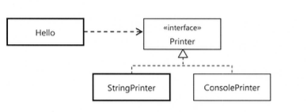
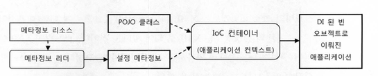
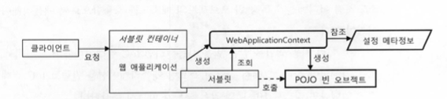
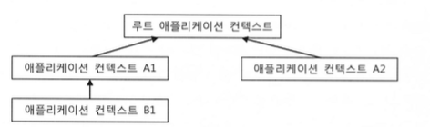
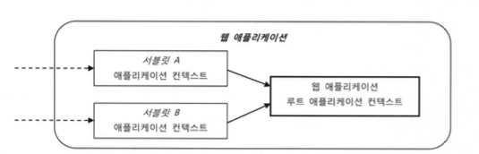
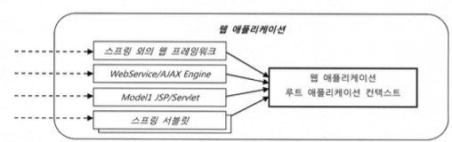

# 10장 IoC 컨테이너와 DI

## 10.1 IoC 컨테이너 : 빈 팩토리와 애플리케이션 컨텍스트

### IoC 컨테이너

- 오브젝트의 생성, 관계설정, 사용등을 코드대신 컨테이너가 제어한다.

### 빈 팩토리? 애플리케이션 컨텍스트?

- `빈 팩토리` : 오브젝트의 생성과, 런타임 관계 설정과 같은 DI 관점에서 보는 컨테이너
- `애플리케이션 컨텍스트` : 빈 팩토리 + 애플리케이션 개발에 필요한 추가 기능

스프링의 IoC 컨테이너는 일반적으로 애플리케이션 컨텍스트를 말한다.  
스프링의 빈 팩토리와 애플리케이션 컨텍스트 모두 인터페이스 형태로 정의되어 있다.  
`public interface ApplicationContext extends ListableBeanFactory,HierarchicalBeanFactory ...`

### IoC 컨테이너를 이용하여 애플리케이션 만들기

```java
StaticApplicationContext ac=new StaticApplicationContext();
```

`ApplicationContext` 인터페이스의 구현체를 통해 오브젝트를 만들었다.  
다음으로는 먼저 IoC 컨테이너에서 사용할 POJO 클래스를 생성한다.


```java

public class Hello {
    String name;
    Printer printer;

    public String sayHello() {
        return "Hello" + name;
    }

    public void print() {
        this.printer.print(sayHello());
    }

    public void setName(String name) {
        this.name = name;
    }

    public void setPrinter(Printer printer) {
        this.printer = printer;
    }
} 
```

```java
public class StringPrinter implements Printer {
    private StringBuffer buffer = new StringBuffer();

    public void print(String message) {
        this.buffer.append(message);
    }

    public String toString() {
        return this.buffer.toString();
    }
}
```

```java
public class ConsolePrinter implements Printer {
    public void print(String message) {
        System.out.println(message);
    }
}
```

---
POJO 클래스를 생성한 다음, 컨테이너가 오브젝트들을 제어할 수 있도록 적절한 메타정보를 만들어 제공해야 한다.

### BeanDefinition

  
스프링 컨테이너는, `BeanDefinition`으로 만들어진 메타정보를 담은 오브젝트를 사용한다.

- 어떠한 파일의 형식에 상관없이 `BeanDefinition`으로 변환될 수 있다면 사용 가능하다.
- 그러한 변환 역할을 `BeanDefinitionReader` 가 담당하며, 해당 인터페이스의 구현을 통해 어떠한 형식이라도 `BeanDefinition`으로   
  변환될 수 있다면 메타정보로 사용할 수 있다.

```java
StaticApplicationContext ac = new StaticApplicationContext();
ac.registerSingleton("hello1", Hello.class);

Hello hello1 = ac.getBean("hello1", Hello.class);
```

직접 `BeanDefinition` 을 이용해 애플리케이션 컨텍스트에 빈을 등록할 수도 있다.
```java
BeanDefinition helloDef = new RootBeanDefinition(Hello.class);
helloDef.getPropertyValues().addPropertyValue("name". "Spring");

ac.registerBeanDefinition("hello2",helloDef);
```

### IoC 컨테이너의 종류와 사용 방법 

**StaticApplicationContext**
- 코드를 통해 빈 메타정보를 등록하기 위해 사용한다.
- 테스트 용도로만 사용하자

**GenericApplicationContext**
- 가장 일반적인 애플리케이션 컨텍스트의 구현 클래스
- 외부의 리소스에 있는 메타정보를 리더를 통해 읽어들여서 메타정보로 전환하여 사용한다 (xml,yml...)
- 테스트를 작성할 때 자주 사용

**GenericXmlApplicationContext**
- XML을 메타정보 파일로 사용할 때 이용하면 편리하게 사용할 수 있다

**WebApplicationContext**
- ApplicationContext를 확장한 인터페이스이다
- 웹 환경에서 사용할 때 필요한 기능이 추가된 애플리케이션 컨텍스트

기본적으로 적어도 한 번은 IoC 컨테이너에게 요청해서 빈 오브젝트를 가져와야 한다( `getbean`).  
이렇게 IoC 컨테이너의 역할은 초기에 빈 오브젝트를 생성, DI 해주고 애플리케이션을 기동할 빈 하나를 제공해주는 것이다.    
  
웹 환경에서는 서블릿이 해당 웹 애플리케이션 구동에 필요한 빈을 웹 에플리케이션 컨텍스트로 부터 받아오는 역할을 대신한다.  
이후 미리 지정된 메소드를 호출함으로써 애플리케이션의 기능이 시작된다.  
이렇게 컨텍스트를 생성하고, 설정 메타 정보를 초기화해주고, 클라이언트로부터 들어오는 요청에 따라 적절한 빈을 찾아서 이를 호출     
해주는 기능을 가진 `DispatcherServlet` 이라는 이름의 서블릿으로 제공한다.


### IoC 컨테이너 계층 구조

모든 애플리케이션 컨텍스트는 부모 컨텍스트를 가질 수 있다.  
     
계층구조 안의 모든 컨텍스트는 각자 독립적인 메타정보를 이용해 오브젝트를 관리한다.   
DI를 위해 빈을 찾을 때는 부모 애플리케이션 컨텍스트의 빈까지 모두 검색한다.   
`자기 자신의 컨텍스트 내부의 빈 검색` => `부모 컨텍스트 내부의 빈 검색`   
그러나 자식 컨텍스트에 있는 빈은 찾을 수 없다.

1. 기존 설정을 수정하지 않고 사용하지만 일부 빈 구성을 변경 가능
2. 여러 애플리케이션 컨텍스트가 공유하는 설정을 만들 수 있다 


### 웹 애플리케이션의 IoC 컨테이너 구성

자바 서버에는 하나 이상의 웹 모듈(war)을 배치해서 사용할 수 있다.   
이러한 애플리케이션들은 여러 개의 서블릿을 가질 수 있는데, 웹 요청을 모두 받는 하나의 대표 서블릿을 등록해두고   
각 요청의 기능을 담당하는 핸들러를 호출하는 방식으로 개발하는 경우가 일반적이다.   
스프링도 이러한 `프론트 컨트롤러 패턴`을 사용한다.

따라서 스프링 웹 애플리케이션에서 사용되는 서블릿의 숫자는 하나이거나 많아야 두세개 정도이다.
스프링 웹 애플리케이션에서 동작하는 IoC 컨테이너는 두 가지 방법으로 만들어진다.
1. 스프링 애플리케이션의 요청을 처리하는 서블릿 안에서 만들어지는 것
2. 웹 애플리케이션 레벨에서 만들어지는 것

일반적으로는 이 두 가지 방법을 모두 사용하여 컨테이너를 만든다.   
즉 두 개 이상의 WebApplicationContext 오브젝트가 만들어 진다.   

### 웹 애플리케이션의 컨텍스트 계층구조

웹 애플리케이션에서는 하나 이상의 스프링 애플리케이션의 프론트 컨트롤러 역할을 하는 서블릿이 여러개 등록될 수 있다.     
따라서 이 서블릿들은 각각 독립적인 애플리케이션 컨텍스트를 지니고,   
각 서블릿이 공유하게 되는 공통적인 빈들은 루트 애플리케이션 컨텍스트에 등록되어 중복 생성을 방지한다.  
   

특별한 이유
- 기존에 생성된 애플리케이션 컨텍스트와 그 설정을 유지하면서, 새로운 기능이나 별도의 기술을 추가

가 없는 이상 일반적으로는 한 개의 프론트 컨트롤러 역할의 서블릿을 만들어 사용하기 때문에 아래와 같은 구조가 대부분이다.  
   

여러 개의 자식 컨텍스트가 없는데 부모 컨텍스트로 분리하는 이유
- 전체 애플리케이션에서 웹 기술에 의존적인 부분을 분리하기 위함

아래의 그림은 웹 기술에 따른 설정 구조의 분리를 보여준다.   
   

이렇게 프레젠테이션 계층을 분리해서 계층 구조로 애플리케이션 컨텍스트를 구성해두면   
`확장과 변경에 유연함`을 가져갈 수 있다.   

### 웹 애플리케이션의 컨텍스트 구성 방법
1. 서블릿 컨텍스트와 루트 애플리케이션 컨텍스트 계층 구조
   - 웹 관련 기술의 빈들은 서블릿의 컨텍스트에 두고, 나머지는 루트 컨텍스트에 등록한다.
2. 루트 애플리케이션 컨텍스트 단일 구조
   - 스프링 웹 기술을 이용하지 않고, 다른 프레임 워크나 서비스 엔진만을 사용해서 만든다면,
   서블릿의 애플리케이션 컨텍스트를 사용하지 않게 되므로, 루프 애플리케이션 컨텍스트만 등록하면 된다
3. 서블릿 컨텍스트 단일 구조
   - 스프링 웹 기술을 사용하면서, 스프링 외의 기술에서 스프링의 빈을 사용하지 않는다면 루트 애플리케이션 컨텍스트를  
   생략할 수 있다. 따라서 서블릿에서 만들어지는 컨텍스트에 모든 빈을 등록하면 된다.