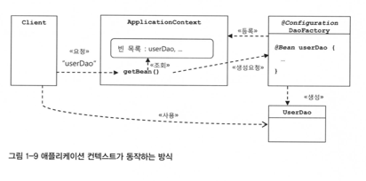

# WEEK 2

## 1.4 제어의 역전

### 1.4.1 오브젝트 팩토리

`UserDaoTest` 클래스는 오직 테스트를 위한 클래스이어야 하는데, 의존관계 주입이라는 책임까지 같이 떠맡게 됨

1. 인터페이스의 구현 클래스 생성
2. 클래스 간의 의존관계 주입

이렇게 두 관심사를 `UserDaoTest` 클래스로부터 분리하자

**_팩토리_**   
객체의 생성 방법을 결정하고 만들어진 오브젝트를 돌려주는 객체  
```java
public class DaoFactory {
    public UserDao userDao() {
        ConnectionMaker connectionMaker = new DConnectionMaker();
        UserDao userDao = new UserDao(connectionMaker);
        return userDao;
    }
}
```
이를 통해   
1. 다른 핵심 관심사를 지닌 오브젝트의 변경없이, 오브젝트간의 의존관계 설정의 변경에 자유로움을 얻게 되었다.
2. 테스트코드에서 불필요한 책임을 덜어내었다

### 1.4.2 오브젝트 팩토리의 활용

`DaoFactory` 내부에서 다른 Dao 들을 생성하는 함수를 만들때, `ConnectionMaker` 를 생성하는 부분이  
중복되기 때문에 따로 함수를 만들어 분리한다
```java
public class DaoFactory {
    public UserDao userDao() {
        ConnectionMaker connectionMaker = connectionMaker();
        UserDao userDao = new UserDao(connectionMaker);
        return userDao;
    }

    public ConnectionMaker connectionMaker() {
        return new DConnectionMaker();
    } 
}
```

### 1.4.3 제어권의 이전을 통한 제어관계 역전

**_제어의 역전_**    
일반적인 프로그램에서의 객체들은 능동적으로,각자 자신이 사용할 오브젝트를 정하고,   
결정한 오브젝트를 생성하고 만들어진 오브젝트를 이용하는 흐름을 갖는다.    
이렇게 오브젝트의 능동성(제어권)을 다른 특별한 오브젝트 또는 상위 프로세스에게 위임하여   
자신을 포함한 다른 오브젝트의 생성, 사용에 대한 책임을 위임하는것이 **_제어의 역전_**, **_IoC_**  이다.

**_프레임워크 vs 라이브러리_**   
라이브러리는 애플리케이션 코드가 능동적으로 사용한다. 즉 애플리케이션 코드에게 제어권이 있음을 뜻한다.   
그러나 프레임워크에서의 애플리케이션 코드는 반대로, 프레임워크에 의해 수동적으로 애플리케이션 코드가 동작하게 된다. 

**_DaoFactory 와 스프링_**  
`DaoFactory`는 오브젝트 수준의 가장 단순한 IoC 컨테이너, IoC 프레임워크라 불릴 수 있다.     
단순한 적용에서는 IoC 제어권을 가진 오브젝트를 분리해서 만드는 방법이면 충분하지만,   
애플리케이션 전반에서는 스프링과 같은 IoC 프레임워크의 도움을 받는게 이점이 크다.  
스프링은 IoC를 모든 기능의 기초가 되는 기반기술로 삼고 있으며, IoC를 극한까지 적용하고 있는 프레임워크이다.

## 1.5 스프링의 IoC

### 1.5.1 오브젝트 팩토리를 이용한 IoC
스프링에서는 스프링이 제어권을 가지는 오브젝트를 `Bean` 이라고 한다    
빈의 제어를 담당하는 IoC 오브젝트를 `Bean Factory`, `ApplicationContext` 라고 부른다.  
- 빈 팩토리 : 빈의 생성과 관계 설정에 초점
- 애플리케이션 컨텍스트 : 애플리케이션 전반에 걸친 제어작업을 담당하는 IoC 엔진에 초점

`ApplicationContext`는 직접 설정정보를 담고 있지는 않고, 별도로 설정정보를 담고 있는 무언가를  
불러와 활용하는 범용적인 IoC 엔진이다

따라서 `DaoFactory`를 빈 팩토리가 사용할 수 있는 설정정보로 만들었다
```java
@Configuration
public class DaoFactory {
    @Bean
    public UserDao userDao() {
        return new UserDao(connectionMaker());
    }

    @Bean
    public ConnectionMaker connectionMaker() {
        return new DConnectionMaker();
    }
}
```
이제 이를 활용하여 `UserDaoTest` 에서 애플리케이션 컨텍스트가 이 정보를 활용하도록 변경했다
```java
public class UserDaoTest {
    public static void main(String[] args) {
        ApplicationContext context =
                new AnnotaionConfigApplicationContext(DaoFactory.class);
        UserDao dao = context.getBean("userDao", UserDao.class);
    }
}
```
`AnnotaionConfigApplicationContext`  
`@Configuration`이 붙은 자바코드를 설정정보를 사용하는 `ApplicatiaonContext`의 구현체이다

`getBean()`     
빈을 불러오는 메소드이다. `@Bean` 이라는 애노테이션이 붙은 메소드의 이름이 빈의 이름이 되며,    
이 빈의 이름을 통해 빈 팩토리에서 빈을 가져올 수 있다.    
두 번쨰 인자로 리턴 타입을 줘서, 캐스팅 코드를 생략 할 수 있다.

### 1.5.2 애플리케이션 컨텍스트의 동작방식
    
`DaoFacotry`를 오브젝트 팩토리로 직접 사용했을 때와 비교해서 애플리케이션 컨텍스트를     
 사용했을 때 얻을 수 있는 장점이 있다.
1. 클라이어느는 구체적인 팩토리 클래스를 알 필요가 없다
   - Dao 뿐만 아니라 다양한 오브젝트가 계속 추가될 때에도 추가적인 오브젝트 팩토리를 만들
      필요가 없으며, 일관된 방식으로 오브젝트를 가져올 수 있다
2. 애플리케이션 컨텍스트는 종합 IoC 서비스를 제공해준다
   - 오브젝트의 생성과, 관계주입뿐만 아니라 생성 시점, 전략, 후처리, 인터셉팅등의  
   다양한 기능을 제공한다
3. 애플리케이션 컨텍스트는 빈을 검색하는 다양한 방법을 제공한다
   - `getBean()`뿐만 아니라 다양한 방식으로 빈을 찾는 메소드를 제공한다
   
### 1.5.3 스프링 IoC의 용어 정리
- 빈
  - 스프링이 IoC 방식으로 관리하는 오브젝트이다.  
  모든 오브젝트가 빈이아닌, 스프링이 직접 생성과 제어를 담당하는 오브젝트만을 빈이라 함
- 빈 팩토리
  - 스프링 IoC를 담당하는 핵심 컨테이너를 말한다.  
  보통은 이를 그대로 사용하지 않고 확장시킨 애플리케이션 컨텍스트를 이용한다
- 애플리케이션 컨텍스트
  - 빈 팩토리를 확장한 IoC 컨테이너이다. 빈 팩토리의 기능뿐만 아니라,  
  스프링이 제공하는 각종 부가 서비스를 추가로 제공한다  
  `ApplicationContext` 인터페이스는 `BeanFactory` 를 상속받음
- 설정정보/설정 메타정보
  - 애플리케이션 컨텍스트 또는 빈 팩토리가 실제로 적용하기 위해 사용되는 메타정보
- 컨테이너/IoC 컨테이너
  - 빈 팩토리 또는 애플리케이션 컨텍스트를 컨테이너/IoC 컨테이너라고 한다
- 스프링 프레임워크
  - 스프링이 제공하는 모든 기능을 통틀어 말할 때 주로 사용한다
## 1.6 싱글톤 레지스트리와 오브젝트 스코프
`DaoFactory`를 오브젝트 팩토리로써 이용한 코드를 통해, 오브젝트를 여러번 받아올 때에는  
매번 다른 객체가 생성되어 반환된다.  
그러나 `ApplicationContext`를 이용해 빈을 여러번 받아올 때에는 매번 같은 객체가 반환된다.

이렇게 `ApplicationContext`가 계속해서 같은 객체를 반환하는 이유를 알아보자

### 1.6.1 싱글톤 레지스트리로서의 애플리케이션 컨텍스트

**_서버 애플리케이션과 싱글톤_**  
스프링이 주로 적용되는 대상은 서버환경이다. 따라서 한 개의 서버에 수십, 수백번의 요청을 받는  
높은 성능이 요구되는 환경에서 사용되기 때문에, 매 요청마다 새롭게 오브젝트를 생성하여 반환해  
주는 방식은 성능저하에 크게 영향을 미친다.

따라서 서비스 오브젝트라는 개념을 도입해, 서블릿 클래스 하나당 하나의 오브젝트만을 만들어 놓고  
여러 스레드에서 하나의 오브젝트를 공유해 동시에 사용하는 싱글톤 패턴의 원리를 따르게 되었다

**_싱글톤 패턴의 한계_**  
그러나 일반적인 싱글톤 패턴을 서버환경에 적용시키기에는 여러가지 문제점이 있다
1. private 상속자로 인하여 상속이 불가하다  
상속이 불가하여, 다형성을 적용할 수 없다. 이는 객체지향적인 설계의 장점을 적용하기가  
어려워진다
2. 테스트 하기에 힘들다  
싱글톤은 초기화 과정에서 생성자 등을 통해 사용될 오브젝트를 동적으로 주입하기 어렵기   
때문에, 필요한 오브젝트는 직접 오브젝트를 생성해야한다. 이런 경우 테스트 오브젝트로  
대체하기 힘들다.
3. 서버환경에서 싱글톤의 유일성이 보장되지 못한다  
서버에서 클래스 로더의 구성에 따라서 하나 이상의 오브젝트가 생성될 수 있으며, 여러 개의  
JVM에 분산되어 있는 경우도 마찬가지다.
4. 싱글톤은 전역 상태를 만들 수 있기 때문에 바람직하지 못하다  
싱글톤은 스태틱 메소드를 이용해 언제든지 싱글톤에 쉽게 접근할 수 있기 때문에, 자연스럽게  
전역 상태로 사용되기 쉽다. (Thread-unsafe, 동시성 문제)

**_싱글톤 레지스트리_**  
스프링은 서버환경에서 서비스 오브젝트 방식으로 사용되는 것은 적극 지지하여,  
싱글톤 패턴의 단점을 보완하고자 직접 싱글톤 형태의 오브젝트를 만들고 관리하는 기능을 제공한다.  
이를 **_싱글톤 레지스트리_** 라 한다.

싱글톤 레지스트리 덕분에 싱글톤 방식으로 사용될 애플리케이션 클래스라도 public 생성자를 가질 수  
있으며, 이에 따라 싱글톤이 아닌 형태로 사용해야 할 상황에서도 간단하게 생성이 가능하다. 또한  
테스트 환경에서도 자유롭게 오브젝트를 관리할 수 있다

### 1.6.2 싱글톤과 오브젝트의 상태

싱글톤은 멀티 스레드 환경에서 동시에 접근이 가능하다. 따라서 상태 관리가 중요하다.  
싱글톤 오브젝트의 인스턴스 변수를 수정하는 일은, 스레드간에 인스턴스 변수를 쓰고 읽는 과정에서  
서로 다른 값을 불러오는 문제를 일으킬 수 있기 때문이다.

계속해서 변하는 값들은, 파라미터, 로컬 변수, 리턴값을 이용하여 매번 독립적인 공간을 사용하도록  
하는 것이 안전하다.

```java
public class UserDao {
    private ConnectionMaker connectionMaker; // 읽기 전용이라 괜찮다
    private Connection c; // 위험함 -> 메소드마다 값이 변경됨
    private User user; // 위험함 -> 메소드 마다 값이 변경됨
}
```
위의 코드에서 `connectionMaker` 와 같은 값은 읽기전용 필드이기 때문에, 인스턴스 변수로  
사용해도 크게 문제가 없다. 또한 이렇게 읽기전용 값이라면 `static final` 또는 `final`로  
선언하는 편이 나음  
그러나 `Connection` 이나 `User`와 같은 값은 메소드가 실행될 때마다 변하기 때문에,  
멀티 스레드 환경에서 심각한 문제가 발생할 수 있다.

### 1.6.3 스프링 빈의 스코프
_**빈의 스코프**_  
빈이 생성되고, 존재하고, 적용되는 범위를 빈의 스코프라 한다.  
기본적으로 스프링에서 빈의 스코프는 싱글톤이다. 경우에 따라서 싱글톤 외의 스코프를 가질 수 있다.

## 1.7 의존관계 주입

### 1.7.1 제어의 역전(Ioc)과 의존관계 주입

단순히 IoC라는 용어는, 스프링이 제공하는 기능의 특징을 명확하게 설명하지 못한다.  
따라서 **_DI_** (의존관계 주입) 이라는 용어를 통해 스프링이 제공하는 IoC 방식을 설명한다.  
따라서 스프링은 IoC 컨테이너라는 말보다는, DI 컨테이너로 더 많이 불리고 있다

### 1.7.2 런타임 의존관계 설정

**_의존 관계_**  
B의 변경에 A가 영향을 받을 때, A가 B에 의존한다고한다.  
의존관계에는 방향성이 있기 때문에, A가 B에 의존함이 B가 A에 의존함을 뜻하진 않는다

**_런타임 의존관계_**  
설계 모델이나 코드 상에서, 인터페이스를 통해 드러나는 느슨한 의존관계가 아닌,  
런타임시에 실제 구체적인 오브젝트를 통한 의존관계를 런타임 의존관계라 한다.  
설계 시점에서의 의존관계가 실체화 된 것이며, 이때 실제 사용되는 오브젝트를 의존 오브젝트라 한다.  

**_의존관계의 주입_**  
의존관계의 주입이란, 구체적인 의존 오브젝트와, 그것을 사용할 주체를 런타임 시에 연결해주는  
작업을 의미하며 다음 세가지 조건을 충족한다
- 클래스 모델이나 코드에서는 런타임 시점의 의존관계가 드러나지 않는다.(인터페이스에만 의존)
- 런타임 시점의 의존관계는 컨테이너나 팩토리같은 제3의 존재가 결정한다
- 의존관계는 사용할 오브젝트에 대한 레퍼런스를 외부에서 제공해줌으로써 만들어진다

```java
public class UserDao {
    private ConnectionMaker connectionMaker;

    public UserDao(ConnectionMaker connectionMaker) {
        this.connectionMaker = connectionMaker;
    }
}
```
기존 코드와 달리, 런타임에서 제3의 존재(DI 컨테이너)를 통해 의존관계를 주입 받는다

### 1.7.3 의존관계 검색과 주입

**_의존관계 검색_**  
스스로 검색을 이용하여 의존관계를 주입받는 것을 의존관계 검색이라 한다.  
의존관계 검색은 런타임 시 의존관계를 맺을 오브젝트를 결정하는 것과 오브젝트의 생성 작업은 외부  
컨테이너에게 위임하지만, 메소드나 생성자를 통한 주입 대신 스스로 요청하는 방법을 택한다.

```java
public class UserDao {
    private ConnectionMaker connectionMaker;

    public UserDao(ConnectionMaker connectionMaker) {
        DaoFactory daoFactory = new DaoFactory();
        this.connectionMaker = daoFactory.connectionMaker();
    }
}
```
위의 방식과 동일하지만, 팩토리 대신 애플리케이션 컨텍스트를 활용하여 의존관계 검색을 해보자
```java
public class UserDao {
    private ConnectionMaker connectionMaker;

    public UserDao(ConnectionMaker connectionMaker) {
        ApplicationContext context =
                new AnnotaionConfigApplicationContext(DaoFactory.class);
        this.connectionMaker = context.getBean("connectionMaker", ConnectionMaker.class);
    }
}
```

의존관계 검색은 IoC 개념을 잘 따르고 있지만  
코드 안에 오브젝트 팩토리 클래스나, 스프링 API가 나타나게 되어, 이 또한 다른 오브젝트에   
의존하게 되는 것이므로 바람직하지 않다. 따라서 대게는 의존관계 주입 방법을 사용하는 편히 좋다

**_의존관계 검색과 의존관게 주입_**  
의존관계 검색을 사용하는 빈은 그 자체가 빈 오브젝트일 필요가 없지만,  
의존관계 주입을 받는 빈은 그 자체 또한 빈 오브젝트이어야 한다.
이런점에서 DI와 DL(Dependency lookup)은 적용 방법에 차이가 있다

### 1.7.4 의존관계 주입의 응용

1. 기능 구현의 교환  
코드에 인터페이스를 통해 느슨한 연관관계만을 맺어주고,  
실제 구현 클래스의 변경이 필요할 때 DI 컨테이너나, 팩토리의 설정만을 바꿈으로써 해결할 수 있다.
2. 부가기능 추가  
실제 구현 클래스에 새로운 기능의 추가가 필요할 때, 새로운 구현 클래스에 이를 반영하여  
작성하고 설정 정보만 변경함으로써 이에 대응할 수 있다

### 1.7.5 메소드를 이용한 의존관계 주입

의존관계 주입시 생성자가 아닌 일반 메소드를 사용할 수도 있을 뿐만 아니라, 생성자를  
사용하는 방법보다 더 자주 사용된다

1. 수정자 메소드를 이용한 주입  
세터를 통해 연관관계를 설정한다. 외부로부터 제공받은 오브젝트 레퍼런스를 저장해뒀다가  
내부의 메소드에서 사용하게 하는 DI 방식에서 활용하기에 적당하다
2. 일반 메소드를 통한 주입  
여러개의 파라미터를 갖는 일반 메소드를 DI용으로 사용할 수 있다.   
필요한 갯수만큼 파라미터로 받아 DI에 사용할 수 있기 때문에, 때때로 생성자 주입보다 낫다

## 1.8 XML을 이용한 설정

위에서 자바 코드로 애플리케이션 컨텍스트의 설정정보를 적용했었다.  
스프링에서는 이를 XML을 이용하는 설정정보로도 사용 할 수 있다.  
구현체 : `GenericXmlApplicationContext`

## 1.9 정리
스프링은 객체지향 프로그래밍의 장점을 부각시키는 프레임워크이다.  
따라서 어떻게 오브젝트가 설계되고, 만들어지고, 관계를 맺는지에 집중하는 프레임워크임을 기억하자  
