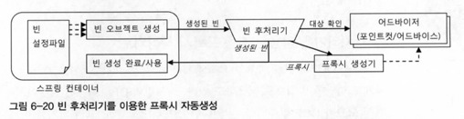
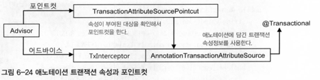

# WEEK 8

## 6.5 스프링 AOP

### 6.5.1 자동 프록시 생성

기존 코드에서 타겟 오브젝트에 대한 프록시 생성은, `ProxyFactoryBean` 을 통해 해결해주었다.        
그러나, 이 `ProxyFactoryBean` 을 타깃 오브젝트마다 계속해서 빈 설정정보를 추가해주는 문제점이 남아있다.

_**빈 후처리기를 이용한 자동 프록시 생성**_



빈 후처리기는 빈으로 등록된 모든 어드바이저 내의 포인트컷을 이용하여, 프록시 생성이 필요한 타겟인지 판단하고,      
적용 대상이면, 프록시를 생성하여 스프링 컨테이너에게 돌려주어 해당 프록시 오브젝트를 빈으로 등록하여 사용한다

이전까지 프록시 팩토리는 이미 타겟 클래스를 알고있으므로, 포인트컷은 메소드만을 대상으로 수행되었지만    
빈 후처리기를 이용할 때에는, 메소드 이외에도 클래스에 대한 선정 알고리즘이 필요하다

### 6.5.2 DefaultAdvisorAutoProxyCreator 적용

기존 `ProxyFactoryBean` 과 달리 자동 프록시 생성기인 `DefaultAdvisorAutoProxyCreator`는 수동으로 어드바이저들을 DI        
하지 않아도, 다이나믹하게 런타임시에 DI된다. 따라서 필요한 어드바이저들만 스프링 빈으로 등록하면 된다.

### 6.5.3 포인트컷 표현식을 이용한 포인트컷

**포인트컷 표현식**

```
execution([접근 제한자] 리턴타입패턴 [패키지, 클래스타입패턴.]메소드이름패턴 (파라미턴 타입패턴 | "..", ...) [throws 예외 패턴]);
```

`[]` 내부는 옵션항목이며, 패턴내부에 와일드카드를 사용하여 유연하게 사용할 수 있다

또한 포인트컷 표현식에서의 클래스 이름에 적용되는 패턴은, 이름 패턴이 아닌 타입 패턴이므로,        
슈퍼클래스의 타입에도 포인트컷에 매칭된다

### 6.5.4 AOP란 무엇인가?

여태껏 코드를 리팩토링한 과정을 살펴보자

**트랜잭션 서비스 추상화**                
기존 코드에서 트랜잭션 경계 설정 코드에 비즈니스 코드가 종속되어있는것을 바꾸고자       
트랜잭션에 대한 서비스 추상화를 통해, 특정 트랜잭션 기술에 대한 종속성을 없앴다.

**프록시와 데코레이터 패턴**       
특정 트랜잭션 기술에 대한 종속성은 없앴지만, 여전히 비즈니스 로직에 트랜잭션 경계설정 코드가               
포함되어 있었다. 따라서 데코레이터 패턴을 이용하여, 각 서비스 기능들을 프록시로 이어주고      
각 프록시에서 자신의 기능을 수행하고 다음 타겟으로 작업을 위임하는 형태로 리팩토링 하였다  
이를 통해 비즈니스 로직 코드에서 트랜잭션 관련 코드를 덜어낼 수 있었다

**다이내믹 프록시와 프록시 팩토리 빈**     
그러나, 위와 같은 구조는 각 서비스 마다 필요한 기능이 있다면 해당 서비스에 대한 인터페이스를 필요할 때마다       
모두 구현하여 사용해야한다는 단점이 있었다. 이를 해결하고자 프록시 기술을 추상화 한 프록시 팩토리 빈을 이용하여     
부가기능에 대한 재사용성을 포인트컷과 어드바이스를 담은 어드바이저와 프록시 간의 분리를 통해 획득하였다.

**자동 프록시 생성 방법과 포인트컷**  
하지만, 여전히 프록시 팩토리 빈을 일일이 빈으로 등록해야한다는 소요가 남아있다. 따라서 이를 해결하고자      
스프링의 빈 후처리 기법을 활용하여, 부가기능을 적용이 필요한 클래스를 포인트 컷을 통해 자동으로 프록시를 생성하도록       
하여, 포인트컷과 어드바이저를 프록시 생성 단계에서 분리해 내었다

**부가기능의 모듈화**       
이와 같은 과정을 통해, 흩어져있던 부가기능을 재사용성이 있는 모듈로 만들게 되었다.     
따라서 같은 부가기능에 대해서는 독립적인 한 모듈만이 관여하게 되며, 이에 타깃이 되는 비즈니스 로직에서는     
이러한 부가기능과 관련 없이 독립적인 코드로 작성할 수 있다는 장점이 있다.

**AOP**     
여러 흩어져있던 부가기능을 모듈화 하고, 이를 애스팩트라 부른다.        
핵심적인 기능과 분리하여, 애스팩트라는 독특한 모듈로 만들어서 설계하고 사용되며,       
이러한 패러다임은 결국 더욱 객체지향적으로 설계할 수 있도록 돕는다.

### 6.5.5 AOP 적용기술

**바이트코드 생성과 조작을 통한 AOP**    
`AspectJ` 라이브러리에서는 스프링처럼 프록시를 통한 aop 가 아닌, 바이트 코드 조작을 통해 aop를 적용한다.     
즉, 컴파일된 클래스 파일 자체를 수정하거나, JVM에 로딩되는 시점에 가로채서 이러한 바이트 코드에 실제 필요한 부가기능        
코드를 직접 주입하는 방식을 사용한다. 이러한 방식의 장점을 알아보자

1. DI 컨테이너와 같이 외부의 도움 필요없이, AOP를 적용할 수 있다
2. 바이트코드를 직접 조작하기 때문에, 메소드 이외의 다양한 작업에 부가기능을 부여할 수 있다

## 6.6 트랜잭션 속성

### 6.6.1 트랜잭션 정의

**트랜잭션** : 더 이상 쪼갤 수 없는 최소 단위의 작업   
따라서 트랜잭션 경계 안에서 진행된 작업은 `commit` 을 통해 모두 성공하든지, `rollback`을 통해 모두 취소돼야 한다.

1. 트랜잭션 전파     
   트랜잭션의 경계에서 이미 진행준인 트랜잭션이 있을 때 또는 없을 때 어떻게 동작할 것인가

`PROPAGATION_REQUIRED`  
진행 중인 트랜잭션이 없으면 새로 시작하고, 이미 있다면 참여한다
`DefaultTransactionDefinition`의 트랜잭션 전파 속성

`PROPAGATION_REQUIRES_NEW`  
항상 새로운 트랜잭션을 시작한다. 독립적인 트랜잭션이 보장돼야 하는 코드에 적용

`PROPAGATION_NOT_SUPPORTED`     
트랜잭션 없이 동작하도록 만든다. 진행중인 트랜잭션이 있어도 무시한다.  
Why? : ex) 특정 메소드에서는 트랜잭션 적용에서 제외시키기 위해 사용

트랜잭션 매니저를 통해 트랜잭션을 시작하려고 할 때 `getTransaction()` 을 사용하는 이유도,     
트랜잭션의 전파 속성이 있기 때문이다. `getTransaction()` 은 트랜잭션 전파 속성과,     
현재 존재하는 트랜잭션이 존재하는지 여부에 따라서 동작하게 된다.   
진행중인 트랜잭션에 참여하는 경우는 현재의 트랜잭션 경계의 끝에서 트랜잭션을 커밋시키지도 않는다.  
참여한 트랜잭션이 종료될 때 까지 진행되어야 커밋될 수 있다.

2. 격리수준        
   서버환경에서는 여러 개의 트랜잭션이 동시에 진행될 수 있다. 순차적으로 실행한다면 좋겠지만, 그러한     
   경우에는 성능이 크게 떨어질 수 있기 때문에 문제가 발생하지 않는 수준으로 많은 트랜잭션을 처리해야 한다.     
   격리수준은 기본적으로 DB에 설정되어 있지만, JDBC 드라이버나 DataSource 등에서 재설정 할 수 있다.

3. 제한시간        
   트랜잭션을 수행하는 제한시간을 설정할 수 있다   
   제한시간은 트랜재션을 직접 시작할 수 있는 전파 옵션과 함께 사용해야 의미가 있다.

4. 읽기전용        
   트랜잭션 내에서 데이터를 조작하는 시도를 막아줄 수 있다. 또한 액세스 기술에 따라 성능 향상에도 도움이 된다.

트랜잭션 정의를 수정하기 위해서는, `TransactionDefinition` 타입의 오브젝트를 DI 받아 사용하면 된다.        
그러나 이러한 방식은 모든 트랜잭션의 속성이 모두 바뀐다는 문제가 있다.

### 6.6.2 트랜잭션 인터셉터와 트랜잭션 속성

**`TransactionInterceptor`**    
기존 `TransactionAdvice` 와 동일하게 동작하지만, 메소드 이름 패턴을 통해 메소드별 트랜잭션 정의도 가능하다

```xml

<bean id="transactionAdvice"
      class="org.springframework. transaction. interceptor.TransactionInterceptor">
    <property name="transactionManager" ref="transactionManager"/>
    <property name="transactionAttributes">
        <props>
            <prop key="get*">PROPAGATION_REQUIRED, readOnly, timeout_30</prop>
            <prop key="upgrade*">PROPAGATION_REQUIRES_NEW, ISOLATION_SERIALIZABLE</prop>
            <prop key="*">PROPAGATION REQUIRED
            </prop>
        </props>
    </property>
</bean>
```

달라진 점으로는 `transactionManager` 뿐만 아니라, 새로운 Property 가 추가되었는데 이는 `transactionAttributes`로     
트랜잭션 속성을 정의한 프로퍼티이다. `TransactionDefinition` 네 가지 항목에 `rollbackOn()` 메소드를 하나 더 갖고 있는    
`TransactionAttribute` 인터페이스로 정의된다. `rollbackOn()` 메소드는 어떤 예외가 발생하면 롤백을 할 것인가를 결정하는 메소드이다.        
기존 사용하던 `TransactionAdvice` 코드에서 `try-catch` 문으로 예외에 대해 롤백처리하는 부분이 `rollbackOn()` 과 같은 기능을 하는 부분이다.

**rollback with Exception**     
스프링에서는 런타임 예외가 아닌 체크 예외가 비즈니스 로직에서 발생할 경우, 이를 유의미한 반환값으로 인식해서 기본적으로 트랜잭션을 커밋해버린다.   
스프링의 기본적인 예외처리 원칙에 따라 비즈니스적인 의미가 있는 예외상황에만 체크 예외를 사용하고, 그 외의 모든 복구 불가능한 순수한 예외의 경우에는        
런타임 예외로 포장하여 전달하는 방식을 따른다고 가정하기 때문이다.       
이에 따라 `rollbackOn()` 이라는 속성을 통해, 체크 예외에 대한 롤백처리와 런타임 예외에 대한 커밋처리 또한 처리할 수 있다.

`TransactionInterceptor`는 이런 `TransactinoAttribute`를 맵 타입 오브젝트로 전달받는다.      
그 이유는 메소드 패턴에 따라 각기 다른 트랜잭션 속성을 부여하기 위해서이다.

**메소드 이름 패턴 : 트랜잭션 속성 지정**      
`PROPAGATION_NAME, ISOLATION_NAME, readOnly, timeout_NNNN, -Exception1, +Exception2`        
각 항목별로, 전파속성, 격리 속성, 읽기 전용, 제한시간, 체크 예외 중 롤백 대상으로 추가할 예외, 런타임 예외지만 롤백시키지 않을 예외이다.       
이 중 전파속성만이 필수이고 나머지는 생략 가능하다.

```xml

<bean id="transactionAdvice"
      class="org.springframework. transaction. interceptor.TransactionInterceptor">
    <property name="transactionManager" ref="transactionManager"/>
    <property name="transactionAttributes">
        <props>
            <prop key="get*">PROPAGATION_REQUIRED, readOnly, timeout_30</prop>
            <prop key="upgrade*">PROPAGATION_REQUIRES_NEW, ISOLATION_SERIALIZABLE</prop>
            <prop key="*">PROPAGATION REQUIRED</prop>
        </props>
    </property>
</bean>
```

key-value 쌍으로 메소드 패턴에 대한 트랜잭션 속성 지정을 통해 사용 가능하다. 이를 통해 하나의 트랜잭션 어드바이스를 사용하는 것으로 다양한    
트랜잭션 설정이 가능해진다

### 6.6.3 포인트컷과 트랜잭션 속성의 적용 전략

1. 트랜잭션 포인트컷 표현식은 타입 패턴이나 빈 이름을 이용한다
2. 공통된 메소드 이름 규칙을 통해 최소한의 트랜잭션 어드바이스와 속성을 정의한다
3. 프록시 방식 AOP는 같은 타깃 오브젝트 내의 메소드를 호출할 때는 적용되지 않는
   클라이언트에서 호출되는 경우에만 어드바이스들이 적용된다.  
   따라서 타겟 내에서 다른 메소드를 호출할 때에는 AOP에 설정한 트랜잭션 관련 코드들이 동작하지 않은 채로 동작하게 된다.

### 6.6.4 트랜잭션 속성 적용

**트랜잭션 경계설정의 일원화**      
일반적으로 특정 계층의 경계를 트랜잭션 경계와 일치시키는 것이 바람직하다. 비즈니스 로직을 담고 있는 서비스 계층 오브젝트의    
메소드가 트랜잭션 경계를 부여하기에 가장 적절한 대상이다.  
이와같이 트랜잭션의 경계를 정했다면, 테스트와 같은 특별한 이유가 아니고서는 DAO에 직접 접근하는 것은 차단해야 한다.

## 6.7 애노테이션 트랜잭션 속성과 포인트컷

### 6.7.1 트랜잭션 애노테이션

`@Transactional`  
`TransactionalInterceptor`는 메소드 이름 패턴 : 속성정보의 컬렉션 대신, 애노테이션의 엘리먼트에서 트랜잭션 속성을 가져와 사용한다.  
동시에 포인트컷도 `@Transactional`을 통한 트랜잭션 속성정보를 참조하도록 만든다.  
  
이 방식을 이용하면 포인트컷과 트랜잭션 속성을 애노테이션 하나로 지정할 수 있다. 따라서 타입 레벨에 일괄적인 부여보다   
메소드 단위로 세밀한 트랜잭션 속성 제어가 가능해진다.  
그러나 메소스 단위로 `@Transactional`을 부여하고 속성을 지정하다보면 코드가 지저분해지고, 동일한 코드가 반복될 수 있다.

**대체 정책**  
따라서 스프링은 `@Transactional` 을 적용할 때 4단계의 fallback 정책을 이용하게 해준다.

1. 타깃 메소드
2. 타깃 클래스
3. 선언 메소드
4. 선언 타입

```java
// 4
public interface Service {
    // 3
    void foo();

    // 3
    void bar();
}

// 2
public class ServiceImpl implements Service {
    // 1
    public void foo();

    // 1
    public void bar();
}
```

따라서 최대한 타입 레벨에 적용하여 공통 속성을 지정하고, 특수한 경우에 메소드 레벨에 다시 `@Transactional`을  
통해 특정 속성을 부여하도록 하는 것이 바람직하다. 또한 타깃 보다는 인터페이스에 두는 게 바람직하다.

### 6.7.2 트랜잭션 애노테이션 적용

```xml
<tx:attribute>
    <tx:method name="get*" readonly="true"/>
    <tx:method name="*"/>
</tx:attribute>
```
```java
@Transactional
public interface UserService {
    void add(User user);
    void deleteAll();
    void update(User user);
    void upgradeLeveles();
    
    @Transactional(readOnly=true)
    User get(String id);

   @Transactional(readOnly=true)
   List<User> getAll();
}
```

위의 xml config를 애노테이션을 이용하여 리팩토링 하였다.

## 6.8 트랜잭션 지원 테스트

### 6.8.1 선언적 트랜잭션과 전파 속성

선언적 트랜잭션 : AOP를 이용하여 코드 외부에서 트랜잭션의 기능을 부여해주고 속성을 지정할 수 있게 하는 방법  
프로그램에 의한 트랜잭션 : 트랜잭션 API를 사용하여 코드 안에서 제어하는 방법  
특별한 경우가 아니라면 선언적 방식의 트랜잭션을 사용하는 것이 바람직하다.

### 6.8.2 트랜잭션 동기화와 테스트

**트랜잭션 매니저와 트랜잭션 동기화**  
트랜잭션 추상화 기술의 핵심은 트랜잭션 매니저와 트랜잭션 동기화다.  
이러한 트랜잭션 매니저를 이용하여, 테스트코드에서 강제로 트랜잭션을 동기화 할 수 있다.  

### 6.8.3 테스트를 위한 트랜잭션 애노테이션

`@Transactional` 애노테이션은 테스트 코드에서 사용될 시에, 트랜잭션 종료 시에 기본적으로    
트랜잭션 내용을 롤백시킨다.  
`@Rollback` 애노테이션은 메소드 단위에 붙어 롤백에 관한 제어를 할 수 있다   
`@TransactionConfiguration`을 이용하면 클래스 단에서도 기본 롤백설정을 변경할 수 있다.   
   
**효과적인 DB 테스트**      
DB가 사용되는 통합 테스트를 별도의 클래스로 만들어둔다면 기본적으로 클래스 레벨의 `@Transactional` 을 부여해준다.   
DB가 사용하는 통합 테스트는 가능한 롤백 테스트로 만들고, 테스트 DB를 셋업하고 각 테스트에서 필요한 데이터 셋을 채운 뒤,   
테스트를 진행하는 구조로 만들게 되면, 서로 다른 테스트 사이에 영향을 주지않기 때문에 독립적이고 자동화된 테스트를 만들기에 편하다.  
