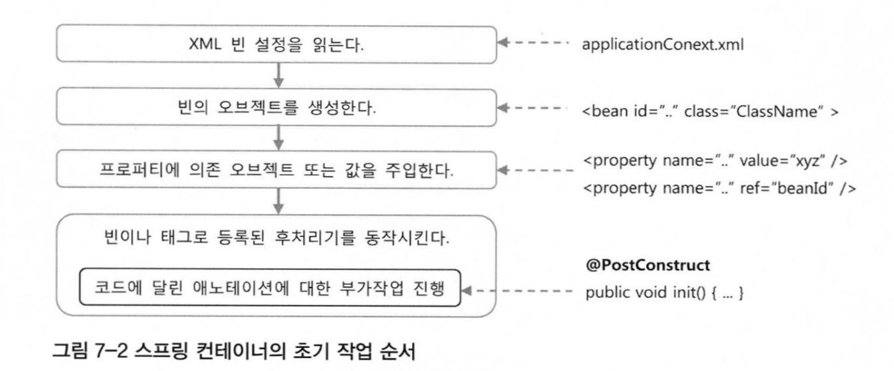
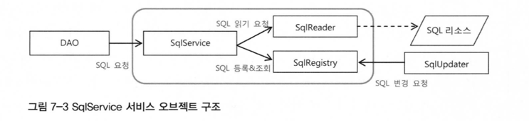
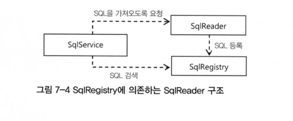
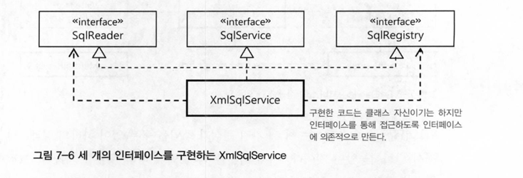

# WEEK 9

## 7장 스프링 핵심 기술의 응용

## 7.1 SQL과 DAO의 분리

이제 `UserDao` 에서 SQL 코드를 분리하려 한다.    
매번 SQL에 수정이 있거나, SQL 만을 확인하려 할때 코드를 열어 확인해야 하는 불편함이 있으며,    
DB 테이블과 필드정보를 고스란히 담고 있는 SQL문을 분리하여 사용하고자 한다.

### 7.1.1 XML 설정을 이용한 분리

**개별 SQL 프로퍼티 방식**      
XML을 통해 각 SQL 문들을 일일이 빈에 프로퍼티로 주입하는 방법이다.    
하지만 필요한 SQL의 개수가 많아지면 그때마다 빈 설정정보에 각각 프로퍼티를 추가하는 작업은 매우 번거롭다.

```xml
```

**SQL 맵 프로퍼티 방식**       
따라서 Map 구조를 이용하여 key-value 형식으로 SQL을 지니고 있는 맵 프로퍼티를 만들고,    
실제 빈에서는 이 맵을 프로퍼티로 주입받아, 자신에게 필요한 SQL을 key로써 꺼내오는 방식이다.

```xml
```

이 정도면 나름 깔끔하게 분리했다 싶었지만, XML 파일을 보면 빈 설정정보와, SQL문들이 섞여있어 가독성도 좋지않고, 관리하기에도 좋지 않다.       
따라서 SQL에 대한 파일을 독립적으로 관리하려 한다. SQL이 담긴 파일이 항상 XML 형태의 파일이 아닐 수도 있고,      
SQL 필드 관련 수정이 필요할 때, DAO의 인스턴스 변수를 변경과 관련해서 동시성 문제를 일으킬 수도 있기 때문이다.

**SQL 서비스 인터페이스**    
먼저 SQL 관련 기능을 DAO에서 분리하기 위해, SQL 서비스 인터페이스를 통해 DAO에서 SQL 서비스에 접근하도록 하였다.

```java
public interface SqlService {
    String getSql(String key) throws SqlRetrievalFailureException;
}
```

이후 인터페이스를 구현하는 `SimpleSqlService` 를 작성하였다.

```java
public class SimpleSqlService implements SqlService {
    private Map<String, String> sqlMap;

    public void setSqlMap(Map<String, String> sqlMap) {
        this.sqlMap = sqlMap;
    }

    public String getSql(String key) throws SqlRetrievalFailureException {
        String sql = sqlMap.get(key);
        if (sql == null) {
            throw new SqlRetrievalFailureException(key + "Not found");
        } else {
            return sql;
        }
    }
}
```

이렇게 작성이 된 뒤에, 빈 설정정보 XML 파일에서 DAO 클래스에서 프로퍼티로 `SqlService`를 주입받고,            
`SqlService`는 프로퍼티로 sqlMap 을 주입받는다.

## 7.2 인터페이스의 분리와 자기 참조 빈

### 7.2.1 XML 파일 매핑

스프링의 XML 설정파일 내에서 SQL 정보를 넣어놓고 활용하는 건 좋은 방법이 아니다.

> 가독성도 떨어지고, 관리하는 차원에서도 좋지 않음

따라서 SQL을 저장하는 독립적인 파일을 이용하는 편이 바람직하다.       
그 중 가장 편리한 포맷인 XML을 이용하여, SQL 서비스 구현 클래스를 만들어 본다.

`JAXB`

1. 언마샬링(unmarshalling) : XML 문서를 읽어 자바의 오브젝트로 변환
2. 마샬링(marshalling) : 바인딩 오브젝트를 XML로 변환

이러한 기능을 지원하는 JAXB 를 사용하여 `SqlService` 에 적용하게 된다

### 7.2.2 XML 파일을 이용하는 SQL 서비스

SQL이 담긴 XML 문서를 생성하고, 이를 JAXB API를 통해 읽어오게 된다.

```java
public class XmlSqlService implements SqlService {
    public Map<String, String> sqlMap = new HashMap<>();

    public XmlSqlService() {
        String contextPath = Sqlmap.class.getPackage().getName();
        try {
            JAXBContext context = JAXBContext.newInstance(contextPath);
            Unmarshaller unmarshaller = context.createUnmarshaller();
            InputStream is = UserDao.class.getResourceAsStream("sqlmap.xml");
            Sqlmap sqlmap = (Sqlmap) unmarshaller.unmarshall(is);

            for (SqlType sql : sqlmap.getSql()) {
                sqlMap.put(sql.getKey(), sql.getValue());
            }
        } catch (JAXBException e) {
            throw new RuntimeException(e);
        }
    }
}
```

이를 통해 기존 sqlService 설정정보 안에 존재하던 SQL 정보들을 독립적인 파일로 분리하게 되었다

### 7.2.3 빈의 초기화 작업     

현재 생성자에서 예외가 발생할 수 있는 초기화 작업을 수행하고 있다.  
이렇게 오브젝트를 생성하는 중에 생성자에서 발생하는 예외는 다루기 힘들고, 상속하기 불편하며, 보안에도 문제가 생길 수 있다.      
따라서 초기 상태를 지닌 오브젝트가 생성되고 난 뒤에 초기화 메소드를 사용하는 방법이 바람직하다.      
    
`@PostConstruct`    
초기화 작업을 수행할 메소드에 부여해주면 스프링은 해당 빈의 오브젝트를 생성하고, DI 작업을 마친 뒤에, 메소드를 자동으로 실행해준다.        
생성자와는 달리, 프로퍼티가 모두 준비된 후에 실행된다는 점에서 매우 유용하게 사용할 수 있현.       



### 7.2.4 변화를 위한 준비 : 인터페이스 분리          
현재 SqlService에서는 두가지 책임을 지니고 있다.        
1. SQL을 코드 외부에서 읽어오기
2. 가져온 SQL을 저장하고, 필요할때 사용하기
        
따라서 이 두가지 책임을 분리하기 위해 DI를 적용한다.     
        
**책임에 따른 인터페이스 정의**     
SQL을 읽어오는 `SqlReader` 인터페이스와 SQL을 저장하고 등록,조회를 담당하는 `SqlRegistry` 두가지 인터페이스로 분리하였다.      



그렇다면 `SqlReader`에서 읽어온 데이터를 `SqlRegistry`로 어떻게 전달할지를 생각해야한다.        
`SqlReader` 는 특정 기술에 종속되는 것이 아닌, 임의의 리소스로부터 데이터를 가져오기 때문에 특정 라이브러리에서 지원하는 클래스를 사용할 수 없다.        
따라서 간단하게 맵이나 배열을 이용하는 생각을 해볼 수 있다.      
        
그러나 이러한 방식에도 한가지 문제가 있다. `SqlRegistry` 또한 어떠한 저장형식에 종속되는 것이 아니기 때문에, `SqlReader` 와 `SqlRegistry` 사이에서       
데이터를 주고받는 동안, 번거롭게 데이터 포맷을 변환해야하는 소요가 발생한다.     
따라서 이렇게 주고받는 중간과정을 삭제하고, 템플릿/콜백의 형태로 `SqlRegistry` 자체를 `SqlReader`에 넘기면서,       
`SqlReader`는 불러온 데이터를 `SqlRegistry`의 메소드를 호출하며 넘기는 형태로 구현한다.    
        


### 7.2.5 자기참조 빈으로 시작하기     
현재 `SqlReader`, `SqlService`, `SqlRegistry` 이 세개의 인터페이스를 통해 SqlService를 구현하고 있다.        
이 인터페이스들을 각각의 구현클래스가 아닌, `XmlSqlService` 클래스 하나에 모두 구현해보자.      
책임에 따라 분리되지 않았던 `XmlSqlService` 클래스를 일단 세분화된 책임을 정의한 인터페이스를 구현하도록 만드는 것이다.      
그래서 같은 클래스의 코드이지만 책임이 다른 코드는 직접 필드나 메소드를 통해 접근하는 것이 아닌, ***인터페이스를 통해 접근하는 형태*** 로 구현해야 한다.     
    

    
각각의 인터페이스에 대한 구현이 완료된 뒤, 이제 프로퍼티를 통해 `SqlRegistry` 와 `SqlReader` 오브젝트를 DI 받아야 한다.       
클래스도 하나뿐이고, 빈도 하나만 등록하지만 이를 마치 세 개의 빈이 등록된 것처럼 `SqlService` 빈이 위의 두개의 빈을 주입받도록 만들어야한다.      
```xml
<bean id="sqlService" class="springbook.user.sqlservice.XmlSqlService">
    <property name="sqlReader" ref="sqlService"/>
    <property name="sqlRegistry" ref="sqlService"/>
</bean>
```

이렇게 자기 참조빈을 만들어보는 것은, 책임과 관심사가 복잡하게 얽혀 있어서 확장이 힘들고 취약한 구조의 클래스를,        
유연한 구조로 변경하려 할 때 처음 시도해볼 수 있는 방법이다. 이를 통해 기존의 복잡하게 얽혀있던 코드를 책임을 지닌 단위로 분리할 수 있게 된다.     
당장 확장구조를 이용해 구현을 바꾸지 않더라도, 확장구조를 만들어두는게 좋다고 생각될 때 가장 간단히 접근할 수 있는 방법이기도 하다.     

### 7.2.6 디폴트 의존관계      

앞의 `SqlRegistry` 와 `SqlReader` 를 이용하는 가장 간단한 SqlService 구현 클래스 `BaseSqlService` 를 만든다.      
`BaseSqlService`는 프로퍼티의 DI를 통해 자유롭게 변경해가며 기능을 확장할 수 있다. 그러나 이러한 자유로움에는 적어도 3개의 빈을 등록해야 한다는 점이 뒤따른다.     
그러나 특정한 상황에서, 특정 프로퍼티가 대부분의 환경에서 디폴트라고 해도 좋을만큼 기본적으로 사용된다면, 디폴트 의존관계를 갖는 빈을 만드는 것을 고려해볼 필요가 있다.     
```java
public class DefaultSqlService extends BaseSqlService {
    public DefaultSqlService() {
        setSqlReader(new JaxbXmlSqlReader());
        setSqlRegistry(new HashMapSqlRegistry());
    }
}
```
이렇게 생성자에서 디폴트로 적용하고 싶은 의존 오브젝트를 생성자에서 넣어준다. 이렇게 수동 DI를 통해 프로퍼티를 설정하게 되면,
```xml
<bean id="sqlService" class="springbook.user.sqlservice.DefaultSqlService" />
```
이와 같이 빈 정의를 한줄에 끝낼 수 있다.        
        
그러나 위의 코드에는 한가지 문제가 있다. `SqlReader` 에서 사용되는 sqlmapFile 프로퍼티가 없는 상황이다.       
이를 `DefaultSqlService` 의 프로퍼티로 받아와, 그대로 내려주는 방식으로 해결할 수도 있겠지만 그렇게 된다면       
디폴트 의존 오브젝트라는 점에 모순되어, 바람직하지 못하다.       
        
따라서 `JaxbXmlSqlReader` 클래스 자체에서 sqlMapFile 의 디폴트 값을 상수로 지니고 있도록 하면, 따로 DI 받을 필요없이       
동작할 수 있는 오브젝트가 된다.  
        
```java
public class JaxbXmlSqlReader implements SqlReader {
    private static final String DEFAULT_SQLMAP_FILE ="sqlmap.xml"

    private String sqlmapFile = DEFAULT_SQLMAP_FILE;

    public void setSqlmapFile(String sqlmapFile) {
        this.sqlmapFile = sqlmapFile;
    }
}
```

여기서 `DefaultSqlService`는 `BaseSqlService`를 상속했기 때문에, 기존의 프로퍼티를 그대로 갖고있고 이를 이용하여 언제든지        
프로퍼티를 변경할 수 있다. 따라서 디폴트 의존 오브젝트가 아닌 다른 오브젝트를 사용하고 싶다면 기존과 같이 XML 설정파일에서 프로퍼티로       
넘겨주어 사용하면 된다.       
        
그러나 프로퍼티로 설정한 빈 오브젝트가 적용되기는 하겠지만, 생성자에서 이미 디폴트 의존 오브젝트를 만들게 된다.     
만약 이 오브젝트를 생성하는데 많은 리소스를 소모해야한다면, 디폴트 의존 오브젝트가 아옝 만들어지지 않게 하는 방법을 쓸 수 있다.       
앞에서 나왔던 `@PostConstruct` 메소드를 이용해 프로퍼티가 설정되었는지 확인한 뒤(DI) 없다면 디폴트 의존 오브젝트를 만드는 방법을 사용할 수 있다.     


