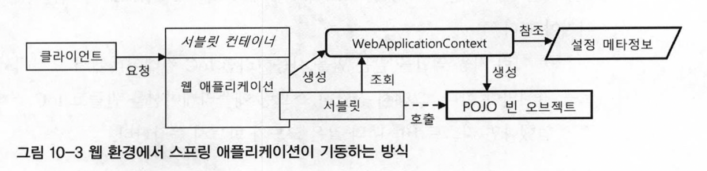
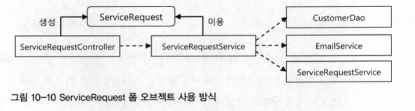
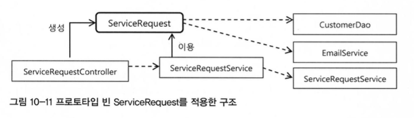

# 10장 IoC 컨테이너와 DI

## 10.1장 IoC 컨테이너: 빈팩토리와 애플리케이션 컨텍스트

오브젝트의 생성과 관계설정, 사용, 제거 등의 작업을 독립된 컨테이너가 담당

컨테이너가 코드 대신 오브젝트에 대한 제어권을 갖고 있다고 해서 IoC라고 부른다.

빈 팩토리와 애플리케이션 컨텍스트는 각각 기능을 대표하는 BeanFactory와 ApplicationContext 인터페이스로 정의

이 인터페이스를 구현한 것이 IoC 컨테이너

### 10.1.1 IoC 컨테이너를 이용해 애플리케이션 만들기

본격적인 IoC 컨테이너로 동작하려면 `POJO 클래스`와 `설정 메타정보`가 필요

핵심 코드를 담고 있느 POJO 클래스 준비 - 각자 기능에 독립적, 결합도가 낮게 인터페이스 사용

설정 메타정보를 만들어 제공한다.

#### BeanDefinition 인터페이스

어떤 형식으로든 작성 가능하다.

### 10.1.2 IoC 컨테이너의 종류와 사용 방법

#### StaticApplicationContext

- 코드를 통해 빈 메타정보를 등록하기 위해 사용
- 실전에서 사용 X, 테스트 목적으로만ㅇㅇ

#### GenericApplicationContext

- 가장 일반적인 애플리케이션 컨텍스트의 구현 클래스
- 실전에서 사용 가능한 모든 기능을 갖추고 있다.
- Static~ 과 다르게 외부의 리소스에 있는 메타정보 활용 가능( xml )
- GenericXMLApplicationContext - XmlBeanDefinitionReader 내장

#### WebApplicationContext

- 가장 많이 사용되는 웹 환경에서 필요한 기능이 추가된 클래스
  
- 

### 10.1.3 IoC 컨테이너 계층 구조

#### 부모 컨텍스트를 이용한 계층구조 효과

계층구조 안의 모든 컨텍스트는 각자 독립적인 메타정보를 이용해 오브젝트를 관리한다.

DI를 위해 빈을 찾을 때는 부모 애플리케이션 컨텍스트의 빈까지 모두 검색한다.

본인 검사 후 부모 검색, 자식은 검색하지 않음

### 10.1.4 웹 애플리케이션의 IoC 컨테이너 구성

- 웹 모듈(WAR)안에 컨테이너를 두는 것
- 엔터프라이즈 애플리케이션 레벨에 두는 방법

웹 애플리케이션에는 하나 이상의 스프링 애플리케이션의 프론트 컨트롤러 역활을 하는 서블릿이 등록될 수 있다.

여러 서블릿들이 확장, 변경에 사용될 수 있도록 구성 방법을 짜야한다.

- 서블릿 컨텍스트와 루트 애플리케이션 컨텍스트 계층구조
- 루트 애플리케이션 단일 구조
- 서블릿 컨텍스트 단일구조

## 10.2 IoC/DI 를 위한 빈 설정 메타정보 작성

### IoC 컨테이너의 기본 역할

코드를 대신해서 애플리케이션을 구성하는 POJO로 만들어진 애플리케이션 클래스와 서비스 오브젝트들을 생성하고 관리하는 것이다.

### 10.2.1 빈 설정 메타 정보

BeanDefinition에 IoC 컨테이너가 필요한 핵심 정보가 있고 여러 개의 빈을 만드는데 재사용 될 수 있다.

|이름|내용|디폴트 값|

|beanClassName|빈 오브젝트의 클래스 이름|없음. 필수|

|scope|빈의 생명주기를 결정|싱글톤|

|lazyInit|빈 생성을 지연할 것인지 여부|false|

|autowireCandidate|자동으로 autowire대상으로 포함시킬지 여부|true|

|primary|자동와이어링 중 최종 선택의 우선권을 부여할지 여부|false|

|abstract|메타정보 상속에만 사용할 추상 빈으로 만들지의 여부|false|

### 10.2.2 빈 등록 방법

- XML: `<bean>` 태그
- XML: 네임스페이스와 전용 태그
- 자동인식을 이용한 빈 등록:
  - 스테레오타입 어노테이션
  - 빈 스캐너
- 자바 코드에 의한 빈 등록: @Configuration 클래스의 @Bean 메소드

### 10.2.3 빈 의존관계 설정 방법

명시적과 자동 와이어링 방법이 존재!

- XML: `<property>`, `<constructor-arg>`
- XML: 자동와이어링
- byType: 타입에 의한 자동와이어링
- XML: 네임스페이스와 전용 태그
- 애노테이션: @Resource
- 애노테이션: @Autowired / @Inject

### 10.2.4 프로퍼티 값 설정 방법

DI를 통해 빈에 주입되는 값은 다른 빈 오브젝트의 레퍼런스와 빈을 제외한 나머지 정보들이다.

- XML: `<property>`와 전용 태그
- 애노테이션: @Value
- 자바 코드: @Value

### 10.2.5 컨테이너가 자동등록하는 빈

ApplicationContext, BeanFactory

ResourceLoader, ApplicationEventPublisher

systemProperties, systemEnvironment

## 10.3 프로토타입과 스코프

스프링 빈은 싱글톤

컨텍스트마다 빈의 오브젝트는 한개

인스턴수 변수에 상태 값을 저장 불가능 → 싱글톤이 아닌 프로토타입과 스코프 빈

### 10.3.1 프로토타입 스코프

여러 개의 빈에서 DI 해도 같은 빈

자동주입 말고 의존객체 조회를 해도 같은 객체

```java
@Test
public void singletonScope(){
 ...
 beans.add(ac.getBean(SingletonBean.class));
 beans.add(ac.getBean(SingletonBean.class));
  asserThat(beans.size(), is(1)); // 2개를 만들어도 1개
...
}

// ...

@Test
public void prototypeScope(){
 beans.add(ac.getBean(PrototypeBean.class));
 asserThat(beans.size(), is(1));
 beans.add(ac.getBean(PrototypeBean.class));
 asserThat(beans.size(), is(2)); // 2개를 만들면 2개
}
```

#### 프로토타입 빈의 생명주기와 종속성

프로토타입은 빈을 제공하면 스프링이 관리하는 빈이 아니다. 컨테이너가 관리한다.

주입받은 빈에 따라 생명 주기가 달라진다.

#### 프로토타입 빈의 용도

사용자의 요청별로 독립적인 정보나 작업상태를 저장 해 둘 오브젝트를 만들 필요가 있을 때 사용
매번 새로운 오브젝트가 필요하면서 DI를 통해 다른 빈을 사용할 수 있어야 한다

```java
public class ServiceRequest {
 String customerNo;
 String productNo;
 String description;
}
```



마치 DTO의 느낌

```java
@Component
@Scope ("prototype")
public class ServiceRequest {
 ...
}
```

```java
@Autowired ApplicationContext context;
public void serviceRequestFormSubmit (HttpServletRequest request) {
  ServiceRequest serviceRequest = this.context.getBean(ServiceRequest.class); 
  ServiceRequest.setCustomerByCustomerNo(request.getarameter("custno"));
  ...
}
# new 대신 컨테이너에 요청해서 새로운 오브젝트를 받아옴.
```



#### 프로토 타입 빈의 DI 전략

```java
@Autowired ServiceRequest serviceRequest;
public void serviceRequestFormSubmit (HttoServletRequest request) { 
 this.serviceRequest.setCustomerNo(request.getParameter"custno"));
 ...
}
```

컨트롤러 내에서 선언하면 생성될때만 주입되어 오류발생

> 💡 DI가 아닌 DL로 가야함

#### 프로토 타입 빈의 DL 전략

- ApplicationContext, BeanFactory를 DI받은 뒤 getBean() 하는 방법

    스프링 내의 ObjectFactory, ObjectFactoryCreatingFactoryBean을 사용

    ApplicationContext가 없으면 팩토리를 두고 팩토리에 DI 후 오브젝트를 받아온다.

    ```java
    @Configuration
    public class ObjectFactoryConfig {
     @Bean 
     public ObiectFactoryCreatingFactoryBean serviceRequestFactory() { 
      ObjectFactoryCreatingFactoryBean factoryBean =
       new ObjectFactoryCreatingFactoryBean(); 
      factoryBean.setTargetBeanName("serviceRequest"); 
     return factoryBean;
    }
    ```

    스프링이 기본으로 제공해주는 objectFactory를 사용하자!

- ServiceLocatorFactoryBean

    기존에 만들어둔 팩토리 인터페이스를 활용하고 싶을 때

- 메소드 주입

    ```java
    abstract public ServiceRequest getServiceRequset();
    
    public void serviceRequestFormSubmit (HttpServletRequest request) { 
     ServiceRequest serviceRequest = this.getServiceRequest();
     serviceRequest.setCustomerByCustomerNo(request.getParameter("custno"));
    }
    ```

- `Provider<T>`

    Provider 인터페이스를 @Inject, @Autowired, @Resource중의 하나를 이용해 DI 되도록지정해주기만하면스프링이자동으로
    Provider를구현한오브젝트를생성해서주입해주기때문이다.

### 10.3.2 스코프

application을  제외한 나머지 세가지 스코프는 싱글톤과 다르게 독립적인 상태를 저장해두고 사용하는데 필요!

- 요청

    하나의 웹요청 안에서 만들어지고 해당 요청이 끝날때 제거

- 세션, 글로벌세션

    사용자 별로 만들어지고 브라우저를 닫거나 세션타임이 종료될 때까지 유지되기 때문에 로그인 정보나 사용자별 선택 옵션 등 을 저장해두기에 유용

- 애플리케이션

    서블릿컨텍스트에 저장되는 빈오브젝트

스코프빈의 사용방법

프로토타입 빈과는 다르게 스프링이 생성부터초기화, DI, DL, 제거까지의 전과정을 모두 관리!

DL 방식

```java
@Scope("session")
public class LoginUser { 
 String loginId;
 String name; 
 Date loginTime;
 ...
}
```

```java
public class LoginService {
 @Autowired Provider <LoginUser> loginUserProvider;

 public void login(Login login) {
  LoginUser loginUser = loginuserProvider.get();
  loginUser.setLoginId(...);
  loginUser.setName(...);
  loginUser.setLoginTime(new Date());
 }
}
```

DI 방식

```java
@Scope(value="session", proxylode=ScopedProxylode.TARGET_CLASS)
public class LoginUser {
}
```

```java
public class LoginService {
 @Autowired LoginUser loginUser;

 public void login(Login login) {
  this.loginUser.setLoginId(...);
 }
}
```

### 10.4 기타 빈 설정 메타정보

#### 10.4.1 빈 이름

빈의 식별자 → id, name

#### 10.4.2 빈 생명주기 메소드

- 초기화 메소드

    빈오브젝트가생성되고DI 작업까지마친다음에실행
    되는메소드

  - 초기화콜백인터페이스
    InitializingBean
  - init-method지정 - xml
  - @PostConstruct
  - @Bean(init-method)
- 제거메소드

    컨테이너가 종료될 때 호출돼서 빈이 사용한 리소스를 반환하거나 종료전에 처리해야 할 작업

  - 제거콜백인터페이스
    DisposableBean 인터페이스를 구현해서 destroy()를 구현하는방법
    스프링 API에 종속되는 코드를 만드는 단점
  - destroy-method
    `<bean>` 태그에 destroy-method 를넣어서제거메소드를지정
  - @PreDestroy
    컨테이너가 종료될 때 실행될 메소드에 @PreDestroy를 붙여주면 된다.
  - @Bean(destroyMethod)
    @Bean 애노테이션의 destroyMethod엘리먼트를 이용해서 제거 메소드를지정

#### 10.4.3 팩토리 빈과 팩토리 메소드

- FactoryBean인터페이스
- 스태틱팩토리메소드
- 인스턴스팩토리메소드
- @Bean메소드
