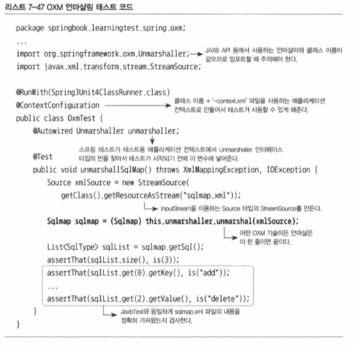
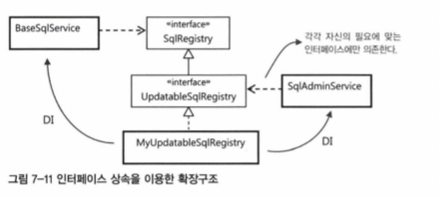

# 7장 스프링 핵심 기술의 응용

## 7.3 서비스 추상화 적용

JaxbXmlSQLReader의 발전시킬 2가지

- JAXB 외에도 다양한 XML과 자바오브젝트 매핑 기술이 있다.
- XML 파일을 좀 더 다양한 소스에서 가져올 수 있게 한다.

### 7.3.1 OXM 서비스 추상화

대표적인 XML과 자바오브젝트 매핑 기술

- Castor XML
- JiBX
- XmlBeans
- Xstream

이런 기술들을 OXM (Object-XML Mapping)이라고 한다.

#### OXM 서비스 인터페이스

- 자바오브젝트를 XML로 변환하는 Marshaller
- XML을 자바오브젝트로 변화하는 Unmarshaller

#### JAXB 구현 테스트

`Jaxb2Marshaller`는 `Unmarshaller`와 `Marshaller` 모두 구현하고 있다.



### 7.3.2 OXM 서비스 추상화 적용

이제 스프링의 OXM 기술을 이용하는 SqlService를 만들어보자.

OxmSqlService는 BaseSqlService와 유사하게 SqlReader 타입의 의존 오브젝트를 사용하되 이를 스태틱 멤버 클래스로 가지고 있는다.
OxmSqlReader는 private 멤버 클래스이므로 외부에서 접근하거나 사용할 수 없고 OxmSqlService를 통해 간접적으로 DI 받는다.

sqlRegistry와 같은 내부 오브젝트의 프로퍼티를 DI 받아 교체 가능하게 해준다.

#### 위임을 이용한 BaseSqlService 재사용

loadSql()과 getSql()이 중복되므로 작업을 위임해준다.

### 7.3.3 리소스 추상화

SQL 매핑 정보가 담긴 XML 파일 이름을 프로퍼티로 외부에서 지정할 수 있지만 클래스패스에 존재하는 파일로 제한된다.

#### 리소스

```java
package org.springframework.core.io;
...

public interface Resource extends InputStreamSourse {
    boolean exist();

    boolean isReadable();

    boolean isOpen();

    URL getURL() throws IOException;

    URL getURI() throws IOException;

    File getFile() throws IOException;

    Resource createRelative(String relativePath) throws IOException;

    long lastModified() throws IOException;

    String getFilename();

    String getDescription();
}

public interface InputStreamSource {
    InputStream getInputStream() throws IOException;
}
```

#### 리소스 로더

`ResourceLoader`가 인식하는 접두어

- file:
- classpath:
- 없음
- http::

## 7.4 인터페이스 상속을 통한 안전한 기능확장

### 7.4.1 DI와 기능의 확장

의존 오브젝트는 자유롭게 확장될 수 있다는 점을 염두에 두자.
DI는 런타임 시에 의존 오브젝트를 다이내믹하게 연결해줘서 유연한 확장을 꾀하는게 목적임을 잘 생각하자.

DI를 적용할 때는 가능한 한 인터페이스를 사용하게 해야 한다.

- 다형성을 얻기 위해서,
- 클라이언트별 다중 인터페이스 구현과 같은 유연하고 확장성 높은 설계가 가능하다.

### 7.4.2 인터페이스 상속

사용하는 이유 중 하나는 모든 클라이언트가 자신의 관심에 따른 접근 방식을 불필요한 간섭 없이 유지할 수 있다는 점이다.

`BaseSqlService`와 `SqlAdminService`는 동일한 오브젝트에 의존하고 있지만 각자의 관심과 펼요에 따라서 다른 인터페이스를 통해 접근한다. 
인터페이스를 사용하는 DI이 기 때문에 가능한 일이다.



## 7.5 DI를 이용해 다양한 구현 방법 적용하기

읽기 전용은 동시성 문제가 발생할 일이 없지만 수정은 다르다.

### 7.5.1 ConcurrentHashMap을 이용한 수정 가능 SQL 레지스트리

HashMap으로는 멀리스레드 환경에서 예상하지 못한 결과가 발생할 수 있다.

동기화된 해시 데이터 조작에 최적화되도록 만들어진 ConcurrentHashMap을 사용하는게 권장된다.

### 7.5.2 내장형 데이터베이스를 이용한 SQL 레지스트리 만들기

내장형 DB를 이용해 만들어보자.

내장형 DB

- 인덱스 활용 가능
- SQL을 저장해두고 관리할 목적으로 별도의 DB를 구성하면 
- 최적화된 락킹, 격리수준, 트랜잭션을 적용 가능