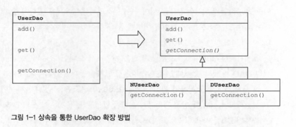
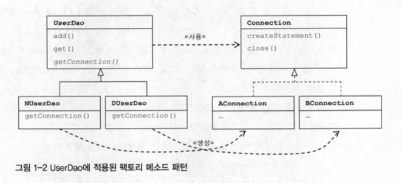
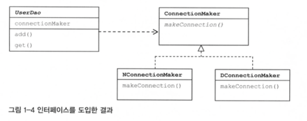
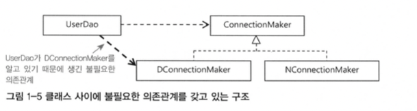
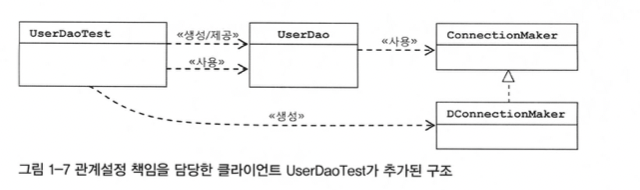

# *1장 오브젝트와 의존관계*

>객체지향의 기술의 진정한 가치를 회복시키고, 그로부터 객체지향 프로그래밍이 제공하는 폭넓은 혜택을 누릴 수 있도록 기본으로 돌아가자는 것이 바로 스프링의 핵심 철학이다.

## 1.1 초난감 DAO

>**DAO란?**
Data Access Object는 DB를 사용해 데이터를 조회하거나 조작하는 기능을 전담하도록 만든 오브젝트를 말한다.

스프링이 가장 관심을 두는 대상은 오브젝트다. 오브젝트에 대한 관심은 오브젝트의 기술적인 특성과 사용방법을 넘어서 오브젝트의 설계로 발전하게 된다.

### JDBC를 이용하는 작업의 일반적인 순서

- DB 연결을 위한 Connection을 가져온다.
- SQL을 담은 Statement(또는 PreparedStatement)를 만든다.
- 만들어진 Statement를 실행한다.
- 조회의 경우 SQL 쿼리의 실행 결과를 ResultSet으로 받아서 정보를 저장할 오브젝트에 옮겨준다.
- 작업 중에 생성된 Connection, Statement, ResultSet 같은 리소스는 작업을 마친 후 반드시 닫아준다.
- JDBC API가 만들어내는 예외를 잡아서 직접 처리하거나, 메소드에 throws를 선언해서 예외가 발생하면 메소드 밖으로 던지게 한다.

```java
// UserDAO
public class UserDao {
  public void add(User user) throws ClassNotFountException, SQLException {
    Class.forName('com.mysql.jdbc.Driver');
    Connection c = DriverManager.getConnection("jdbc:mysql://localhost/test","ID","PW");
    PreparedStatement ps = c.prepareStatement("insert into users(id, name, password) values (?, ?, ?)");
    ps.setString(1, user.getId());
    ps.setString(2, user.getName());
    ps.setString(3, user.getPassword());
    ps.executeUpdate();
    ps.close();
    c.close();
  }
  public User get(String userid) throws ClassNotFoundException, SQLException {
    Class.forName('com.mysql.jdbc.Driver');
    Connection c = DriverManager.getConnection("jdbc:mysql://localhost/test","ID","PW");
    PreparedStatement ps = c.prepareStatement("select * from users where id = ?");
    ps.setString(1, user.getId());
    ResultSet rs = ps.executeQuery();
    rs.next();
    User user = new User();
    user.setId(rs.getString("id");    
    user.setName(rs.getString("name");
    user.setPassword(rs.getString("password");
    rs.close();
    ps.close();
    c.close();
    return user;
  }
}
```

```java
// test용 main() 메소드
public static void main(String[] args) {
 UserDao dao = new UserDao();

 User user = new User();
 user.setId("whiteship");
 user.setName("백기선");
 user.setPassword('married');

 dao.add(user); 

    System.out.println(user.getId() + "등록 성공")

 User user2 = dao.get(user.getId()); 
 System.out.println(user2.getName());
 System.out.println(user2.getPassword());

    System.out.println(user2.getId() + "조회 성공")
}
```

다음과 같은 코드는 작동은 잘하지만 여러가지 문제가 있다. 이런 초난감 DAO 코드를 객체 지향 기술의 원리에 충실한 멋진 스프링 스타일의 코드로 개선해보자.

## 1.2 관심사의 분리

객체지향 세계에서는 모든 것이 변한다. 오브젝트에 대한 설계와 이를 구현하는 코드가 변한다.
`관심사의 분리(Separation of Concerns)`는 관심이 같은 것끼리는 하나의 객체 안으로 또는 친한 객체로 모이게 하고, 관심이 다른 것은 가능한 따로 떨어져서 서로 영향을 주지 않도록 분리하는 것이라고 생각할 수 있다.

### 메소드 추출

우선 리팩토링을 통해 중복 코드의 메소드를 추출한다.

이때 Dao의 기능에는 아무런 변화를 주지않고 메소드를 분리해 내야한다.
공통의 기능을 담당하는 메소드로 중복된 코드를 뽑아내는 것을 **메소드 추출 기법**이라고 부른다.
여기서는 add()와 get()에 있는 중복코드인 getConnection()을 메소드로 추출해냈다.

```java
// UserDAO
public class UserDao {
  public void add(User user) throws ClassNotFountException, SQLException {
    Connection c = DriverManager.getConnection("jdbc:mysql://localhost/test","ID","PW");
    // ...
  }
  public User get(String userid) throws ClassNotFoundException, SQLException {
    Connection c = DriverManager.getConnection("jdbc:mysql://localhost/test","ID","PW");
    // ...
  }

  private Connection getConnection() throws ClassNotFoundException, SQLException {
    Class.forName('com.mysql.jdbc.Driver');
    Connection c = DriverManager.getConnection("jdbc:mysql://localhost/test","ID","PW");
    return c;
  }
}
```

또 다른 방법으로 상속을 통해서 확장 방법을 제공해줄 수 있다.
슈퍼클래스에 기본적인 로직 흐름을 만들고, 그 기능의 일부를 추상 메소나 오버라이딩이 가능한 protected 메소드 등으로 만든 뒤 서브클래스에서 이런 메소드를 필요에 맞게 구현해서 사용하도록 하는 방법을 **템플릿 메소드 패턴**이라고 한다.


여기에 getConnection() 메소드는 어떤 Connection 클래스의 오브젝트를 어떻게 생성할 것인지를 결정하는 방법이라고도 볼 수 있다. 이 메소드까지 분리해내서 서브클래스에서 구체적인 오브젝트 생성 방법을 결정하게 되는 것을 **팩토리 메소드 패턴** 이라고 부른다.

>팩토리 메소드 패턴은 슈퍼클래스 코드에서는 서브클래스에서 구현할 메소드를 호출해서 필요한 타입의 오브젝트를 가져와 사용한다.
서브클래스는 다양한 방법으로 오브젝트를 생성하는 메소드를 재정의할 수 있다.
이렇게 서브클래스에서 오브젝트 생성 방법과 클래스를 결정할 수 있도록 미리 정의해둔 메소드를 팩토리 메소드라고 하고, 이 방식을 통해 오브젝트 생성 방법을 나머지 로직, 즉 슈퍼클래스의 기본 코드에서 독립시키는 방법을 팩토리 메소드 방식이라고 한다.



## 1.3 DAO의 확장

문제가 많은 상속이 아닌 클래스를 분리하면서 가장 좋은 해결책은 두 클래스가 서로 긴밀하게 연결되어 있지 않도록 중간에 추성적인 느슨한 연결고리를 만들어주는 것이다.
인터페이스를 도입하여 구현하면 다음과 같은 결과가 나온다.

인터페이스로 추상화해놓은 최소한의 통로를 통해 접근하는 쪽에서는 오브젝트를 만들 때 사용할 클래스가 무엇인지 몰라도 되게 된다.

하지만 이 방법으로 분리하였을때에도 userDao에 어떤 클래스의 오브젝트를 사용할지를 결정하는 생성자의 코드에 남아있다. 아직 분리되지 않은 또 다른 관심사항이 존재하기 때문에 그런것이다.
이것을 해결하기 위해 클라이언트 오브젝트에 제 3의 관심사항인 `UserDao`와 `ConnectionMaker`구현 클래스의 관계를 결정해주는 기능을 분리해주자.


위와 같았던 불필요한 의존관계가 있던 구조에서 아래와 같이 필요한 의존성만 챙기는 구조가 될 수 있다.

### 원칙과 패턴

#### 개방 폐쇄 원칙 - OCP

클래스나 모듈은 확장에는 열려 있어야 하고 변경에는 닫혀 있어야 한다.

#### 높은 응집도와 낮은 결합도

- 높은 응집도
응집도가 높은건 하나의 모듈, 클래스가 하나의 책임 또는 관심사에만 집중되어 있다는 뜻이다.

- 낮은 결합도
낮은 결합도는 높은 응집도보다 더 민감한 원칙이다. 느슨한 연결은 관계를 유지하는데 꼭 필요한 최소한의 방법만 간접적인 형태로 제공하고, 나머지는 서로 독립적이고 알 필요도 없게 만들어주는 것이다.
결합도가 낮아지면 변화에 대응하는 속도가 높아지고, 구성이 깔끔해진다. 또한 확장하기에도 매우 편리하다.
