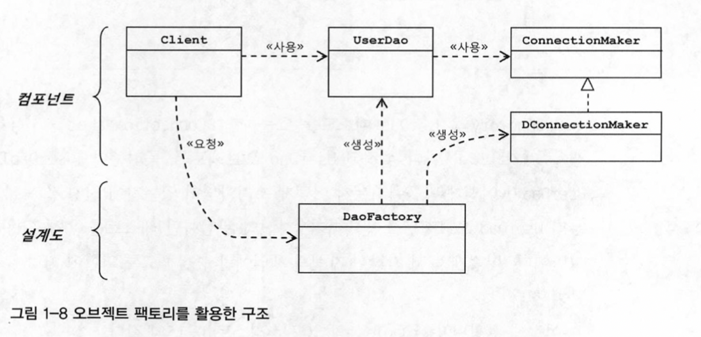
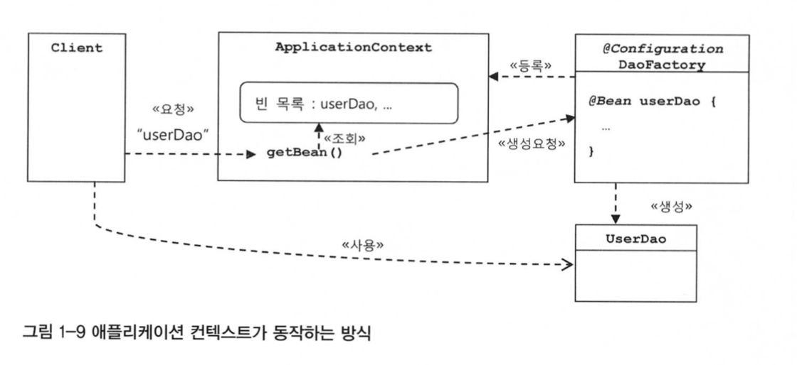
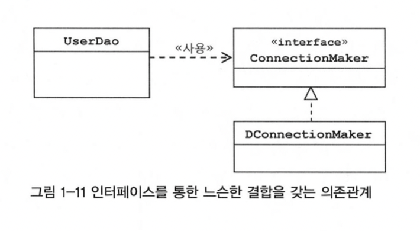
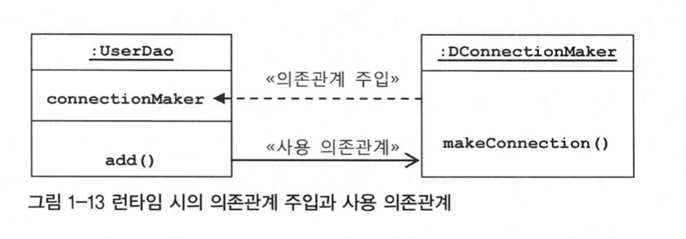
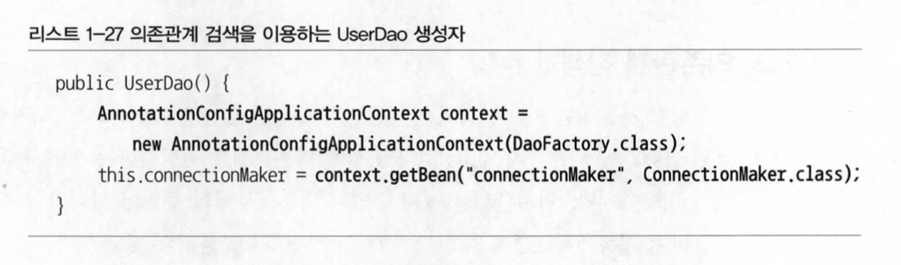

# IoC

## Inversion of Control 제어의 역전

`UserDaoTest`는 `UserDao`의 기능이 잘 동작하는지를 테스트하려고 만든 것인데 또 다른 책임까지 떠맡게 되었다. 이것도 분리하여 `UserDao`와 `ConnectionMaker` 구현 클래스의 오브젝트를 만드는 것과, 그렇게 만들어진 두 개의 오브젝트가 연결돼서 사용될 수 있도록 관계를 맺어주는 것이다.

## 팩토리란?

객체의 생성 방법을 **결정**하고 그렇게 만들어진 오브젝트를 **돌려주는** 클래스이다.

`DaoFactory`에 `UserDao`, `ConnectionMaker` 관련 생성 작업을 `DaoFactory` 로 옮기고, `UserDaoTest`에서는 `DaoFactory`에 요청해서 미리 만들어진 `UserDao` 오브젝트를 가져와 사용하게 만든다.



`UserDao`와 `ConnectionMaker`는 각각 애플리케이션의 핵심적인 데이터 로직과 기술 로직을 담당하고 있고, `DaoFactory`는 이런 애플리케이션의 오브젝트들을 구성하고 그 관계를 정의하는 책임을 맡고 있다.

전자가 실질적인 로직을 담당하는 컴포넌트라면, 후자는 애플리케이션을 구성하는 컴포넌트의 구조와 관계를 정의한 걸계도와 같은 역할을 한다.

### 제어의 역전이란?

> **제어의 역전**에서는 오브젝트가 자신이 사용할 오브젝트를 스스로 선택하지 않는다. 당연히 생성하지도 않는다. 또 자신도 어떻게 만들어지고 어디서 사용되는지를 알 수 없다. 모든 제어 권한을 자신이 아닌 다른 대상에게 위임하기 때문이다.

### 1.5 스프링의 IoC

오브젝트 팩토리를 이용한 스프링 IoC를 사용해보자

#### 애플리케이션 컨텐스트와 설정정보

스프링 빈은 스프링 컨테이너가 생성과 관계설정, 사용등을 제어해주는 제어의 역전이 적용된 오브젝트를 말한다.

애플리케이션 컨텍스트(`application context`)는 빈 팩토리를 IoC 방식에 따라 만들어진 일종의 빈 팩토리라고 생각하면 `된다. 별도의 정보를 참고해서 빈(오브젝트)의 생성, 관계 설정 등의 제어 작업을 총괄한다.

```java
import org.springframework.context.annotation.Bean;
import org.springframework.context.annotation.Configuration;

@Configuration -> 애플리케이션 컨텐스트 또는 빈 팩토리가 사용할 설정정보라는 표시
public class DaoFactory {
    @Bean -> 오브젝트를 생성을 담당하는 IoC용 메소드라는 표시
    public UserDao userDao() {
        return new UserDao(connectionMaker());
    }
    @Bean
    public ConnectionMaker connectionMaker() {
        return new DConnectionMaker;
    }
}
```



`Client`가 `Application Context`로 요청을 보내면 `DaoFactory`와 달리 직접 오브젝트를 생성하고 관계를 맺어주는 코드가 없고, 그런 생성정보와 연관관계 정보를 별도의 설정정보를 통해 얻는다.

`DaoFactory`를 오브젝트 팩토리로 직접 사용했을 때와 다르게 얻을 수 있는 장점은 다음과 같다.

- 클라이언트는 구체적인 팩토리 클래스를 알 필요가 없다.
  오브젝트들이 추가되면 팩토리 클래스를 추가하고 생성해야하는데 그러지 않아도 일관된 방식으로 가져올 수 있다.
- 애플리케이션 컨텍스트는 종합 IoC 서비스를 제공해준다.
- 애플리케이션 컨텍스트는 빈을 검색하는 다양한 방법을 제공한다.

- 빈
    빈 또는 빈 오브젝트는 스프링이 IoC 방식으로 관리하는 오브젝트라는 뜻이다.
    모든 오브젝트가 다 빈은 아니다.
- 빈 팩토리
    스프링의 IoC를 담당하는 핵심 컨테이너를 가리킨다.
- 애플리케이션 컨텍스트
    스프링의 설정정보란 애플리케이션 컨텍스트 또는 빈 팩토리가 IoC를 적용하기 위해 사용하는 메타정보를 말한다.
- 설정정보 / 설정 메타 정보
    IoC에 적용하기 위해 사용하는 메타정보를 말한다.
- 컨테이너 또는 IoC 컨테이너
    IoC 방식으로 빈을 관리하는 의미에서 애플리케이션 컨텐스트나 빈 팩토리를 컨테이너 또는 IoC 컨테이너라고 한다.
- 스프링 프레임워크
    IoC 컨테이너, 애플리케이션 컨텍스트를 포함해서 스프링이 제공하는 모든 기능을 통틀어 말할때 사용한다.

## 1.6 싱글톤 레지스티리와 오브젝트 스코프

스프링 컨텍스트와 `DaoFactory`에서 가져온 오브젝트의 값을 확인해보면 스프링에서는 같은 값이 나오지만 `DaoFactory`에서는 다른 값이 나오는걸 확인할 수 있다.

애플리케이션 컨텍스트는 싱글톤을 저장하고 관리하는 싱글톤 레지스트리이다.

### 1.6.1 왜 스프링은 싱글톤으로 빈을 만들까?

주로 자바 엔터프라이즈 기술을 사용하는 서버환경이기 떄문이다. 서버 하나에 많은 요청이 오고 여러 로직들이 사용되는 환경을 위해 싱글톤으로 설계되었다.

서블릿은 대부분 멀티스레드 환경에서 싱글톤으로 동작한다.

자바에서의 싱글톤의 한계

- 클래스 밖에서는 오브젝트를 생성하지 못하도록 생성자를 private으로 만든다.
- 생성된 싱글톤 오브젝트를 저장할 수 있는 자신과 같은 타입의 스태틱 필드를 정의한다.
- 스태틱 팩토리 메소드인 `getInstance()`를 만들고 이 메소드가 최초로 호출되는 시점에서 한번만 오브젝트가 만들어지게 한다. 생성된 오브젝트는 스태틱 필드에 저장된다. 또는 스태틱 필드의 초기값으로 오브젝트를 미리 만들어둘 수도 있다.
- 한번 오브젝트(싱글톤)이 만들어지고 난 후에는 `getInstance()` 메소드를 통해 이미 만들어져 스태틱 필드에 저장해둔 오브젝트를 넘겨준다.

생성자가 `private`로 바뀌었기 때문에 `DaoFactory`에서 `UserDao`를 생성하며 `ConnectionMaker` 오브젝트를 넣어주는게 불가능해졌다.

- private를 생성자를 갖고 있기 때문에 상속할 수 없다.
- 싱글톤은 테스트하기가 힘들다.
- 서버환경에서는 싱글톤이 하나만 만들어지는 것을 보장하지 못한다.
- 싱글톤의 사용은 전역 상태를 만들 수 있기 때문에 바람직하지 못하다.

#### 스프링 레지스트리

스프링은 직접 싱글톤 형태의 오브젝트를 만들고 관리하는 기능을 제공한다.

### 1.6.2 싱글톤과 오브젝트의 상태

멀티스레드 환경이라면 여러 스레드가  동시에 접근해서 사용할 수 있다. 따라서 상태 관리에 주의를 기울여야 한다. 기본적으로 싱글톤이 멀티스레드 환경에서 서비스 형태의 오브젝트로 사용되는 경우에는 상태정보를 내부에 갖고 있지 않은 stateless 방식으로 만들어져야 한다.

스프링의 싱글톤 빈으로 사용되는 클래스를 만들 때는 기존의 UserDao처럼 개별적으로 바뀌는 정보는 로컬 변수로 정의하거나, 파라미터로 주고받으면서 사용하게 해야 한다.

스프링이 한번 초기화해주고 나면 이후에는 수정되지 않기 때문에 멀티스레드 환경에서 사용해도 아무런 문제가 없다.

### 1.6.3 스프링 빈의 스코프

빈이 생성되고, 존재하고, 적용되는 범위를 빈의 스코프라고 한다. 프로토타입 스코프는 컨테이너에 빈을 요청할 때마다 매번 새로운 오브젝트를 만들어준다. 그 외에도 웹에 새로운 HTTP 요청이 생길때마다 생기는 `request` 스코프가 있고 웹의 세션과 유사한 세션 스코프가 있다.

## 1.7 의존관계 주입(DI)

### 1.7.1 제어의 역전(IoC)과 의존관계 주입

(DI)는 Dependency Injection으로 오브젝트 레퍼런스를 외부로부터 제공(주입)받고 이를 통해 여타 오브젝트와 다이내믹하게 의존관계가 만들어지는 것이다. 의존관계 설정이라고 할 수 있다.

### 1.7.2 런타임 의존관계 설정

의존관계란?

의존관계에는 방향성이 있어야한다. A가 B에 의존하고 있지만, 반대로 B는 A에 의존하지 않는다. 의존하지 않는다는 말은 B는 A의 변화에 영향을 받지 않는다는 뜻이다.



인터페이스를 통해 느슨한 의존관계를 갖는 UserDao 클래스는 ConnectionMaker 인터페이스에게만 직접 의존한다.

프로그램이 시작되고 `UserDao` 오브젝트가 만들어지고 나서 런타임 시에 의존관례를 맺는 대상, 즉 실제 사용대상인 오브젝트를 `의존 오브젝트(dependent object`라고 말한다.

의존관계 주입이란 다음과 같은 세 가지 조건을 충족하는 작업을 말한다.

- 클래스 모델이나 코드에는 런타임 시점의 의존관계가 드러나지 않는다. 그러기 위해서는 인터페이스에만 의존하고 있어야 한다.
- 런타임 시점의 의존관계는 컨테이너나 팩토리 같은 제 3의 존재가 결정한다.
- 의존관계는 사용할 오브젝트에 대한 레퍼런스를 외부에서 제공(주입)해줌으로써 만들어진다.

여기서 핵심은 설계 시점에서는 알지 못했던 두 오브젝트의 관계를 맺도록 도와주는 제 3의 존재가 있다는 것이다.



### 1.7.3 의존관계 검색과 주입

의존관계 주입만 있는 것이 아닌 코드에서는 구체적인 클래스에 의존하지 않고, 런타임 시에 의존관계를 맺는 방법이 외부로부터 주입이 아니라 스스로 검색을 이용하기 때문에 `의존관계 검색(Dependency Lookup)`이라고 불리는 것도 있다. 의존관계 검색은 자신이 필요로 하는 의존 오브젝트를 능동적으로 찾는다.



#### DI와 DL의 차이점

`UserDao`와 `ConnectionMaker` 사이에 DI가 적용되려면 UserDao도 반드시 컨테이너가 만드는 빈 오브젝트여야 한다. 컨테이너가 UserDao에 대한 생성과 초기화 권한을 갖고 있어야 하기 때문이다.

### 1.7.4 의존관계 주입의 응용

- 기능 구현의 교환

1000개의 Dao가 있으면 모두 수정해줬어야했지만 DI를 이용하면 한줄만 수정하면 가능하다.

- 부가기능 추가
    DB 연결회수를 카운팅 하고 싶을 때 구현하는 방법으로 `ConnectionMaker`의 인터페이스에만 의존하고 있기 때문에 `ConnectionMaker`인터페이스를 구현하고 있다면 어떤 것이든 DI가 가능하다. 그래서 새로운 `CountingConnectionMaker`를 만들었다. 이 클래스는 DB커넥션을 직접 만들지 않는다. 하지만 DAO가 DB 커넥션을 가져올 때마다 호출하는 `makeConnection()`에서 카운트를 하여 카운팅을 구현할 수 있다.

```java
public class UserDaoConnecionCountingTest {
    public static void main(String[] args) throws ClassNotFoundException,
            SQLException {
        AnnotationConfigApplicationContext context =
            new AnnotationConfigApplicationContext(CountingDaoFactory.class);
        UserDao dao = context.getBean("userdao", UserDao.class);

        // DAO 사용 코드
        CountingConnectionMaker ccm = context.getBean("connectionMaker", CountingConnectionMaker.class);
        System.out.println("Connection counter : " + ccm.getCounter());
    }
}
```

## 1.7.5 메소드를 이용한 의존관계 주입

생성자가 아닌 메소드를 이용해 의존 오브젝트와의 관계를 주입해주는 데는 크게 두 가지 방법이 있다.

- 수정자 메소드를 이용한 주입
  - setter 메소드는 외부로부터 제공받은 오브젝트 레퍼런스를 저장해뒀다가 내부의 메소드에서 사용하게 하는 DI 방식에서 활용하기에 적당하다.
- 일반 메소드를 이용한 주입
  - 수정자 메소드처럼 set으로 시작해야 하고 한번에 한 개의 파라미터만 가질 수 있다는 제약이 싫다면 여러개의 파라미터를 갖는 일반 메소드를 DI용으로 사용할 수도 있다. 생성자가 수정자 메소드보다 나은 점은 한번에 여러 개의 파라미터를 받을 수 있다는 점이다.

## 1.8 XML을 이용한 설정

의존관계 설정정보를 쉽게 다룰 수 있는 XML을 이용해 만들어보자.

### 1.8.1 XML

- 빈 설정파일   `@Configuration`  `<beans>`
- 빈의 이름 `@Bean methodName()`  `<bean id=”methodName”`
- 빈의 클래스   `return new BeanClass();` `class=”a.b.c… BeanClass”>`

```xml
<beans>
    <bean id="connectionMaker" class="springbook.user.dao.DConnectionMaker"/>
    <bean id="userDao" class="springbook.user.dao.UserDao">
        <property name="connectionMaker" ref="connectionMaker"/>
    <beans>
</beans>
```

### 1.8.2 XML을 이용하는 애플리케이션 컨텍스트

애플리케이션 컨텍스트가 사용하는 XML 설정파일을 만들고 `GenericXmlAppicationContext`를 이용해 만들면 된다.

### 1.8.3 DataSource 인터페이스로 변환

ConnectionMaker와 같은 일을 하는 DataSource라는 인터페이스가 이미 존재한다.

```xml
<bean id="datasource" class="org.springframework.jdbc.datasource.SimpleDriverDataSource"/>
```

여기서 `<bean>` 설정으로 `SimpleDriverDataSource`의 오브젝트를 만드는 것까지는 가능하지만 수정자로 넣어진 DB 접속정보는 나타나 있지 않다는 점이다. 이 값들을 property로 연결정보를 주입할 수 있다.

```xml
<property name="driverClass" value="com.mysql.jdbc.Driver" />
<property name="url" value="jdbc:mysql://localhost/springbook" />
<property name="username" value="spring" />
<property name="password" value="book" />
```
