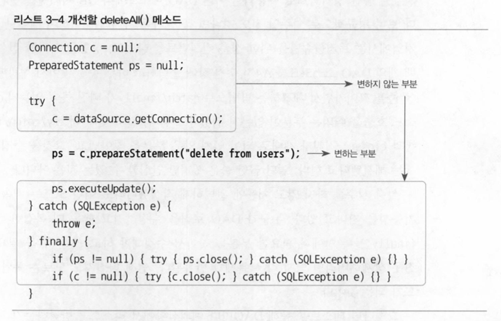
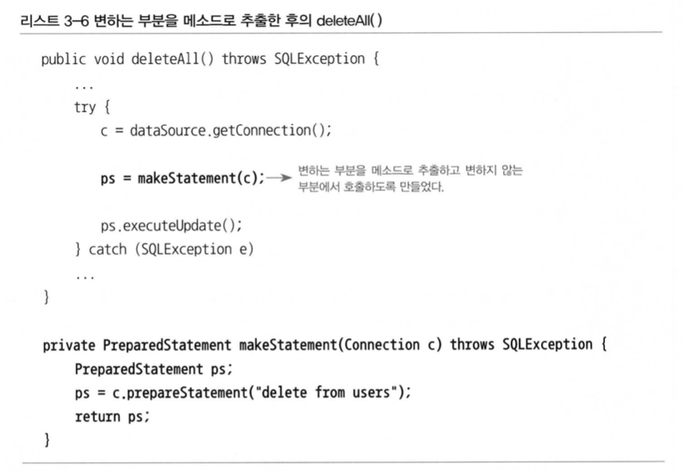
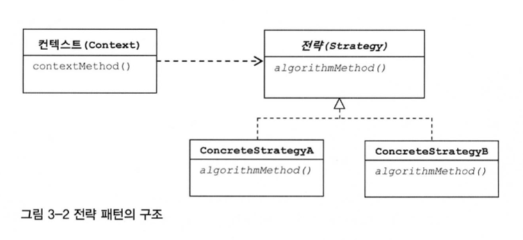
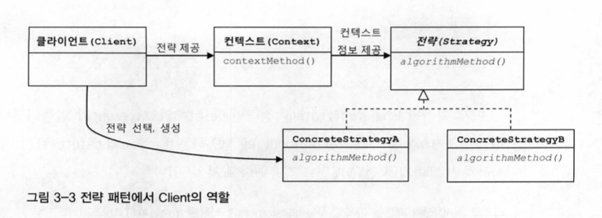
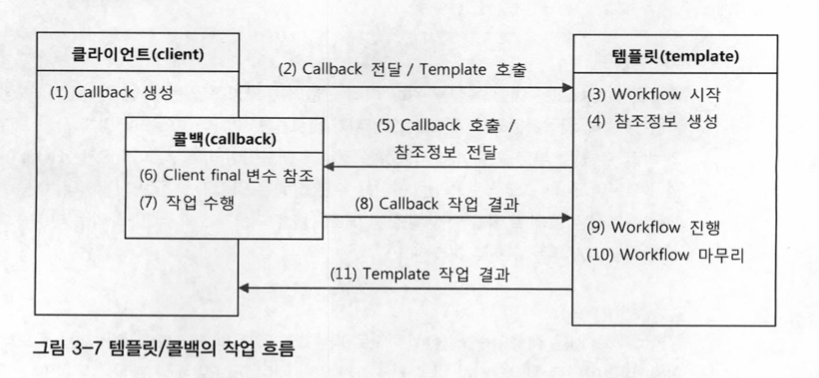
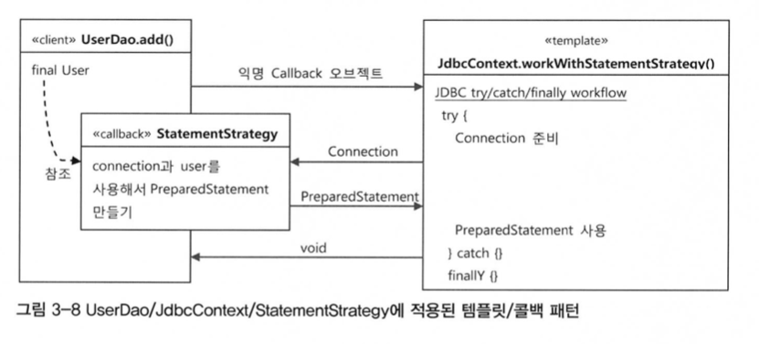

# 템플릿

템플릿이란 이렇게 바뀌는 성질이 다른 코드 중에서 변경이 거의 일어나지 않으며 일정한 패턴으로 유지되는 특성을 가진 부분을 자유롭게 변경되는 성질을 가진 부분으로부터 독립시켜서 효과적으로 활용할 수 있도록 하는 방법이다.

## 3.1 다시 보는 초난감 DAO

개선을 많이 했지만 예외상황에 대한 처리가 부족하다.

### 3.1.1 예외처리 기능을 갖춘 DAO

DB커넥션을 이용하면 예외처리를 할 필요가 있다. > 예외가 발생했을 경우에도 리소스를 반드시 반환하도록 해야한다.

JDBC에서는 try/catch/finally 사용을 권장한다.

```java
public void deleteAll() throws SQLException {
    Connection c = null;
    PreparedStatement ps = null;

    try {
        c = dataSource.getConnection();
        ps = c.preparedStatement("delete from users");
        ps.executeUpdate();
    } catch (SQLException e) {
        throw e;
    } finally {
        if (ps != null) {
            try {
                ps.close(); // 각각에도 예외가능성이 있어 잡아줘야한다.
            } catch (SQLException e) {
     }
        }
        if (c != null) {
            try {
                c.close(); // 각각에도 예외가능성이 있어 잡아줘야한다.
            } catch (SQLException e) {}
        }
    }
}
```

조회에서는 ResultSet이 추가되어 얘도 반환해야해 예외처리를 해야한다.

```java
public int getCount() throws SQLException {
    Connection c = null;
    PreparedStatement ps = null;
    **ResultSet rs = null;**

    try {
        c = dataSource.getConnection();
        ps = c.prepareStatement("select count(*) from users");

        **rs = ps.executeQuery();
        rs.next();
        return rs.getInt(1);**
    } catch (SQLException e) {
        throw e;
    } finally {
        **if (rs != null) {
            try {
                rs.close();
            } catch (SQLException e) {}
        }**
        if (ps != null) {
            try {
                ps.close();
            } catch (SQLException e) {}
        }
        if (c != null) {
            try {
                c.close();
            } catch (SQLException e) {}
        }
    }
}
```

## 3.2 변하는 것과 변하지 않는 것

### 3.2.1 JDBC try/catch/finally 코드의 문제점

2중으로 중첩되어 나오는데다가 메소드마다 반복된다.

### 3.2.2 분리와 재사용을 위한 디자인 패턴 적용

변하는 성격이 다른 것을 찾아내자.



업데이트를 실행하는 메소드와 구조는 거의 비슷하다. 이부분을 바꿔보자

#### 메소드 추출



 자주 바뀌는 부분을 메소드로 독립시켰는데 반대로 분리되고 남은 메소드가 재사용이 필요한 부분이다.

#### 템플릿 메소드 패턴의 적용

그래서 템플릿 메소드 패턴을 적용시켜서 분리해보자. 추출해서 별도의 추상메소드 선언으로 변경한다.

```java

abstract protected PreparedStatement makeStatement(Connection c) trhows SQLException;
```

이를 상속하는 서브클래스를 만들어 거기서 메소드를 구현한다.

**장점**: 클래스의 기능을 확장하고 싶을 때마다 상속을 통해 자유롭게 확장할 수 있다

**단점**: DAO로직마다 새로운 클래스를 만들어야한다는 단점이 있다.

확장구조가 이미 클래스를 설계하는 시점에서 고정되어 버려 관계에 대한 유연성이 떨어져 버린다.

### 전략 패턴의 적용

오브젝트를 아예 둘로 분리하고 클래스 레벨에서는 인터페이스를 통해서만 의존하도록 만드는 전략 패턴이다.

OCP 관점에서 보면 확장에 해당하는 변하는 부분을 별도의 클래스로 만들어 추상화된 인터페이스를 통해 위임하는 방식이다.



좌측의 context의 contextMethod()에서 일정한 구조를 가지고 동작하다가 특정 확장 기능은 strategy 인터페이스를 통해 외부의 독립된 전략 클래스에 위임하는 것이다.

deleteAll()의 컨텍스트들

- DB 커넥션 가져오기
- **PreparedStatement를 만들어줄 외부 기능 호출하기 ← 이 기능이 전략**
- 전달받은 PreparedStatement 실행하기
- 예외가 발생하면 이를 다시 메소드 밖으로 던지기
- 모든 경우에 만들어진 PreparedStatement와 Connection을 적절히 닫아주기

```java
public class DeleteAllStatement implements StattementStrategy {
 **public PreparedStatement makePreparedStatement(Connection c) throws SQLExceoption{
  PreparedStatement ps = c.preparedStatement("delete from users");
  return ps;**
 }
}
```

```java
public void deleteAll() throws SQLException {
 //...
 try {
  c = dataSource.getConnetion();

  **StatementStrategy strategy = new DeleteAllStatement();
  ps = strategy.makePreparedStatement(c);**

  ps.executeUpdate();
 } catch (SQLException e) {
 //...
}
```

다음과 같이 인터페이스를 사용해 전략 클래스에 나누어줬지만 컨텍스트 안에서 이미 특정 구현 클래스인 DeleteAllStament를 직접 알고 있는 것은 이상하다.

### DI 적용을 위한 클라이언트/컨텍스트 분리



클라이언트가 전략을 만들어 Context에 전달하는 것이 실제적인 사용 방법이다.

UserDao와 ConnectionMaker를 독립시켰던 그 방법이다.

JDBC의 try/catch/finally 코드를 클라이언트 코드인 StatementStrategy로 만드는 부분에서 독립시켜야한다는 점이다.

```java
public void jdbcContextWithStatementStrategy(StatementStrategy stmt) throws SQLException {
 Connection c = null;
 PreparedStatement ps = null;

 try {
  c = dataSource.getConnetion();

  **ps = stmt.makePreparedStatement(c);**

  ps.executeUpdate();
 } catch (SQLException e) {
 //...
}
```

```java
public void deleteAll() throws SQLException{
 StatementStrategy st = new DeleteAllStatement();
 jdbcContextWithStatementStrategy(st);
}
```

## 3.3 JDBC 전략 패턴의 최적화

### 3.3.1 전략 클래스의 추가 정보

전략패턴을 사용해 깔끔하게 분리해냈다.

이제 jdbcContextWithStatementStrategy()를 이용해 적절한 전략으로 바꾸어 로직을 제공해주자.

앞에서 구현했던 것과 같이 user 정보를 추가하여 AddStatement에 전달해주자.

```java
public void add(User user) throws SQLException {
 StatementStrategy st = new AddStatement(user);
 jdbcContextWithStatementStrategy(st);
}
```

### 3.3.2 전략과 클라이언트의 동거

클래스 파일이 많아지게 되어 복잡해짐 → 이때 전략 클래스들을 로컬 클래스로 만드는 방법이 있다.

또는 익명 내부 클래스로 만들 수 있다.

## 3.4 컨텍스트와 DI

### 3.4.1 JdbcContext의 분리

jdbcContextWithStatementStrategy는 userDAO가 아닌 다른 DAO 에서도 사용 가능하다.

독립시켜보자!

#### 클래스 분리

```java
public class JdbcContext {
    private DataSource dataSource;
    public void workWithStatementStrategy(StatementStrategy statementStrategy) throws SQLException {
        Connection connection = null;
        PreparedStatement preparedStatement = null;
        try {
            connection = this.dataSource.getConnection();
            preparedStatement = statementStrategy.makePreparedStatement(connection);
            preparedStatement.executeUpdate();
        } catch (SQLException e) {
            throw e;
        } finally {
            if (preparedStatement != null) {
                try {
                    preparedStatement.close();
                } catch (SQLException e) {
                }
            }
            if (connection != null) {
                try {
                    connection.close();
                } catch (SQLException e) {
                }
            }
        }
    }
}
```

의존관계 주립이라는 개념을 충실히 따르자면, 인터페이스를 사이에 둬서 클래스 레벨에서는 의존관계가 고정되지 않게 하고, 런타임 시에 의존할 오브젝트와의 관계를 다이내믹하게 주입해주는 것이 맞다. 따라서 인터페이스를 사용하지 않으면 엄밀히 말해서 온전한 DI라고 볼 수 없다. 하지만 스프링의 DI는 넓게 보자면 IoC라는 개념을 보괄한다. 따라서 JdbcContext를 스프링을 이용해 UserDao 객체에서 사용하게 주입했다는 건 DI의 기본을 따르고 있다고 볼 수 있다.

## 3.5 템플릿과 콜백

전략 패턴의 기본 구조에 익명 내부 클래스를 활용한 방식을 스프링에서는 템플릿/콜백 패턴이라고 부른다.

- 템플릿
    프로그래밍에서는 고정된 틀 안에 바꿀 수 있는 부분을 넣어서 사용하는 경우를 템플릿이라고 부른다.
- 콜백
    콜백은 실행되는 것을 목적으로 다른 오브젝트의 메소드에 전달되는 오브젝트를 말한다.
    파라미터로 전달되지만 값을 참조하기 위한 것이 아니라 특정 로직을 담은 메소드를 실행시키기 위해 사용한다.
    자바에선 메소드 자체를 파라미터로 전달할 방법은 없기 때문에 메소드가 담긴 오브젝트를 전달해야 한다.
    그래서 Functional Object 라고 한다.

### 3.5.1 템플릿/콜백 작동원리



클라이언트가 템플릿 안에서 실행될 로직을 담은 콜백 오브젝트 생성 > 템플릿은 콜백 오브젝트의 메소드를 호출, 참조 정보와 메소드에 있는 정보를 가지고 작업 수행, 결과를 다시 템플릿에 돌려줌 > 작업 마무리



그래서 jdbc에서는 이렇게 적용되어 있다.

### 3.5.2 편리한 콜백의 재활용

템플릿/콜백 방식에는 한 가지 아쉬운 점이 있다. DAO 메소드에서 매번 익명 내부 클래스를 사용하기 때문에 상대적으로 코드를 작성하고 읽기가 불편하다. 복잡한 익명 내부 클래스의 사용을 최소화 해보자.

전략 인터페이스 내에 바뀌지 않는 부분을 빼내서 executeSql() 메소드를 만들고 이를 jdbcContext로 옮겨보자

```java
public class jdbcContext{
 public void executeSql(final String query) throws SQLException {
  workWithStatementStrategy(
   new StatementStrategy() {
    public PreparedStatement makePreparedStatement(Connection c)
     throws SQLException {
       return c.prepareStatement(query)
     }
   }
  )
 }
}
```

### 3.5.3 템플릿/콜백의 응용

## 3.6 스프링의 JdbcTemplate

스프링이 제공하는 JDBC 코드용 기본 템플릿을 알아보자.

### 3.6.1 update()

```java
 public void deleteAll() throws SQLException {
    this.jdbcTemplate.update("delete from users");
}
```

```java
public void add(User user) throws SQLException {
    this.jdbcTemplate.update("insert into users(id, name, password values(?,?,?)", user.getId(), user.getName(), user.getPassword());
}
```

### 3.6.2 queryForInt()

```java
public int getCount() { 
    return this.jdbcTempalte.query(new PreparedStatementCreator() {
    // 첫번째 콜백 Statement 생성
        public PreparedStatement createPreparedStatement(Connection con)
            throws SQLExction {
                return con.prepareStatment("select count(*) from users");
            }
    }, new ResultSetExtractor<Integer>(){
    // 두번째 콜백, ResultSet으로부터 값 추출
        public Integer extractData(ResultSet rs) throws SQLException,
            DataAccessException {
                rs.next();
                return rs.getInt(1);
            }
    }) 
}
```

```java
public int getCount() {
  return this.jdbcTemplate.queryForInt("select count(*) from users");
}
```

### 3.6.3 queryForObject()

단건의 row를 받아와 object에 매핑

```java
public User get(String id) {
    return this.jdbcTemplate.queryForObject("select * from users where id = ?",
        new Object[] {id},
        new RowMapper<User>(){
            public User mapRow(ResultSet rs, int rowNum)
                throws SQLException {
                    User user = new User();
                    user.setId(rs.getString("id"));
                    user.setName(rs.getString("name"));
                    user.setPassword(rs.getString("password"));
                    return user;
                }
        }) ;
}
```

### 3.6.4 query()

여러건의 row를 받아와 오브젝트에 매핑

```java
public List<User> getAll() {
    return this.jdbcTemplate.query("select * from users order by id",
    new RowMapper<User>() {
          public User mapRow(ResultSet rs, int rowNum) 
        throws SQLException {
                User user = new User();
                user.setId(rs.getString("id"));
                user.setName(rs.getString("name"));
                user.setPassword(rs.getString("password"));
                return user;
            }
      });
}
```

## 3.7 정리

- JDBC와 같은 리소스의 반환이 필요한 코드는 반드시 try/catch/finally 블록으로 관리해야 한다.
- 컨텍스트가 하나 이상의 클라이언트 오브젝트에서 사용된다면 클래스를 분리해서 공유하도록 만든다.
- 일정한 작업 흐름이 반복되면서 그중 일부 기능만 바뀌는 코드가 존재한다면 전략 패턴을 적용한다.
- 컨텍스트가 하나 이상의 클라이언트 오브젝트에서 사용된다면 클래스를 분리해서 공유하도록 만든다.
