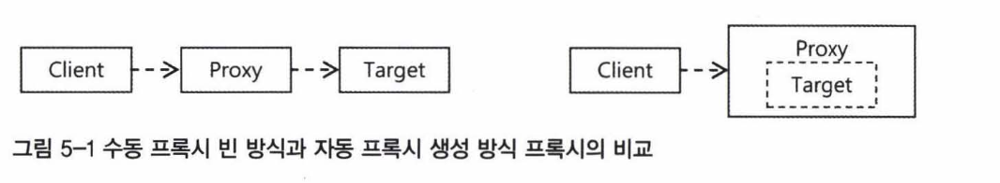
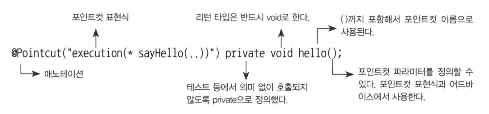
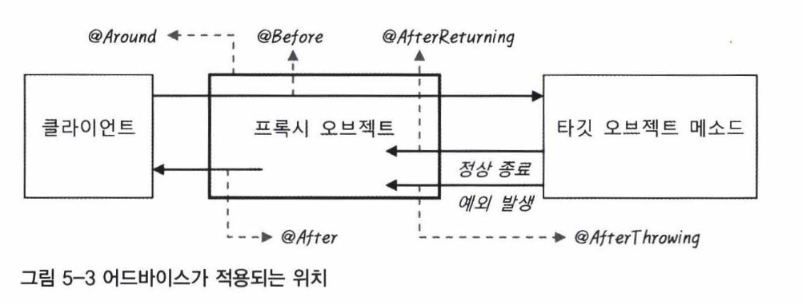

# 5장 AOP와 LTW

트랜잭션 AOP는 1장에서 배웠다. 이젠 AspectJ를 이용해 AOP를 만드는 법을 배워보자.

## 5.1 애스펙트 AOP

### 5.1.1 프록시 기반 AOP

부가기능(어드바이스) + 적용대상(포인트컷)을 통해 공통적인 기능을 개발, 관리하는 기술

데코레이터 패턴 or 프록시 패턴을 응용해 적용 가능

### 등록 방법

- AOP 인터페이스 구현과 <bean> 등록을 이용하는 방법
    - 각각을 모두 클래스로 개발하고 이를 빈으로 등록
- AOP 인터페이스 구현과 aop 네임스페이스의 <aop:advisor> 태그를 이용하는 방법
    - 포인트컷 표현식을 적극 활용해 태그로 등록
    
    ```xml
    <aop:config>
    	<aop:advisor advice-ref="transactionAdvice" pointcut="bean(*Service)"/>
    </aop:config>
    
    <bean id="transactionAdvice" class="...">...</bean>
    ```
    
- 임의의 자바 클래스와 aop 네임스페이스의 <aop:aspect>를 이용하는 방법
    - 어드바이스, 어드바이저 개념 대신 애스펙트라는 개념을 이용해 aop 네임스페이스를 사용
- @AspectJ 애노테이션을 이용한 애스펙트 개발 농법
    - @AspectJ는 이름 그대로 AspectJ AOP 프레임워크에서 정의된 애노테이션을 이용해 애스펙트를 만들 수 있게 해준다. 하지만 @AspectJ 문법과 애스펙트 정의 방법을 차용했을 뿐, AspectrJ AOP를 사용하는 것은 아니다.
    - @AspectJ는 @Transactional과 마찬가지로 AOP의 구성요소를 애노테이션을 이용해 정의할 수 있게 해준다.

### 자동 프록시 생성기와 프록시 빈

스프링 AOP를 사용한다면 어떤 개발 방식을 적용하든 모두 프록시 방식의 AOP

Client와 Target이라는 두 개의 클래스가 있고 Client는 Target을 Dl 받아 사용하는 관계라고 생각해보자.

```java
public class Client {
	@Autowired Target target;
	...
}
public class Target { ... }
// Client가 Target을 직접적으로 알고 있으니까 DI 위반
```

```java
public class Client {
	@Autowired Interface intf;
}

interface Interface { ... }

public class Target implements Interface { .. . }
```

```java
public class Proxy implements Interface (
	private Interface next;
	public void setNext(Interface next) { this.next =next; }
}
// Client • Proxy • Target 순서로 의존관계를 가지니 성공!
// 근데 문제가 있네?
```

문제는 `@Autowired`다. 

Proxy를 빈으로 등록하면 `@Autowired`를 통한 타입 자동와이어링을 사용할 수 없다.

왜냐하면 interface를 구현한 빈이 proxy와 client 두개이기 때문이다.

그래서 스프링은 자동 프록시 생성기를 이용해서 컨테이너 초기화 중에 만들어진 빈을 바꿔치기해 프록시 빈을 자동으로 등록해준다. 

이 자동 프록시 생성기가 바로 스프링의 프록시 기반 AOP의 핵심 동작원리다.



### AOP 적용의 특징

- AOP 적용은 @Autowired의 타입에 의한 의존관계 설정에 문제톨 일으키지 않는다
- AOP 적용은 다른 빈들이 Target 오브젝트에 직접 의존하지 못하게 한다

### 프록시의 종류

인터페이스를 구현한 방식만 프록시가 가능할까?

No, 클래스를 직접 참조하면서 강한 의존관계를 맺고 있는 경우에도 프록시를 적용 가능하다.

방법은?

- 타깃 클래스를 상속한 서브클래스를 만들어서 이를 프록시로 사용
- But, final 클래스와 final 메소드에는 적용이 안되며 타깃 클래스의 생성자가 두 번 호출된다

### 클래스를 이용한 프록시를 적용하는 방법

- 아예 아무런 인터페이스도 구현하지 않은 타깃 클래스에 AOP를 적용
- 강제로 클래스 프록시를 만들도록 설정
    
    ```xml
    <aop:config proxy-target-class="true">
    	...
    </aop:config>
    
    <!-- @Transactional에 적용하려면 다음과 같이 한다 -->
    <tx:annotation-driven proxy-target-class="true"/>
    ```
    

## 5.1.2 @AspectJ AOP

애스펙트 = 많은 오브젝트에 걸쳐서 필요한 부가기능을 추상화해놓은 것

### @AspectJ를 이용하기 위한 준비사항

`<aop:aspectj-autoproxy />` xml에 쓰면 클래스 레벨에서 붙은 @Aspect를 모두 등록해준다.

### @Aspect 클래스와 구성요소

- @Aspect만 붙여서 만들 수 있다. 빈으로 만들어줘야함.
- 포인트컷: @Pointcut
- 어드바이스: @Before, @AfterReturning, @AfterThrowing, @After, @Around

### 포인트컷 메소드와 애노테이션



- execution() : 접근제한자, 리턴 타입, 타입, 메소드, 파라미터 타입, 예외 타입 조건을 조합해서 메소드 단위까지 선책 가능한 가장 정교한 포인컷을 만들 수 있다.
- within() : 타입 패턴만을 이용해 조인 포인트 메소드를 선택한다.
    
    ```java
    @Pointcut(within("com.epril.myproject.dao..*))
    private void daoLayer() {}
    
    @Pointcut(within("com.epril.myproject.service..*))
    private void serviceLayer() {}
    
    @Pointcut(within("com.epril.myproject.web..*))
    private void webLayer() {}
    
    // dao.*는 패키지 밑의 클래스와 인터페이스만
    // dao..*는 dao밑의 모든 서브패키지까지
    ```
    
- this, target : 여러 개의 타입을 고를 수 있는 타입 패턴이 아니라 하나의 타입을 지정
- args : 메소드의 파라미터 타입만을 이용해 포인트컷을 설정할 때 사용
- @target, @Within
    - @target 지시자는 타깃 오브젝트에 특정 애노테이션이 부여된 것을 선정한다.
    - @within은 타깃 오브젝트의 클래스에 특정 애노테이션이 부여된 것을 찾는다.
- @args, @annotation, bean, ||, ! 등등

### 어드바이스 메소드와 애노테이션



- @Around
    - @Around 어드바이스 내에서 원한다면 타깃 오브젝트의 메소드를 여러 번 호출하거나, 호출 파라미터를 바꿔치기 하거나, 심지어 타깃 오브젝트 메소드를 호출하지 않도록 만들 수도 있다.
- @Before
    - 타깃 오브젝트의 메소드가 실행되기 전에 사용되는 어드바이스
- @AfterReturning
    - 타깃 오브젝트의 메소드가 실행을 마친 뒤에 실행되는 어드바이스다. 단, 예외가 발생하지 않고 정상적으로 종료한 경우에만 해당된다.
- @AfterThrowing
    - @AfterThrowing은 타깃 오브젝트의 메소드를 호출했을 때 예외가 발생하면 실행되는 어드바이스
- @After
    - @After는 메소드 실행이 정상 종료됐을 때와 예외가 발생했을 때 모두 실행

## 5.2 AspectJ와 @Configurable

### 5.2.1 AspectJ AOP

스프링 AOP는 단지 DI의 도움을 받아 프록시 오브젝트를 추가해서 애스펙트를 적용한다. 

하지만 AspectJ는 이와 달리 아예 타깃 오브젝트 자체의 코드를 바꿈으로써 애스펙트를 적용하므로 재컴파일이나 바이트코드 조작을 한다.

프록시 방식으로는 어드바이스를 적용할 수 없는 조인 포인트와 포인트컷 지시자를 지원하기 위해서

### 5.2.2 빈이 아닌 오브젝트에 DI 적용하기

도메인 오브젝트는 다른 빈을 참조하지 않는다. 따라서 DI를 받을 필요가 없다.

그런데 도메인 오브젝트에서 다른 빈을 사용하고 싶으면?

DI를 적용해야 하니 도메인 오브젝트를 스프링 빈으로 등록하고 IOC/DI가 적용되게 해야 한다.

스코프를 프로토타입으로 선언하고 Provider 등을 이용해 필요할 때마다 새로운 오브젝트를 가져오도록 만들어야 할것이다.

어디서든지 도메인 오브젝트가 생성되면 자동 DI 작업을 수행해주는 어드바이스를 적용해주는 것이다.

### DI 애스펙트

```java
after(Object bean) returning :
  beanConstruction(bean) && postConstructionCondition() && inConfigurableBean() {
      configureBean(bean);
  }
// @Configurable을 이용해 쉽게 적용시킬 수 있다
```

## 5.3 로드타임 위버(LTW)

### Runtime Weaving(RTW)

프록시 패턴을 활용한 위빙 방식으로, **Proxy**객체를 생성해 실제 타깃 오브젝트의 변형없이 런타임 중 메서드 호출이 일어나는 시점에 위빙을 수행한다.

메소드 호출에 대해서만 어드바이스를 적용 할 수 있다는 단점이 있다.

### Compile Time Weaving(CTW)

특수한 컴파일러를 활용해 **컴파일 과정에서 바이트 코드 조작**을 통해 Advisor 코드를 직접 삽입하여 위빙을 수행한다.

AspectJ에는 AJC (AspectJ Compiler)라는 컴파일러가 있다.

### Load Time Weaving(LTW)

java 파일을 컴파일한 결과물 **자바 클래스가 JVM에 로드될 때 바이트 코드 조작**을 통해 위빙되는 방식이다.

RTW처럼 소스파일과 클래스 파일에 조작을 가하지 않아 컴파일 시간은 상대적으로 CTW보다 짧다. 하지만 오브젝트가 메모리에 올라가는 과정에서 위빙이 일어나기 때문에 런타임 시, 시간은 CTW보다 상대적으로 느리다.

- @Configurable 지원
- 트랜잭션 AOP의 모드를 AspectJ로 설정했을 때도 로드타임 위버가 필요하다.
- JPA는 구현 제품에 따라서 다르긴 하지만 대부분 로드타임 위버를 이용한 바이트코드 조작을 필요로 한다.

## 5.4 스프링 3.1의 AOP와 LTW

### @EnableAspectJAutoProxy

@EnableAspectJAutoProxy는 @Aspect로 애스팩트를 정의할 수 있게 해주는 @AspectJ AOP 컨테이너 인프라 빈을 등록

```java
@Configuration
@EnableAspectJAutoProxy
public class AppConfig {
	@Bean MyAspect myAspect() { 
		return new MyAspect();
	}
	...
}
```

### @EnableLoadTimeWeaving

환경에 맞는 로드타임 위버를 등록해주는 애노테이션

```java
@Configuration
@EnableLoadTimeWeaving
public class Appconfig {
  ...
}
```

## 5.5 정리

- 스프링에서는 프록시 기반의 AOP 기술을 네 가지 접근 방법을 통해 활용할 수 있다. 각 접
근 방법의 장단점을 파악하고 자신에게 맞는 방법을 선택할 수 있어야 한다.
- @AspectJ는 AspectJ 스타일의 POJO 애스팩트 작성 방법이다. @AspectJ는 유연하고 강력한 기능을 가진 애스팩트를 손쉽게 만들게 해주지만, 복잡한 AspectJ 문법과 사용 방법을 익혀야하는부담이 있다.
- 스프링은 또한 AspectJ를 스프링 애플리케이션 내에서 간접적으로 활용할 수 있는 몇 가지 방법을 제공한다. @Configurable은 스프링 빈이 아닌 오브젝트에 DI를 적용할 수 있게 해 준다.
- 스프링은 다양한 서버환경에서 사용 가능한 편리한 로드타임 위버를 제공해준다.
  