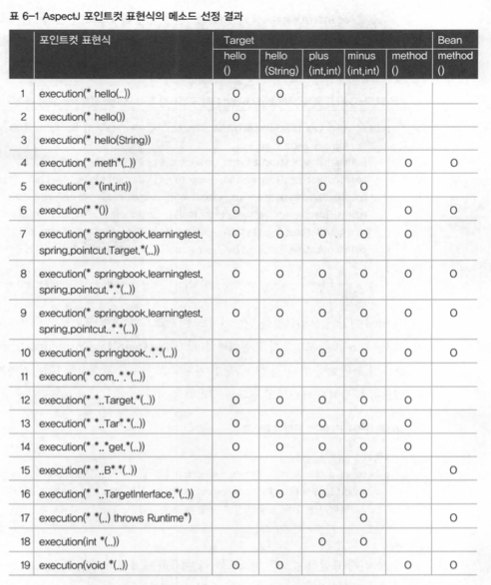

# 6장 AOP - 스프링 AOP

## 6.5 스프링 AOP

분리해낸 트랜잭션 코드는 기존 설계와 코드에 영향을 주지 않아야 한다.

### 6.5.1 자동 프록시 생성

부가 기능이 오브젝트마다 새로 만들어지는 문제는 ProxyFactoryBean의 어드바이스를 통해 해결

부가기능의 적용이 필요한 오브젝트마다 비슷한 ProxyFactoryBean 빈 설정정보를 추가해주는 부분?

#### 중복 문제의 접근 방법

코드 생성 기법을 통해 다이내믹 프록시 기술로 만들었다.

설정도 자동등록 기법으로 해결 할 수 있을까?

#### 빈 후처리기를 이용한 자동 프록시 생성기

빈 후처리기: 스프링 빈 오브젝트로 만들어지고 난 후 가공할 수 있게 해준다.

DefaultAdvisorAutoProxyCreator는 어드바이저를 이용한 자동 프록시 생성기이다.

빈 오브젝트가 생성될 때마다 후처리 작업을 요청한다.

- 프로퍼티를 수정할 수 있다.
- 별도의 초기화가 가능하다.
- 오브젝트 자체를 바꿔치기할 수도 있다.

#### 확장된 포인트컷

포인트컷의 기능

- 클래스 필터 - 프록시를 적용할 클래스인지 확인
- 메소드 매처 - 어드바이스를 적용할 메소드인지 확인

DefaultAdvisorProxyCreator는 클래스와 메소드 선정 알고리즘을 모두 갖고 있는 포인트컷이 필요하다.

#### 포인트컷 테스트

클래스 필터가 통과하지 못하면 프록시를 적용시켜도 부가기능을 전혀 받지 못한다.

### 6.5.2 DefaultAdvisorAutoProxyCreator의 적용

#### 클래스 필터를 적용한 포인트컷 작성

```java
package springbook.learningtest.jdk.proxy;
...
public class nameMatchClassMethodPointcut extends NameMatchMethodPointcut {
    public void setMappedClassName(String mappedClassName) {
        this.setClassFilter(new SimpleClassFilter(mappedClassName));
				// 디폴트 클래프 필터로 덮어씌운다.
    }
    
    static class SimpleClassFilter implements ClassFilter {
        String mappedName;
        
        private SimpleClassFilter(String mappedName) {
            this.mappedName = mappedName;
        }
        
        public boolean matches(Class<?> clazz){
            return PatternMatchUtils.simpleMatch(mappedName, clazz.getSimpleName());
        }
    }
}
```

#### 어드바이저를 이용하는 자동 프록시 생성기 등록

자동 프록시 생성기인 DefaultAdvisorAutoProxyCreator는 등록된 빈 중에서 Advisor 인터페이스를 구현한 것을 모두 찾는다. 그리고 어드바이저의 포인트컷을 적용해보면서 프록시 적용 대상을 선정한다. 

기존의 포인트컷 설정을 삭제하고 새로 만든 클래스 필터 지원 포인트컷을 빈으로 등록한다.

#### 자동 프록시 생성기를 사용하는 테스트

@Autowired를 통해 가져오는 UserService 오브젝트는 트랜잭션이 적용된 프록시여야한다.

클래스 필터에 걸릴 수 있게 이름을 바꾸자

또한 스태틱 멤버 클래스는 $를 사용하여 스프링 빈으로 등록할 수 있다.

### 6.5.3 포인트컷 표현식을 이용한 포인트컷

#### 포인트컷 표현식

AspectJExpressionPointcut 클래스를 사용하여 클래스와 메소드의 선정 알고리즘을 한번에 지정할 수 있다.

#### 포인트컷 표현식 문법

AspectJ 포인트컷 표현식

> execution([접근제한자 패턴] 리턴타입패턴 [패키지와 클래스타입패턴.]이름패턴 (타입패턴 | “..”, …)[throws 예외 패턴])
> 



1번은 메소드만 선정, 파라미터는 모두 허용

2번은 파라미터가 없는 것만 선정

3번은 파라미터가 1개이며 String 타입인 것만 선정

4번은 메소드 이름에 와일드카드, 메소드가 정의된 타입은 지정되지 않으므로 meth로 시작하는 모든 클래스의 메소드가 다 허용

5번은 파라미터 타입만으로 선정 → 2개의 정수 파라미터 메소드 선정

6번은 파라미터가 없는 모든 메소드를 선택

7,8,9는 모두 패키지와 클래스 타입 패턴을 사용하는 방법

9번은 ..을 사용해 서브 클래스까지 포함

11번은 com으로 시작되는 패키지 선정 → 어떤 메소드에도 적용되지 않음

12번은 패키지 상관없이 Target이라는 이름의 모든 클래스에 적용

13,14,15는 클래스 이름에 와일드카드 부여

16은 Targer 클래스가 아니라, TargetInterface를 선정조건으로 함

17번은 메소드와 클래스 상관없이 예외선언만 확인해서 메소드를 선정

18,19는 리턴타입을 이용해 메소드를 선정

#### 포인트컷 표현식을 이용하는 포인트컷 적용

빈의 이름으로도 표현할 수 있다.

@Transcational 을 이라는 어노테이션이 적용된 메소드를 선정해준다.

#### 타입 패턴과 클래스 이름 패턴

포인트컷 포현식의 클래스 이름에 적용되는 패턴은 클래스 이름 패턴이 아니라 타입 패턴이기 때문이다. 

TestUserService 클래스이자, 슈퍼 클래스인 UserServiceImpl, 구현 인터페이스인 UserService 세가지가 모두 적용된다.

### 6.5.4 AOP란 무엇인가?

1. 트랜잭션 서비스 추상화
2. 프록시와 데코레이터 패턴
3. 다이내믹 프록시와 프록시 팩토리 빈
4. 자동 프록시 생성 방법과 포인트컷
5. 부가기능의 모듈화

AOP란?

애스펙트 지향 프로그래밍

그 자체로 애플리케이션의 핵심기능을 담고 있지는 않지만, 애플리케이션을 구성하는 중요한 한 가지 요소이고, 핵심기능에 부가되어 의미를 갖는 특별한 모듈을 가리킨다.

독립적으로 개발한 부가기능 모듈을 다양한 타깃 오브젝트의 메소드에 다이내믹하게 적용해주기 위해 가장 중요한 역할을 맡고 있는게 프록시이다. 스프링의 AOP는 프록시 방식의 AOP라고 할 수 있다.

#### 바이트코드 생성과 조작을 통한 AOP

AspectJ는 프록시처럼 간접적인 방법이 아니라, 타깃 오브젝트를 뜯어고쳐서 부가기능을 직접 넣어주는 방법을 사용한다. 이런 방법이 있는데 왜 컴파일된 클래스 파일 수정이나 바이트코드 조작과 같은 복잡한 방법을 사용할까?

자동 프록시 생성 방식을 사용하지 않아도 AOP를 적용할 수 있다. 스프링과 같은 컨테이너가 사용되지 않은 환경에서도 사용 가능

프록시 방식보다 훨씬 강력하고 유연한 AOP가 가능, 메소드에 제한되지 않는다.
