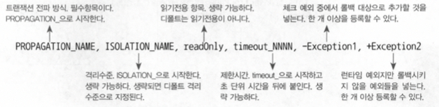
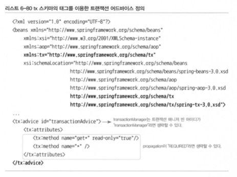
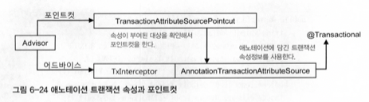

# 6장 AOP - 스프링 AOP

## 6.5 스프링 AOP

분리해낸 트랜잭션 코드는 기존 설계와 코드에 영향을 주지 않아야 한다.

### 6.5.1 자동 프록시 생성

부가 기능이 오브젝트마다 새로 만들어지는 문제는 ProxyFactoryBean의 어드바이스를 통해 해결

부가기능의 적용이 필요한 오브젝트마다 비슷한 ProxyFactoryBean 빈 설정정보를 추가해주는 부분?

#### 중복 문제의 접근 방법

코드 생성 기법을 통해 다이내믹 프록시 기술로 만들었다.

설정도 자동등록 기법으로 해결 할 수 있을까?

#### 빈 후처리기를 이용한 자동 프록시 생성기

빈 후처리기: 스프링 빈 오브젝트로 만들어지고 난 후 가공할 수 있게 해준다.

DefaultAdvisorAutoProxyCreator는 어드바이저를 이용한 자동 프록시 생성기이다.

빈 오브젝트가 생성될 때마다 후처리 작업을 요청한다.

- 프로퍼티를 수정할 수 있다.
- 별도의 초기화가 가능하다.
- 오브젝트 자체를 바꿔치기할 수도 있다.

#### 확장된 포인트컷

포인트컷의 기능

- 클래스 필터 - 프록시를 적용할 클래스인지 확인
- 메소드 매처 - 어드바이스를 적용할 메소드인지 확인

DefaultAdvisorProxyCreator는 클래스와 메소드 선정 알고리즘을 모두 갖고 있는 포인트컷이 필요하다.

#### 포인트컷 테스트

클래스 필터가 통과하지 못하면 프록시를 적용시켜도 부가기능을 전혀 받지 못한다.

### 6.5.2 DefaultAdvisorAutoProxyCreator의 적용

#### 클래스 필터를 적용한 포인트컷 작성

```java
package springbook.learningtest.jdk.proxy;
...
public class nameMatchClassMethodPointcut extends NameMatchMethodPointcut {
    public void setMappedClassName(String mappedClassName) {
        this.setClassFilter(new SimpleClassFilter(mappedClassName));
				// 디폴트 클래프 필터로 덮어씌운다.
    }
    
    static class SimpleClassFilter implements ClassFilter {
        String mappedName;
        
        private SimpleClassFilter(String mappedName) {
            this.mappedName = mappedName;
        }
        
        public boolean matches(Class<?> clazz){
            return PatternMatchUtils.simpleMatch(mappedName, clazz.getSimpleName());
        }
    }
}
```

#### 어드바이저를 이용하는 자동 프록시 생성기 등록

자동 프록시 생성기인 DefaultAdvisorAutoProxyCreator는 등록된 빈 중에서 Advisor 인터페이스를 구현한 것을 모두 찾는다. 그리고 어드바이저의 포인트컷을 적용해보면서 프록시 적용 대상을 선정한다. 

기존의 포인트컷 설정을 삭제하고 새로 만든 클래스 필터 지원 포인트컷을 빈으로 등록한다.

#### 자동 프록시 생성기를 사용하는 테스트

@Autowired를 통해 가져오는 UserService 오브젝트는 트랜잭션이 적용된 프록시여야한다.

클래스 필터에 걸릴 수 있게 이름을 바꾸자

또한 스태틱 멤버 클래스는 $를 사용하여 스프링 빈으로 등록할 수 있다.

### 6.5.3 포인트컷 표현식을 이용한 포인트컷

#### 포인트컷 표현식

AspectJExpressionPointcut 클래스를 사용하여 클래스와 메소드의 선정 알고리즘을 한번에 지정할 수 있다.

#### 포인트컷 표현식 문법

AspectJ 포인트컷 표현식

> execution([접근제한자 패턴] 리턴타입패턴 [패키지와 클래스타입패턴.]이름패턴 (타입패턴 | “..”, …)[throws 예외 패턴])
> 


1번은 메소드만 선정, 파라미터는 모두 허용

2번은 파라미터가 없는 것만 선정

3번은 파라미터가 1개이며 String 타입인 것만 선정

4번은 메소드 이름에 와일드카드, 메소드가 정의된 타입은 지정되지 않으므로 meth로 시작하는 모든 클래스의 메소드가 다 허용

5번은 파라미터 타입만으로 선정 → 2개의 정수 파라미터 메소드 선정

6번은 파라미터가 없는 모든 메소드를 선택

7,8,9는 모두 패키지와 클래스 타입 패턴을 사용하는 방법

9번은 ..을 사용해 서브 클래스까지 포함

11번은 com으로 시작되는 패키지 선정 → 어떤 메소드에도 적용되지 않음

12번은 패키지 상관없이 Target이라는 이름의 모든 클래스에 적용

13,14,15는 클래스 이름에 와일드카드 부여

16은 Targer 클래스가 아니라, TargetInterface를 선정조건으로 함

17번은 메소드와 클래스 상관없이 예외선언만 확인해서 메소드를 선정

18,19는 리턴타입을 이용해 메소드를 선정

#### 포인트컷 표현식을 이용하는 포인트컷 적용

빈의 이름으로도 표현할 수 있다.

@Transcational 을 이라는 어노테이션이 적용된 메소드를 선정해준다.

#### 타입 패턴과 클래스 이름 패턴

포인트컷 포현식의 클래스 이름에 적용되는 패턴은 클래스 이름 패턴이 아니라 타입 패턴이기 때문이다. 

TestUserService 클래스이자, 슈퍼 클래스인 UserServiceImpl, 구현 인터페이스인 UserService 세가지가 모두 적용된다.

### 6.5.4 AOP란 무엇인가?

1. 트랜잭션 서비스 추상화
2. 프록시와 데코레이터 패턴
3. 다이내믹 프록시와 프록시 팩토리 빈
4. 자동 프록시 생성 방법과 포인트컷
5. 부가기능의 모듈화

AOP란?

애스펙트 지향 프로그래밍

그 자체로 애플리케이션의 핵심기능을 담고 있지는 않지만, 애플리케이션을 구성하는 중요한 한 가지 요소이고, 핵심기능에 부가되어 의미를 갖는 특별한 모듈을 가리킨다.

독립적으로 개발한 부가기능 모듈을 다양한 타깃 오브젝트의 메소드에 다이내믹하게 적용해주기 위해 가장 중요한 역할을 맡고 있는게 프록시이다. 스프링의 AOP는 프록시 방식의 AOP라고 할 수 있다.

#### 바이트코드 생성과 조작을 통한 AOP

AspectJ는 프록시처럼 간접적인 방법이 아니라, 타깃 오브젝트를 뜯어고쳐서 부가기능을 직접 넣어주는 방법을 사용한다. 이런 방법이 있는데 왜 컴파일된 클래스 파일 수정이나 바이트코드 조작과 같은 복잡한 방법을 사용할까?

자동 프록시 생성 방식을 사용하지 않아도 AOP를 적용할 수 있다. 스프링과 같은 컨테이너가 사용되지 않은 환경에서도 사용 가능

프록시 방식보다 훨씬 강력하고 유연한 AOP가 가능, 메소드에 제한되지 않는다.


### 6.5.6 AOP의 용어

- 타깃
  부가기능을 부여할 대상
- 어드바이스
  타깃에게 제공할 부가기능을 담은 모듈이다.
- 조인 포인트
  어드바이스가 적용될 수 있는 위치
- 포인트컷
  어드바이스를 적용할 조인 포인으틀 선별하는 작업 또는 그 기능을 정의한 모듈
- 프록시
  클라이언트와 타깃 사이에 존재하면서 부가기능을 제공하는 오브젝트
- 어드바이저
  포인트컷과 어드바이스를 하나씩 가지고 있는 오브젝트
- 애스펙트
  AOP의 기본 모듈

## 6.6 트랜잭션 속성

트랜잭션을 가져올 때 파라미터로 트랜잭션 매니저에게 전달하는 `DefualtTransactionDefinition`의 용도가 무엇인지 알아보자.

### 6.6.1 트랜잭션 정의

트랜잭션에 영향을 줄 수 있는 네 가지 속성을 정의하고 있다.

#### 트랜잭션 전파

트랜잭션의 경계에서 이미 진행 중인 트랜잭션이 있을 때 또는 없을 때 어떻게 동작할 것인가를 결정하는 방식
A가 작업중일 때 B가 오면 같이 진행할 지 새로운 트랜잭션을 시작할 지 안할지를 결정한다.

- PROPAGATION_REQUIRED
  진행중인게 없으면 새로, 있으면 같이 참여, Default가 이에 해당
- PROPAGATION_REQUIRES_NEW
  항상 새로운 트랜잭션을 시작
- PROPAGATION_NOT_SUPPORTED
  트랜잭션 없이 동작 -> 특별한 메소드만 트랜잭션 없이 하게 만든다.

#### 격리수준

DB에서의 격리 수준을 조정

#### 제한시간

timeout 시간을 설정

### 6.6.2 트랜잭션 인터셉터와 트랜잭션 속성

메소드별로 다른 트랜잭션 정의를 사용하려면 어드바이스의 기능을 확장해야 한다.

#### TransactionInterceptor

다시 `TransactionAdvice`를 다시 설계할 필요은 없고 이미 만들어진 트랜잭션 경계설정 어드바이스인 `TransactionInterceptor`를 사용하면 된다.

인터셉터에는 두가지의 예외처리가 있다.
런타임 예외가 발생하면 트랜잭션은 롤백된다. 반면에 체크 예외를 던지면 예외상황으로 해석하지 않고 트랜잭션을 커밋해버린다.
이러한 경우를 없애기 위해 rollBackOn()이라는 속성을 둬서 다른 예외처리가 가능하게 해준다.

#### 메소드 이름 패턴을 이용한 트랜잭션 속성 지정

Properties 타입의 TransactionAttributes 프로퍼티는 메소드 패턴과 트랜잭션 속성을 키와 값으로 갖는 컬렉션이다.


이 중에서 트랜잭션 전파 항목만 필수이고 나머지는 생략 가능

### 6.6.3 포인트컷과 트랜잭션 속성의 적용 전략

후보 메소드 선정은 포인트컷 -> 어드바이스의 트랜잭션 전파 속성에 따라 적용방식이 결정

#### 트랜잭션 포인트 표현식은 타입 패턴이나 빈 이름을 이용한다

조회 작업에 읽기 전용을 설정하면 성능 향상이 있을 수 있고, 복잡한 조회에 제한시간을 지정해줄 수 있으며 격리 수준에 따라 트랜잭션 안에서 진행해야 할 필요가 있다.
따라서 트랜잭션용 포인트컷 표현식에는 메소드나 파라미터, 예외에 대한 패턴을 정의하지 않는게 바람직하다.

#### 공통된 메소드 이름 규칙을 통해 최소한의 트랜잭션 어드바이스와 속성를 정의한다

하나의 애플리케이션에서 사용할 트랜잭션 속성의 종류는 많지 않다. 많으면 관리가 힘들 것이다.
기준이 되는 몇 가지 트랜잭션 속성을 정의하고 그에 따라 적절한 메소드 명명 규칙을 만들어두면 하나의 어드바이스만으로 애플리케이션의 모든 서비스 빈에 트랜잭션 속성을 지정할 수 있다.

#### 프록시 방식 AOP는 같은 타깃 오브젝트 내의 메소드를 호출할 때는 적용되지 않는다

프록시 방식의 AOP에서는 클라이언트로부터 호출이 일어날 때만 가능하다. 따라서 자기 자신의 메소드를 호출할 때는 부가기능이 적용되지 않는다.

### 6.6.4 트랜잭션 속성 적용

#### 트랜잭션 경계설정의 일원화

특정 계층의 경계를 트랜잭션 경계와 일치시키는 것이 좋다.
비즈니스 로직을 담고 있는 서비스 계층 오브젝트의 메소드가 트랜잭션 경계를 부여하기 가장 좋다.
이렇게 정하면 다른 계층이나 모듈에서 DAO에 직접 접근하는 것은 차단해야 한다.

#### 서비스 빈에 적용되는 포인트컷 표현식 등록

다음와 같이 모든 서비스 빈에 적용되게 수정한다.

```xml
<aop:config>
  <app:advisor advice-ref="transactionAdvice" pointcut="bean(*Service)"/>
</aop:config>
```

#### 트랜잭션 속성을 가진 트랜잭션 어드바이스 등록

tx 네임스페이스와 스키마를 추가하고 트랜잭션 어드바이스의 속성을 정의해준다.


#### 트랜잭션 속성 테스트

읽기 전용 속성을 가진 트랜잭션 테스트를 진행해보고 예외가 발생하는 지 확인하자.
그리고 성공으로 만들기 위해 예외 타입을 확인하여 반영하자.

## 6.7 애노테이션 트랜잭션 속성과 포인트컷

### 6.7.1 트랜잭션 애노테이션

- @Transactional
  이 애노테이션의 타깃은 메소드와 타입이다. 부여된 모든 오브젝트를 자동으로 타깃 오브젝트로 인식한다.

#### 트랜잭션 속성을 이용하는 포인트컷


**애노테이션을 사용했을 때 어드바이저의 동작방식**
트랜잭션 부가기능 적용 단위는 메소드다. 메소드마다 유연하게 속성 제어를 할 수 있지만 반복적으로 부여해주는 바람직하지 못하는 결과가 나올 수 있다.

#### 대체 정책
스프링에서는 @Transactional를 적용할 때 4단계의 대체 정책을 이용한다.
속성을 확인할 때 타깃 메소드, 타깃 클래스, 선언 메소드, 선언 타입의 순서에 따라 차례로 확인하고 가장 먼저 발견되는 속성 정보를 사용한다.

### 6.7.2 트랜잭션 애노테이션 적용

이 `@Transactioanl`을 `UserService`에 적용시켜보자.
일관된 패턴을 만들어 적용하고 이를 활용해 포인트컷과 트랜잭션 속성을 지정하는 것보다는 애노테이션을 부여하는 것이 편리하고 코드를 이해하기에 좋다.

```xml
<tx:attributes>
  <tx:method name="get*" read-only="true"/>
  <tx:method name="*"/>
</tx:attributes>
```

get에만 read-only을 적용시켜주고 나머지 속성은 개별 메소드에 적용시켜준다.

## 6.8 트랜잭션 지원 테스트

### 6.8.1 선언적 트랜잭션과 트랜잭션 전파 속성

AOP를 이용해 코드 외부에서 트랜잭션의 기능을 부여해주고 속성을 지정 할 수 있게 하는 방법을 `선언적 트랜잭션`이라고 한다. 직접 코드 안에서 사용하는 방법은 `프로그램에 의한 트랜잭션`이라고 한다.

### 6.8.2 트랜잭션 동기화와 테스트

AOP 덕분에 프록시를 이용한 트랜잭션 부가기능을 간단하게 애플리케이션 전반에 적용할 수 있다.
또 한가지 중요한 기술적인 기반은 바로 스프링의 트랜잭션 추상화다.

#### 트랜잭션 매니저와 트랜잭션 동기화

트랜잭션 추상화 기술의 핵심은 트랜잭션 매니저와 트랜잭션 동기화다.
트랜잭션 매니저를 통해 구체적인 트랜잭션 기술의 종류에 상관없이 일관된 트랜잭션 제어가 가능했다.

#### 트랜잭션 매니저를 이용한 테스트용 트랜잭션 제어

에 테스트 메소드에서 만들어지는 세개의 트랜잭션 모두 REQUIRED 속성이니 트랜잭션이 시작되기 전에만 가능하다.

#### 트랜잭션 동기화 검증

UserService의 add()와 deleteAll()이 모두 롤백되어야 한다.

### 6.8.3 테스트를 위한 트랜잭션 애노테이션

테스트에도 `@Transactional`을 적용할 수 있다.

#### @Rollback

@Transactional은 애플리케이션의 클래스에 적용할 때와 디폴트 속성은 동일하다.

#### @TransactionConfiguration

테스트의 모든 메소드에 트랜잭션을 적용하면서 모든 트랜잭션이 롤백되지 않고 커밋하게 하려면 @TransactionConfiguration을 적용하면 편리하다.

일부한 롤백을 해주면 된다.