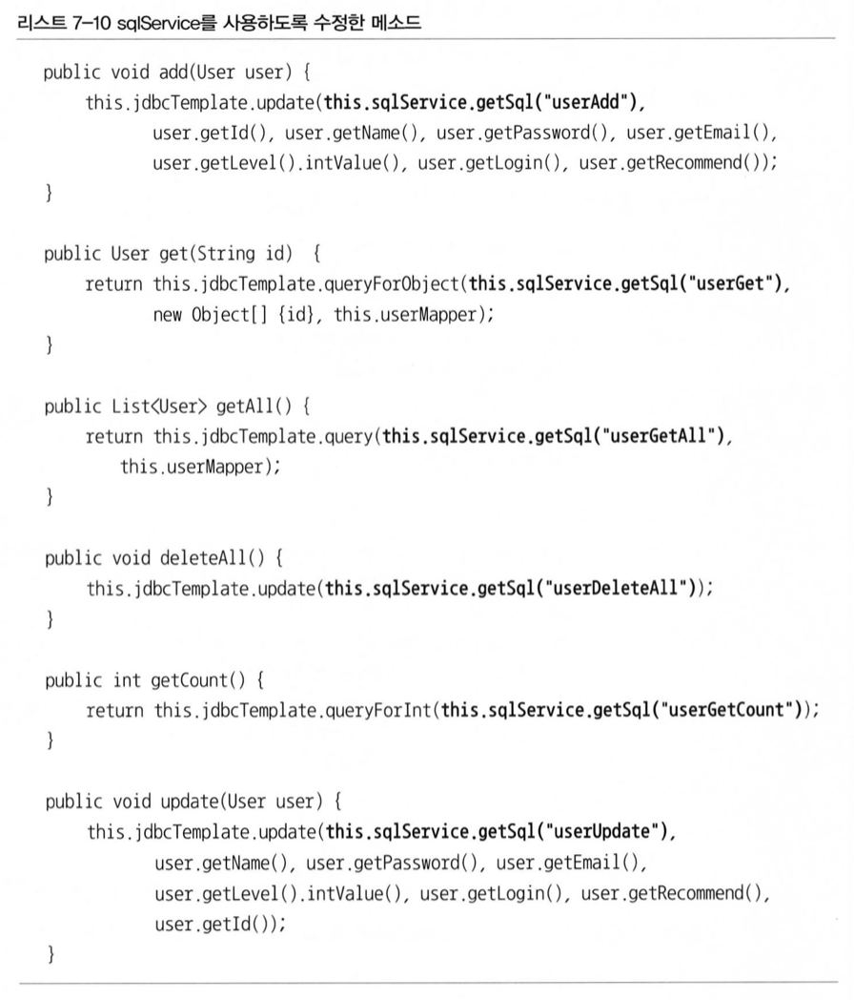
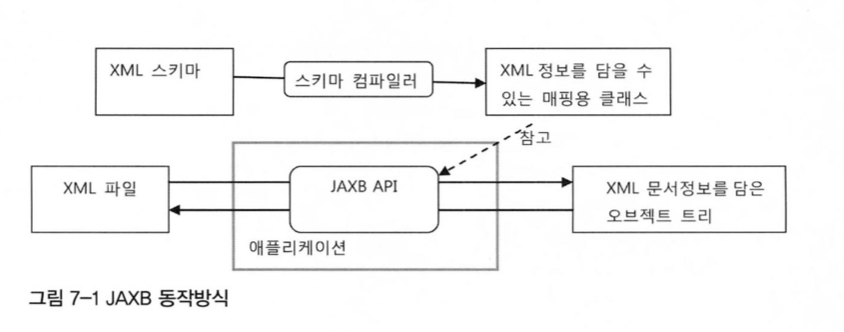
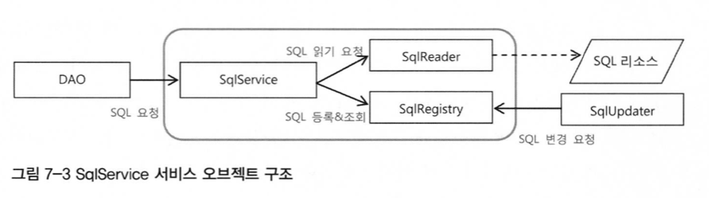
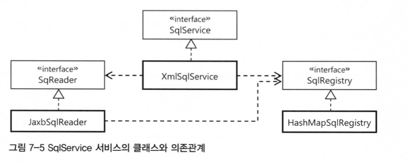
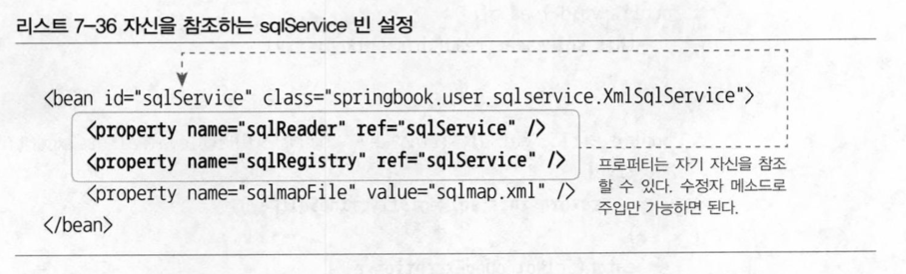
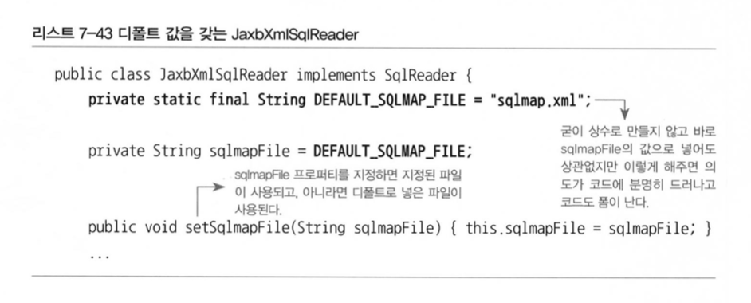

# 7장 스프링 핵심 기술의 응용

## 7.1 SQL과 DAO의 분리

UserDao를 많이 개선했지만 SQL을 DAO에서 분리해보자.

데이터를 가져오고 조작하는 작업의 인터페이스 → DAO

SQL의 변경작업이 있을  경우 다시 DAO의 SQL문을 바꿔줘야한다.

### 7.1.1 XML 설정을 이용한 분리

SQL을 스프링의 XML 설정파일로 빼내는 것이다.

- 개별 SQL 프로퍼티 방식
    개별로 SQL을 만들어 메소드에 넣어주는 방식
- SQL 맵 프로퍼티 방식
    SQL을 더 쉽게 관리하기 위해 map을 이용하는 방식

### 7.1.2 SQL 제공 서비스

스프링의 설정파일 안에 SQL을 두고 이를 DI 해서 DAO가 사용하게 하면 손쉽게 SQL을 코드에서 분리해낼 수 있지만 문제점이 많다.

SQL과 DI 설정정보가 섞여 있으면 좋지 않다. XML에 담아둘 이유도 없고 따로 SQL을 저장해둘 곳이 있으면 좋다.

#### SQL 서비스 인터페이스

SQL의 서비스를 구현하여 DI로 구현 클래스의 오브젝트에 주입해준다.



#### 스프링 설정을 사용하는 단순 SQL 서비스

SqlService 인터페이스에는 기술적인 조건이나 제약사항이 없다.

```java
package springbook.user.sqlsevice;

public class SimpleSqlService implements SqlService {
    private Map<String, String> sqlMap;
    public void setSqlMap(Map<String, String> sqlMap) {
        this.sqlMap = sqlMap;
    }

    public String getSql(String key) throws SqlRetrievalFailureException {
        String sql = sqlMap.get(key);
        if (sql == null)
            throw new SqlRetrievalFailureException (key+"에 대한 SQL을 찾을 수 없습니다");
        else
            return sql;
    }
}
```

SimpleSqlService 클래스를 빈으로 등록하고 UserDao가 DI 받아 사용하도록 설정해준다.

## 7.2 인터페이스의 분리와 자기 참조 빈

인터페이스로 대표되는 기능을 구현 방법과 확장 가능성에 따라 유연한 방법으로 재구성할 수 있도록 설계할 필요도 있다.

### 7.2.1 XML 파일 매핑

스프링의 XML에 SQL 정보를 담아두는 것은 좋은 방법이 아니다.

#### JAXB

XML에 정보를 거의 동일한 구조로 오브젝트로 직접 매핑해준다.

또한 XML 문서의 구조를 정의한 스키마를 이용해서 매핑할 오브젝트의 클래스까지 만들어주는 컴파일러를 제공해준다.



#### SQL 맵을 위한 스키마 작성과 컴파일

SQL 정보는 키와 SQL의 목록으로 구성된 맵 구조를 만들어두면 편리하다.

```java
<sqlmap>
    <sql key="userAdd">insert into users(...)...</sql>
    <sql key="userGet">select * from users ...</sql>
    ...
</sqlmap>
```

이 문서의 구조를 정의하는 스키마를 만든다.

```java
<?xml version="1.0" encoding="UTF-8"?>
    <schema xmlns="http: //www.w3.org/2001/XMLSchema"
    targetNamesp//awwcw.epr=il".hcotm/tsqplm:ap" xmlns:tns="http://www.epril.com/sqlmap" elementFormDefault="qualified">

    <element name="sqlmap"> 
        <complexType>
            <sequence>
                <element name="sql" maxOccurs="unbounded" type="tns:sqlType" />
            </sequence> 
        </complexType>
    </element>
    <complexType name="sqlType">
        <simpleContent>
            <extension base="string">
                <attribute name="key" use="required" type="string" />
            </extension>
        </simpleContent>
    </complexType>
</schema>
```

### 7.2.2 XML 파일을 이용하는 SQL 서비스

SQL 맵 XML 파일

UserDaoJdbc에서 사용할 SQL이 담긴 XML 문서를 만들어보자.

```java
    xsi:schemaLocation="http://www.epril.com/sqlmap,
            http://www.epril.com/sqlmap/sqlmap.xsd">
    <sql key="userAdd">insert into users (id, name, password, email, level, login, recommend) values (?,?,?,?,?,?,?)</sql>
    <sql_key="userGet">select * from users where id = ?</sql>
    <sql key="userGetAll">select * from users order by id</sql>
    <sql_key="userDeleteAll">delete from users</sql>
    <sql key="userGetCount">select count(*) from users</sql>
    <sql key="userUpdate">update users set name = ? password = ?, email = ?, level=?, login = ?, recommend = ? where id = ?</sql>
</sqlmap>
```

### 7.2.3 빈의 초기화 작업

XmlSqlService 클래스를 파일 이름을 외부에서 지정 할 수 있도록 프로퍼티를 추가한다.

또한 초기화 메소드를 만들어 옮긴다.

<context:annotation-config /> 태그에 등록되는 빈 후처리기는 몇가지 특별한 빈설정에 사용되는 애노테이션을 제공한다.

#### @PostConstruct

오브젝트의 초기화 메소드를 지정하는데 사용

### 7.2.4 변화를 위한 준비: 인터페이스 분리

#### 책임에 따른 인터페이스 정의

SqlService는 외부의 리소스로부터 읽어오는 것과 SQL을 보관해두고 제공해주는 두가지 책임을 가지고 있다



이를 Reader와 Registry 인터페이스로 책임을 분리해보자.

### 7.2.5 자기참조 빈으로 시작하기

#### 다중 인터페이스 구현과 간접 참조

세가지 관심과 책임을 구분없이 넣어놓았으니 분리해보자.



세개의 인터페이스를 만들어 구현하는 XmlSqlService가 모두 구현하게 만들어도 상관없다.



자기 자신을 참조하는 프로퍼티를 넣어 빈은 하나만 만든다.

### 7.2.6 디폴트 의존관계

가장 간단한 SqlService 구현 클래스를 만들어보자

특정 의존 오브젝트가 대부분의 환경에서 거의 디폴트라고 해도 좋을 만큼 기본적으로 사용될 가능성이 있다면, 디폴트 의존관계를 갖는 빈을 만드는 것을 고려해볼 필요가 있다.

생성자에서 디폴트 의존 오브젝트를 직접 만들어서 스스로 DI 해준다.

