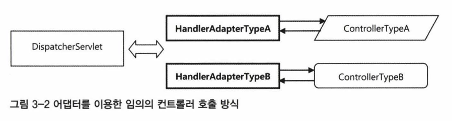

# 목차    
- [3. 스프링 웹 기술과 스프링 MVC](3.-스프링-웹-기술과-스프링-MVC)
    - [3.1 스프링의 웹 프레젠테이션 계층 기술](3.1-스프링의-웹-프레젠테이션-계층-기술)
    - [3.2 스프링 웹 애플리케이션 환경 구성](3.2-스프링-웹-애플리케이션-환경-구성)
    - [3.3 컨트롤러](3.3-컨트롤러)
    - [3.4 뷰](3.4-뷰)
    - [3.5 기타 전략](3.5-기타-전략)

<BR>

## **3.1 스프링의 웹 프레젠테이션 계층 기술**

### **스프링 웹 프레임워크**
- **스프링 서블릿/스프링 MVC** (아래는 스프링 서블릿 기반)
    - Spring Web Flow
    - Spring JavaScript
    - Spring Faces
    - Spring Web Service
    - Spring blazeDS Integration
- 스프링 포틀릿

### **스프링을 기반으로 두지 않는 웹 프레임워크**
- JSP/Servlet
    - new XXXHelper() 방식으로 비즈니스 로직을 처리했다면 위 형태
- Struts1
- Struts2
- Tapestry
- JSF/Seam

스프링 서블릿, 스프링 MVC 기반의 확장된 프레임 워크 권장

<BR>

### **스프링 MVC와 DispatcherServlet 전략**
프레임워크의 발전 방향은 2가지이다.
- 스프링과 같이 유연성, 확장성에 중점을 두고 특정 기술에 종속되지 않기 위한 형태
- 루비와 같이 제한적인 기술만을 사용하도록 강제하지만 기술의 장점을 극대화 시키는 형태

스프링의 유연한 확장성을 고려해 각 프로젝트에도 위와 같은 방향으로 적절히 적용하여 개발할 것!

<BR>

### **DispatcherServlet과 MVC 아키텍처**
스프링 웹 기술의 핵심이자 기반이 되는 DispatcherServlet           
스프링의 웹 기술을 구성히는 다양한 전략을 DI로 구성해서 확장하도록 만들어진 스프링 서블릿/MVC의·엔진과 같은 역할            

MVC는 아래 요소가 서로 협력하여 하나의 request를 처리하여 response를 내려주는 구조
- Model
- View
- Controller


위 그림은 아래와 같은 순서로 수행된다.
- (1) DispatcherServlet의 HTTP 요청 접수
    - request를 전달받을 URL 패턴을 지정
    - 위에 해당할 경우 할당
    ```xml
        <servlet-mapping>
            <servlet-name>Spring MVC Dispatcher Servlet</servlet-name>
            <url-pattern>/app/*</url-pattern>
        </servlet-mapping>
    ```
- (2) DispatcherServlet에서 컨트롤러로 HTTP 요청 위임       
주로 Adapter Pattern 형태로 전달

DispatcherServlet이 HanldeAdapter에 웹 요청을 전달시 HttpServletRequest 타입 오브젝트 전달      
이를 어댑터가 적절히 변환해서 컨트롤러에 전달하는 형태      
- (3) 컨트톨러의 모델 생성과 정보 등록
    - Model은 이름과 Object 쌍으로 생성 (Map)
- (4) 컨트롤러의 절과 리턴: 모멜과 뷰
    - 말 그대로 ModelAndView Object를 통해 Model, View 정보 return
- (5) DispatcherServlet의 뷰 호출과 (6) 모델 참조
    - 뷰 오브젝트에게 모델을 전달, 클라이언트에게 돌려줄 최종 결괴물 생성 요청
    - 최종 결과물은 HttpServletResponse 오브젝트로 return
- (7) HTTP 응답 돌려주기
    - 뷰가 만들어준 HttpServletResponse를 서블릿 컨테이너에게 전달      
    - 서블릿 컨테이너는 HttpServletResponse에 담긴 정보를 HTTP 응답으로 만들어 클라이언트에 전달 및 작업 종료

<BR>

### **DispatcherServlet의 DI 가능한 전략**
- HandlerMapping
    - URL 기준 Controller 결정
- HandlerAdapter
    - Handler Mapping 정보 기준 결정
- HandlerExceptionResolver
    - 예외처리 결정
- ViewResolver
    - Controller가 return한 View 이름을 토대로 적절한 Object 탐색
- LocaleResolver
- ThemeResolver
- RequestToViewNameTranslator

<BR>

## **3.2 스프링 웹 애플리케이션 환경 구성**
서비스 계층과 데이터 액세스 계층의 코드는 실행환경에서 독립적으로 만들기 쉬움          
JavaEE 환경에서도 동작하지만 JavaSE에서 사용할 수도 있고, 간단한 테스트 환경에 서도 구동이 가능        
반면에 웹 프레젠테이션 계층은 최소한 서블릿 또는 포틀릿 컨 테이너가 제공되는 서버환경이 있어야만 동작      

아래 순서로 설정한다.
- 루트 웹 애플리케이션 컨텍스트
- 서블릿 웹 애플리케이션 컨텍스트 등록
    - URL 패턴의 경우 보통 아래와 같이 지정
        - 확장자로 구분히는 방법 (*.do. / *.action. / *.html 등)
        - 특정 url로 구분하는 방법 (RESTful 스타일에 적용)
        - /*로 지정해서 모든 request에 지정할 작업 설계 등
- Model / View / Controller 생성
- 작동 검증

```java
public interface Controller {
    ModelAndView handleRequest(HttpServletRequest request, HttpServletResponse response) throws Exception;
}
public class HelloController implements Controller {
    @Autowired
    HelloSpring helloSpring; 

    public ModelAndView handleRequest(HttpServletRequest req, HttpServletResponse res) throws Exception {
        String name = req.getParameter("name"); 
        String message = this.helloSpring.sayHello(name);
        Map<String, Object> model = new HashMap<String, Object>(); 
        model.put("message", message);
        return new ModelAndView("/WEB-INF/view/hello.jsp", model);
    }
}
```

### **테스트**
- MockHttpServlet 이용
- 적절한 Model And View를 내려주는지 검증

<BR>

## **3.3 컨트롤러**
스프링 MVC는 4가지의 컨트롤러를 지원        
각 컨트롤러를 DispatcherServlet에 연결하는 어댑터 또한 필요하므로 핸들러 어댑터도 4가지.       

- Servlet / SimpleServletHandlerAdapter (Bean 등록 필요)
- HttpRequestHandler / HttpRequestHandler Adapter (Default)
```java
public interface HttpRequestHandler {
    void handleRequest(HttpServletRequest request, HttpServletResponse response) throws ServletException , IOException;
}
```
- Controller / SimpleControllerHandlerAdapter (Default)
    - 스프링 MVC의 가장 대표적인 Controller Type
    - DispatcherServlet이 컨트롤러와 주고받는 정보 그대로 파라미터와 리턴값을 가지고 있음
    - 단일 사용 X, 웹 브라우저를 클라이언트로 갖는 AbstractController를 상속
        - 웹 요청에 용이하게 처리하는 기능 제공
```java
public interface Controller {
    ModelAndView handleRequest(HttpServletRequest request, HttpServletResponse response) throws ServletException , IOException;
}
```
- AnnotationMethodHandlerAdapter 
    - **@Controller**
    - 지원하는 컨트롤러의 타입이 정해져있지 않음
    - 현재 가장 많이 사용하는 형태
```java
@Controller
public class HelloController {
    @RequestMapping("/he11o")
    public String he11o (@RequestParam("name") String name,     ModelMap map) {
        map.put("message", "He11o " + name); 
        return "/WEB-INF/view/he11o.jsp";
    }
}
```

<BR>

### **핸들러 매핑**
HTTP 요청 정보를 이용해서 이를 처리할 Handler, 즉 Controller를 찾아주는 기능을 가진 DispatcherServlet의 전략        
스프링은 기본적으로 5가지 전략 제공

- BeanNameUrlHandlerMapping (Default)
    - Bean Name에 URL Mapping
- ControllerBeanNameHandlerMapping 
    - Bean의 ID나 Bean Name에 해당하는 Controller Mapping
- ControllerClassNameHandlerMapping
    - Bean Name 대신 Class Name을 URL에 Mapping
- SimpleUrlHandlerMapping
    - Url & Controller의 Mapping 정보를 한 곳에 모아놓는 전략
- DefaultAnnotationHandlerMapping (Default)
    - @RequestMapping 이용

<BR>

### **핸들러 인터셉터**
핸들러 매핑의 중요한 역할 중 하나       
DispatcherServlet이 Controller를 호출하기 전과 후에 request, response를 참조하거나 가공할 수 있는 일종의 필터       
DispatcherServlet으로부터 Mapping 작업 요청시 Response로 HandlerExcutionChain 제공          
-> Interceptor 순차적 실행

### **HandlerInterceptor**
아래 3가지 함수 구현
```java
// Controller 호출 전
boolean preHandle(HttpServletRequest request, HttpServletResponse response, Object handler) throws Exception

// Controller 실행 후
void postHandle(HttpServletRequest request, HttpServletResponse response, Object handler, ModelAndView modelAndView) throws Exception

// View에서 최종 결과 생성 포함한 모든 작업 완료 후 실행
void afterCompletion(HttpServletRequest reQuest, HttpServletResponse response, Object handler, Exception ex) throws Exception
```

위를 활용해 커스텀 Controller 생성가능

<BR>

## **3.4 뷰**
Spring의 View 인터페이스 구현필요
```java
public interface View {
    String getContentType();

    void render(Map<String, ?> model, HttpServletRequest request, HttpServletResponse response) throws Exception;
}
```

<스프링에서 제공하는 뷰>
- InternalResourceView
    - JSP 서블릿을 통해 JSP View 적용시 사용
- JstlView
    - InternalResourceView의 서브클래스     

아래와 같이 사용
```java
public class HelloController implements Controller {
    public ModelAndView handleRequest(HttpServletRequest req, HttpServletResponse res) throws Exception {
        Map<String, Object) model = new HashMap<String, Object>();
        model.put("message", message);
        View view = new InternalResourceView("IWEB-INF/view/hello.jsp");  // VIEW
        return new ModelAndView(view, model);

        // or
        return new ModelAndView("/WEB-INF/view/hello.jsp", model);
    }
}
    
```

- RedirectView
    - 실제 View 생성 대신 URL만 생성 후 리다이렉트
```java
return new ModelAndView(new RedirectView("main"));
return new ModelAndView("redirect:/main");
```

- VelocityView 
    - Velocity 엔진 이용 
- FreeMarkerView
    - FreeMarker 엔진 이용
- MarshallingView
    - OXM 추상화를 이용해 XML을 생성하는 형태
- AbstractExcelView
- AbstractJExcelView
    - 엑셀 View 생성 
- AbstractPdfView
    - PDF View 생성
- AbstractAtomFeedView
    - atom+xml 타입 피드 문서 생성
- AbstractRssFeedView
    - rss+xml 타입 피드 문서 생성
- XsltView
- TilesView
- AbstractJasperReportsView
- MappingJacksonJsonView
    - Json 타입 Content를 작성하는 View

<BR>

### **뷰 리졸버**
뷰 이름으로부터 사용할 뷰 오브젝트 찾기     
ViewResolver Interface를 구현해서 사용      

- InternalResourceViewResolver (default)
    - 주로 JSP를 View로 이용시 사용
    - JstlView 이용가능
    - 경로 Suffix / Prefix 지정하여 사용
- VelocityViewResolver
- FreeMarkerViewResolver
    - 템플릿 엔진 기반의 View
    - 별도의 Root을 지정해줘야 하므로 보통 suffix만 이용
- ResourceBundleViewResolver
    - 여러 View 혼용 || View의 종류를 코드 밖에서 변경하는 경우
    - Controller마다 뷰의 종류가 달라지는 경우 이용
    - ex) hello는 Jsp, main은 vm이라는 템플릿 파일 적용한 경우
    ```properties
    hello.(class)=org.springframework.web.servlet.view.JstlView
    hello.url=/WEB-INF/view/hello.jsp

    main.(class)=org.springframework.web.servlet.view.velocity.VelocityView
    main.url=main.vm
    ```
    - 이 View에 우선순위를 줘서 예외 케이스를 처리하고, 그 외에는 JSP로 처리하는 형태로도 사용 가능하다.
    ```xml
    <bean class="org.springframework.web.servlet.view.ResourceBundleViewResolver"> 
        <property name="order" value="0" />
    </bean>
    <bean class="org.springframework.web.servlet.view.lnternalResourceViewResolver" />
    ```
- XmlViewResolver
    - 위와 유사, properties 대신 XML 설정 파일을 이용해 View 등록
- BeanNameViewResolver
    - View 이름과 동일한 Bean을 찾아서 View로 이용
- ContentNegotiatingViewResolver
    - 아래 3단계에 따라 View 제공
    - 미디어 타입 결정
        - HTTP Content Type에 따라 대응
        - html, xml, json 등
    - 뷰 리졸버 위임을 통한 후보 뷰 선정
        - controller가 응답한 View Name에 따라 Resolver 탐색
    - 미디어 타입 비교를 통한 최종 뷰 선정
        - 미디어 타입과 뷰 리졸버를 매핑하여 뷰 제공

<BR>

## **3.5 기타 전략**

### **핸들러 예외 리졸버**
- HandlerExceptionResolver interface 구현
```java
public interface HandlerExceptionResolver { 
    ModelAndView resolveException(HttpServletRequest request, HttpServletResponse response, Object handler, Exception ex);
}
```

스프링은 총 4개의 HandlerExceptionResolver 구현 전략을 제공 중
- AnnotationMehtodHandlerExceptionResolver (Default)
    - @ExceptionHandler 
    - 위 애노테이션이 붙은 Method를 찾아 예외처리
- ResponseStatusExceptionResolver (Default)
    - @ResponseStatus
    - 위 애노테이션이 지정해둔 HTTP Status Code 전달
- DefaultHandlerExceptionResolver (Default)
    - 스프링 MVC 내부에서 발생하는 예외 처리
    - 표준 예외처리 로직을 담고 있음
- SimpleMappingExceptionResolver
    - 예외 처리할 View 지정
    - Default 전략이 아니므로 Bean 등록 필요


### **지역 정보 리졸버**
- 애플리케이션이 사용하는 Locale을 결정하는 전략
- Default로 HTTP Header 정보 이용

### **멀티파트 리졸버**
- 파일 업로드와 같이 멀티 파트 포맷의 요청을 처리하는 전략

### **RequestToViewNameTranslator**
- Controller에서 뷰 이름이나 뷰 오브젝트를 돌려주지 않았을 경우 HTTP 요청 정보를 참고해서 View 이름 생성