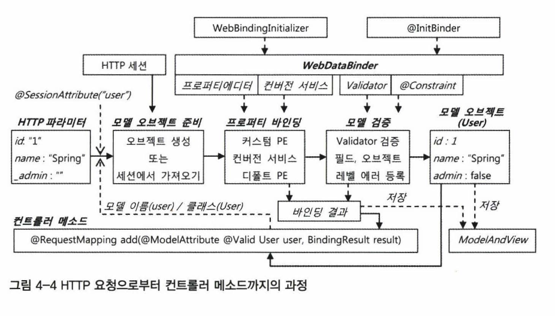

# 목차    
- [4. 스프링 @MVC](4.-스프링-@MVC)
    - [4.1 @RequestMapping 핸들러 매핑](4.1-RequestMapping-핸들러-매핑)
    - [4.2 Controller](4.2-Controller)
    - [4.3 모델 바인딩과 검증](4.3-모델-바인딩과-검증)
    - [4.4 JSP 뷰와 form 태그](4.4-JSP-뷰와-form-태그)
    - [4.5 메시지 컨버터와 AJAX](4.5-메시지-컨버터와-AJAX)
    - [4.6 MVC 네임스페이스](4.6-MVC-네임스페이스)
    - [4.7 MVC 확장 포인트](4.7-MVC-확장-포인트)
    - [4.8 URL과 리소스 관리](4.8-URL과-리소스-관리)
    - [4.9 Spring 3.1의 @MVC](4.9-Spring-3.1의-@MVC)

<BR>

# 4. 스프링 @MVC

## 4.1 @RequestMapping 핸들러 매핑
```java
// 아래와 같이 사용
@RequestMapping()
void method() { ... }

// String[] value()
@RequestMapping("/hello")

// String[] method() 
@RequestMapping(value="/hello", method=RequestMethod.GET)

// String[] params
@RequestMapping(value="/user/edit", params="type=nember")

// String[] headers 
@RequestMapping(value = "/view", headers = "content-type=text/*")
```

### **타입 레벨과 메소드 레벨의 결합**
```java
@RequestMapping("/hello")
public class ABController {
    @RequestMapping("/add") public String add( ... ) { }
    @RequestMapping("/edit") public String edit( ... ) { } 
    @RequestMapping("/delete") public String delete( ... ) { }

}
```

**@RequestMapping이 정의된 Controller를 상속받는다면?**         
- 기본적으로 정보를 그대로 상속받는다
- 서브클래스에서 재정의시 무시한다
- class -> method 순으로 Annotation이 적용된다      

<BR>

### **제네릭을 이용한 컨트롤러 작성**           
아래는 전형적인 컨트롤러이다.       
```java
public class UserController {
    UserService service;
    public void add(User user) { ... } 
    public void update(User user) { ... } 
    public User view(Integer id) { ... }
    public void delete(Integer id) { ... } 
    public List<User> list() { ... }
}
```

이를 아래와 같이 설계할 수 있다.       
물론 예시이고, 실제로는 더 신경써야한다.
```java
public abstract class GenericController<T, K, S> { 
    S service;
    public void add(T entity) { ... } 
    public void update(T entity) { ... } 
    public T view(K id) { ... }
    public void delete(P id) { ... } 
    public List<T> list() { ... }
}
```

```java
public class UserController extends GenericController<User, Integer, UserService> {
    public String login(String userld, String password) { ... }
}
```

<BR>

## **4.2 Controller**
### **메소드 파라미터의 종류**
- HttpServletRequest, HttpServletResponse
- HttpSession
- WebRequest, NativeWebRequest
- Locale
- InputStream, Reader
- OutputStream, Writer
- @PathVariable
```java
@RequestMapping("/member/{membercode}/order/{orderid}")
public String lookup(@PathVariable('membercode') String code,
@PathVariable("orderid") int orderid) { ... }
```
- @RequestParam     
여러개를 지정할 수 있다.
```java
public void view(@RequestParam(value="id", required=false, defaultValue="1") int id) { ... }

public String add(@RequestParam Map<String, String> params) { ... }

public String view(@RequestParam int id) { ... }

```
- CookieValue
- @RequestHeader        
```java
public void header(@RequestHeader('Host') String host, @RequestHeader("Keep-Alive") Long keepAlive)
```
- Map, Model, ModelMap
- @ModelAttribute 
    - @RequestParam과 비슷한 역할
    - 요청 파라미터를 메소드 파라미터에서 1:1로 받으면 @RequestParam 
    - 도메인 오브젝트나 DTO의 프로퍼티에 요청 따라미터를 바인딩해 서 한 번에 받으면 @ModelAttribute
    - 간결한 코드
    - Validation 과정 포함
```java
@RequestMapping("/user/search")
public String search(@RequestParam int id, @RequestParam String name,
@RequestParam int level, @RequestParam String email, Model
model) {
    List<User> list = userService.search(id, name, level, email);
    model.addAttribute("userList", list);
}

@RequestMapping("/user/search")
public String search(ModelAttribute UserSerarch userSearch) {
    List<User> list = userService.search(userSearch); 
    model.addAttribute("userList", list);
}
```
- Errors, BindingResult
- SessionStatus
- @RequestBody
```java
// Json Mapping
public void message(@RequstBody AClass body) { ... }
```
- @Value
    - 값 주입시
```java
public class HelloController {
    @Value('#{systemProperties['os.name')}') 
    String osName

    @RequestMapping( ... ) 
    public String hello() {
        String osName = this.osName;
    }
}
```
- @Valid
    - 데이터 검증

<BR>

### **리턴 타입의 종류**
최종적으로 DispatcherServlet에 돌아갈 때엔 ModelAndView로 return        
아래 Object는 return type에 상관없이 모델에 자동으로 추가
- @ModelAttribute Object
- @ModelAttribute Method
- Map, Model, ModelMap Params
- BindingResult

아래는 리턴 가능 타입
- String            
    - 이 return값은 View 이름으로 사용
- void      
    - RequestToViewNameResolver 전략을 통해 자동 생성되는 View 이름 적용
- Map/Model/ModelMap
- View
- @ResponseBody

<BR>

### **@SessionAttributes와 SessionStatus**
HTTP 요청에 의해 동작하는 서블릿은 기본적으로 상태를 유지하지 않는다.           
따라서 매 요청이 독립적으로 처리된다.           
하나의 HTTP 요청을 처리한후에는 사용했던 모든 리소스를 정리해버린다. 

### **배경**
- User를 Update하는 경우
- 실제 User의 모든 정보를 Update하지는 않는다 (ID 등 고윳값 제외)
- 일부 값만 업데이트할 때 User를 그대로 이용하는게 옳은가?

### **Spring의 해결방법 @SessionAttributes**
```java

@Controller
@SessionAttributes('user') 
public class UserController {
    @RequestMapping(value="/user/edit", method=RequestMethod.GET)
    public String form(@RequestParam int id, Model model) {
        model.addAttribute("user" , userService.getUser(id));
        return "user/edit";
    }

    @RequestMapping(value='/user/edit', method=RequestMethod.POST) 
    public String submit(ModelAttribute User user) { ... }
}
```
@SessionAttribute를 이용해 세션에 User 정보를 저장          
@ModelAttribute가 새 오브젝트를 바인딩 하기 전 세션에 같은 이름의 오브젝트가 존재하는지 확인 후 사용


<BR>

### **SessionStatus**
위에서 이용한 데이터는 자동으로 제거되지 않음        
여러번 이용 될 가능성이 있기 때문       
그렇기에 submit같이 작업을 마무리하는 코드에서 setComplete()를 통해 세션 정리

```java
@RequestMapping(value='/user/edit', method=RequestMethod.POST)
public String submit(ModelAttribute User user, SessionStatus sessionStatus) {
    this.userService.updateUser(user);
    sessionStatus.setComplete(); // 현재 컨트툴러에 의해 세션에 저징된 정보를 모두 제거
    return "user/editsuccess";
}
```

<BR>

## **4.3 모델 바인딩과 검증**
@ModelAttribute가 지정된 파라미터를 @Controller Method에 추가시 아래 작업이 자동으로 진행           
1. 파라미터 타입 오브젝트 생성 || @SessionAttributes에 의해 저장된 Object 획득
2. Model에 Web 파라미터 바인딩 (문자열 -> Object)
3. 모델 값 검증

### **Property Editor**
바인딩용 타입 변환 인터페이스
스프링이 제공해주는 default Property Editor의 경우 JAVA의 기본 타입만 지원

ex)
```java
public enum Level {
    GOLD(3, null), SILVER(2, GOLD), BASIC(1, SILVER);
    public int intValue() { return value; }
    public static Level valueOf(int value) { 
        switch(value) {
            case 1: return BASIC;
            case 2: return SILVER;
            case 3: return GOLD;
            default: throw new AssertionError("Unknown value: " + value);
        }
    }
}
```
간단히 예를 들면, 위 상황에서 Enum에 숫자 1을 입력받았을 때 바로 Basic에 대응되도록 변환이 가능하게 하는게 Property Editor의 역할.

```java
public class LevelPropertyEditor extends PropertyEditorSupport {
    public String getAsText() {
        return String.valueOf(((Level)this.getValue()).intValue());
    }

    public void setAsText(String text) throws IllegalArgumentException {
        this .setValue(Level.valueOf(Integer.parselnt(text.trim())));
    }
}
```
Level Type의 Property Editor.

<BR>

@MVC에는 스프링 컨테이너에 정의된 Default Property Editor만 등록되어 있다.      
여기에 LevelPropertyEditor를 추가해야 사용가능.

@Controller 메소드를 호출해줄 책임이 있는 AnnotationMethodHandlerAdapter는 @RequestParam이나 @ModelAttribute, @PathVariable 등처럼 HTTP 요청을 따라미터 변수에 바인딩해주는 작업이 필요한 애노테이션을 만나면 먼저 WebDataBinder를 생성함       

WebDataBinder는 Default Property Editor만 가지고 있기 때문에, 원하는 Property를 등록해주어야함      

이 때 @InitBinder를 이용

```java
@InitBinder
public void initBinder(WebDataBinder dataBinder) { 
    dataBinder.registerCustomEditor(Level.class, new LevelPropertyEditor());
}

// 특정 Field에만 적용하는 경우
@InitBinder
public void initBinder(WebDataBinder dataBinder) {
    dataBinder.registerCustomEditor(int.class , "age" , new MinMaxPropertyEditor(0, 200));
}
```

WebDataBinder에 등록되는 Property Editor는 @RequestParam, @CookieValue, @RequestHeader, @PathVariable, @ModelAttribute 에 적용됨        

<BR>

### **WebBindingInitializer**
위 케이스는 각 Controller별로 InitBinder 메소드를 통해 Property Editor를 지정해줘야 하지만, 범용적으로 적용하고자 하는 Editor가 있다면 WebBindingInitializer를 이용하면 된다.

```java
public class MyWebBindingInitializer implements WebBindingInitializer {     
    public void initBinder(WebDataBinder binder, WebRequest request) {
        binder.registerCustomEditor(Level.class , new LevelPropertyEditor());
    }
}
```

AnnotationMethodHandlerAdapter의 webBindinglnitializer 프로퍼티에 DI해서 사용           

Property Editor의 경우 상태를 가지기 때문에 Bean으로 등록하여 싱글톤으로 이용하게되면 멀티스레드 환경에서 값을 보장할 수 없게됨.        

만약 Property Editor 내에서 다른 Bean을 참조해야 하는 상황이 온다면?        
아래 방법을 통해 적용가능.      
1. 별도의 codeId 필드로 바인딩
    - Bean이 아닌 Primitive type 변수를 ID로 갖는 필드를 추가하여 DB Access
2. 모조 오브젝트 프로퍼티 에디터
    - ID값만 지니고 있는 Object로 변환하는 Property Editor
    - 다른 필드는 지니고 있지 않음
3. 프로토타입 도메인 오브젝트 프로퍼티 에디터
    - DI 받도록 프로토타입 Bean으로 생성
    - 매번 새로운 Object 주입

<BR>

### **Converter와 Formatter**
Converter Interface의 경우 Property Editor와 동일한 역할을 하지만 변환 과정에서 메소드가 1회만 호출되어 상태를 지니고 있지 않기에 멀티 스레드 환경에서 안전함     

```java
// (Source, Target)
public interface Converter(S, T) {
    T convert(S source);
}

// 거꾸로도 가능
public class LevelToStringConverter implements Converter(Level, String) { 
    public String convert(Level level) {
        return String.valueOf(level.intValue());
    }
}
```

Converter의 경우 ConverterService를 통해 WebDataBinder에 등록할 수 있음     
보통 ConverterService를 구현한 GenericConversionService를 등록해서 사용     

### **등록 과정**
- @InitBinder 이용한 수동등록
- ConfigurableWebBindingInitializer률 이용한 일괄 등록 (XML 설정)

모든 컨트롤러에 일괄 적용해야 하는 변환의 경우 Property Editor보다 Converter가 더 유용함        

### **Formatter와 FormattingConversionService**
Converter가 범용적인 변환이라면 Formatter는 특화된 변환         

Formatter Interfac는 print와 parse 메소드를 제공
```java
String print(T object, Locale locale);
T parse(String text, Locale locale) throws ParseException;
```

FormattingConversionServiceFactoryBean을 사용했을 때 자동으로 등록되는 포맷터 2가지     
- @NumberFormat
    - Byte, Double, Float, Integer, Long, Short, Biglnteger, BigDecimal 상호변환
    - 엘리먼트로 style과 pattern 지정
    - Style은 NUMBER, CURRENCY, PERCENT 지정 가능 (Enum)
    - Locale에 정의된 표준 포뱃에는 없는 숫자 패턴을 사용하고 싶을 때 pattern 적용 
    - 사용시 ‘#，###，##0.0#’과 같은 식으로 숫자를 표현하는 패턴을 직접 지정가능
- @DateTimeFormat
    - Date, Calendar, Long과 Joda 라이브러리의 LocalDate, LocalTime, LocalDateTime, DateTime 상호변환
    - style 엘리먼트를 통해 형태 지정 가능 (S, M, L, F) SS가 Default
    - pattern 엘리먼트를 통해 원하는 형태 지정 가능 (yyyy/MM/dd 등)

### **바인딩 기술의 적용 우선순위와 활용 전략**
- 일괄 적용 : Converter
- 조건부 변환 : ConditionalGenericConverter
- 애노테이션 정보롤 활용한 HTTP 요청과 모델 필드 바인딩: AnnotationFormatterFactory와 Formatter
- 특정 필드에만 변환 적용 : PropertyEditor

<BR>

### **WebDataBinder 설정 항목**
- allowedFields, disallowedFields
    - 전자는 특정 필드만 변환 허용, 그 외 전부 reject, 후자는 특정 필드만 reject, 그 외 전부 허용
    ```java
    @InitBinder
    public void initBinder(WebDataBinder dataBinder) {
        dataBinder.setAllowedFields("name" ’ "email" ’ "tel");
    }
    ```
- requiredFields
    - 필수 파라미터 지정시 사용
    - 전달되지 않았다면 바인딩 에러 발생
- fieldMarkerPrefix
    - checkBox 같이 체크되지 않았을 경우 값이 넘어오지 않는 Field를 처리할 때, 이를 필드마커를 통해 구분함 (ex : _)
    - 이 값을 지정해주는 설정 항목
    ```html
    <input type="checkbox" name="autoLogin" />
    <input type="hidden" name="_autoLogin" value="on" />
    ```
- fieldDefaultPrefix
    - checkBox가 체크되지 않았을 경우 Default Value를 지정하고자 할 때
    - !가 기본 값
    ```html
    <input type="hidden" name="!type" value="member" />
    ```

<BR>

### **Validator와 BindingResult, Errors**
@ModelAttribute로 지정된 모델 오브젝트의 바인딩 작업이 실패했다면?
- 타입 변환이 불가능하거나
- 타입 변환은 성공 했지만 validator 검사를 통과하지 못했거나


### **Validator**
스프링에서 범용적으로 사용할 수 있는 오브젝트 검증기를 정의 할 수 있는 API      
```java
public interface Validator {
    boolean supports(Class<?> clazz);
    void validate(Object target , Errors errors);
}
```
supports() 메소드를 통과한 경우에만 validate()가 호출

```java
@Controller
public class UserController {
    @Autowired 
    UserValidator validator;

    @RequestMapping("/add")
    public void add(@ModelAttribute User user, BindingResult result) {
        this.validator.validate(user, result); 
        if (result.hasErrors()) {
            // 오류가 발견된 경우의 작업 
        }
        else {
            // 오류가 없을 때의 작업
        }
    }
}
```
Validator를 구현했다면 위와 같은 형태로 이용

### **@Valid를 이용한 자동검증**
```java
@Controller
public class UserController {
    @Autowired
    UserValidator validator;
    
    @InitBinder
    public void initBinder(WebDataBinder dataBinder) {
        dataBinder.setValidator(this.validator);
    }

    @RequestMapping("/add")
    public void add(@ModelAttribute @Valid User user, BindingResult result) { ... }
}
```
@Valid를 이용해 validator.validate 작업 대신 수행

### **JSR-303 빈 검증 기능**
```java
public class User {
    ...

    @NotNull // 빈 문자열 ("") 은 검증안됨
    String name;

    @Min(0) 
    int age

    ...
}
```

```java
// Custom Annotation Validator
@Target({ElementType.METHOD, ElementType.FIELD}) 
@Retention(RetentionPolicy.RUNTIME) 
@Constraint(validatedBy=MemberNoValidator.class) 
public @interface MemberNo {}
```

<BR>

### **모델의 일생**
**모델이란?**       
MVC 아키텍처에서 정보를 담당히는 컴포넌트.      
브라우저와 같은 웹 클라이언트에서 전달된 정보를 담아 비즈니스 로직에 사용되도록 전달되는 자바오브젝트이며, 비즈니스 로직에 의해 생성된 정보를 클라이언트로 보내는 동안에 유지하고 있는 오브젝트.            


### **HTTP 요청으로부터 컨트롤러 메소드까지**


- @ModelAttribute
    - 모델 이름, 타입 정보 가져오기
- @SessionAttribute
    - HTTP 세션에 저장된 오브젝트 확인 후 존재시 재사용
- WebDataBinder에 등록된 Property Editor, @InitBinder 등을 통해 오브젝트 변환
- WebDataBinder에 등록된 검증 수행
    - @Valid
    - JSR-303
- ModelAndView Map에 저장
    - 이후 DispatcherServlet에 전달
- Controller Method 실행 및 BindingResult 제공 (있을 경우)

### **컨트롤러 메소드로부터 뷰까지**


- ModelAndView의 Model Map
    - Controller 실행 후 DispatcherServlet이 전달받는 결과물
- WebDataBinder에 등록된 MEssageCodeResolver
- Bean으로 등록된 MessageSource와 LocaleResolver
- @SessionAttributes 세션 저장 대상 Model
    - Model Map에 저장된 Model 중에서 지정한 이름과 일치하는 경우 HTTP Session에 저장
- 뷰의 EL과 스프링 태그 또는 매크로

<BR>

## **4.5 메시지 컨버터와 AJAX**
메시지 컨버터란?
- XML이나 JSON을 이용한 AJAX 기능이나 웹 서비스 개발시 사용
- HTTP Property를 Model Object Property에 Binding하는 대신 RequestBody와 ResponseBody를 통째로 다루는 방식

### **메시지 컨버터의 종류**
- ByteArrayHttpMessageConverter
    - byte[] Object 지원
    - 미디어 타입은 모두 지원
- StringHttpMessageConverter
    - String Object 지원
    - 미디어 타입은 모두 지원
- FormHttpMessageConverter
    - 미디어 타입이 application/x-www-form-urlencoded 지원
    - MultiValueMap<String, String> 형태 Object 지원
- SourceHttpMessageConverter
    - 미디어 타입 application/xml, application/*+xml, text/xml 지원
    - 오브젝트 타입 javax.xml.transform.Source 타입인 DOMSource, SAXSource, StreamSource 지원
- Jaxb2RootElementHttpMessageConverter
    - SourcehttpMessageConverter와 동일
- MarshallingHttpMessageConverter
    - 스프링 OXM 추상화의 Marshaller와 Unmarshaller를 이용해서 XML 문서와 자바 오브젝트 사이의 변환을 지원
- MappingJacksonHttpMessageConverter
    - Jackson ObjectMapper를 이용해서 자바오브젝트와 JSON 변환 지원

<BR>

**AJAX란?**     
**Asynchronous JavaScript and XML**의 약자      
자바스크립트를 이용해 서버와 비동기 방식의 통신 수행           
이름과 달리 JSON 지원       

Json 기반 AJAX를 지원하는 방법
- MappingJacksonJsonView를 선택
- @ResponseBody 이용

예제 (GET)
```java
// PathVariable을 통해 {} 내 변수 획득
@RequestMapping(value="checkloginid/{loginId}", method=RequestMethod.GET)
public Result checkLogin(@PathVariable String loginId) { ... }
```
위처럼 Result Object에 결과를 담아서 Json 형태로 내려주기 위해선 위 방법을 적용해야한다     

### **MappingJacksonJsonView**
```xml
<bean class=
"org.springframework.web.servlet.mvc.annotation.AnnotatioαnMethodHandlerAdapter"> 
    <property name="messageConverters">
        <list>
            <bean class="org.springframework.http.converter.json.MappingJacksonHttpMessageConverter" /> 
        </list>
    </property>
</bean>
```

### **ResponseBody**
```java
@RequestMapping(value="checkloginid/{loginId}", method=RequestMethod.GET)
@ResponseBody
public Result checkLogin(@PathVariable String loginId) { ... }
```

<BR>

예제 (POST)         
Json으로 전달되는 요청을 MappingJacksonHttpMessageConverter를 통해 @RequestBody가 붙은 파라미터로 변환
```java
@RequestMapping(value="/register", method=RequestMethod.POST) @ResponseBody
public User registerPost(@RequestBody User user) {
    // user 검증과 등록 작업 ...
    return user;
}
```

<BR>

## **4.6 MVC 네임스페이스**
스프링의 기본 @MVC 설정을 적용할 경우 mvc 스키마의 태그를 활용 하면 설정이 간결해지고 편리해짐.     

- <mvc:annotation-driven>
    - DefaultAnnotationHandlerMapping
        - @RequestMapping 전략
    - AnnotationMethodHandlerAdapter
    - ConfigurableWebBindinglnitializer
    - 메시지 컨버터
    - <spring:eval>을 위한 컨버전 서비스 노출용 인터셉터
    - validator
    - conversion-service
- <mvc:interceptors>
    ```xml
        // 모두적용
        <mvc:interceptors>
            <bean class=" ... Mylnterceptor" />
        </mvc:interceptors>
        
        // 특정 Url Pattern 적용
        <mvc:interceptors>
            <mvc:interceptor>
                <mvc:mapping path="/admin/*"I>
                <bean class="...Adminlnterceptor">
                </mvc:interceptor>
        </mvc:interceptors>
    ```
- <mvc:view-controller>
    - 컨트롤러가 오직 View 지정만 하는 경우 Controller 생성 대신 아래와 같이 설정 가능
    - <mvc:view-controller path="/" view-name="/index" />

<BR>

## **4.7 MVC 확장 포인트**
- AnnotationMethodHandlerAdapter
    - SessionAttributeStore
        - @SessionAttribute에 의해 지정된 모델이 위 인터페이스를 통해 저장됨
        - 적절한 setComplete 필요
        - 고성능 서버에서는 세션 정보 동기화가 더 부담일 수 있음
    - WebArgumentResolver
        - 컨트롤러 메소드 파라미터를 확장하고자 할 때 적용
        ```java
        public interface WebArgumentResolver {
            Object UNRESOLVED = new Object();
            Object resolveArgument(MethodParameter methodParameter,
            NativeWebRequest webRequest) throws Exception;
        }
        ```
    - ModelAndViewResolver
        - 컨트롤러 메소드의 리턴 타입과 메소드 정보, 애노테이션 정보 등을 참고해서 ModelAndView를 생성
        ```java
        public interface ModelAndViewResolver {
            ModelAndView UNRESOLVED = new ModelAndView();
            ModelAndView resolveModelAndView(Method handlerMethod, Class
            handlerType, Object returnValue, ExtendedModelMap implicitModel, NativeWebRequest webRequest);
        }
        ```

<BR>

## **4.8 URL과 리소스 관리**
URL을 깔끔하게 만들기 위해 DispatcherServlet을 / 에 매핑할 때
```xml
<mvc:default-servlet-handler/>
```
를 함께 사용           

정적 파일로 구성된 웹 리소스를 손쉽게 모율화해서 사용할 때  
```xml
<mvc:resources mapping="/ui/**" location="classpath:/META-INF/webresources/" />
```
로 원하는 path 적용

<BR>

## **4.9 Spring 3.1의 @MVC**

### @EnableWebMvc WebMvcConfigurationSupport를 이용한 @MVC 설정
@Configuration 클래스에 @EnableWebMvc를 붙여주면 <mvc:annotation-config/>을 XML에 넣었을 때와 동일하게 스프링 3.1의 최신 전략 빈이 등록됨       

@EnableWebMvc가 자동으로 등록해주는 @MVC 관련 빈의 설정 자바 코드를 이용해 변경해보자                  
- 설정자 또는 configurer : @Enable 전용 애노태이션의 설정을 위해 사용되는 빈 
- @EnableWebMvc의 빈 설정자가 구현해야 할 인터페이스는 WebMvcConfigurer
- add ~ : 빈이나 새 오브젝트 추가
- configure ~ : 설정 변경
- WebMvcConfigurerAdapter를 통해 바꾸고자 하는 함수만 구현도 가능
```java
public interface WebMvcConfigurer {
    void addFormatters(FormatterRegistry registry);
    void configureMessageConverters(List<HttpMessageConverter<?>> converters); 
    Validator getValidator();
    void addArgumentResolvers(List<HandlerMethodArgumentResolver> argumentResolvers);
    void addReturnValueHandlers(List<HandlerMethodReturnValueHandler> returnValueHandlers);
    void configureHandlerExceptionResolvers(List<HandlerExceptionResolver> exceptionResolvers);
    void addInterceptors(InterceptorRegistry registry);
    void addViewControllers(ViewControllerRegistry registry);
    void addResourceHandlers(ResourceHandlerRegistry registry);
    void configureDefaultServletHandling(DefaultServletHandlerConfigurer configurer);
}
```

WebMvcConfigurer 타입 빈은 여러 개 등록도 가능
```java
@Configuration
@EnableWebMvc
public class WebConfig extends WebMvcConfigurerAdapter {
    @Bean
    public WebMvcConfiguer securityConfigurer() {
        return new SecurityConfigurer();
    }
    @Bean
    public WebMvcConfiguer customerHandlerConfigurer() {
        return new CustomerHandlerConfigurer();
    }

    ...
}
```