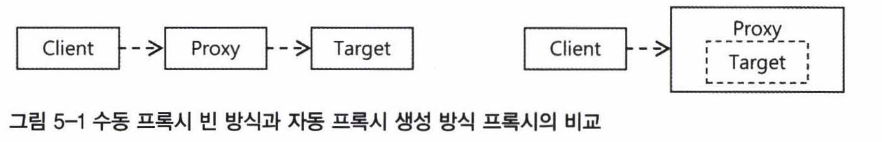
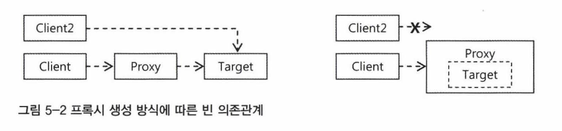
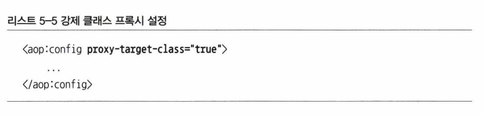
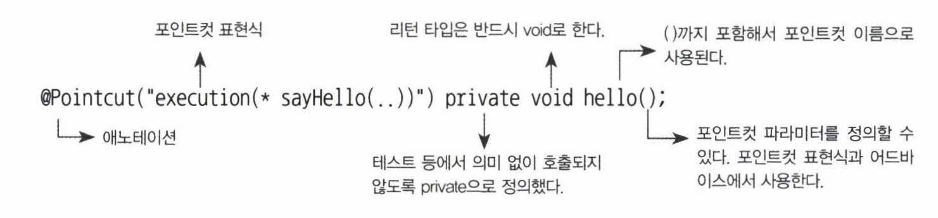
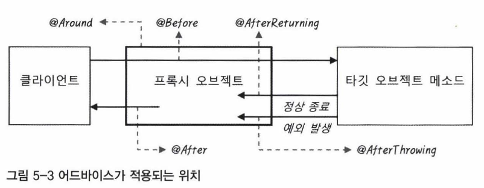
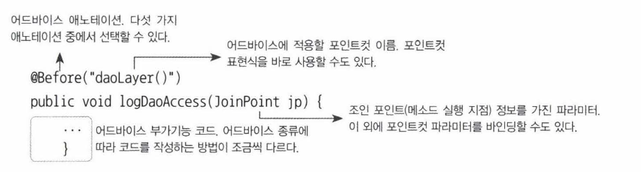

# 목차    
- [5. AOP와 LTW](5.-AOP와-LTW)
    - [5.1 애스펙트 AOP](5.1-애스펙트-AOP)
    - [5.2 AspectJ와 @Configurable](5.2-AspectJ와-@Configurable)
    - [5.3 로드타임 위버(LTW)](5.3-로드타임-위버(LTW))
    - [5.4 스프링 3.1의 AOP와 LTW](5.4-스프링-3.1의-AOP와-LTW)

<br>

# **5.1 애스펙트 AOP**

## **프록시 기반 AOP**
AOP란?      
모율화된 부가기능(어드바이스)과 적용 대상(포인트컷)의 조합을 통해 여러 오브젝트 에 산재해서 나타나는 공통적인 기능을 손쉽게 개발하고 관리할 수 있는 기술

### **다양한 AOP 개발 방법**   
- AOP 인터페이스 구현과 `<bean>` 둥록을 이용하는 방법
    - AOP의 구성요소를 모두 클래스로 개발하 고 이를 빈으로 등록해서 적용하는 형태
- AOP 인터페이스 구현과 aop 네임스페이스의 `<aop:advisor>` 태그를 이용하는 방법
    ```xml
    <aop:config>
        <aop:advisor advice-ref="transactionAdvice" pointcut="bean(*Service)" />
    </aop:config>
    <bean id="transactionAdvice" class="..."> ... </bean>
    ```
- 임의의 자바 쿨래스와 aop 네임스페이스의<aop:aspect>`를 이용하는 방법
    - 스프링 2.0에서부터는 AspectJ를 도입하면서 애스펙트를 정의해서 AOP를 만드는 방법을 함께 제공
    - 애스펙트 AOP 또한 인터페이스 구현이 펼요 없고, 애노테이션이나 XML 설정을 통해 애스펙트로 정의
- @AspectJ 애노테이션을 이용한 애스펙트 개발 방법
    - 동일하게 스프링의 프록시 기반 AOP를 만들 때 사용
    - @AspectJ는 @Transactional과 마찬가지로 AOP의 구성요소를 애노태이션을 이용해 정의
    

<br>

## **자동 프록시 생성기와 프록시 빈**
**자동 vs 수동**


<BR>

**자동 프록시 생성기의 특징**
- AOP 적용은 @Autowired의 타입에 의한 의존관계 설정에 문제톨 일으키지 않는다
    - 스프링은 자동 프록시 생성기를 이용해서 컨테이너 초기화 중에 만들어진 빈 을 바꿔치기해 프록시 빈을 자동으로 등록
- AOP 적용은 다른 빈들이 Target 오브젝트에 직접 의존하지 못하게 한다
    - DI를 지키지 않고 설계했을 경우 AOP 적용시 에러가 나는 이유가 됨
    

<BR>

### **프록시의 종류**
- 인터페이스를 구현한 프록시 (위에서 설명한 케이스)
- 서브 클래스를 이용한 프록시 
    - 타겟 클래스를 상속받아서 이용
    - final class/method에는 적용 불가
    - 클래스 프록시를 만들기 위해서는 CGLib이라는 바이트코드 생성 라이브러리가 필요
    - 다만 권장되는 방법은 아님, 레거시 지원을 위한 방법 
    - 강제로도 지정할 수 있다
    


<BR>

## **AspectJ AOP**
### **애스펙트란?**
- 클래스와 비슷한 개념
- 부가기능을 추상화 해놓은 형태
- 애스펙트는 하나 이상의 포인트컷과 어드바이스로 구성
```java
// 아래와 같이 이용
@Aspect
public class SimpleMonitoringAspect {}
```

### **@AspectJ란?**         
- 애스펙트를 자바 클래스와 메소드, 그리고 애노테이션을 이용해서 정의하는 방법을 가리키는 말
- @Aspect가 붙은 모든 클래스를 애스펙트로 자동 등록
- <aop:aspectj-autoproxy /> 추가

### **포인트컷: @Pointcut**
- 포인트컷은 @Pointcut 애노테이션이 달린 메소드를 이용해 선언
```java
@Pointcut("execution(* hello(..))")
private void all() {}
```

<BR>

### **어드바이스: @Before, @AfterReturning, @AfterThrowing, @After, @Around**
- 어드바이스도 포인트컷과 마찬가지로 하나 이상을 정의할 수 있음
- 어드바이스의 애노테이션에는 이에 적용할 포인트컷을 명시

<br>

### **포인트컷 메소드와 애노테이션**
- @Pointcut으로 정의된 포인트컷은 다른 포인트컷 또는 어드바이스에서 사용됨


포인트컷 표현식은 여러 종류의 포인트컷 지시자를 통해 나타낼 수 있음 
- execution()
    - 접근제한자, 리턴 타입, 타입, 메소드, 파라미터 타입, 예외 타입 조건을 조합해서 메소드 단위까지 선택 가능
    - execution(* *( .. ))
- within()
    - 타입 패턴만을 이용해 조인 포인트 메소드를 선택
    - execution에서 타입 패턴만을 적용한 것이라고 보면 됨
    - @Pointcut(within("com.epril.myproject.dao..*"))
- this, target
    - this와 target은 오브젝트를 선별
        - this는 프록시 오브젝트의 타입을 비교
        - target은 타깃 오브젝트의 타입과 비교
- args
    - 메소드의 파라미터 타입만을 이용해 포인트컷을 설정
    - execution 지시자의 () 안에 들어기는 파라미터 타입과 동일
    - args() / args(String) / args(String,..) / args(String, *)
- @target, @within
    - 타깃 오브젝트에 특정 애노테이션이 부여된 것을 선정
- @args
    - 따라미터 오브젝트에 지정된 애노테이션이 부여되어 있는 경우 선정 대상
    - args와 유사
- @annotation
    - 조인 포인트 메소드에 특정 애노테이션이 있는 것만 선정
- bean
    - 빈 이름 또는 아이디를 이용해서 선정하는 지시자로
    - 와일드카드 사용 가능
- && 
    - 두 개의 포인트컷 또는 지시자를 AND 조건으로 결합
    - within(com.epril.myproject.service..*) && args(java.io.Serializable)
- ||, !
    - 두 가지 지시자 또는 포인트컷의 대상을 모두 포함히는 포인트 컷을 정의할 때 사용
    - !은 Not을 의미

<BR>

### **어드바이스 메소드와 애노테이션**
@Aspect 클래스에 정의하는 어드바이스도 포인트컷과 마찬가지로 애노테이션과 메소드를 사용         
어드바이스는 5종류가 있음, 프록시 안에서 어느 단계에 적용되느냐에 따라 종류가 달라짐        


어드바이스를 정의히는 메소드는 아래 요소로 구성됨
- 어드바이스 애노테이션
- 포인트컷
- 메소드 코드



다섯 가지 어드바이스
- @Around
    - 프록시를 통해서 타깃 오브젝트의 메소드가 호출되는 전 과정을 모두 담을 수 있는 어드바이스
    - Methodlnterceptor 인터페이스와 유사
- @Before
    - 타깃 오브젝트의 메소드가 실행되기 전에 사용되는 어드바이스
    - 타깃 오브젝트 메소드로 전달되는 파라미터를 변경 할 수 없음
    - 파라미터가 참조하는 오브젝트의 내용을 변경할 수는 있음
- @AfterReturning
    - 타깃 오브젝트의 메소드가 실행을 마친 뒤에 실행되는 어드바이스
    - 예외가 발생하지 않고 정상적으로 종료한 경우에만 해당
    - 리턴 값 자체를 바꿀 수는 없음
- @AfterThrowing
    - 타깃 오브젝트의 메소드를 호출했을 때 예외가 발생하면 실행되는 어드바이스
- @After
    - 메소드 실행이 정상 종료됐을 때와 예외가 발생했을 때 모두 실행되는 어드바이스

<BR>

# **5.2 AspectJ와 @Configurable**
### AspectJ AOP
AspectJ는 스프링 AOP와 달리 프록시 대신 바이트코드 조작을 통한 별도의 오브젝트를 생성하여 AOP를 적용.       
이에 따라 스프링 AOP보다 훨씬 많은 포인트컷을 지원.         

### **빈이 아닌 오브젝트에 DI 적용**
- 도메인 오브젝트에 DI가 필요한 상황이 있다면? (DDD 등)
- AspectJ AOP를 통해 적용 가능

### **DI 애스펙트**
- 스프링은 AspectJ 기술로 만들어진 DependencyInjectionAspect 애스펙트를 제공
- DependencyInjectionAspect 애스펙트가 적용되면 @Configurable이 붙은 도메인 오브젝트가 어디서든 생성될 때마다 이 어드바이스가 적용되어 자동 DI 작업 수행
```java
// 포인트컷
public pointcut beanConstruction(Object bean) : 
    initialization(ConfigurableObject+.new( .. )) && this(bean);

declare parents: @(onfigurable * implements ConfigurableObject;

// 어드바이스
after(Object bean) returning :
    beanConstruction(bean) && postConstructionCondition() && inConfigurableBean() {
        configureBean(bean); }
```

### **@Configurable**
DI 애스펙트의 포인트컷에 의한 선정 대상으로 만들기
```java
@Configurable
public class User {
    private UserPolicyDao userPolicyDao; private EmailService emailService;
    
    public void setUserPolicyDao(UserPolicyDao userPolicyDao) { ... } public void setEmailService(EmailService emailService) { ... }
    public void upgradeToNextLevel() {
        UserPolicy userPolicy = userPolicyDao.get(PolicyType.UPGRADE);
        emailService.sendMail(this.email, upgradeMessage);
    }
}
```

- `<bean>` 설정
    - @Configurable이 붙은 클래스는 스프링의 빈이 아니고, 빈으로 등록될 필요도 없고， 등록할 수도 없음
    - 그럼에도 불구하고 DI 설정정보를 제공해주기 위해 등록
- 자동와어어링
    - @Configurable 애노테이션의 autowire 엘리먼트에 자동와이어링 방식을 지정
    - 애노테이션 의존관계 설정
    - @Configurable(autowire=Autowire.BY_NAME)
- 애노테이션 의존관계 설정

### **로드타임 위버와 자바 에이전트**
- DI 애스펙트 적용을 위해 필요한 2가지
    - AspectJ AOP가 동작할 수 있는 환경설정
    - DI 애스펙트 자체를 등록해서 @Configurable 오브젝트에 어드바이스 적용

AspectJ를 사용하려면 클래스를 로딩하는 시점에 바이트코드 조작이 가능하도록 로드타임 위버를 적용해야함

<BR>

# **5.3 로드타임 위버(LTW)**
로드타임 위버를 사용하는 경우는 다음과 같다.
- @Configurable 지원
- 트랜잭션 AOP의 모드를 AspectJ로 설정시
- JPA Lazy Loading 및 최적화

스프링은 자동으로 다음의 로드타임 위버 구 현 방법 중에서 하나를 적용
- WAS 전용 로드타임 위버
- JVM 자바 에이전트
- 관례를 따르는 클래스 로더

<BR>

# **5.4 스프링 3.1의 AOP와 LTW**
- @EnableAspectJAutoProxy
    - @Aspect로 애스팩트를 정의할 수 있게 해주는 @AspectJ AOP 컨테이너 인프라 빈을 등록시키는 애노테이션
    ```java
    // ex
    @Aspect
    public class MyAspect {}
    @Configuration
    @EnableAspectJAutoProxy
    public class AppConfig {
        @Bean MyAspect myAspect() { return new MyAspect() } 
    }
    ```
- @EnableLoadTimeWeaving
    - XML의 `<context:load-time-weaver>`처럼 환경에 맞는 로드타임 위버를 등록해주는 애노테이션
