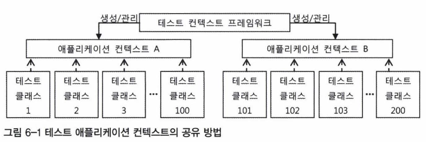

# 목차    
- [6. 테스트 컨텍스트 프레임워크](6.-테스트-컨텍스트-프레임워크)
    - [6.1 테스트 컨텍스트 프레임워크](6.1-테스트-컨텍스트-프레임워크)
    - [6.2 트랜잭션 지원 테스트](6.2-트랜잭션-지원-테스트)
    - [6.3 스프링 3.1의 컨텍스트 테스트 프레임워크](6.3-스프링-3.1의-컨텍스트-테스트-프레임워크)
    
<br>

# **6.1 테스트 컨텍스트 프레임워크**
자바에서 가장 많이 사용되는 테스트 프레임워크로는 JUnit과 TestNG가 있음
이중 가장 대표적이며 많이 사용되는 것은 JUnit4          
다만 스프링의 컨텍스트 태스트 엔진은 테스트 프레임워크의 종류에 독립적으로 작성되어 각각의 사용법이 크게 다르진 않음

### **JUnit4**
- @Test 애노테이션만 붙여주면 메소드가 속한 클래스는 테스트 클래스
- @Test가 붙은 모든 메소드가 각각 하나의 독립적인 테스트
-  모든 태스트는 서로 영향을 주지 않으며 독립적으로 실행됨을 보장

### **테스트용 애플리케이션 컨렉스트 캐싱과 설정파일**
- 테스트가 독립적이라고 해서 매번 스프링 컨텍스트, 컨테이너를 새로 만드는 건 매우 비효율적인 방법
- 이에 스프링은 테스트가 사용하는 컨텍스트를 캐싱해서 여러 테스트에서 하나의 컨텍스트를 공유할 수 있는 방법을 제공


<BR>

### **테스트 컨텍스트 프레임워크 적용방법**
2가지를 적용하면 된다.
- @RunWith 애노태이션을 이용해서 JUnit 태스트를 실행 하는 러너를 스프링이 제공하는 것으로 변경
- 컨텍스트 설정파일 지정
```java
@RunWith(SpringJUnit4ClassRunner.class) 
@ContextConfiguration("/test-applicationContext") 
public class Test1 {
    @Test public void testMethod1() { ... } 
    @Test public void testMethod2() { ... }
}
```

Test1 테스트 실행시 @Test 메소드 개수만큼 Test1 클래스의 오브젝트가 반복적으로 생성됨.      
하지만 `/test-applicationContext.xml`을 설정파일로 하는 애플리케이션 컨텍스트는 단 한 개만 생성.      
설정파일은 여러개 지정할 수 있고, 설정파일 구성이 같다면 동일한 컨텍스트 공유.      
이름 생략시 `클래스명-context.xml`을 자동참조

<BR>

### **컨텍스트 설정의 상속과 컨텍스트 로더**
JUnit 4의 장점은 태스트 클래스가 특정 클래스를 상속하도록 강제하지 않는다는 것      
태스트 클래스를 구성할 때 필요하면 상속구조를 활용할 수도 있음
```java
@ContextConfiguration("common-context.xml") 
public class SuperTest { ... }

@ContextConfiguration("sub-context.xml")
public class SubTest extends SuperTest { ... }
```
이때 적용되는 설정 파일은 2개.          

**슈퍼클래스의 컨텍스트 파일 설정을 무시하고 싶다면?**          
-> @ContextConfiguration의 inheritLocations 옵션을 false

## **테스트 코드의 테스트 컨텍스트 활용**
‘테스트 컨텍스트 프레임워크’의 ‘컨텍스트’는 애플리케이션 컨텍스트가 아닌,          
테스트 에서 시용되는 애플리케이션 컨텍스트를 생성하고 관리해주는 오브젝트를 가리키는 용어.      

### **테스트 컨텍스트로부터 DI 받기**
기존 방법과 동일.       
```java
@ContextConfiguration( ... ) 
public class Test1 {
    @Autowired 
    Bean bean;

    @Resource 
    Bean myBean;

    Bean bean1;
    Bean bean2;
    
    @Autowired
    public void setBean(Bean bean) { this.bean1 = bean; }

    @Autowired
    public void init(Bean bean) { this.bean2 = bean; }
}
```

<BR>

### **공유 컨텍스트 사용 시 주의사항**
- 컨텍스트를 공유해서 사용하므로 구성이나 내부 정보를 함부로 변경해선 안됨
- 외부 리소스 변경시에도 주의 필요 (DB, File 등)
    - 테스트 코드 로직으로 인해 내용 변경시 실행 순서에 따라 결과가 달라질 수 있기 때문
    - @DirtiesContext 적용
        - 태스트가 수행되고 나면 스프링이 현 테스트 컨텍스트를 강제로 제거
        - 테스트를 통해 더럽혀진 컨텍스트이므로 더 이상 공유하지 못하도록 만드는 것
        - 기본적으로 함수 단위 적용, 클래스도 적용 가능 (ClassMode.AFTER_EACH_TEST_METHOD 지정)
        ```java
        @Test
        @DirtiesContext
        public void test1 () { ... }
        ```

<BR>

# **6.2 트랜잭션 지원 테스트**
테스트시 트랜잭션 지원이 필요한 경우가 있음
- DAO 단독 테스트
    - 특히 JPA의 경우 트랜잭션이 시작되지 않은 채로 엔티티 매니저나 세션 사용시 TransactionRequiredException 발생 
    - Hibernate의 경우도 getCurrentSession()시 Exception 발생
- 롤백 테스트
    - 모든 DB 작업을 하나의 트랜잭션으로 묶어서 진행
    - 테스트 종료시 트랜잭션 모두 롤백

트랜잭션을 제어하고 활용하는 방법을 알아보자.

### **트랜잭션 매니저**
- PlatformTransactionManager 타입의 트랜잭션 매니저 빈 이용
```java
@Autowired 
PlatformTransactionManager transactionManager;

@Autowired 
JpaDao dao;

// 강제로 롤백
@Test
public void txTest() {
    new TransactionTemplate(transactionManager).execute(new TransactionCallback<Object>() {
        public Object doInTransaction(TransactionStatus status) {
            status.setRollbackOnly();
            dao.deleteAll();
            dao.add(new Member(10, "Spring", 7.8))
            assertThat(dao.count(), is(1))
            return null;
        }
    }
}
```

<BR>

### **@Transactional 테스트**
트랜잭션 매니저를 이용하는 방법은 코드가 너무 지저분 함         
@Transactional은 이를 간결하게 적용할 수 있게 만드는 애노테이션         
setRollbackOnly()를 호출한 것과 동일한 방식으로 동작        
```java
@Test
@Transactional
public void txTest() {
    dao.deleteAll();
    dao.add(new Member(10, "Spring", 7.8))
    assertThat(dao.count(), is(1))
}
```

만약 일부만 Commit 하고 싶다면?
```java
@Test
@Transactional 
@Rollback(false)
public void txTest() {...}
```

트랜잭션 시작 / 종료 후 하고싶은 작업이 있다면?
```java
@BeforeTransaction
public void setUpBeforeTx() { ... }

@Before
public void setUpInTx() { "" }

@Test
@Transactional
public void test() { ... }

@After
public void tearDownInTx() { ... }

@AfterTransaction
public void tearDownAfterTx() { ... }
```

@Transactional은 클래스 레벨에도 부여 가능.
```java
// Custom TransactionManager도 등록 가능
@TransactionConfiguration(transactionManager="myTransactionMgr") 
public class MyTest { ... }
```

### **ORM 롤백 트랜잭션 테스트 주의사항**
ORM은 기본적으로 모든 작업 결과를 바로 DB에 반영하지 않고,          
메모리에 변경사항을 저장하고 있다가 한꺼번에 DB에 반영함 (Flush)

```java
@Test
@Transactional
public void multiAdd() {
    User user = new User(...); 
    hibernateDao.add(user);
    assertThat(user, is(hibernateDao.get(user.getld())));
}
```
위 코드는 동작시 실제 DB에 데이터를 삽입 하는 것이 아닌, 캐시된 메모리의 Insert문을 참조하여 데이터가 있음을 확인하게 됨            
-> 이를 해결하기 위해 강제로 flush 수행

```java
@Test
@Transactional
public void multiAdd() {
    User user = new User(...); 
    hibernateDao.add(user);
    SessionFactory.getCurrentSession().flush(); // DB에 Insert

    SessionFactorY .getCurrentSession().clear(); // 내부 캐시 제거
    assertThat(user, is(hibernateDao.get(user.getld())));
}
```

DBUnit을 이용한 테스트 방법도 있다.

<BR>

# **스프링 3.1의 컨텍스트 테스트 프레임워크**
스프링 3.0에서는 테스트 컨텍스트 설정시 XML만 사용 가능했지만       
3.1부터는 @Configuration 클래스 사용 가능.      

아래와 같은 Config가 있다고 가정 
```java
@Configuration 
@EnableTransactionManagement 
@ComponentScan("myproject") 
public class AppConfig { ... }
```

이 때 아래와 같이 Config 사용 가능      
ContextConfiguration은 여러개도 지정 가능하다.
```java
@RunWith(SpringJUnit4ClassRunner.class)
@ContextConfiguration(classes=AppConfig.class) 
@Transactional
public class DaoTest { 
    @Autowired 
    UserDao userDao;
    
    ...

    @Test
    public void userDaoTest() {
        //
    }
}
```

아무 클래스를 지정하지 않으면 테스트 클래스의 스태틱 멤버 클래스 중에서         
@Configuration이 붙은 것을 모두 디폴트 설정 정보로 사용          
아래의 경우 MyAppConfig, MyExtraConfig 적용
```java
@RunWith(SpringJUnit4ClassRunner.class) 
public class MyAppTest {
    @Configuration
    static class MyAppConfig { ... }
    
    @Configuration
    static class MyExtraConfig { ... }
}
```
아래의 경우는 에러가 발생한다. 
- 중첩 스태틱 클래스로 정의하는 디폴트 설정 클래스가 private거나 final인 경우 
- xml과 class를 동시 지정하거나, xml과 @Configuration 모두 디폴트 파일이 있는 경우

<BR>

### **Active Profile**
스프링 3.1에서는 테스트에 활성 프로파일을 매우 간단하게 적용할 수 있는 애노테이션을 지원
```java
@RunWith(SpringJUnit4ClassRunner.class) 
@ContextConfiguration(classes=AppConfig.class) 
@ActiveProfiles("dev")
public class MyAppTest { ... }
```

