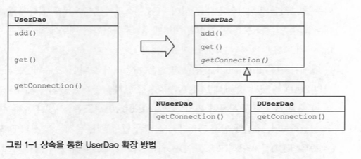
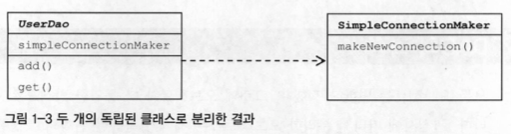
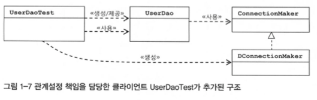

#### 2022.09.06 '토비의 스프링을 읽어봐요' 스터디 자료 by 정의재

# Chapter 1 - 오브젝트와 의존관계

### 목차

[1.1 초난감 DAO](#11-초난감-dao)

[1.2 DAO의 분리](#12-dao의-분리)

[1.3 DAO의 확장](#13-dao의-확장)

<br>
<br>

## 1.1 초난감 DAO 
### JDBC 연결이 가능한 초기 UserDAO
```java
public class User {
        String id;
        String name;
        String password;

        // Getter
        // ...
    
        // Setter
        // ...
    
}

public class UserDAO {
    public 
    public void add(User user) throws ClassNotFoundException, SQLException {
        Class.forName("com.mysql.jdbc.Driver");
        Connection c = DriverManager.getConnection(
                "jdbc:mysql://localhost/springbook", "spring", "book");
        
        PreparedStatement ps = c.prepareStatement(
                "insert into users(id, name, password) values(?,?,?)");
        ps.setString(1, user.getId());
        ps.setString(2, user.getName());
        ps.setString(3, user.getPassword());
        
        ps.excetueUpdate();
        
        ps.close();
        c.close();
    }
    
    public User get(String id) throws ClassNotFoundException, SQLException {
        Class.forName("com.mysql.jdbc.Driver");
        Connection c = DriverManager.getConnection(
                "jdbc:mysql://localhost/springbook", "spring", "book");

        PreparedStatement ps = c.prepareStatement(
                "select * from users where id = ?");
        ps.setString(1, id);

        ResultSet rs = ps.executeQuery();
        rs.next();
        User user = new User();
        user.setId(rs.getString("id"));
        user.setName(rs.getString("name"));
        user.setPassword(rs.getString("password"));
        
        rs.close();
        ps.close();
        c.close();
        
        return user;
    }
}
```

<br>

## 1.2 DAO의 분리
### 1.2.1 관심사의 분리 | 위 코드의 가장 큰 문제점 - 관심사 분리가 되지 않음

- 관심사 분리 안 된게 왜 문제야?
    1. 미래의 코드는 계속해서 바뀐다
    2. DB 연결 방식, 종류가 바뀌는 일이 생긴다면 해당 코드에 DB 관련 코드를 모든 메서드마다 수정해줘야한다
    

- 그래도 관심사 분리를 어떻게 해?
    1. 현재 코드의 주요 관심사를 잘 구분한다
    2. 구분한 관심사를 각각에 맞게 분리해 구현한다
    
<br>

### 1.2.2 커넥션 만들기의 추출 | UserDAO의 관심사항
1. DB와 연결을 위한 커넥션 가져오기
2. 사용자 등록을 위해 DB에 보낼 SQL 문장을 담을 Statement를 만들고 실행하기
3. 작업이 끝나면 사용한 리소인 Statement와 Connection 오브젝트를 닫기

    ++ 예외 처리
    #### 중복 코드의 메소드 추출
    -  ```getConnection()``` - DB와 연결을 위한 커넥션 가져오기
        ```java
        public class UserDAO {
            public void add(User user) throws Exception {
                Conncection  = getConnection();
                // ...
            }
            
            public User get(String id) throws Exception {
                Conncection c = getConnection();
                // ...
            }
            
            private Connection getConnection() throws Excetpion {
                Class.forName("com.mysql.jdbc.Driver");
                return DriverManager.getConnection(
                        "jdbc:mysql://localhost/springbook", "spring", "book");
            }
        }
        ```
        - 이로써 커넥션을 가져오는 부분에 변경이 일어날 경우 ```getConnection()``` 함수만 수정하면 된다
        - 설령 테스트 과정에서 오류가 발견되었더라도 다른 부분을 볼 필요 없이 ```getConnection()```만 체크하면 될 것이다
    
<br>

### 1.2.3 DB 커넥션 만들기의 독립 | But, 각기 다른 종류의 DB를 써야된다면?
갑자기 요구사항이 바뀌어 각 2가지 DB를 사용하는 방식으로 구현해야한다...!
1. ```N_UserDAO```, ```D_UserDAO```라는 서브 클래스를 만든다.
2. 각각 ```UserDAO```를 상속받는다. 이때 ```getConncetion()```을 추상 메소드로 선언해 각각 구현체를 따로 작성한다.
   


```java
public abstract class UserDAO {
    public void add(User user) throws Exception {
        Conncection = getConnection();
        // ...
    }

    public User get(String id) throws Exception {
        Conncection c = getConnection();
        // ...
    }

    public abstract Connection getConnection() throws Excetpion;
}

public class N_UserDAO extends UserDAO {

    @Override
    public Connection getConnection() throws Excetpion {
        // N 사의 DB 커넥션 코드
    }
}

public class D_UserDAO extends UserDAO {

    @Override
    public Connection getConnection() throws Excetpion {
        // D 사의 DB 커넥션 코드
    }
}
```
- 이로써 변경 EASY + 확장성 까지 갖추었다
- L 사의 DB 커넥션을 추가로 해야한다면 이제는 ```UserDAO```를 상속받아 ```getConnection()``` 부분만 이에 맞게 구현하면 된다
- 즉, ```UserDAO```는 Connection 오브젝트라는 것 이외에 다른 것에는 관심이 없다 (관심사 분리)


    💡여기서 나온 메소드 패턴 2가지

        1. 팩토리 메소드 패턴
            서브클래스에서 오브젝트 생성 방법과 클래스를 결정할 수 있도록 메소드를 미리 정의해두고 
            이를 통해 생성한 로직들을 나머지 로직(Super Class)과 독립시키는 방법

        2. 템플릿 메소드 패턴
            기본 알고리즘 골격을 담은 메소드를 이용하는 패턴

            
<br>

#### However, 여전히 상속관계는 두 가지 다른 관심사(DB 커넥션과 DA 로직)에 대해 긴밀한 결합을 허용한다

<br>

## 1.3 DAO의 확장

상속은 두 관심사를 분리하고 서로 영향을 주지 않게 했지만 여전히 단점이 많다.
<br>

### 1.3.1 클래스 분리
- DB 커넥션과 DA 로직을 상속 관계로 두는게 아니라 각각의 별도 클래스로 관리해보자.



```java
public class UserDAO {
    
    private SimpleConncetionMaker simpleConncetionMaker;
    
    public UserDAO() {
        simpleConncetionMaker = new SimpleConnectionMaker();
    }
    public void add(User user) throws Exception {
        Conncection c = simpleConncetionMaker.makeNewConnection();
        // ...
    }

    public User get(String id) throws Exception {
        Conncection c = simpleConncetionMaker.makeNewConnection();
        // ...
    }
}

public class SimpleConnectionMaker {
    public Connection makeNewConnection() throws Exception {
        Class.forName("com.mysql.jdbc.Driver");
        return DriverManager.getConnection(
                "jdbc:mysql://localhost/springbook", "spring", "book");
    }
}
```
분리는 성공.

<br>

#### Nevertheless, 각각 다른 DB 커넨션 방식을 제공해줄 수 가 없다. 
#### UserDAO 내에 있는 ```add()```, ```get()``` 메소드의 커넥션을 가져오는 코드를 일일이 바꿔줘야 한다.

<br>

### 1.3.2 인터페이스 도입

인터페이스라는 느슨한 연결 고리를 통해 DB 커넥션 클래스와 DA 로직 클래스를 분리하되 느슨한 연결고리를 만들어 주자.

```java
public interface ConnectionMaker {
    
    public Conncetion makeConnection() throws Exception;
}

public class D_ConnectionMaker implements ConnectionMaker {
    
        @Override
        public Conncetion makeConnection() throws Exception {
            // D사의 Connection 생성 로직
        }
}

public class UserDAO {

    private ConnectionMaker connectionMaker;

    public UserDAO() {
        connectionMaker = new D_ConnectionMaker();
    }

    public void add(User user) throws Exception {
        Conncection c = connectionMaker.makeConnection();
        // ...
    }

    public User get(String id) throws Exception {
        Conncection c = connectionMaker.makeConnection();
        // ...
    }
}
```
이제는 N사 커넥션을 추가하게 되면 ```ConnectionMaker``` 인터페이스를 상속받아 구현한 후 ```UserDAO```에서
```connectionMaker```만 ```N_ConnectionMaker()```로 수정해주면 된다

그러나, 완벽한 것만 같은 이 코드도 결국 UserDAO 내부를 한 번은 고쳐야 다른 커넥션을 사용할 수 있다...!

<br>

### 1.3.3 관계설정 책임의 분리

<br>

요약하면, ```UserDAO```와 ```UserDAO```가 시용하는 ```ConnectionMaker```의 특정 구현 클래스 사이의 관계를 설정해주는 것 또한
하나의 관심사항이다. 즉, 이 관심사항을 담은 코드를 ```UserDAO```에서 분리해야 ```UserDAO```를 독립적으로 확장 가능한 클래스로
만들 수 있다.
```java
private ConnectionMaker = new X_ConnectionMaker();
```

따라서 여기서부터 클래스와 클래스 사이의 관계가 아닌 오브젝트와 오브젝트 사의 관계로 생각해봐야 한다.
```UserDAO를 사용하는 클라이언트 오브젝트```와 ```UserDAO 오브젝트```가 바로 그 시작점이다.


이 둘의 느슨한 관계를 ```UserDAO``` 내부에서 맺는게 아니라 ```제3의 곳```에서 관계를 맺게 해주자.
```java
public class UserDAO {

    private ConnectionMaker connectionMaker;

    public UserDAO(ConncectionMaker conncectionMaker) {
        this.connectionMaker = conncectionMaker;
    }

    // ...
}

public class ThirdArea {
    public static void main(String[] args) {
        
        Connectionmaker connectionmaker = new D_ConnectionMaker();

        UserDAO userDAO = new UserDAO(connectionmaker);
        
    }
}
```
- 이제 드디어 ```ThirdArea```라는 클라이언트를 통해 ```UserDAO```의 것이 아니었던 관심하아, 책임을 분리하는 작업을 마쳤다
- DAO가 아무리 많아지고, 아무리 많은 DB 커넥션을 사용해도 DB 접속 변경을 변경하고자 할때는 오직 한 곳, ```main 메소드```만
수정하면 된다.
  


<br>

### 1.3.4 원칙과 패턴

위의 1.1 ~ 1.3 과정 동안 우리는 아래의 SOLID 원칙에 맞춰 코드를 발전 시켜나갔다.
사실 SOLID 원칙에 맞춰나갔다기보단 보다 객체지향적인 코드를 만들다보니 SOLID 원칙에 가까운
형태가 만들어졌다고 보는 게 맞을 것이다.
### SOLID
#### 1. SRP(단일 책임 원칙, The Single Responsibility Principle)
#### 2. OCP(개방 폐쇄 원칙, The Open-Closed Principle)
#### 3. LSP(리스코프 치환 원칙, The Liskov Substitution Principle)
#### 4. ISP(인터페이스 분리 원칙, The Interface Segregation Principle)
#### 5. DIP(의존관계 역전 워칙, The Dependency Inversion Principle)
<br>
우리는 이 중 OCP(개방 폐쇄 원칙)로 1.1 ~ 1.3 과정을 효과적으로 설명할 수 있다.

    OCP란, 클래스나 모듈은 확장에는 열려 있어야 하고, 변경에는 닫혀 있어야 한다

초기 ```UserDAO``` 코드는 확장은 거의 불가능에 가까우며, 어떤 기능의 변경, 추가를 할 경우 반드시 변경이 이뤄져야 한다.
즉, ```OCP```를 전혀 따르지 못하는 코드라고 할 수 있다.

하지만 1.3 과정 끝에 나온 ```UserDAO``` 코드는 DB 커넥션 방식 추가를 할 경우, 확장을 통해 이를 만들 수 있다. 반면
```UserDAO``` 코드 자체는 어떠한 변경도 이뤄지지 않으므로 ```OCP 조건```을 충족한다고 할 수 있다.

<br>

### 높은 응집도와 낮은 결합도

#### 1. 응집도가 높다 → 하나의 클래스가 하나의 책임, 관심사에 집중되어 있다
#### 2. 결합도가 낮다 → 책임, 관심사가 다른 오브젝트를 느슨하게 연결된 형태로 유지한다

우리 코드에서 ```ConnectionMaker```는 오직 DB와의 커넥션을 연결해주는 책임만을 가진다. 
반대로 ```UserDAO```는 Data에 접근하는 책임에만 집중하고 있다. 즉, 각각의 오브젝트, 클래스가
응집도가 높음을 알 수 있다.


반면 각 오브젝트는 서로 결합도가 낮다. 즉, ```UserDAO```에서 사용해야하는 DB 커넥션의 종류가 다를 때
```ConnectionMaker``` 인터페이스를 상속받아 새로 만든 구현체를 ```ThirdArea```에서 사용함으로써 ```UserDAO```와
```ConnectionMaker```간의 결합도는 계속해서 낮게 유지한다.

<br>

### 전략 패턴
    전략 패턴이란, 자신의 기능 맥락(Context)에서 필요에 따라 변경이 필요한 알고리즘을 인터페이스를 통해 통째로 
    외부로 분리시키고, 이를 구현한 구체적인 알고리즘 클래스를 필요에 따라 바꿔서 사용할 수 있게 하는 디자인 패턴이다.

즉, ```UserDAO```라는 Context에서 자주 변경될 예정인 DB 커넥션이라는 기능, 알고리즘을 외부에 인터페이스로 분리시키고
이를 구현한 ```D_ConnectionMaker, N_ConnectionMaker``` 등을 구현해 필요에 따라 사용할 수 있도록 한다는 점에서
전략 패턴이라고 할 수 있다. 그리고 이 때 Context를 사용할 클라이언트(ThirdArea)가 Context 전략을 생성자와
같은 형태로 제공해주는 것이 일반적인 형태이다.

<br>

아주아주 간단한 코드를 통해 여러가지 객체지향적 이론들을 직접 체험해봤다. 이제 본격적으로 코드와 구조를
복잡하게 가져가면서 지금 배운, 앞으로 배울 원칙, 스프링의 장점을 느껴보도록 하자.
    
-끝-

