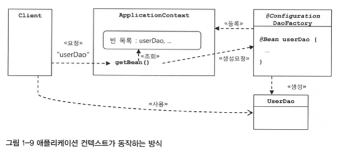

#### 2022.09.13 '토비의 스프링을 읽어봐요' 스터디 자료 by 정의재

# Chapter 1 - 오브젝트와 의존관계

### 목차

[1.4 제어의 역전](#14-제어의-역전)

[1.5 스프링의 IoC](#15-스프링의-ioc)

[1.6 싱글톤 레지스트리와 오브젝트 스코프](#16-싱글톤-레지스트리와-오브젝트-스코프)

[1.7 의존 관계 주입(DI)](#17-의존-관계-주입-(di))

[1.8 XML 설정](#18-xml을-이용한-설정)

[1.9 정리](#19-정리)

<br>
<br>

## 1.4 제어의 역전 
### 오브젝트 팩토리

UserDAOTest는 UserDAO의 기능이 잘 동작하는지 테스트하는 역할만을 수행해야하므로 UserDAO와 ConnectionMaker 구현 클래스를 만들고
그 두 오브젝트를 연결해주는 역할을 따로 수행할 클래스가 필요하다. 그리고
보통 이런 일을 하는 오브젝트를 ```팩토리```라고 한다.
```java
public class DAOFactory {
    public UserDAO userDAO() {
        ConnectionMaker connectionMaker = connectionMaker();
        UserDAO userDAO = new UserDAO(conncetionMaker);
        return userDAO;
    }
    
    // ConnectionMaker타입 오브젝트 생성 메소드
    public ConnectionMaker connectionMaker() {
        return new DConnectionMaker();
    }
}


public class UserDAOTest {
    public static void main(String[] args) {
        UserDAO dao = new DAOFactory().userDAO();
        // ...
    }
}
```
위와 같이 코드가 바뀜으로써 얻는 가장 큰 장점은 
우리는 이제 애플리케이션의 컴포넌트 역할을 하는 오브젝트(```UserDAO```, ```ConnectionMaker```)와 애플리케이션 구조를
결정하는 오브젝트(```DAOFactory```)를 분리하게 되었다는 것이다.
<br>


### 제어권 이전을 통한 제어관계 역전
기존 코드는 모든 종류의 작업을 사용하는 쪽에서 제어하는 구조이다.
더 이상 UserDAO같은 오브젝트가 자신이 사용할 오브젝트를 스스로 선택하지 않는다. DAOFactory에게 
ConnectionMaker의 구현 클레스를 결정한 권한을 넘겼기 때문에 제어권을 이전해주었고,
이를 통해 제어관계가 역전되었음을 알 수 있다.


<br>

## 1.5 스프링의 IoC
### 애플리케이션 컨텍스트(Application Context)
- 빈(Bean) - 스프링이 제어권을 가지고 직접 만들고 관계를 부여하는 오브젝트
- 빈 팩토리(Bean Factory) - 빈의 생성, 관계 설정 등과 같은 제어를 담당하는 IoC 오브젝트
- 애플리케이션 컨텍스트(Application Context) - 빈 팩토리를 보다 확장한 용어

이제 기존의 DAOFactory에 스프링 설정을 더해주자
```java
@Configuration
public class DAOFactory {
    
    @Bean
    public UserDAO userDAO() {
        return new UserDAO(connectionMaker());
    }
    
    @Bean
    public ConnectionMaker connectionMaker() {
        return new DConnectionMaker();
    }
}


public class UserDAOTest {
    public static void main(String[] args) {
        ApplicationContext context = new AnnotationConfigApplicationContext(DAOFactory.class);
        UserDAO dao = context.getBean("userDAO", UserDAO.class);
        // ...
    }
}
```

자바 리플렉터를 사용해 getBean을 활용하면 DAOFactory에서 관리되는 해당 오브젝트를 가져올 수가 있게 된다.

### Application Context의 동작방식


1. 빈의 등록은 DAOFactory에서 처음 진행한다. 여기서 @Bean으로 어노테이션을 준 오브젝트들이 ApplicationContext에
등록된다.
2. 이후 CLient가 ApplicationContext를 통해 오브젝트를 요청하게되면 ApplicationContext는 빈 목록을
조회해 해당하는 빈이 있다면 이 빈의 DAOFactory에 생성 요청을 하게 된다.
3. DAOFactory는 요청에 따라 새로운 오브젝트를 생성하게 되고 Client는 이 오브젝트를 리턴받아 사용하게 된다.


<br>

## 1.6 싱글톤 레지스트리와 오브젝트 스코프
### Application Context의 싱글톤 레지스트리
기존 오브젝트 팩토리는 같은 오브젝트를 요청하더라도 매번 return new를 하기 때문에 매번 새로운 오브젝트를
리턴한다. 반면 Application Context는 싱글톤으로 빈 오브젝트를 만들기 때문에 매번 "동일한" 오브젝트를
리턴하게 된다.

### 싱글톤으로 관리하는 이유
스프링은 주 적용 대상이 자바 엔터프라이즈 기술을 사용하는 서버환경이기 때문이다. 매번 클라이언트에서 요청이
들어올 때마다 오브젝트를 새로 생성하게 되면 말도 안되게 리소스를 잡아먹게 될 것이다. 이를 막기 위해 빈 오브젝트를
싱글톤으로 관리함으로써 이러한 부하를 줄이게 된다.

### 싱글톤의 한계
```java
public class UserDao {
    private static UserDao INSTANCE;
    private ConnectionMaker connectionMaker;
    // ...

    private UserDao(ConnectionMaker connectionMaker) {
        this.connectionMaker = connectionMaker;
    }

    public static synchronized UserDao getInstance() {
        if (INSTANCE == null) INSTANCE = new UserDao(???);
        return INSTANCE;
    }
}
```
1. 상속 불가( ∵ private 생성자)
2. 테스트하기 어려움
3. 서버환경에서 싱글톤이 실제로 하나만 만들어지는 것을 보장하지 못함
4. 싱글톤 사용은 전역 상태를 만들 수 있기 때문에 바람직 하지 못함

### 싱글톤 레지스트리(스프링에서의 싱글톤)
스프링은 위의 싱글톤의 한계를 극복하고자 등장했다. 기존 싱글톤 방식과 달리 public 생성자를 가질 수 있고, 테스트를
위한 Mock 오브젝트로 대체하는 것도 간단하다. 그 중에서도 스프링이 지지하는 객체지향적인 설계 방식, 원칙, 디자인 패턴을
모두 적용하는데 아무런 제약이 없다는 것이 가장 큰 장점이다.

<br>

## 1.7 의존 관계 주입(DI)
제어의 역전(IoC)은 다양한 곳에서 사용되는 추상적인 용어이기 때문에 스프링에서 사용하는 IoC를 보통 의존 관계 주입(DI)라고
칭하는 것이 일반적이다.

### 의존한다?
A가 B를 의존한다는 의미는 B가 변하면 그것이 A에 영향을 미친다는 뜻이다. A가 B를 사용하는 경우가 그러하다.

### 의존 관계 검색과 주입
```java
public class UserDAO {
    
    public UserDAO() {
        AnnotationConfigApplicationContext context =
                new AnnotationConfigApplicationContext(DAOFactory.class);
        this.connectionMaker = context.getBean("connectionMaker", ConnectionMaker.class);
    }
    
}
```

위에서처럼 getBean을 활용한 의존관계 검색 방법을 적용할 수 있다. 이때 UserDAO는 굳이 Bean일 필요가 없다.
하지만 UserDAO와 ConnectionMaker 사이에 의존관계 주입이 적용되려면 UserDAO도 반드시 Bean으로 등록해
관리되어야 한다. 즉, 위의 코드는 DI가 아니라 DL(Dependency Look-up)라고 구분해야할 것이다.


### 의존 관계 주입의 응용
1. 기능 구현의 교환

    개발용으로 DB를 사용하다가 실제 배포용 DB로 전환할 때 우당탕탕 초기 코드였다면 전부 하나하나 DBConnection을
바꿔줬어야한다. 하지만 Spring을 적용한 지금의 코드에서는 Bean으로 등록한 connectionMaker() 메소드만 수정하면 된다.


2. 부가 기능 추가
   
    DAO가 DB를 얼마나 많이 연결하는지 확인하는 기능을 추가해야한다고 가정하자. 만약 우당탕탕 초기 코드였다면 역시나 
   DBConnection을 하는 곳들을 모두 찾아 count를 증가시켜주는 로직을 추가했어햐 할 것이다.
   하지만 우리는 ConnectionMaker 인터페이스를 상속해 Counting 기능이 추가된 ConnectionMaker 구현클래스를
   만들면 될 것이다. 이후 빈팩토리에 구현 클래스를 등록하고 관계 설정만 해주면 UserDAO 쪽의 코드는 한 줄도
   수정하지 않고 기능을 추가할 수 있게 된다.

<br>

## 1.8 XML 설정
Apllication Context를 XML 형태로도 저장하고 이용할 수 있다.

<br>

## 1.9 정리
스프링이란, 어떻게 오브젝트가 설계되고, 만들어지고, 어떻게 관계를 맺고 사용되는지에 관심을 갖는 프레임워크라는 사실을
꼭 기억해두자.