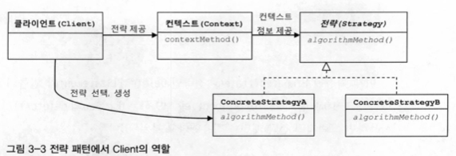
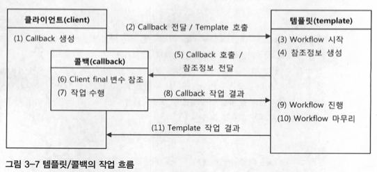
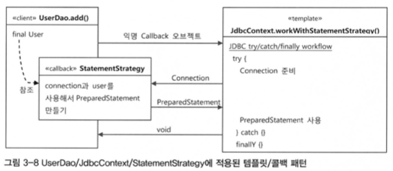

#### 2022.09.27 '토비의 스프링을 읽어봐요' 스터디 자료 by 정의재

# Chapter 3 - 템플릿

### 목차

[3.1 다시 보는 초난감 DAO](#)

[3.2 변하는 것과 변하지 않는 것](#)

[3.3 JDBC 전략 패턴의 최적화](#)

[3.4 컨텍스트와 DI](#)

[3.5 템플릿과 콜백](#)

[3.6 스프링의 JdbcTemplate](#)

[3.7 정리](#)
<br>

## 3.1 다시 보는 초난감 DAO
### 예외 처리 (try / catch / finally)

UserDAO가 많은 발전을 거듭했지만 예외처리가 전혀 되지 않은만큼 발전 여지가 많다고 할 수 있다.

가장 흔히 사용하는 ```try / catch /finally```를 이용해 기존 코드를 수정한다.

```java
public class DeleteException {
    // 기존 코드
    public void deleteAllBefore() throws SQLException {
        Connection c = dataSource.getConnection();

        PreparedStatement ps = c.prepareStatement("delete from users");
        ps.executeUpdate();
        
        ps.close();
        c.close();
    }
    
    // 예외 처리를 한 코드
    public void deleteAllAfter() throws SQLException {
        Connection c = null;
        PreparedStatement ps = null;

        try {
            c = dataSource.getConnection();
            ps = c.preparedStatement("delete from users");
            ps.executeUpdate();
        } catch (SQLException e) {
            throw e;
        } finally {
            if (ps != null) {
                try {
                    ps.close();
                } catch (SQLException e) {}
            }
            if (c != null) {
                try {
                    c.close();
                } catch (SQLException e) {}
            }
        }
    }
}
```

```java
public class GetCountException {
    // 예외 처리를 한 코드
    public int getCountAfter() throws SQLException {
        Connection c = null;
        PreparedStatement ps = null;
        ResultSet rs = null;

        try {
            c = dataSource.getConnection();

            ps = c.prepareStatement("select count(*) from users");

            rs = ps.executeQuery();
            rs.next();
            return rs.getInt(1);
        } catch (SQLException e) {
            throw e;
        } finally {
            if (rs != null) {
                try {
                    rs.close();
                } catch (SQLException e) {}
            }
            if (ps != null) {
                try {
                    ps.close();
                } catch (SQLException e) {}
            }
            if (c != null) {
                try {
                    c.close();
                } catch (SQLException e) {}
            }
        }
    }
    
}

```
상당히 쉽지않은 예외처리를 통해 안정적이면서도 DB 연결 기능을 자유롭게 확장할 수 있는 DAO가 완성되었다.


## 3.2 변하는 것과 변하지 않는 것
### try / catch / finally 의 문제점

단 한 곳, 한 줄이라도 예외 처리하는 것을 까먹거나 잘못 작성하면 추후 문제가 생겼을 때
처치가 아주 곤란해질 것이다.
   
### 분리와 재사용을 위한 디자인 패턴 적용
1. 템플릿 메소드 패턴 적용

    템플릿 메소드 패턴을 적용하기 위해 변하는 부분인 ```makeStatement```를 추상 메소드로 바꾼 후 이를 상속해 구현하는 방법을 채택하려 했다.
    하지만 이렇게될 경우 만드는 모든 DAO 로직마다 상속을 통해 새로운 클래스를 만들어야한다는 점에서 매우 불편하다는 특징이 있다.
   
   
2. 전략 패턴 적용
    
    전략 패턴의 경우 makeStatement 부분을 아예 오브젝트로써 클래스로 분리하고 인터페이스를 통해 의존하도록 만드는 방식을 취한다.
    
   
    1. StatementStrategy라는 인터페이스를 만들고 이를 구현한 ```DeleteAllStatement``` 클래스를 만든다.
    2. Context라고 할 수 있는 변하지 않는 부분을 메소드로 둔 채 ```StatementStrategy```를 매개변수로 주입받는다.
    3. 그리고 deleteAll() 메소드를 클라이언트로 설정하고 전략 오브젝트를 만들고 컨텍스트를 호출한다
   
    ```java
    public class Class {
        // 클라이언트에서 전략 오브젝트 생성 & 컨텍스트 호출
        public void deleteAll() throws SQLException {
            StatementStategy st = new DeleteAllStatement(); // 전략 오브젝트
            jdbcContextWithStatementStategy(st);            // 컨텍스트 + DI
        }
    }
    ```

## 3.3 JDBC 전략 패턴의 최적화
3.2에 했던 작업을 이번에는 add()함수에 적용해본다. 이때 2가지 문제점이 발생한다.

1. 새로 만드는 DAO 메소드마다 새로운 StatementStrategy 구현 클래스를 만들어야한다.
2. User와 같이 StatementStrategy에 전달할 부가적인 정보가 있는 경우 이를 위해 오브젝트를 전달받는 생성자와
이를 저장해둘 인스턴스 변수를 번거롭게 만들어야 한다.
   
이 두 가지를 해결하기 위해 저자는 로컬 클래스와 익명 내부 클래스를 사용했고, 익명 내부 클래스를 통해 보다 원활한 코드를 만들었다.
```java
public class Class {
    
    public void deleteAll() throws SQLException {
        jdbcContextWithStatementStrategy(
            new StatementStrategy() {
                public PreparedStatement makePreparedStatement(Connection c) throws SQLException {
                    return c.preparedStatement("delete from users");
                }    
            }
        );
    }
    
}
```

## 3.4 컨텍스트와 DI
### JdbcContext의 분리
JDBC와 관련된 로직들은 다른 DAO에서도 사용 가능하므로 분리할 필요가 있다.

따라서 UserDAO에서 JdbcContext(JDBC 관련 로직)를 분리한 뒤 이를 DI 받아서 사용할 수 있도록 만들자.
```java
public class JdbcContext {
    private DataSource dataSource;

    public void setDataSource(DataSource dataSource) {
        this.dataSource = dataSource;
    }
    
    public void workWithStatementStrategy(StatementStrategy stmt) throws SQLException {
        Connection c = null;
        PreparedStatement ps = null;

        try {
            c = this.dataSource.getConnection();
            ps = stmt.makePreparedStatement(c);
            ps.executeUpdate();
        } catch (SQLException e) {
            throw e;
        } finally {
            if (ps != null) { try { ps.close(); } catch (SQLException e) {} }
            if (c != null) { try { c.close(); } catch (SQLException e) {} }
        }
    }
}

public class UserDAO {
    // ...
    
    private JdbcContext jdbcContext;

    public void setJdbcContext(JdbcContext jdbcContext) {
        this.jdbcContext = jdbcContext;
    }
    
    public void add(final User user) throws SQLException {
        this.jdbcContext.workWithStatementStrategy(new StatmentStrategy() { ... });
    }
    
    public void deleteAll() throws SQLException {
        this.jdbcContext.workWithStatementStrategy(new StatementStrategy() { ... });
    }
    
    //...
}
```


    DI의 개념을 충실히 따르자면, 인터페이스를 사이에 뒤서 클래스 레벨에서는 의존관계가 고정되지 않게 하고, 런타임 시에 의존할 
    오브젝트와의 관계를 다이내믹하게 주입해주는 것이 맞다. 

    따라서 인터페이스를 사용하지 않았다면 엄밀히 말해 온전한 DI라고 볼 수는 없다. 그러나 스프링의 DI는 넓게 보자면 객체의 생성과 
    관계설정에 대한 제어권한을 오브젝트에서 제거하고 외부로 위임했다는 IoC라는 개념을 포괄한다. 

    그런 의미에서 JdbcContext를 스프링을 이용해 UserDAO 객체에서 사용하게 주입했다는 건 DI의 기본을 따르고 있다고 볼 수 있다.

### 코드를 이용한 수동 DI
UserDAO에서 DataSource를 세팅해주면서 JdbcContext까지 초기화한다면 코드를 통해서도 DI를 적용할 수 있다.

두 방법 모두 어떤 방법이 낫다기 보다는 상황에 맞게 쓰면 될 것이다.

## 3.5 템플릿과 콜백
### 콜백이란?
 - 실행을 목적으로 다른 오브젝트의 메소드에 전달되는 오브젝트를 말한다.
 - 파라미터로 전달되지만 값을 참조하기 위한 것이 아니라 특정 로직을 담은 메소드를 실행시키기 휘해 사용한다.
 - 자바에서 메소드 자체를 파라미터로 넘길 방법이 없기 때문에 메소드가 담긴 오브젝트를 전달하고 이러한 오브젝트를 Functional Object라고 한다.

### 템플릿 콜백 적용


위 두 그림을 통해 ```템플릿/콜백``` 작업 흐름을 우리 DAO에 어떤 식으로 녹였는지 볼 수 있다.

### 계산기 예제를 통한 실습
Calculator 클래스를 통해 템플릿 콜백을 적용하는 실습을 한다.

## 3.6 스프링의 JdbcTemplate
스프링의 JdbcTemplate을 적용한 UserDAO의 최종 모습이다.
```java
public class UserDAO {
    
    private JdbcTemplate jdbcTemplate;
    
    public void setDataSource(DataSource dataSource) {
        this.jdbcTemplate = new JdbcTemplate(dataSource);
    }
    
    private RowMapper<User> userMapper = new RowMapper<User>() {
        public User mapRow(ResultSet rs, int rowNum) throws SQLException {
            User user = new User();
            user.setId(rs.getString("id"));
            user.setName(rs.getString("name"));
            user.setPassword(rs.getString("password"));
            return user;
        }
    };

    public void add(final User user) {
        this.jdbcTemplate
                .update("insert into users(id, name, password) values(?,?,?)"
                        , user.getId(), user.getName(), user.getPassword());
    }

    public User get(String id) {
        return this.jdbcTemplate
                .queryForObject("select * from users where id = ?"
                        , new Object[]{id}, this.userMapper);
    }
    
    public void deleteAll() {
        this.jdbcTemplate.update("delete from users");
    }

    public int getCount() {
        return this.jdbcTemplate.queryForInt("select count(*) from users");
    }
    
    public List<User> getAll() {
        return this.jdbcTemplate.query("select * from users order by id", this.userMapper);
    }
}
```