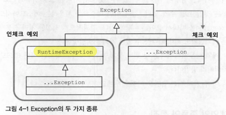
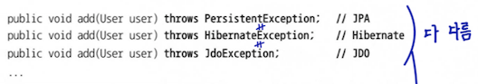
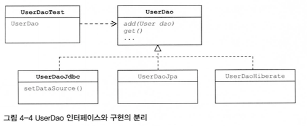
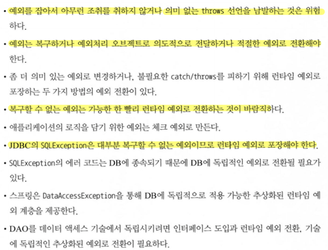

#### 2022.10.04 '토비의 스프링을 읽어봐요' 스터디 자료 by 정의재

# Chapter 4 - 예외

### 목차

[4.1 사라진 SQLException](#)

[4.2 예외 전환](#)

[4.3 정리](#)

<br>

## 4.1 사라진 SQLException
3장에서 최종적으로 JdbcTemplate을 적용하자 모든 메소드에서 ```throws SQLException```이
사라진 것을 확인할 수 있다.
```java
// JdbcTemplate 적용 전
public void deleteAll() throws SQLException { ... }

// JdbcTemplate 적용 후
public void deleteAll() { ... }
```

어떤 과정을 통해 이렇게 되었는지 알아보자.

### 안좋은 예외
예외 처리를 처음해본는 경우 다음같은 일이 빈번하게 일어난다.


    
```java
// (1) 아무것도 안 하기
} catch (SQLException e) {}

// (2) 그냥 sysout 찍기
} catch (SQLException e) {
    System.out.println(e);
}

// (3) 에러 내용 e.print하기
} catch(SQLException e) {
    e.printStakTrace();
}
```
우리는 다음 내용들을 배우면서 개발자로써 해줘야할 예외 처리들에 대해 배우게 될 것이다.

### 체크 예외 & 언체크 예외

- 체크 예외(Checked Exception)
  
    1. ```Exception``` 클래스의 서브 클래스
    2. ```RuntimeException```을 상속하지 않은 것들
    3. 체크 예외가 발생할 수 있는 경우 반드시 예외를 처리하는 코드를 함께 작성해야 함
    4. 제대로 처리하지 않으면 컴파일 에러가 발생함
    

- 언체크 예외(Unchecked Exception)
    1. ```RuntimeException```을 상속한 것들
    2. ```NullPonterException```, ```IllegalArgumentException``` 등이 있음
    

### 예외 처리 방법

1. 예외 복구
   
    예외 상황을 파악하고 문제를 해결해서 정상 상태로 돌려놓는 방법
   

2. 예외 처리 회피
   
    예외 처리를 자신이 담당하지 않고 자신을 호출한 쪽으로 던져버리는 방법
   

3. 예외 전환

    발생한 예외를 그대로 넘기는게 아니라 적절한 예외로 전환해서 던지는 방법
    - 로그인 아이디 중복의 경우 ```SQLException``` → ```DuplicateUserIdException``` 으로 변환해서 던짐 
    1. 중첩 예외
       
        ```java
       // SQLException 안에서 중첩해서 DuplicateUserIdException을 throw
        catch(SQLException e) {
            ...
            throw DuplicateUserIdException(e);
       }
        ```
    2. 포장
        ```java
       // 예외 상황에 따라 다르게 포장
       try {
            OrderHome orderHome = EJBHomeFactory.getInstance().getOrderHome();
            Order order = orderHome.findByPrimaryKey(Integer id);
       
       // 모두 EJBException을 throw하긴 하지만 안에 포장하는 예외가 다름
       } catch(NamingException NE) {
            throw new EJBException(NE);
       
       } catch(SQLException SE) {
            throw new EJBException(SE);
       
       } catch(RemoteException RE) {
            throw new EJBException(RE);
       }
       ```
       
    
### 그래서 예외 처리 뭐?
    자바 엔터프라이즈 환경은 수많은 사용자가 동시에 요청을 보내고 각 요청이 독립적인 작업으로 취급된다. 
    즉, 예외가 발생했을 때 작업을 일시 중지한다던지, 사용자와 바로 커뮤니케이션하는 등은 불가능하다.
    따라서 애초에 애플리케이션 차원에서 예외 상황을 미리 파악하고, 예외가 발생하지 않도록 미리미리 차단해주는 게 좋다.

### 애플리케이션 예외
애플리케이션 자체의 로직에 의해 의도적으로 발생시키고, 반드시 catch해서 무엇인가 조치를 취하도록 요구하는 예와

 - 애플리케이션 예외 처리 방법
    1. 예외 케이스에 따라 다른 종류의 리턴값을 리턴하고 해당 리턴값에 따라 처리하는 방법
    2. 정상적인 흐름을 따르는 코드는 그대로 두고, 예외 상황에서만 비즈니스적 의미를 띈 예외를 던지도록 하는 방법
    

### 그래서 SQLException은 어떻게 된건데?
기본적으로 SQLException은 코드 레벨에서는 99% 복구 불가능한 예외이다.

따라서 개발자가 미연에 방지하는게 최선이다.

Spring의 JdbcTemplate은 이러한 전략을 그대로 가져간다. JdbcTemplate의 템플릿과 콜백 안에서 발생하는 모든
```SQLException```을 ```RuntimeException```의 일종인 ```DataAccessException```으로 포장해서 던져준다.

이로 인해 모든 SQLException이 사라졌던 것이다.

    그 밖에도 스프링의 API 메소드에 정의되어 있는 대부분의 예외는 RuntimeException이다.
    따라서 발생 가능한 예외가 있다고 하더라도 이를 처리하도록 강제하지 않는다.

<br>

## 4.2 예외 전환
### JDBC의 한계
자바 개발자들이 JDBC의 표준 인터페이스(Connection, Statement, ...)에 익숙해지면 DB 종류에 관계 없이 일관된 방법으로 프로그램을 개발할 수 있다.
하지만 DB를 자유롭게 변경해서 사용할 수 있는 유연한 코드를 보장해주지는 못한다.

또, DB마다 SQL만 다른 것이 아니라 에러의 종류와 원인도 제각각이다.

### 한계 극복(~~지금은 안 쓰는 방법 같음~~)
DB 별로 미리 특정 예외 상황에 대한 Exception을 매핑 파일로 저장해두면 DB가 달라져도 동일한 예외를 받을 수 있다.


### DAO 인터페이스와 구현의 분리
DB에 따라 같은 상황에 던지는 예외가 다르기 때문에 UserDAO를 인터페이스로 만들고 각 DB에 따라 구현을 해보도록 하자.



```java
class Class {
    
    public interface UserDAO {
        void add(User user);
        User get(String id);
        List<User> getAll();
        void deleteAll();
        int getCount();
    }
    
    public class UserDaoJdbc implements UserDAO { ... }
    
    public class UserDaoJpa implements  UserDAO { ... }
    
}
```

이후 테스트에서 변수 선언 부분을 UserDAO에서 UserDaoJdbc로 바꿀 필요가 없다.

UserDaoJdbc 오브젝트 자체가 UserDAO 타입이기 때문이다.




### DataAccessException 활용 시 주의할 것 (~~2022년 지금도 이럴까...?~~)
```DuplicatedKeyException```같은 것들은 아직 JDBC에서만 발생한다고 한다.
JPA나 하이버네이트에서는 이런 예외들이 세분화되지 않았기 때문이다.

따라서 ```DuplicatedKeyException```을 잡아서 처리하는 코드를 만드려고 한다면 미리미리 세부 예외가
뭘로 던져지는지 확인하는 작업이 필요할 것이다.

<br>

## 4.3 정리

