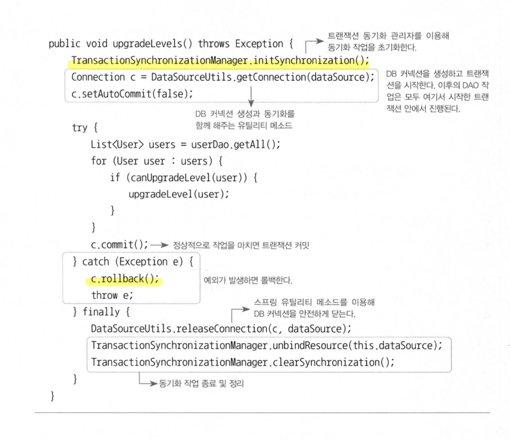

#### 2022.11.01 '토비의 스프링을 읽어봐요' 스터디 자료 by 정의재

# Chapter 5 - 서비스 추상화

### 목차

[5.1 사용자 레벨 관리 기능 추가](#)

[5.2 트랜잭션 서비스 추상화](#)

[5.3 서비스 추상화와 단일 책임 원칙](#)

[5.4 메일 서비스 추상화](#)

[5.5 정리](#)

<br>

## 5.1 사용자 레벨 관리 기능 추가
### Enum(이넘, 이늄)
BASIC, GOLD, SILVER 등을 문자열로 관리하는 것이 아닌 이넘을 활용하기로 했다.

만약 각 문자열에 해당하는 int 값을 사용한다면 잘못된 값을 넣을 위험이 있기때문이다.

```java
public enum Level {
    BASIC(1), SILVER(2), GOLD(3);

    private final int value;

    Level(int value) {
        this.value = value;
    }

    public int getValue() {
        return value;
    }

    public static Level valueOf(int value) {
        return switch (value) {
            case 1 -> BASIC;
            case 2 -> SILVER;
            case 3 -> GOLD;
            default -> throw new AssertionError("Unknown value: " + value);
        };
    }
}
```

이를 User에 필드로 선언하게 되면 보다 원활하게 관리가 가능해진다.

### Update 테스트
업데이트 테스트시 WHERE 절을 빼먹는 실수를 할 수 있다. 이렇게 될 경우
테스트는 문제 없이 통과하기때문에 실제 운영에서 큰 문제를 야기할 수 있다.
이를 막기 위해 2가지 방법을 제시한다.
1) JdbcTemplate의 update()가 돌려주는 리턴값을 확인해라.
2) 테스트를 보강해서 원하는 사용자 외의 정보는 변경되지 않았음을 직접 확인해라.

테스트 코드에 수정할 사용자와 수정하지 않을 사용자를 모두 넣은 뒤 UPDATE문을 진행하고 그 결과를 사펴보면 될 것이다.

### Service 추가
사용자 관리 로직을 따로 관리하기 위해 UserService라는 클래스를 만들기로 한다.


이렇게 의존관계가 변하게 된다.

이후 level이 변경되는 경우에만 ```userDAO.update(user);```를 호출하는 로직을 추가한다. 이를 테스트할 때는 가능한
모든 케이스를 커버하면서 테스트하는 것이 좋다.
또한 테스트 코드 내에서도 중복되는 부분이 많다면 따로 메소드로 빼는 것이 좋다.
```java
public class TestClass {
    @Test
    public void Test() {
        userDAO.deleteAll();
        for(User user: users) userDAO.add(user);

        userService.upgradeLevels();

        checkLevel(users.get(0), Level.BASIC);
        checkLevel(users.get(1), Level.SILVER);
        checkLevel(users.get(2), Level.SILVER);
        checkLevel(users.get(3), Level.GOLD);
        checkLevel(users.get(4), Level.GOLD);
    }

    private void checkLevel(User user, Level expectedLevel) {
        User userUpdate = userDAO.get(user.getId());
        assertThat(userUpdate.getLevel(), is(expectedLevel));
    }
}
```
### upgradeLevels() 로직 개선

위와 같이 성격이 다른 각각의 로직이 한 곳에 뭉쳐있음을 알 수 있다. 이를 리팩토링해주자.

1. 추상적인 레벨로 로직을 작성해보기
```java
public class Class {
    
    public void upgradeLevels() {
        List<User> users = userDAO.getAll();
        for (User user : users) {
            if (canUpgradeLevel(user)) {
                upgradeLevel(user);
            }
        }
    }
    
}
```

2. 구현 가능한 메소드부터 차례차례 구현하기
3. upgradeLevel의 경우 User가 책임을 지는 것이 맞으므로 User에게 책임 전가하기

위 과정의 장점은 다음과 같다.
1. 각자 자기 책임에 충실한 작업만 하고 있으니 코드를 이해하기도 쉽다.
2. 변경이 필요할 때 어디를 수정해야 할지도 쉽게 알 수 있다.
3. 잘못된 요청이나 작업을 시도했을 때 이를 확인하고 예외를 던져줄 준비도 다 되어있다.
4. 각각을 독립적으로 테스트하도록 만들면 테스트 코드도 단순해진다.

<br>


위 그림처럼 객체지향적인 구조까지 잡은 것을 알 수 있다.

## 5.2 트랜잭션 서비스 추상화
### 문제 상황
    정기 사용자 레벨 관리 작업을 수행하는 도중에 네트워크가 끊기거나 서버에 장애가 생겨서 작업을 완료할 수 없다면 
    롤백해야하는가 그대로 둬야하는가? 이 경우 모두 롤백하기로 결정했다. 어떻게 구현할 것인가?
테스트 시에는 이런 에러를 인위적으로 던져보면서 테스트하는 것이 좋다.

UserService를 상속받은 TestUserService를 만들어서 지정된 ID의 User 오브젝트가 발견되면 예외를
던져 작업을 강제로 중단시킨다.
```java
public class Test{
    
    @Test
    public void upgradeAllOrNothing() {
        UserService testUserService = new TestUserService(users.get(3), getId());
        testUserService.setUserDAO(this.userDAO);
        userDAO.deleteAll();
        for (User user : users) userDAO.add(user);

        try {
            testUserService.upgradeLevel();
            fail("TestUserServiceException expected");
        } catch (TestUserServiceException e) {
        }

        checkLevelUpgraded(users.get(1), false); // 중간에 끊겼으므로 업그레이드가 취소되기를 기대
    }
}
```
fail이 실행되었다는 예외는 원하는 예외가 터지지 않았다는 뜻으로 테스트가 실패했다고 볼 수 있다.
이러한 장치에도 불구하고 테스트는 진짜 실패하고 만다.

<br>

그 이유는 바로 트랜잭션 문제때문이다. Connection에서는 이를 직접 핸들링할 수 있다.
```java
public class Class {
    public void transcationTest() {
        Connection c = dataSource.getConnection();
        c.setAutoCommit(false); // 트랜잭션 시작
        try {
            ...
            c.commit();         // 트랜잭션 커밋
        } catch (Exception e) {
            c.rollback();       // 트랜잭션 롤백
        }
        c.close();
    }
    
}
```
위에서처럼 핸들링 가능하다.

### JdbcTemplate에서의 트랜잭션
JdbcTemplate은 각 메소드 별로 트랜잭션이 나누니다. 따라서 위 문제를 해결하기 어려워보인다.
또한 이 문제를 해결하고자 여러 JdbcTemplate관련 로직을 한 곳에 모으는 것 또한 바보같은 짓이다.

따라서 UserDAO가 가진 SQL이나 JDBC API를 이용한 데이터 엑세스 코드는 최대한 그대로 남겨둔 채로, UserService에는 트랜잭션 시작과 종료를 담당하는 최소한의
코드만 가져오게 만들면 어느정도 해결 가능하다.


또 Connection을 공유해야하기 때문에 여러 메소드에서 Connection을 파라미터로 넘겨줘야 하는데 이 방법 밖에 없지만
결코 좋은 방법이 아니다.

정리하면,
1. JdbcTemplate을 더 이상 활용할 수 없다.
2. connection 파라미터가 추가돼야 한다.
3. UserDAO는 더 이상 데이터 엑세스 기술에 독립적일 수가 없다.

### 트랜잭션 동기화
이를 해결하기 위해 스프링이 있다. 바로 트랜잭션 동기화 방식이다.

DataSource에서 직접 Connection을 가져오지 않고, 스프링이 제공하는 유틸리티 메소드를 쓰는 이유는
이 DataSourceUtils의 getConnection() 메소드는 Connection 오브젝트를 생성해줄 뿐만 아니라 트랜잭션 동기화에
사용하도록 저장소에 바인딩해주기 때문이다.

JdbcTemplate의 경우도 직접 DB 커넥션을 만드는 것이 아니라 트랜잭션 동기화 저장소에 들어 있는 DB 커넥션을 가져와 사용한다.

### 하나의 트랜잭션 안에서 여러 개의 DB에 데이터를 넣는 작업을 해야한다면?
이를 위해 스프링은 트랜잭션 추상화 계층구조를 제공한다.

## 5.3 서비스 추상화와 단일 책임 원칙
UserDAO는 데이터 엑세스 로직(DB 연결을 생성하는 방법에 대해서는 독립적)을 담고 있고, UserService는 비즈니스 로직을 담고 있다.

### 단일 책임 원칙
우리가 지금까지 리팩토링해온 코드를 통해 단일 책임 원칙을 엿볼 수 있다.

    단일 책임 원칙을 잘 지키는 코드를 만들려면인터페이스를 도입하고 이를 DI로 연결해야 하며, 그 결과로 단일 책임
    원칙 뿐 아니라 OCP도 잘 지키고, 모듈 간에 결합도가 낮아서 서로의 견경이 영향을 주지 않고, 같은 이유로 변경이 단일 책임에
    집중되는 응집도 높은 코드가 나오게 된다. 객체지향 설계 원칙을 잘 지킨 코드는 테스트하기도 편하다.

## 5.4 메일 서비스 추상화
JavaMail을 통해 메일 서비스를 만드는데 이에 대해 테스트할 때 곤란함이 발생한다.

JavaMail은 이미 검증된 안정적인 모듈인 만큼 테스트 시 원하는 결과를 리터한다는 전제를 깔고 테스트를
진행할 수 있다.

### 테스트용 메일 발송 오브젝트
DummyMailService를 만들고 MailSender를 상속받은 뒤 구현체를 아무것도 만들지 않으면 된다.

### 트랜잭션까지 적용
메일을 발송 취소해야되는데 이미 일부 발송되는 사고를 막으려면 어떻게 해야할까?
1. 메일을 업그레이드할 사용자를 발견했을 때마다 발송하지 않고 발송 대상을 별도의 목록에 저장하고 한 번에 발송
2. MailSender를 확장해서 메일 전송에 트래잭션 개념을 적용

### {테스트 스텁, 목 오브젝트} ⊂ 테스트 대역 ({Test Stub, Mock Obejct} ⊂ Test Double)
테스트만을 위해 기능에만 충실한 오브젝트들을 테스트 대역이라고 통칭하고 그 중 하나가 스텁이다.
미리 테스트 중에 필요한 정보를 리턴해주도록 만들 수 있다.

Stub은 단순히 테스트를 성공하도록 도와준다면 Mock은 여기에 더해 Mock과 테스트 오브젝트 사이에 일어나는 커뮤니케이션을
저장했다가 테스트 결과를 검증하는 데에 활용할 수 있게 해준다.

단순히 UserService의 기능에 초점을 두고 테스트하는 것이라면 이렇게 목 오브젝트를 사용해 검증하는 것으로 충분하다.

## 5.5 정리
