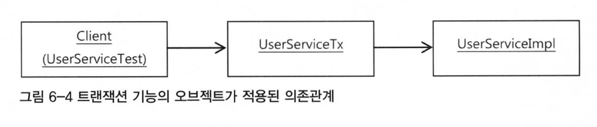
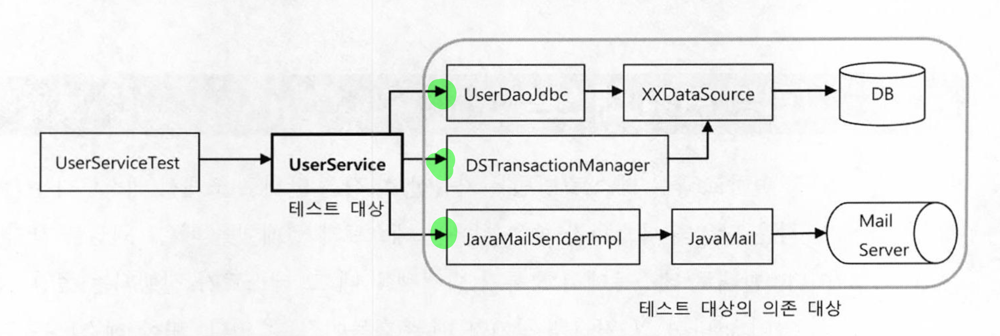
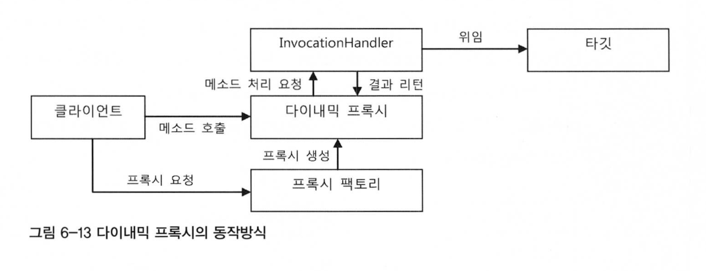
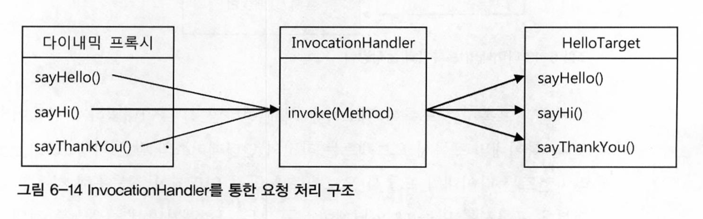
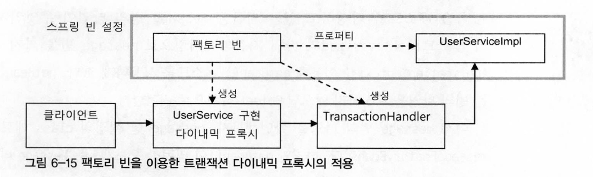
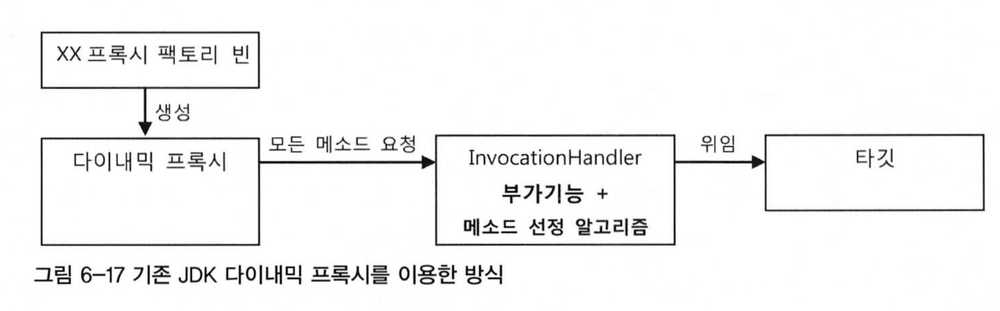
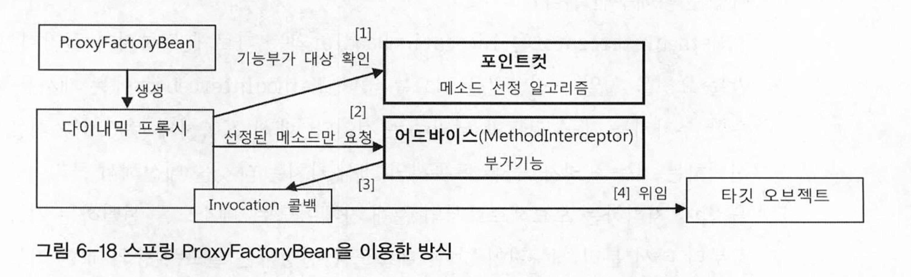
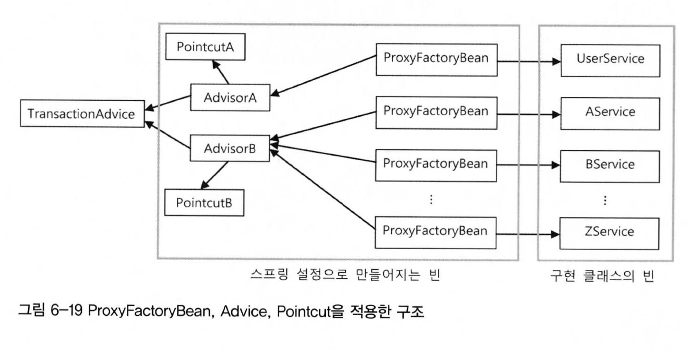

#### 2022.11.08 '토비의 스프링을 읽어봐요' 스터디 자료 by 정의재

# Chapter 6 - AOP

### 목차

[6.1 트랜잭션 코드의 분리](#)

[6.2 고립된 단위 테스트](#)

[6.3 다이내믹 프록시와 팩토리 빈](#)

[6.4 스프링의 프록시 팩토리 빈](#)


<br>

## 6.1 트랜잭션 코드의 분리
### 메소드 분리
```UserService``` 코드는 트랜잭션 경계설정 코드가 존재하기 때문에 온전히 비즈니스 로직에 집중할 수 없는 상태이다.

코드를 찬찬히 살펴보면 트랜잭션 경계설정 로직과 비즈니스 로직이 뚜렷하게 구분됨을 알 수 있다.

```java
public class UserService {
    
    public void upgradeLevels() throws Exception {
        // =====트랜잭션 로직=========================================================================
        TransactionStatus status = this.transactionManager
                                            .getTransaction(new DefaultTransactionDefinition());
        try {
        // ========================================================================================
            
        // =====비즈니스 로직=========================================================================
            List<User> users = userDAO.getAll();
            for (User user : users) {
                if (canUpgradeLevel(user)) {
                    upgradeLevels(users);
                }
            }
        // ========================================================================================
            
        // =====트랜잭션 로직=========================================================================
            this.transactionManager.commit(status);
        } catch (Exception e) {
            this.transactionManager.rollback(status);
            throw e;
        }
        // ========================================================================================
    }
    
}
```
두 코드가 완벽하게 독립적인 코드이므로 비즈니스 로직 코드를 추출해 독립시킨다.

```java
public class UserService {

    public void upgradeLevels() throws Exception {
        // =====트랜잭션 로직=========================================================================
        TransactionStatus status = this.transactionManager
                .getTransaction(new DefaultTransactionDefinition());
        try {
        // ========================================================================================

        // =====비즈니스 로직=========================================================================
            upgradeLevelsInternal();
        // ========================================================================================

        // =====트랜잭션 로직=========================================================================
            this.transactionManager.commit(status);
        } catch (Exception e) {
            this.transactionManager.rollback(status);
            throw e;
        }
        // ========================================================================================
    }

    private void upgradeLevelsInternal() {
        List<User> users = userDAO.getAll();
        for (User user : users) {
            if (canUpgradeLevel(user)) {
                upgradeLevels(users);
            }
        }
    }

}
```
코드 자체는 깔끔해졌지만 여전히 트랜잭션 로직을 UserService로 부터 분리하지 못했다.

<br>

### DI를 활용한 클래스 분리
실제 사용할 오브젝트의 클래스 정체는 감춘 채 인터페이스를 통해 간접으로 접근하게 하는 DI의 기본 아이디어를 활용해보자.

```UserService```를 인터페이스로 빼고 ```UserServiceImpl```(비즈니스 로직)과 
```UserServiceTx```(트랜잭션 로직)를 구현체로 만드는 방식을 취한다.

```java
public interface UserService {
    void add(User user);

    void upgradeLevels();

}

public class UserServiceImpl implements UserService {
    UseDAO userDAO;
    MailSender mailSender;

    @Override
    public void upgradeLevels() {
        List<User> users = userDAO.getAll();
        for (User user : users) {
            if (canUpgradeLevel(user)) {
                upgradeLevels(users);
            }
        }
    }
    // ...
}

public class UserServiceTx implements UserService {
    // DI 받음
    UserService userService;
    PlatformTransactionManager transactionManager;

    public void setTransactionManager(PlatformTransactionManager transactionManager) {
        this.transactionManager = transactionManager;
    }

    public void setUserService(UserService userService) {
        this.userService = userService;
    }

    @Override
    public void add(User user) {
        userService.add(user);
    }

    @Override
    public void upgradeLevels() {
        TransactionStatus status = this.transactionManager
                                            .getTransactionManager(new DefaultTransactionDefinition());
        try {
            userService.upgradeLevels();

            this.transactionManager.commit(status);
        } catch (RuntimeException e) {
            this.transactionManager.rollback(status);
            throw e;
        }
    }
}
```
위 로직을 토대로 의존관계를 그려보면 아래와 같다.



그래서 이게 뭐가 좋은걸까?

### 트랜잭션 코드 분리의 장점
1. 비즈니스 로직을 담당하고 있는 ```UserServiceImpl```의 코드를 작성할 때는 트랜잭션과 같은 기술적인 내용에는 전혀 신경 쓰지 않아도 된다.
   

2. 비즈니스 로직에 대한 테스트를 손쉽게 만들어낼 수 있다.

<br>

## 6.2 고립된 단위 테스트

갑자기 딴 길로 샜다. 트랜잭션 코드 분리의 장점 2번 때문이다.

이제부터 단위 테스트의 위력을 체험할 시간이다.

### 복잡한 의존관계 속의 테스트

아래 그림의 ```UserService```처럼 많은 테스트 대상들을 동작시키기 위해서는 여러가지의 의존 오브젝트가 필요하다.



```UserService```를 테스트하기로 했다면 테스트의 단위는 UserService 클래스가 되어야 
하지만 ```UserDAO```, ```TransactionManager```, ```MailSender```
라는 세가 의존 관계를 갖는다. 무작정 테스트 로직을 짜면 테스트가 진행되는 동안 3가지가 같이 실행될 것이다.

### 테스트를 위한 UserServiceImpl 고립
```UserService```의 구현체인 ```UserServiceImpl```에서 ```UserDAO```,
```TransactionManager```, ```MailSender```를 모두
목 오브젝트로 만든다면 ```UserServiceImpl```를 완벽하게 고립된 테스트 대상으로 만들 수 있다.

예를 들어 ```UserDAO```를 목 오브젝트로 만들게 되면 실제 ```update()```가 호출되었을 때 로직이 
실행되는 것이 아니라 ```update()```가 호출된다는 것만 확인하도록 만들면 될 것이다.

우선 기존 ```upgradeLevels()``` 테스트 코드를 살펴보자.

```java
public class UserServiceTest {
    
    @Test
    public void upgradeLevel() throws Exception {
        userDAO.deleteAll();
        for (User user : users) userDAO.add(user);

        MockMailSender mockMailSender = new MockMailSender();
        userServiceImpl.setMailSender(mockMailSender);
        
        userService.upgradeLevels();

        checkLevelUpgraded(users.get(0), false);
        // ...
        checkLevelUpgraded(users.get(4), false);
        
        List<String> request = mockMailSender.getRequests();
        assertThat(request.size(), is(2));
        assertThat(request.get(0), is(users.get(1).getEmail()));
        assertThat(request.get(1), is(users.get(3).getEmail()));
    }

    private void checkLevelUpgraded(User user, boolean upgraded) {
        User userUpdate = userDAO.get(user.getId());
        // ...
    }
    
}
```

일단 MailSender는 이미 Mock 오브젝트로 구성되어 있다. 이제 UserDAO또한 Mock 오브젝트로 만들어보자.

```java
public class MockUserDAO implements UserDAO {
    
    private List<User> users;                       // 레벨 업그레이드 후보 User 오브젝트 목록
    private List<User> updated = new ArrayList<>(); // 업그레이드 대상 오브젝트를 저장해둘 리스트

    private MockUserDAO(List<User> users) {
        this.users = users;
    }
    
    @Override
    public List<User> getUpdated() {
        return this.updated;
    }

    @Override
    public List<User> getAll() {
        return this.users; // 스텁 기능 제공
    }

    @Override
    public void update(User user) {
        updated.add(user); // Mock 오브젝트 기능 제공
    }

    // 테스트에 사용되지 않는 메소드
    @Override public void add(User user) { throw new UnsupportedOperationException(); }
    @Override public void deleteAll()    { throw new UnsupportedOperationException(); }
    @Override public void get(String id) { throw new UnsupportedOperationException(); }
    @Override public void getCount()     { throw new UnsupportedOperationException(); }
}
```

- ```users``` - 생성자를 통해 전달받은 사용자 목록을 저장해둠. ```getAll()```을 호출하면 DB에서 가져온 것처럼 user리스트를 리턴해줌
  
- ```updated``` - ```update()``` 메소드가 호출되면 업그레이드 대상 ```User``` 오브젝트를 저장해뒀다가 돌려준다.
- 테스트에 사용하지 않을 메소드는 ```UnsupportedOperationException```을 던지게 한다.

이제 이 ```MockUserDAO```를 Test에 적용시켜보자.

```java
public class UserServiceTest {
    
    @Test
    public void upgradeLevel() throws Exception {
        // 테스트만을 위해 독립적으로 동작하는 테스트 대상을 사용할 것이기 때문에 @Autowired로 가져올 필요가 없다
        UserserviceImpl userService = new UserServiceImpl();

        MockUserDAO mockUserDAO = new MockUserDAO(this.users); // MockUserDAO를 직접 DI 해준다
        userServiceImpl.setUserDAO(mockUserDAO);

        MockMailSender mockMailSender = new MockMailSender();
        userService.setMailSender(mockMailSender);
        
        userService.upgradeLevels();

        List<User> updated = mockUserDAO.getUpdated();
        assertThat(updated.size(), is(2));
        checkUserAndLevel(updated.get(0), "joytouch", Level.SILVER);
        checkUserAndLevel(updated.get(1), "madnite1", Level.GOLD);
        
        List<String> request = mockMailSender.getRequests();
        assertThat(request.size(), is(2));
        assertThat(request.get(0), is(users.get(1).getEmail()));
        assertThat(request.get(1), is(users.get(3).getEmail()));
    }

    private void checkUserAndLevel(User updated, String expectedId, Level expectedLevel) {
        assertThat(updated.getId(), is(expectedId));
        assertThat(updated.getLevel(), is(expectedLevel));
    }
    
}
```
이제 성공적으로 upgradeLevel에 대한 단위 테스트를 만들 수 있게 되었다.


        <이 책에서의 단위 테스트와 통합 테스트>
        * 단위 테스트: upgradeLevels() 테스트처럼 외부 리소스를 사용하지 않고 고립시켜 테스트하는 것
        * 통합 테스트: 외부의 DB, 파일, 서비스 등의 리소스가 참여하는 테스트

### 단위 테스트와 통합 테스트 가이드라인
1. 항상 단위 테스트 먼저 고려
2. 외부 리소스를 사용해야만 하는 테스트는 통합 테스트
3. 스프링 프레임워크를 이용하는 것 자체가 통합 테스트

개발 초기부터 단위 테스트를 잘 해둠으로써 나중에 UI까지 연동한 후 테스트하려고 했을 때 쏟아질 예외들을 잘 핸들링할 수 있을 것이다.

### 목 프레임워크(Mockito 등)
PASS


## 6.3 다이내믹 프록시와 팩토리 빈
다시 트랜잭션 로직과 비즈니스 로직으로 돌아오자.

### 프록시
현재 완전히 분리된 두 로직의 경우 클라이언트가 핵심 로직(비즈니스 로직) 클래스를 바로 사용하면 부가기능(트랜잭션 로직)을 사용할 수 없다는
것이 문제이다.

따라서 부가기능을 핵심 기능을 가진 클래스처럼 꾸며서 클라이언트가 부가기능을 거쳐 핵심기능을 사용하도록 만들어야 한다.
이렇게 마치 자신이 원래 클라이언트가 사용하려고 했던 대상인 것처럼 위장해 요청을 대리로 받아주는 역할을 하는 것을 ```프록시```라고 한다.

이 때 실제 핵심기능을 가지는 오브젝트를 타깃 오브젝트라고 부른다. 


### 데코레이터 패턴 & 프록시 패턴
- 데코레이터 패턴
    - 부가 기능을 런타임 시 동적으로 부여해주기 위해 프록시를 사용하는 패턴
    

    ex) InputStream is = new BufferedInputStream(new FileInputStream("a.txt"));
                                ↑ 데코레이터                 ↑ 타깃

- 프록시 패턴
    - 데코레이터 패턴과는 다르게 타깃의 기능을 추가하거나 확장하지 않고 클라이언트가 타깃에 접근하는 방식을 변경해주는 패턴
    - 타깃 오브젝트를 당장 사용하지는 않지만 레퍼런스가 필요한 경우에 사용(ex. JPA 프록시 객체)
    - 타깃 오브젝트에 대한 접근 권한을 제어하기 위해서도 만들 수 있음(ex. 읽기 전용 오브젝트)

    
- 두 패턴의 특징
    - 프록시 패턴의 경우 코드에서 자신이 만들거나 접근할 타깃 클래스 정보를 알고 있는 경우가 많다
    - 두 패턴을 혼용해서 사용할 수 있다
    

### 다이나믹 프록시
- 프록시의 기능
    1. 타깃과 같은 메소드를 구현하고 있다가 메소드가 호출되면 타깃 오브젝트에게 위임
    2. 지정된 요청에 대해서는 부가 기능 수행


- 프록시를 적용한 UserServiceTx이다.
    ```java
    public class UserServiceTx implements UserService {
        UserService userService;
        
        //...
        
        public void add(User user) { // 메소드 구현
            this.userService.add(user); // 위임
        }
        
        public void upgradeLevels() {
            // 부가 기능 수행
            TransactionStatus status = this.transactionManager
                    .getTransaction(new DefaultTransactionDefinition());
            try {
                userService.upgradeLevels(); // 위임
                
                // 부가 기능 수행
                this.transactionManager.commit(status);
            } catch (RuntimeException e) {
                this.transactionManager.rollback();
                throw e;
            }
        }
        
    }
    ```

- 프록시의 문제점
    1. 타깃의 인터페이스를 구현하고 위임하는 코드를 작성하기가 번거롭다
    2. 부가기능 코드가 중복될 가능성이 많다
    

### 리플렉션
이제 자바의 리플렉션 기능까지 등장한다. 이 리플렉션을 이용하면 다이나믹 프록시를 만들 수 있다. 그 전에 리플렉션에 대해 좀 더 알아보자.

- 리플렉션
    - 자바의 코드 자체를 추상화해서 접근하도록 만든 것
    - 아래 예시 코드는 name.length()를 리플렉션 방식으로 호출하는 코드다.

        ```java

        String name = "Spring";

        Method lengthMethod = String.class.getMethod("length");

        int length = lengthMethod.invoke(name); // int length = name.length();

        ```
      
### 프록시 클래스
다이나믹 프록시를 이용한 프록시를 만들어보자. 조건은 다음과 같다.
1. Hello라는 인터페이스를 만든다.
2. HelloTarget이라는 Hello를 구현한 타깃 클래스를 만든다.
3. HelloTarget의 부가기능으로 HelloUppercase라는 프록시를 만들어 리턴하는 문자를 모두 대문자로 만드는 기능을 추가한다.

이를 모두 종합하면 아래와 같이 만들 수 있다.

```java
// Hello 인터페이스
public interface Hello {

    String sayHello(String name);

    String sayHi(String name);

    String sayThankYou(String name);

}

// HelloTarget 타깃 클래스
public class HelloTarget implements Hello {

    @Override
    public String sayHello(String name) {
        return "Hello " + name;
    }

    @Override
    public String sayHi(String name) {
        return "Hi " + name;
    }

    @Override
    public String sayThankYou(String name) {
        return "Thank You " + name;
    }

}

// HelloUppercase 프록시 클래스
public class HelloUppercase implements Hello {
    
    Hello hello;

    public HelloUppercase(Hello hello) {
        this.hello = hello;
    }
    
    @Override
    public String sayHello(String name) {
        return hello.sayHello(name).toUpperCase();
    }

    @Override
    public String sayHi(String name) {
        return hello.sayHi(name).toUpperCase();
    }

    @Override
    public String sayThankYou(String name) {
        return hello.sayThankYou(name).toUpperCase();
    }

}

// 프록시 테스트 코드
public class ProxyTest {
    
    @Test
    public void proxyTest() {
        Hello proxiedHello = new HelloUppercase(new HelloTarget());
        assertThat(proxiedHello.sayHello("Toby"), is("HELLO TOBY"));
        assertThat(proxiedHello.sayHi("Toby"), is("HI TOBY"));
        assertThat(proxiedHello.sayThankYou("Toby"), is("THANK YOU TOBY"));
    }
    
}
```

### 다이나믹 프록시 적용
이제 드디어 다이나믹 프록시를 적용할 차례가 왔다. 그 전에 다이나믹 프록시가 동작하는 방식을 살펴보자.


프록시 팩토리를 통해 동적으로 프록시를 생성하고, 해당 프록시는 타깃 오브젝트와 같은 클래스로써 InvocationHandler를 거쳐 위임과
부가 기능이 실행되기 때문에 위에서처럼 일일이 인터페이스를 모두 구현해가면서 프록시 클래스를 정의할 필요가 없어졌다.



또한 InvocationHandler에서 invoke 함수는 파라미터로 Method 타입을 받는다. 즉, 클라이언트의 요청을 리플렉션을 통해 invoke()
메소드로 넘기기 때문에 모든 요청이 하나의 메소드로 집중되어 중복되는 기능을 효과적으로 제공할 수 있다.

이제 HelloUppercase 클래스를 InvocationHandler를 통해 처리하도록 바꿔보자.
```java
public class UppercaseHandler implements InvocationHandler {
    
    Hello target;

    public UppercaseHandler(Hello target) {
        this.target = target;
    }

    public Object invoke(Object proxy, Method method, Object[] args) {
        String ret = (String) method.invoke(target, args);  // 타깃으로 위임
        return ret.toUpperCase();   // 부가기능 제공
    }
    
}

public class ProxyTest {
    
    public void createProxy() {
      Hello proxiedHello = (Hello) Proxy.newProxyInstance(
              getClass().getClassLoader(),  // 다이나믹 프록시 클래스의 동적 로딩을 위한 클래스 로더
              new Class[]{Hello.class},     // 구현할 인터페이스
              new UppercaseHandler(new HelloTarget())   // 부가 기능과 위임 코드를 담은 InvocationHandler
      );
    }
    
}
```
무언가 복잡해진 것 같은데 이렇게 다이나믹 프록시를 적용했을 때 장점이 있긴 한걸까?

→ UppercaseHandler와 다이나믹 프록시를 사용하면 인터페이스가 바뀌어도 매번 프록시를 생성할 필요가 없다. 즉, 재사용성이 극대화된다.

단, 리플렉션을 사용하기 때문에 주의깊게 사용해야 한다. 만약 스트링 외의 리턴타입을 가진다면 내부 로직을 통해 리턴 타입을 확인해 핸들링 해주는
방식으로 처리하자.

### 트랜잭션 부가기능에 다이나믹 프록시 적용
돌고 돌아 우리 원래 문제였던 트랜잭션 로직에 다이나믹 프록시를 적용할 때가 왔다.

다시 현재 문제 상황을 정리하면 다음과 같다.
"현재 UserServiceTx는 서비스 인터페이스의 메소드를 모두 구현해야하고 트랜잭션이 필요한 메소드마다 트랜잭션 처리 코드가 중복되어 나타난다."

이 문제를 다이나믹 트랜잭션을 활용하면 다음과 같이 변한다.

```java
public class TransactionHandler implements InvocationHandler {
  private Object target;
  private PlatformTransactionManager transactionManager;
  private String pattern;

  @Setter setTarget() { ... }
  @Setter setTransactionManager() { ... }
  @Setter setPattern() { ... }
  
  public Object invoke(Object proxy, Method method, Object[] args) throws Throwable {
      // 트랜잭션 적용 대상 메소드를 선별해서 적용
      if (method.getName().startsWith(pattern)) {
          return invokeInTransaction(method, args);
      } else {
          return method.invoke(target, args);
      }
  }

  private Object invokeInTransaction(Method method, Object[] args) throws Throwable {
      TransactionStatus status = 
              this.transactionManager.getTransaction(new DefaultTransactionDefinition());
      try {
          Object ret = method.invoke(target, args);
          this.transactionManager.commit(status);
          return ret;
      } catch (InvocationTargetException e) {
          this.transactionManager.rollback(status);
          throw e.getTargetException();
      }
  }
}
```
- 타깃을 저장할 변수를 Object로 선언해 재사용성 및 확장성 확보
- 단, 롤백 시 InvocationTargetException으로 예외를 잡아줘야하고 그 안에서 다시 TargetException을 던지도록 함

```java
public class UserServiceTest {
  
    // ...
  
    @Test
    public void upgradeAllOrNothing() throws Exception {
        // UserServiceTx 오브젝트 대신 TransactionHandler를 선언
        TransactionHandler txHandler = new TransactionHandler();
        txHandler.setTarget(testUserService);
        txHandler.setTransactionManager(transactionManager);
        txHandler.setPattern("upgradeLevels");
        
        UserService txUserService = (UserService) Proxy.newProxyInstance(
                getClass().getClassLoader(), new Class[] { UserService.class }, txHandler
        );
        // ...
    }
    
    // ...
    
}
```

### 팩토리 빈
다이나믹 프록시는 newProxyInstance()라는 메소드를 통해서만 생성이 가능하므로 일반적이 방법으로 스프링 빈에 등록할 수 없다.
이를 위해 팩토리 빈을 사용하자.


팩토리 빈을 사용한 다이내믹 프록시의 적용 구조이다.

팩토리 빈은 다이나믹 프록시가 위임할 타깃 오브젝트 UserServiceInpl에 대한 레퍼런스를 프로퍼리를 통해 DI 받아둬야 한다.

```java
public interface FactoryBean<T> {
    T getObject() throws Exception;     // 빈 오브젝트를 생성해서 돌려줌
  
    Class<? extends T> getObjectType(); // 생성되는 오브젝트의 타입을 알려줌
  
    boolean isSingleton();              // getObject()가 돌려주는 오브젝트가 항상 같은 싱글톤 오브젝트인지 알려줌
}

public class TxProxyFactoryBean implements FactoryBean<Object> {
  Object target;
  PlatformTransactionManager transactionManager;
  String pattern;
  Class<?> serviceInterface;

  @Setter
  setTarget() { ...}

  @Setter
  setTransactionManager() { ...}

  @Setter
  setPattern() { ...}

  // Factory 인터페이스 구현 메소드


  @Override
  public Object getObject() throws Exception {
    TransactionHandler txHandler = new TransactionHandler();
    txHandler.setTarget(target);
    txHandler.setTransactionManager(transactionManager);
    txHandler.setPattern(pattern);
    return Proxy.newProxyInstance(
            getClass().getClassLoader(), new Class[] { serviceInterface }, txHandler
    );
  }

  @Override
  public Class<? extends T> getObjectType() {
    return serviceInterface;
  }

  @Override
  public boolean isSingleton() {
    return false;
  }
}
```
이렇게 사용했을 때의 장점과 단점(한계)를 알아보자.

장점
  1. TxProxyFactoryBean은 코드 수정 없이 다양한 클래스에 적용가능하다.
  2. 프록시 기법을 아주 빠르고 효과적으로 적용할 수 있다. 미리 프록시 팩토리 빈을 만들어두면 스프링 설정을 통해서 바로 적용이 가능하기 때문이다.
  3. 인터페이스를 구현하는 클래스를 일일이 만드는 번거로움을 제거할 수 있다.

단점
  1. 한 번에 여러 개의 클래스에 공통적인 부가기능을 제공하는 일이 불가능하다.
  2. 하나의 타깃에 여러 개의 부가기능을 적용하는 것이 어렵다.
  3. TransactionHandler 오브젝트가 프록시 팩토리 빈 개수만큼 만들어진다.


## 6.4 스프링의 프록시 팩토리 빈

이제 스프링이 제공해주는 ProxyFactoryBean을 통해 여태까지 사서 고생한 것들을 정리해보자.

### ProxyFactoryBean
스프링의 ProxyFactoryBean의 경우 프록시에서 사용할 부가기능을 MethodInterceptor 인터페이스를 구현해 만든다.
InvocationHandler와는 다르게 ProxyFactoryBean으로부터 타깃 오브젝트에 대한 정보또한 제공받는다.

→ 이를 통해 타깃 오브젝트와 상관없이 독립적으로 생성할 수 있고, 다른 타깃의 여러 프록시와도 함께 사용가능하며 싱글톤으로 빈 등록이 가능하다.

```java
public class DynamicProxyTest {
    
    // 기존 테스트
  public class simpleProxy() {
    Hello ProxiedHello = (Hello) Proxy.newProxyInstance(
            getClass().getClassLoader(),
            new Class[]{Hello.class},
            new UppercaseHandler(new HelloTarget())
    );
    // ...
  }
  
  public void proxyFactoryBean() {
    ProxyFactoryBean pfBean = new ProxyFactoryBean();
    pfBean.setTarget(new HelloTarget());
    pfBean.addAdvice(new UppercaseAdvice());
    
    Hello proxiedHello = (Hello) pfBean.getObject();

    assertThat(proxiedHello.sayHello("Toby"), is("HELLO TOBY"));
    assertThat(proxiedHello.sayHi("Toby"), is("HI TOBY"));
    assertThat(proxiedHello.sayThankYou("Toby"), is("THANK YOU TOBY"));
    
  }
  
  static class UppercaseAdvice implements MethodInterceptor {
      public Object invoke(MethodInvocation invocation) throws Throwable {
          String ret = (String) invocation.proceed();
          return ret.toUpperCase();
      }
  }
  
  // ...
  
}
```
- MethodInvocation은 타깃 오브젝트의 메소드를 실행할 수 있는 기능이 있기 때문에 MethodInterceptor는 부가 기능을 제공하는 데에만
집중할 수 있다.
  
- addAdvice를 통해 여러개의 MethodInterceptor를 추가할 수 있다. 이를 통해 기존 프록시 팩토리 빈의 단점인 부가기능 추가때마다 
프록시와 프록시 팩토리 빈을 추가해줘야하는 문제를 해결할 수 있다.
  
###Advice
MethodInterceptor처럼 타깃 오브젝트에 적용하는 부가기능을 담은 오브젝트를 스프링에서 ```Advice```라고 부른다.

### 포인트 컷
MethodInterceptor 오브젝트는 여러 프록시가 공유하기 때문에 타깃 정보를 갖지 않는다. 하지만 이런 상태에서 트랜잭션
적용 대상 메소드 이름 패턴을 넣어주는 것이 곤란해진다.
여러 오브젝트가 공유하지만 프록시마다 패턴이 다를 수 있기 때문이다.


기존 방식의 경우 그림과 같이 InvocationHandler는 오브젝트 차원에서 특정 타깃을 위한 프록시 수준으로 제한된다. 이런 상황에서
MethodInterceptor에는 재사용 가능한 순수 부가기능 제공 코드만 남겨주도록 변경하자. 그러한 구조가 다음 그림이다.


- 어드바이스: 부가기능을 제공하는 오브젝트
- 포인트컷: 메소드 선정 알고리즘을 담은 오브젝트
- 프록시는 먼저 포인트컷을 통해 부가기능을 부여할 메소드인지 확인한 후 어드바이스를 호출하는 구조를 가지고 있다.
- 전형적인 템플릿/콜백 구조로 콜백 오브젝트와 메소드 호출정보를  제외한 나머지는 재사용 가능한 기능으로 만들어 사용한다.
- 실제 사용시에는 포인트컷과 어드바이스를 Advisor로 묶어서 한 번에 추가하도록 한다.


    어드바이저 = 포인트컷 + 어드바이스

스프링의 ProxyFactoryBean은 스프링의 DI와 템플릿/콜백 패턴, 서비스 추상화 등의 기법이 모두 적용된 것이다. 그 덕분에 독립적이며,
여러 프록시가 공유할 수 있는 어드바이스와 포인트 컷으로 확장 기능을 분리할 수 있다.


위 그림을 보면 TransactionAdvice는 하나이지만 이를 적용받는 서비스는 여러개임을 알 수 있다.
ProxyFactoryBean을 통해 이와같이 많은 수의 서비스 빈에 부가기능이 적용 가능하게 된 것이다.