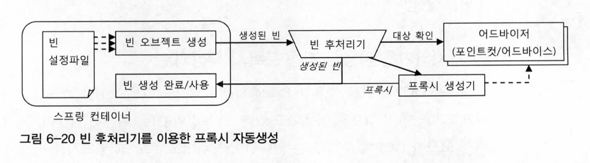
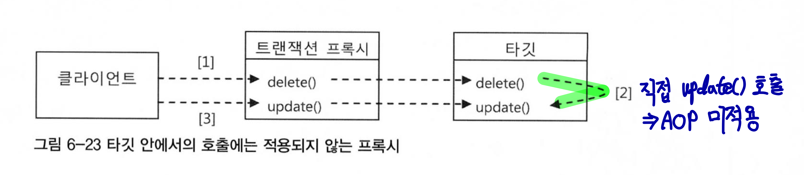

#### 2022.11.08 '토비의 스프링을 읽어봐요' 스터디 자료 by 정의재

# Chapter 6 - AOP

### 목차

[6.5 스프링 AOP](#)

[6.6 트랜잭션 속성](#)

[6.7 어노테이션 트랜잭션 속성과 포인트컷](#)

[6.8 트랜잭션 지원 테스트](#)

[6.9 정리](#)


<br>

## 6.5 스프링 AOP
### 투명한 부가기능 적용
다시 한 번 현재 과정의 목표를 상기시켜보자. 
    
    "비즈니스 로직에 반복적으로 등장해야만 했던 트랜잭션 코드를 깔끔하고 효과적으로 분리해내는 것"

6.4까지의 과정을 통해 부가기능이 타깃 오브젝트마다 새로 만들어지는 문제를 ProxyFactoryBean의 어드바이스를 통해 해결했다.

이제 부가 기능의 적용이 필요한 타겟 오브젝트마다 거의 비슷한 내용의 ProxyFactoryBean 빈 설정 정보를 추가해줘야한다.

### 빈 후처리기
빈 후처리기란 스프링 빈 오브젝트로 만들어지고 난 후에 빈 오브젝트를 다시 가공할 수 있게 해주는 기능을 수행한다.

그 중 ```DefaultAdvisorAutoProxyCreator```를 사용하자.
이 빈 후처리기 자체를 진으로 등록하게되면 빈 오브젝트의 프로퍼리를 강제로 수정하거나 별도의 초기화 작업을 수행할 수도 있다.



### 포인트 컷의 확장
포인트 컷은 프록시를 적용할 클래스를 고를 클래스 필터와 어디브아시를 적용할 메소드 매처 기능을 가지고 있다.

포인트 컷의 확장된 기능과 빈 후처리기를 활용한 프록시 자동 생성기를 적용핳 때는 두 가지를 주의해서 확인해야 한다.

1. 트랜잭션이 필요한 빈에 트랜잭션 부가기능이 적용됐는가
2. 아무 빈에나 트랜잭션 부가기능이 적용된 것은 아닌가


### 지금까지의 여정 정리
1. 서비스 추상화

    트랜잭션 경계 설정 기술에 비즈니스 코드가 종속되어 버린다. 트랜잭션 방식으로 바꾸려면 모든 트랜잭션 적용 코들르 수정해야
한다는 심각한 문제가 있다. 트랝개션과는 직접 관련이 없는 코드가 담긴 많은 클래스를 일일이 수정해야 한다.
   
   → 트랜잭션 적용이라는 추상적인 작업 내용은 유지한 채로 구체적인 구현 방법을 자유롭게 바꿀 수 있도록 서비스 추상화 기법을 적용했다.
   

2. 프록시와 데코레이터 패턴
    
    여전히 비즈니스 로직 코드에는 트랜잭션을 적용하고 있다. 경계설정을 담당하는 코드의 특성 때문에 
   단순한 츠ㅜ상화와 메소드 추출 방법으로는 더 이상 제거할 방법이 없었다.

   → DI를 이용해 프록시를 데코레이터 패턴으로 적용했다.


3. 다이내믹 프록시

    비즈니스 로직 인터페이스의 모든 메소드마다 트랜잭션 기능을 부여하는 코드를 넣어 프록시 클래스를 만드는
   작업이 오히려 시간을 소모시켰다.

   → JDK 다이내믹 프록시 기술을 적용해 프록시 클래스 없이도 프록시 오브젝트를 런타임 시에 만들어주었다.


4. 프록시 팩토리 빈

    동일한 기능의 프록시를 여러 오브젝트에 적용할 경우 오브젝트 단위로는 중복이 일어나는 문제가 있다.

   → 스프링의 프록시 팩토리 빈을 이용해 다이내믹 프록시 생성 방법에 DI를 도입했다.


5. 자동 프록시 생성 방법과 포인트 컷

    트랜잭션 적용 대상이 되는 빈마다 일일이 프록시 팩토리 빈을 설정해줘야 했다.

   → 스프링 컨테이너의 빈 생성 후처리 기법을 통해 컨테이너 초기화 시점에서 자동으로 프록시를 만들어주는 방법을 도입했다.
    

### 부가기능의 모듈화
지금까지 힘겹게 적용한 DI, 데코레이터 패턴, 다이내믹 프록시, 오브젝트 생성 후처리, 자동 프록시 생성, 포인트컷 등을
```TransactionAdvice```이란 일므으로 모듈화할 수 있다.

독립적으로 모듈화가 가능하므로 코드는 중복되지 않고 변경이 필요한 곳만 수정하면 된다. 또 포인트 컷을 통해 부가기능을 부여할 대상을
직접 선정할 수 있다.


### AOP(Aspect Oriented Programming)
위와 같은 부가기능 모듈화 작업은 기존 객체지향 설계와는 구분되는 새로운 특성이 있었고, 이러한 설계 방식을 AOP라고 부르기로 했다.

중요한 것은 AOP는 OOP와 대조되는 새로운 패러다임이 아니라 OOP를 보조적으로 돕는 기술이라는 점이다.
   
AOP에는 여러 방식이 있지만 스프링은 프록시 방식을 추히ㅏ고 있다.

### AOP 용어
- 타깃
   
   타깃을 부여할 대상
  

- 어드바이스
  
   타깃에게 제공할 부가기능을 담은 모듈
  

- 조인 포인트
  
   어드바이스가 적용될 수 있는 위치
  

- 포인트컷 
  
   어드바이스를 적용할 조인 포인트를 선별하는 작업 또는 그 기능
  

- 프록시 
  
   클라이언트와 타깃 사이에 투명하게 존재하면서 부가기능을 제공하는 오브젝트
  

- 어드바이저 
  
   포인트컷과 어드바이스를 하나씩 갖고 있는 오브젝트
  
   (부가기능[어드바이스]을 어디에 전달[포인트컷]할 것이가를 알고있는 AOP의 가장 기본이 되는 모듈)

  

- 애스펙트

   AOP의 기본 모듈(OOP의 클래스같은 단위)


## 6.6 트랜잭션 속성
트랜잭션 경계 안에서 진행된 작업은 모두 commit되어 성공하던지 모두 rollback되어 취소되어야 한다.

## 트랜잭션 전파
트랜잭션의 여러 설정에 따라 트랜잭션 범위를 결정할 수 있다.
- ```PROPAGATION_REQUIRED``` : 진행 중인 트랜잭션이 있으면 참여 없으면 새로 시작
- ```PROPAGATION_REQUIRES_NEW``` : 무조건 새로운 트랜잭션 시작
- ```PROPAGATION_NOT_SUPPORTED``` : 무조건 트랜잭션 없이 동작


트랜잭션 매니저가 트랜잭션을 시작할 때 ```getTransaction()```이라는 메소드를 쓰는 이유가 바로 위의 전파속성 때문이다.

### 트랜잭션 인터셉터와 트랜잭션 속성
비즈니스 로직상에서 예외인 경우에는 체크 예외를 던지게 되는데 이때는 DB 트랜잭션은 커밋하는 것이 일반적으로 옳다.
따라서 ```TransactionInterceptor```는 비즈니스 예외와 같은 체크 예외를 던지는 경우에는 이것을 에외 사항으로 취급하지 않는다.

```RuntimeException```이 일어나느 경우에만 롤백을 진행한다.

하지만 ```TransactionAttribute```를 활용하면 체크 예외에서 롤백, 언체크 예와에서 커밋을 할 수도 있다.

### 포인트컷과 트랜잭션 속성의 적용 전략
1. 트랜잭션 포인트컷 표현식은 타입 패턴이나 빈 이름을 이용한다
   

2. 공통된 메소드 이름 규칙을 통해 최소한의 트랜잭션 어드바이스와 속성을 정의한다
   

3. 프록시 방식 AOP는 같은 타깃 오브젝트 내의 메소드를 호출할 때는 적용되지 않는다.
    
   
   
### 트랜잭션 속성 적용
일반적으로 특정 계층의 경계를 트랜잭션 경계와 일치시키는 것이 바람직하다.


## 6.7 어노테이션 트랜잭션 속성과 포인트컷


### @Transactional

```java
package org.springframework.transaction.annotation;
// ...

@Target({ElementType.METHOD, ElementType.TYPE})
@Retention(RetentionPolicy.RUNTIME)
@Inherited
@Documented
public @interface Transactional {
   String value() default "";
   Propagation propagation() default Propagation.REQUIRED;
   Isolation isolation() default  Isolation.DEFAULT;
   int timeout() default TransactionDefinition.TIMEOUT_DEFAULT;
   boolean readOnly() default false;
   Class<? extends Throwable>[] rollbackFor() default {};
   String[] rollbackForClassName() default {};
   Class<? extends  Throwable>[] noRollbackFor() default {};
   String[] noRollbackForClassName() default {};
   
}
```

타깃에 부여할 수 있는 트랜잭션 어노테이션은 다음과 같이 정의되어 있다.

```@Transactionl```의 어노테이션 타깃은 메소드와 타입이다. 즉, 메소드, 클래스, 인터페이스에 사용할 수 있다는 뜻이다.

### 대체 정책
우선순위
1. 타깃 메소드
2. 타깃 클래스
3. 선언 메소드
4. 선언 타입(클래스, 인터페이스)


아래 코드가 위의 우선 순위를 말해준다.
```java
// (4)
public interface Service {

   void method1(); // (3)

   void method2(); // (3)

}

// (2)
public class ServiceImpl implements Service {
    
   @Override
   public void method1() { } // (1)

   @Override
   public void method2() { } // (1)
   
}
```

## 6.8 트랜잭션 지원 테스트
```@Transactional```의 경우 테스트에도 적용가능하다. 이때는 @Rollback 설정을 통해 강제 롤백(가능/불가능)하도록 설정할 수도 있다.

## 6.9 정리