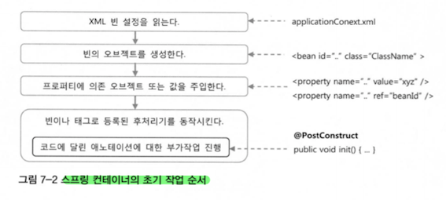
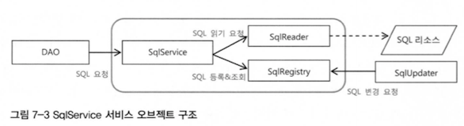
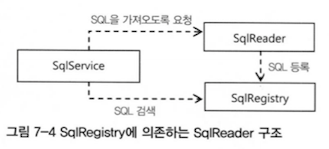
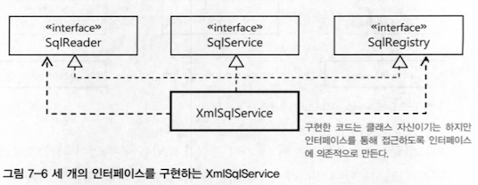

#### 2022.11.29 '토비의 스프링을 읽어봐요' 스터디 자료 by 정의재

# Chapter 7 - 스프링 핵심 기술의 응용

### 목차

[7.1 SQL과 DAO의 분리](#)

[7.2 인터페이스의 분리와 자기 참조 빈](#)


<br>

## 7.1 SQL과 DAO의 분리

쿼리문은 생각보다 빈번하게 수정되고 변경되며 추가된다. 따라서 이를 DAO와 분리하는 것이 좋아보인다.

    DAO의 역할: 데이터를 가져오고 조작하는 작업의 인터페이스 역할

### XML 설정을 이용한 분리
우선 순수하게 SQL문을 XML로 빼고 UserDaoJdbc 클래스에 뺀 SQL문들에 해당하는 프로퍼티를 선언해준다.

그 후 외부로부터 DI 받은 SQL문장을 프로퍼티에 담아 사용하게 하자.

```java
class UserDaoJdbc implements UserDao {
    public void add(User user) {
        this.jdbcTemplate.update(this.sqlAdd, user.getId(), user.getName(), ... , user.getRecommend());
    }
}
```
```xml
<bean id="userDAO" class="springbook.user.dao.UserDaoJdbc">
    <property name="dataSource" ref="dataSource"/>
    <property name="sqlAdd" value="insert into users(id, name, password,
        email, level, login, recommend values(?,?,?,?,?,?)" />
    ...
</bean>
```
이로써 DB테이블의 컬럼 값이 바뀌어도 xml파일만 수정하면 된다.

### SQL 맵 프로퍼티 방식
SQL이 많아지면 그때마다 DAO에 DI용 프로퍼티를 추가하기 어려워지기 때문에 Map을 활용해보기로 한다.

```java
class UserDaoJdbc implements UserDao {
    
    private Map<String, String> sqlMap;

    public void setSqlMap(Map<String, String> sqlMap) {
        this.sqlMap = sqlMap;
    }
    
    public void add(User user) {
        this.jdbcTemplate.update(
                this.sqlMap.get("add"), 
                user.getId(), user.getName(), ... , user.getRecommend()
        );
    }
}
```
```xml
<bean id="userDAO" class="springbook.user.dao.UserDaoJdbc">
    <property name="dataSource" ref="dataSource"/>
    <property name="sqlMap">
        <map>
            <entry key="add" value="insert into users(id, name, password,
                email, level, login, recommend) values(?,?,?,?,?,?)" />
            <entry key="get" value="..." />
            <entry key="getAll" value="..." />
            <entry key="deleteAll" value="..." />
            <entry key="getCount" value="..." />
            <entry key="update" value="..." />
        </map>
    </property>
    ...
</bean>
```

### SQL 제공 서비스 인터페이스
Map을 활용해 DAO가 활용하기 쉽게 SQL을 분리했지만 SQL과 DI 설정 정보가 섞여 있으면 지저분하고 관리하기에도 좋지 않다.
또 스프링의 설정파일로부터 생성된 오브젝트와 정보는 어플리케이션을 다시 시작하기 전에는 변경이 매우 어렵다.

따라서 독립적으로 SQL 제공 서비스를 SqlService로 빼서 관리한다. 이때 SqlService의 역할은 SQL에 대한 키 값을 전달하면
그에 해당하는 SQL을 돌려주는 것이다.

```java
public interface SqlService {
    String getSql(String key) throws SqlRetrievalFailureException;
}


class UserDaoJdbc implements UserDao {

    private SqlService sqlService;

    public void setSqlService(SqlService sqlService) {
        this.sqlService = sqlService;
    }

    public void add(User user) {
        this.jdbcTemplate.update(
                this.sqlService.getSql("userAdd"),
                user.getId(), user.getName(), ... ,user.getRecommend()
        );
    }

    public void get(User user) {
        this.jdbcTemplate.queryForObject(
                this.sqlService.getSql("userGet"), new Object[] {id}, this.userMapper
        );
    }

    public void getAll() {
        this.jdbcTemplate.query(this.sqlService.getSql("userGetAll"), this.userMapper);
    }

    public void deleteAll() {
        this.jdbcTemplate.update(this.sqlService.getSql("userDeleteAll"));
    }
    
    // ...
    
}
```
```xml
<bean id="userDAO" class="springbook.user.dao.UserDaoJdbc">
    <property name="dataSource" ref="dataSource"/>
    <property name="sqlService" ref="sqlService" />
</bean>

<bean id="sqlService" class="springbook.user.sqlservice.SimpleSqlService">
    <property name="sqlMap">
        <map>
            <entry key="add" value="insert into users(id, name, password,
                    email, level, login, recommend) values(?,?,?,?,?,?)" />
            <entry key="get" value="..." />
            <entry key="getAll" value="..." />
            <entry key="deleteAll" value="..." />
            <entry key="getCount" value="..." />
            <entry key="update" value="..." />
            ...
        </map>
    </property>
</bean>
```

이제 UserDao를 포함한 모든 DAO는 SQL을 어디에 저장해두고 가져오는지에 대해서는 전혀 신경쓰지 않아도 된다.


## 7.2 인터페이스의 분리와 자기 참조 빈

### XML 파일 매핑

### 빈의 초기화 작업
XmlSqlService코드의 경우 생성자에서 예외가 발생할 수도 있는 초기화 작업이 껴있고, 읽어들일 파일의 위치와 이름이 코드에서 고정되어 있다.

따라서 파일 이름을 외부에서 지정할 수 있도록 프로퍼티로 추가해주고, 셍상지는 일단 생성자의 역할만 한 후 ```@PostConstruct```를 통해 
반드시 초기화되도록 한다.

```java
public class XmlSqlService {
    
    @PostConstruct
    public void loadSql() { ... }
}
```



위 그림처럼 스프링 컨테이너가 동작하기 때문에 ```@PostConstruct```는 믿고 쓸 수 있다.

### 인터페이스 분리(책임에 따른 인터 페이스 정의)
SQL을 가져오는 것과 보관해두고 사용하는 것은 충분히 독립적인 전략이므로 분리할 수 있다.

XmlSqlService의 책임
1. SQL 정보를 외부의 리소스로부터 읽어노느 책임 => ```SqlReader```
2. 읽어온 SQL을 보관해두고 있다가 필요할 때 제공해주는 책임 => ```SqlRegistry```
    - 일단 서비스를 위해서 한 번 가져오는 SQL을 필요에 따라 수정하게 할 수도 있다.
    
```SqlReader```와 ```SqlRegistry```를 분리하고 나면 아래와 같은 구조가 될 것이다.



문제는 ```SqlReader```와 ```SqlRegistry``` 사이에서 정보를 전달하려면 불필요한 임시 Map타입의 파라미터가 필요하다. 따라서 그냥
직접 정보를 전달할 수 있도록 S```qlService```가 ```SqlReader```에서 정보를 받으면서 동시에 ```SqlRegistry```에 SQL을 등록하자.



이제 ```SqlService```의 구현 클래스는 이제 ```SqlReader```와 ```SqlRegistry``` 두개의 프로퍼티를 DI받을 수 있는 구조로 만들어야한다.



그러면 아래와 같아진다.

```java
public class XmlSqlService implements SqlService, SqlRegistry, SqlReader {
    // ...
    private String sqlMapFile;

    public void setSqlMapFile(String sqlMapFile) {
        this.sqlMapFile = sqlMapFile;
    }
    
    @PostConstruct
    public void loadSql() {
        this.sqlReader.read(this.sqlRegistry);
    }

    public void read(SqlRegistry sqlRegistry) {
        String contextPath = SqlMap.class.getPackage().getName();
        try {
            JAXBContext context = JAXBContext.newInstance(contextPath);
            ...
            for (SqlType sql : sqlMap.getSql) {
                sqlRegistry.registerSql(sql.getKey(), sql.getValue());
            }
        } catch (JAXBExecption e) {
            throw new RuntimeException(e);
        }
    }
}
```


### 디폴트 의존 오브젝트
인터페이스와 전략 패턴을 도입하고 DI를 적용한다면 늘어난 클래스와 인터페이스 구현과 의존관계 설정에 대한 부담이 있다.

떠라서 외부에서 DI 받지 않는 경우, 기본적으로 자동 적용되는 의존관계를 설정해야하고 이러한 관계를 ```디폴트 의존관계```라고 한다.