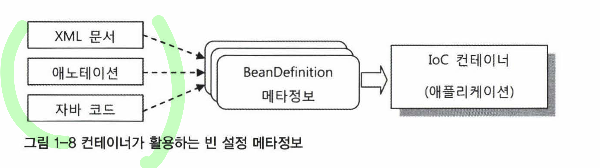

# 범위
```
1.2 IOC / DI를 위한 빈 설정 메타 정보 작성  
1.2.1 빈 설정 메타정보  
1.2.2 빈 등록 방법  
1.2.3 빈 의존관계 설정 방법  
1.2.4 프로퍼티 값 설정 방법  
1.2.5 컨테이너가 자동등록하는 빈
```  

# why
컨테이너는 어떻게 자신이 만들 오브젝트가 무엇인지 알 수 있을까?

## what - 어떤 기준으로 빈을 생성할까?
### how - 빈 설정 메타 정보
- BeanDefinition에는 IoC컨테이너가 빈을 만들 때 필요한 핵심 정보가 담겨 있다.  
- 몇가지 필수 항목을 제외하면 컨테이너에 미리 설정된 디폴트값이 그대로 적용된다.
- BeanDefinition은 여러 개의 빈을 만드는데 재사용 할 수 있다. 
  - 빈의 이름이나 아이디를 나타내는 정보는 포함되지 않는다.

```java
BeanDefinition이란?
- 순수한 오브젝트로 표현되는 빈 생성 정보 
- 정보가 담긴 리소스의 종류와 작성방식에 독립적
```

#### 동작 방식

1. `빈 설정 메타정보`가 담긴 xml 파일 or 애노테이션 같은 리소스를 전용 리더를 통해 읽는다
2. BeanDefinition 타입의 오브젝트로 변환한다
3. IoC 컨테이너는 이 BeanDefinition 메타정보를 이용해 빈을 생선한다

#### 빈 설정 메타 정보 항목
https://docs.spring.io/spring-framework/docs/current/javadoc-api/org/springframework/beans/factory/config/BeanDefinition.html

- 정말 많다.
- 가장 중요한 항목은 클래스 이름(`beanClassName`) 이다. 
  - 추상 빈으로 정의하지 않는 한 클래스 정보는 반드시 필요하다. 
  - 빈은 오브젝트이고, 오브젝트를 생성하려면 클래스가 반드시 필요하기 때문이다. '

## what - 어떻게 빈을 등록할까?
1. 여러 가지 방법으로 빈 메타 정보를 작성하고,
2. 적절한 리더나 변환기를 통해서 어플리케이션 컨텍스트가 사용할 수 있는 정보로 변환시켜줘야 한다!

### how 1 - XML: bean 태그
```xml
<bean id = "hello" class = "springbook.learningtest.spring.ioc.bean.Hello">
  <property name = "printer">
    <bean class = "springbook.learningtest.spring.ioc.bean.StringPrinter"/>
  </property>
</bean>
```
### how 2 - XML: 네임스페이스와 전용 태그
스프링은 기술적인 설정과 기반 서비스를 빈으로 등록할 때를 위해 의미가 잘 드러나는 네임스페이스와 태그를 가진 설정
방법을 제공한다.

```xml
<!-- 일반적인 빈 설정 정보-->
<bean id = "mypointcut"
	class = "org.springframework.aop.aspectj.AspectJExpressionPointcut">
	<property name = "expression" value ="execution(*.*..*ServiceImpl.update*(..))"/>
</bean>

<!-- 네임스패이스와 테그로 설정 정보 변경 -->
<aop:pointcut id = "mypointcut"
	expression="execution(*.*..*ServiceImpl.update*(..))"/>
```
### how 3 - 자동인식을 이용한 빈 등록: 스테레오타입 애노테이션과 빈 스캐너
특정 애노테이션이 붙은 클래스를 자동으로 찾아가서 빈으로 등록해주는 방식

- 등장 배경
  - 모든 빈을 XML에 일일이 선언하는 것이 귀찮고 규모가 커지면 XML 파일 관리가 번거로워진다. 
- 동작방식
  - 빈으로 사용될 클래스에 특별한 애노테이션을 부여해서, 이런 클래스를 자동으로 찾아서 빈으로 등록해준다.
    - 특별한 애노테이션 예시: `@Component`, `@Controller`, `@Service`, `@Respository` 
  - 이런 스캐닝 작업을 담당하는 오브젝트를 `빈 스캐너`라고한다. (우리가 흔히 아는 `@ComponentScan` 역할)
    - xml 을 이용한 빈 스캐너 등록
    - 빈 스캐너를 내장한 애플리케이션 컨텍스트 사용
- 예시
  ```java
  @Component // annotaionHello 라는 id로 빈 생성됨
  public class AnnotationHello { 
  
  }
  ```
- 단점
  -  애플리케이션에 등록될 빈이 어떤것들이 있고 그정의는 어떻게 되는지 한눈에 파악하기 힘듦(이게 XML방식의 장점이었으니..)

### how 4 - 자바 코드에 의한 빈 등록 : @Configuration 클래스의 @Bean 메소드
```java
@Configuration
public class AnnotatedHelloConfig {
  // 자바코드에 의한 빈 등록 기능은 하나의 클래스 안에 여러개의 빈을 정의 할 수 있다.
  
  @Bean
  public AnnotationHello annotationHello() {
      return new AnnotationHello();
  }

  @Bean
  public DataSource dataSource(){
      SimpleDriverDataSource dataSource = new SimpleDriverDataSource();
      dataSource.setDriverClass(com.mysql.jdbc.Driver.class);
      dataSource.setUrl("jdbc:mysql://localhost/testdb");
      dataSource.setUsername("read-toby-spring");
      dataSource.setPassword("jjang");
      return dataSource;
  }
}
```
- 장점 
  - 컴파일러, IDE를 통한 검증이 가능하다.
    - XML은 문제가 있을 경우, 런타임 에러로만 확인이 가능하다
  - 작성이 쉽다. (자동완성 이런거 사용할 수 있으니까..)
  - 이해도 쉽다!
  - 복잡한 빈 설정이나 초기화 작업을 간단히 적용할 수 있다

### how 5 - 자바 코드에 의한 빈 등록 : 일반 빈 클래스의 @Bean 메소드
`@Configuration`이 붙은 클래스가 아닌 일반 POJO클래스에도 @Bean을 사용할 수있다.
```java
@Component
public class HelloConfig {
    private Printer printer;
    
    public void setPrinter(Printer printer) {
        this.printer = printer;
    }
	
	@Bean
	public Hello hello(){
		Hello hello = new Hello();
		hello.setPrinter(printer());
		return hello;
	}
	
	@Bean
	public Hello hello2(){
		Hello hello = new Hello();
		hello.setPrinter(printer());
		return hello;
	}
    
	@Bean
	public Printer printer(){
		return new Printer();
	}
}
```
- 이용하는 상황
  - 일반적으론 거의 없다. 
  - @Bean으로 만드는 빈이 클래스로 만들어지는 빈과 밀접한 관계가 있을 때 사용 (궁금한점: 이런 경험이 있으신 분?!)

### 요약
크게 아래 3가지가 많이 사용 된다.
- XML 단독 사용
- XML과 빈 스캐너에 의한 자동인식 혼용
  - XML: 기술 서비스, 기반 서비스, 컨테이너 설정 (ex. AOP, 트랜잭션 속성, 내장 DB)
  - 빈 스캐너에 의한 자동인식: 비즈니스 로직 처리하는 빈
- 빈 스캐닝 단독 사용
  - 기술 서비스, 기반 서비스, 컨테이너 설정도 `자바 코드에 의한 빈 등록`을 이용함

## what - 등록된 빈들을 이용해서, 의존관계 주입은 어떻게 할까?
빈 사이의 의존관계 메타정보를 작성하는 방법은?

DI 할 대상을 선정하는 방법으로 분류 (2가지)
- 명시적으로 구체적인 빈을 지정하는 방법
- 일정한 규칙에따라 자동으로 선정(autowiring)

메타정보 작성 방법으로 분류 (4가지)
- XML <bean> 태그
- 스키마를 가진 전용태그
- 애노테이션
- 자바코드에 의한 직접적인 DI

따라서 총 8가지의 방법이 있다.

### how 1 - XML < bean > 태그
#### 명시적으로 구체적인 빈을 지정
방법 1) < property > : 수정자 주입
```XML
<bean id="Hello" class="springbook.learningtest.spring.ioc.bean.Hello">
        <property name="name" value="Spring"/>
        <property name= "printer" ref="printer"/>
        <property name="name" value="Spring"/> <!--빈 객체가 아니라 단순 값도 주입 가능-->
        <property name="age" value="30"/>
        <property name="myClass" value="java.lang.String"/>
</bean>
```
방법 2)  <construct-arg> : 생성자 주입
```java
public class Hello {
  String name;
  Printer printer;

  public Hello(String name, Printer printer) {
    this.name = name;
    this.printer = printer;
  }
}
```
```xml
	<bean id="Hello2" class="springbook.learningtest.spring.ioc.bean.Hello">
		<constructor-arg index="0" value="Spring" /> <!--타입이 겹치지 않으면, index없이 타입만 명시해줘도 됨-->
		<constructor-arg index="1" ref="printer" />
	</bean>
```
#### 일정한 규칙에따라 자동으로 선정(autowiring)
명시적으로 프로퍼티나 생성자 파라미터를 지정하지 않고, 미리 정해진 규칙을 이용해 자동으로 DI 설정을 컨테이너가 추가하도록 만든다.  

방법 1) byName : 빈 이름 자동와이어링
- 보통 빈의 이름은 이 클래스를 대표할 수 있는 인터페이스 이름을 이용한다. 또한 빈의 프로퍼티도 같은 이름, 깉은 타입으로 선언되어있다. 
- 빈 이름 자동와이어링은 이런 관례를 이용하는 방법이다.
```xml
	<bean id="Hello" class="springbook.learningtest.spring.ioc.bean.Hello" autowire="byName">
		<property name="name" value="Spring" />
	</bean>
	<bean id="printer" class="springbook.learningtest.spring.ioc.bean.StringPrinter" />
```
방법 2) byType :  타입에 의한 자동와이어링
-  프로퍼티의 타입과 각 빈의 타입을 비교해서 자동으로 연결해주는 방법
```xml
	<bean id="Hello2" class="springbook.learningtest.spring.ioc.bean.Hello" autowire="byType">
		<property name="name" value="Spring" />
	</bean>
```

### how 2 - XML: 네임스페이스와 전용 태그
how 1 - XML <bean> 태그 와 동일한 동작

```xml
<oxm:jaxb2-marshaller id="unmarshaller" contextPath="..."/>
<bean id = "sqlService" class="springbook.user.sqlservice.OxmSqlService">
    <property name = "unmarshaller" ref="unmarshaller"/> <!--전용태그로 만들어진 빈을 다른 빈이 참조할 경우, id 애트리뷰트 이용-->
</bean>
```

### how 3 - 애노테이션
#### 명시적으로 구체적인 빈을 지정하는 방법
`@Resouce` 애노태이션
- < property > 선언과 비슷하게 주입할 빈을 아이디로 지정하는 방법이다. 
- @Resource는 자바 클래스의 수정자뿐만 아니라 필드에도 붙일수 있다.
- @Resource가 붙어 있으면 반드시 참조할 빈이 존재해야한다. 
  - 만약 DI 할 빈을 찾을 수 없다면 예외가 발생한다.
- @Reusource에 name 엘리먼트를 지정하지 않았고 디폴트 이름으로는 참조할 빈을 찾을 수 없는 경우에는 타입을 이용해서 다시한번 빈을 찾기도한다.
```java
// 수정자 주입
@Resource(name="printer") //name 생략가능
public void setPrinter(Printer arg) { //메소드 이름으로 부터 프로퍼티이름을 끌어내어 빈을 주입
    this.printer = arg;
}

// 필드 주입( 단위테스트를 진행할 때 컨테이너 밖에서 수동으로 DI를 하기 힘듦)
public class Hello {

  String name;
  @Resource(name = "stringPrinter")
  Printer printer;
}
```

#### 일정한 규칙에따라 자동으로 선정(autowiring)
`@Autowired` 애노테이션
- 스프링 2.5부터 적용된 스프링 전용 애노테이션
- XML의 타입에 의한 자동와이어링 방식을 `생성자`, `필드`, `수정자 메서드`, `일반 메서드`의 네가지로 확장한 것이다.


```java
public class BaseSqlService implements SqlService {

  private SqlReader sqlReader;
  private SqlRegistry sqlRegistry;

  @Autowired // 생성자 - 모든 파라미터에 타입에 의한 자동 와이어링 적용. 오직 하나의 생서자에만 적용할 수 있음
  public BaseSqlService(SqlReader sqlReader, SqlRegistry sqlRegistry) {
    this.sqlReader = sqlReader;
    this.sqlRegistry = sqlRegistry;
  }

  @Autowired // 일반 메서드
  public void config(SqlReader sqlReader, SqlRegistry sqlRegistry) {
    this.sqlReader = sqlReader;
    this.sqlRegistry = sqlRegistry;
  }
}

// 필드
public class Hello {
  @Autowired
  private Printer printer;
}

// 수정자
public class Hello {
  private Printer printer;

  @Autowired
  public void setPrinter(Printer printer) {
    this.printer = printer;
  }
}
```

만약, 같은 타입의 빈이 여러개 존재할 경우는?
```java
@Autowired
Collection<Printer> printers;

@Autowired
Printer[] printers;

@Autowired //bean id가 키가 되는 Map을 DI 받음.
Map<String,Printer> printerMap;
```

만약, 같은 타입의 빈 중 특정한 빈을 지정하고 싶다면?
- `@Qualifier`를 이용한다!

```java
// 빈등록
@Component
@Qualifier("mainDB")
public class OracleDataSource {
}

// DI
@Autowired
@Qualifier("mainDB")
DataSource dataSource;

```

`@Inject` 애노테이션
- JaveEE 6의 표준 스펙이 JSR-330에 정의되있는 것
- 스프링 외에도 JavaEE 6을 따르는 여타 프레임워크에서도 동일한 의미로 사용되는 DI를 위한 애노테이션이다.

### how 4 - 자바코드에 의한 직접적인 DI
#### 명시적으로 구체적인 빈을 지정하는 방법
메서드로 정의된 다른 빈을 호출시켜, DI 한다. 
```java
@Configuration
public class Config {
	@Bean
	public Hello hello(){
        Hello hello = new Hello();
		hello.setPrinter(printer()); // printer() 호출해서 DI 시킴
		return hello;
	}
    @Bean
    public Printer printer(){
        return new Printer();
    }
}
```

#### 일정한 규칙에따라 자동으로 선정(autowiring)
직접 @Bean이 붙은 메소드를 호출하는 대신, 그 빈의 레퍼런스를 파라미터로 주입받는 방식이다.

```java
@Configuration
public class Config {
	@Bean
	public Hello hello(Printer printer){
        Hello hello = new Hello();
		hello.setPrinter(printer);
		return hello;
	}
    @Bean
    public Printer printer(){
        return new Printer();
    }
}
```

**주의**  
빈 등록 방식과 빈 의존관계 주입 방법은 메타정보 작성 방법이 항상 같아야 하는게 아니다 !!  
ex. 빈 등록 메타정보는 XML에 쓰고, 의존관계 주입 메타정보는 자바 config 클래스에서 해도 됨

### 빈 등록과 의존관계 설정 전략
1. XML 단독
    - 빈 등록: XML
    - 의존관계 설정: XML
2. XML과 애노테이션 설정의 혼합 ✔
    - 빈 등록: XML
    - 의존관계 설정: @Autowired, @Resource 사용
3. 애노테이션 단독 ✔
    - 빈 등록: @Component 같은 애노테이션
    - 의존관계 설정: @Autowired를 이용한 자동 주입

## what - 빈 객체가 아닌 일반 값은 어떻게 의존관계 주입하지?
여기서 말하는 `값`이란?
- 스프링이 관리하는 빈이 아닌 모든 것!
  - DI를 통해 빈에 주입되는 것은 두가지다. 하나는 다른 빈 오브젝트의 레퍼런스이고, 다른 하나는 단순 값이다.

### how 1 - XML: < property > 와 전용 태그
- < property >태그의 value 애트리뷰트를 사용하면 런타임 시에 주입할 값으로 인식한다.
- 스프링 컨테이너는 XML의 문자열로 된 값을 프로퍼티 타입으로 변환해주는 변환 서비스를 내장하고 있다.
  - String 뿐만아니라 int, float, double 등의 기본 타입이거나 Class나 Resource 같은 단순하지 않은 오브젝트 타입도 주입이 가능하다. 
  - 스키마에 정의된 전용 태그에서는 ref로 끝나는 애트리뷰트 외에는 대부분 프로퍼티 값이라고 생각하면된다.

```xml
<bean id="Hello" class="springbook.learningtest.spring.ioc.bean.Hello">
    <property name="name" value="Spring" />
</bean>

<aop:advisor advice-ref="trasactionAdvice" pointcut="bean(*Servince)" /> <!--pointcut에 값 주입-->
```

### how 2 - 애노테이션: @Value
빈 의존관계는 아니지만 특정 값을 외부에서 주입해야하는 목적은 크게 2가지이다. 
1. 환경에 따라 매번 달라질 수 있는값이다.
2. 클래스의 필드에 초기값을 설정해두고 대개는 그 값을 사용하지만 특별한경우, 예를 들면 테스트나 특별한 이벤트 때는 초기값 대신 다른 값을 지정하고 싶을 경우가 있다. 이렇게 초기값을 두면 대부분의 경우 편리하고 안전하다.

```java
public class Hello {

    @Value("#{systemProperties['os.name]}")
    private String name;

    @Value("${database.username}") // yaml, properties에서 읽어옴
    private String username;
    
    @Value("Everyone") // 기본값으로 초기화
    public void setName(String name){
        this.name = name;
    }
}
```

### how 3 - 자바 코드 : @Value
- @Configuration 과 @Bean을 사용하는 경우에도 프로퍼티 값을 외부로 독립시킬수 있다.
- 클래스 자체가 메타정보이기 때문에, 설정을 변경해야 할 때마다 코드를 수정하고 재컴파일하는 게 문제가 되지 않지만, 환경에 종속적인 정보는 역시 환경정보나 프로퍼티 파일에서 가져오는 것이 바람직하다.

```java
@Configuration
public class Config {
    @Value("${database.username}")
    String name;
    
    @Bean
    public Hello hello(@Value("${database.username}") String name) {
        Hello hello = new Hello();
        hello.setName(name);
        return hello;
    }    
}
```

### how 4 - PropertyEditor와 ConversionService(스프링3.0 이상)
- XML의 value나 @Value의 엘리먼트는 문자로 작성, 그 외의 타입인 경우라면 변경 과정이 필요하다.
- 스프링은 두 가지 종류의 타입 변환 서비스를 제공한다 (default는 PropertyEditor)
  - boolean, Boolean, byte, Byte, short, Short, int, Integer, long, Long, float, Float
    double, Double, BigDecimal, BigInteger, char, Character, String

```java
// 기본타입 예시 (boolean)
boolean flag;
public void setFlag(boolean flag) { this.flag = flag; }

<property name="flag" name"true"/>

@Value("true") booealn flag;

// 배열 예시
<property name = "names">
    <list>
        <value>Spring</value>
        <value>Io</value>
        <value>DI</value>
    </list>
</property>

@Value("1,2,3,4") int[] intarr;
```

## what - 별다른 설정없이 컨테이너가 자동으로 등록하는 빈은 없을까?
스프링 컨테이너는 초기화 과장에서 몇 가지 빈을 기본적으로 등록해준다.  
-> 컨테이너 자신을 빈으로 등록해두고 필요하면 일반 빈에서 DI 받아서 사용할 수 있다.

```java
public class SystemBean {
    @Autowired //@Resource로도 주입 가능
    ApplicationContext context; //BeanFactory 인터페이스를 상속하고 있어서, 웬만하면 이거로 다 해결가능

    public void specialJobWithContext() {
        this.context.getBean(...);
    }
}
```

스프링 컨테이너는 ResourceLoader이기도 하다.  
-> 서버환경에서 다양한 Resource를 로딩할 수 있는 기능을 제공한다. 
```java
@Autowired 
ResourceLoader resourceLoader;

public void loadDataFile(){
		Resource resource = this.resourceLoader.getResource("WEB-INF/info.dat");
}
```

스프링 컨테이너가 직접 등록하는 빈 중에서 타입이 아니라 이름을 통해 접근할 수 있는 빈이 있다.  
각각 Properties와 Map타입이기 때문에 타입에 의한 접근 방법은 적절치 않다.
```java
@Resource 
Properties systemProperties; // System.getProperties() 메서드가 돌려주는 Properties타입의 오브젝트를 읽기전용으로 접근할 수 있게 만든 빈 오브젝트

@Value("#{systemProperties['os.name'}") 
String osName;

@Value("#{systemProperties['Path']}") //  System.getenv()에서 제곧하는 환경변수가 담긴 Map 오브젝트
String path;
```