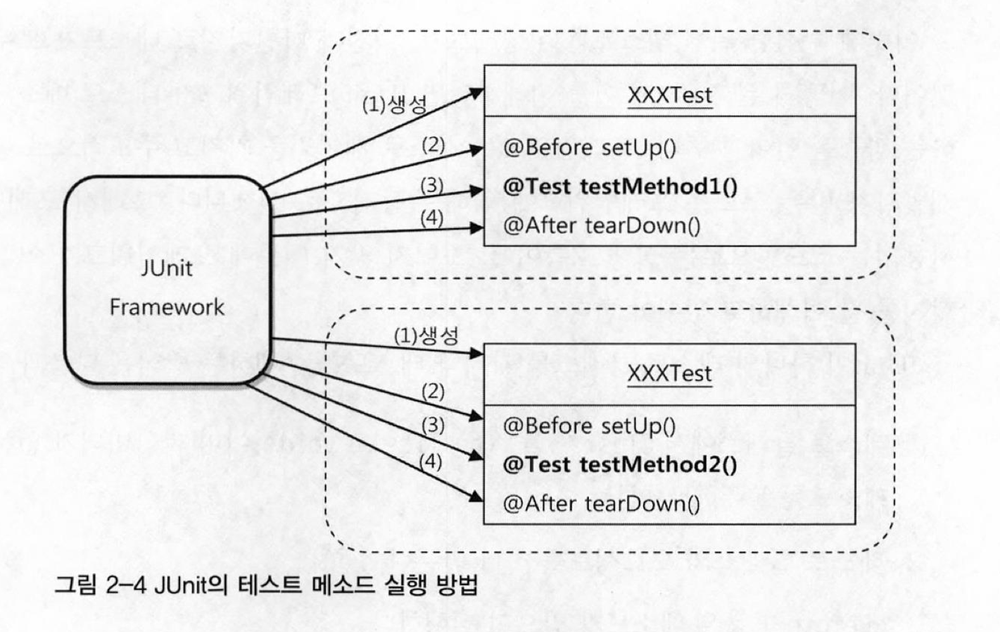

# 범위
**2장 테스트**  
2.1 UserDaoTest 다시 보기  
2.2 UserDaoTest 개선  
2.3 개발자를 위한 테스팅 프레임워크 JUnit  
2.4 스프링 테스트 적용  
2.5 학습 테스트로 배우는 스프링

# WHY : 만들어진 코드를 확신할 수 있게 해주고, 변화에 유연하게 대처할 수 있는 코드를 작성해야 한다.

사용자의 비즈니스 프로세스와 그에 따른 요구사항은 끊임없이 바뀌고 발전한다.  
기술도 시간이 지남에 따라 바뀌고, 운영되는 환경도 변화한다.  

따라서 개발자는 미래의 변화를 대비해야 한다.

1장에서는 `분리와 확장`을 고려한 설계가 필요함을 배웠다.  
그럼, 이렇게 작성한 코드가 의도한 대로 잘 동작하리라고는 어떻게 확신할 수 있을까?

# WHAT : 만들어진 코드의 동작을 확인하는 테스트가 필요하다.
## 테스트의 목적 
내가 예상하고 의도했던 대로 코드가 정확히 동작하는지를 확인해서, 만든 코드를 확신할 수 있게 해주는 작업이다. 

## 테스트의 장점
테스트의 결과가 원하는 대로 나오지 않는 경우, 코드 or 설계에 결함이 있음을 알 수 있다.  
-> 이를 바탕으로 디버깅해나가면, 수정 포인트를 쉽게 찾아갈 수 있다. 

# HOW : 어떻게 테스트를 수행할 수 있을까?
## 자바 코드로 테스트하기
```java
public class UserDaoTest {
    public static void main(String[] args) throws SQLException {
        ApplicationContext applicationContext = new GenericXmlApplicationContext("applicationContext.xml");
        UserDao userDao = applicationContext.getBean(UserDao.class);

        User user = new User();
        user.setId("user");
        user.setName("부리또");
        user.setPassword("delicious");

        userDao.add(user);

        System.out.println(user.getId() + " 등록 성공");

        User user2 = userDao.get(user.getId());
        System.out.println(user2.getName());
        System.out.println(user2.getPassword());

        System.out.println(user2.getId() + "조회 성공");
    }
}
```
### 특징
- `main()`메소드를 이용해 쉽게 테스트 실행
- 테스트할 `UserDao` 를 직접 호출해서 사용
- 결과를 콘솔창에 찍어서 확인
### 단점
수동 확인 작업의 번거로움
- 결과를 단순히 콘솔창에 출력하기 때문에, 개발자의 눈으로 직적 확인해야 한다.
> 만약, 도출한 결과가 맞는지/틀리는지 자동으로 알 순 없을까?

실행 작업의 번거로움
- DAO클래스가 여러개라면, xxxTest 클래스마다 `main()` 메소드를 일일이 실행시켜야 한다.
- 웹을 띄워서 확인하는 것보다야 낫지만, 최선의 방법은 아니다. 
>만약, `main()` 메소드 말고, 더 편리하고 체계적으로 테스트코드를 실행시킬 순 없을까?

## 웹을 통해 테스트하기
웹 화면을 통해 아래 절차를 수행한다.
1. 값을 입력하고
2. 기능을 수행시키고
3. 결과 확인

### 단점
테스트를 수행하기까지의 번거로움
- 서비스 클래스, 컨트롤러, FE 코드 까지 다 갖추어져 있어야 한다.
- 테스트 중 에러가 발생하면, 전체 코드 중 어디가 문제인지 쉽게 찾을 수 없다. 
>만약, 이번에 작성한 코드 `UserDao`의 동작만 확인할 순 없을까?

## 어떤 테스트가 좋은 테스트일까?
1. [코드 작성 관점] 도출한 결과가 맞는지/틀리는지 자동으로 알 수 있어야 한다.
2. [코드 작성 관점] `main()`메소드를 이용하는 방법 말고, 더 쉽고 편리하게 테스트코드를 실행할 수 있어야 한다.
3. [코드 설계 관점] 테스트 대상이 명확하다면, 그 대상에 집중해서 테스트할 수 있어야 한다. (== 단위 테스트)
    - 테스트는 가능하면 작은 단위로 쪼개서, 각 단위에 집중해서 작성해야 한다.
    - 이로써, 테스트 대상이 명확해지면, 문제가 생겼을 때 쉽게 디버깅이 가능하다.

### 단위 테스트란?
작은 단위의 코드에 대해 테스트를 수행하는 것을 의미한다.  
단위는 작을 수록 좋다.  
단위를 넘어선느 다른 코드들은 신경쓰지 않고/참여하지도 않고 테스트가 동작할 수 있으면 좋다.
️
```
Q. UserDaoTest 는 단위테스트일까?!
A. 맞다.
일부는 테스트 중 DB가 사용되면 단위 테스트가 아니라고 한다.
하지만,
사용할 DB의 상태를 테스트가 관장하고 있으니 단위테스트라고 볼 수 있다.
```

## 테스팅 프레임워크 JUnit 적용
JUnit도 프레임워크 이므로, 개발자가 만든 클래스에 대한 제어 권한을 넘겨받아서 주도적으로 애플리케이션의 흐름을 제어한다.  
-> 개발자가 만든 클래스의 오브젝를 생성/실행하는 과정은 프레임워크에 의해 진행된다.  
-> main()메소드도 필요없고, 오브젝트를 만들어서 실행시키는 코드를 만들 필요도 없다. 

### 특징
1. 메서드가 junit4까지는 `public`으로 선언되어야 하고, junit5는 `default`(`package-private`)도 허용한다. 
2. 메서드에 @Test 어노테이션을 붙여야 한다.
3. 긱 테스트 메서드를 실행할 때마다 테스트 클래스 오브젝트를 생성한다. (ex. @Test가 2개 있으면, 객체 2번 생성)
    - 목적: 각 테스트가 서로 영향을 주지 않기 위해서. 

### 장점
1. 일정한 패턴을 가진 테스트를 만들 수 있다.
2. 많은 테스트를 간단히 실행시킬 수 있다.
3. 테스트 결과를 종합해서 볼 수 있다.
4. 테스트가 실패한 곳을 빠르게 찾을 수 있는 기능이 있다.

### 동작 방식



1. 테스트 클래스에서 @Test가 붙은 public(or package-private), void 형이며 파라미터가 없는 테스트 메소드를 모두 찾는다. 
2. 테스트 클래스의 오브젝트를 하나 만든다. 
3. @Before(Each) 가 붙은 메소드가 있으면 먼저 실행한다. 
4. @Test가 붙은 메소드를 하나 호출하고 테스트 결과를 저장해둔다. 
5. @After(Each)가 붙은 메소드가 있으면 실행한다. 
6. 나머지 테스트 메소드에 대해 2~5번을 반복한다. 
7. 모든 테스트의 결과를 종합해서 돌려준다.

### 적용 예시
**BEFORE**  
자바코드로 테스트하기  

**AFTER**
<details>
<summary>자세히 보기</summary>

#### 개선1) 기초적으로 JUnit프레임워크만 적용
1. `main()`메서드에 있는 코드를 일반 메서드로 옮긴다. // main()함수에 작성되어있던 것은 사실 흐름 제어권을 직접 갖는다는 의미
2. 결과 검증코드를 라이브러리 함수(`assertThat`) 를 이용해서 작성한다. 

```java
public class UserDaoTest {
    @Test
    public void addAndGet() throws SQLException {
        ApplicationContext applicationContext = new GenericXmlApplicationContext("applicationContext.xml");
        UserDao userDao = applicationContext.getBean(UserDao.class);

        User userToAdd = new User();
        user.setId("user");
        user.setName("부리또");
        user.setPassword("delicious");

        userDao.add(userToAdd);

        User userToGet = userDao.get("user");

        Assertions.assertEquals(userToAdd.getId(), userToGet.getId());
        Assertions.assertEquals(userToAdd.getName(), userToGet.getName());
        Assertions.assertEquals(userToAdd.getPassword(), userToGet.getPassword());
    }
}
```
#### 개선2) 테스트할 때마다 수동으로 DB밀었던 작업 자동화  
테스트 코드에 변경사항이 없다면, 외부 영향(ex.DB)에 상관없이 항상 동일한 결과를 도출해야한다.
이를 보장하기 위해, 손수 DB를 초기화 시켰던 작업을 대신할 코드를 추가한다.
```java
public class UserDaoTest {
    @Test
    public void addAndGet() throws SQLException {
        ApplicationContext applicationContext = new GenericXmlApplicationContext("applicationContext.xml");
        UserDao userDao = applicationContext.getBean(UserDao.class);

        userDao.deleteAll(); // DB 밀어주기
        assertEquals(userDao.getCount(), 0); // 잘 밀렸는지 확인

        User userToAdd = new User();
        // 생략
        userDao.add(userToAdd);
        assertEquals(userDao.getCount(), 1); // 잘 저장되었는지 확인
        // 생략
    }
    
    public void deleteAll() throws SQLException {
        Connection c = dataSource.getConnection();
        PreparedStatement ps = c.prepareStatement("delete from users");
        ps.executeUpdate();
        ps.close();
        c.close();
    }

    public int getCount() throws SQLException {
        Connection c = dataSource.getConnection();
        PreparedStatement ps = c.prepareStatement("select count(*) from users");
        ResultSet rs = ps.executeQuery();
        rs.next();
        int count = rs.getInt(1);
        rs.close();
        ps.close();
        c.close();

        return count;
    }
}
```
#### 개선3) JUnit 프레임워크의 기능을 이용한 리팩토링
여러 테스트코드에서 중복되는 `UserDao`객체 생성 로직을 일원화시킨다.
```java
public class UserDaoTest {
    
    private UserDao userDao; //모든 메서드에서 공통으로 사용하는 정보 or 오브젝트를 픽스쳐(fixture)라고 부름

    @Before //JUnit5에서는 @BeforeEach
    public void setUp() {
        // 스프링 api 사용 버전
        ApplicationContext applicationContext = new GenericXmlApplicationContext("applicationContext.xml");
        userDao = applicationContext.getBean(UserDao.class);
        
        // 순수 자바 코드 버전 //DI테스트 방식 1
        dao = new UserDao();
        DataSource = new SingleConnectionDataSource(
                "jdbc:mysql://localhost/testdb", "spring", "book", true);
        dao.setDataSource(dataSource);
    }
    
    @Test
    public void addAndGet() throws SQLException {
        //생략
    }
    
    @Test
    void count() throws SQLException {
        //생략
    }
}
```

#### 개선4) @Before(Each) 이슈 해결
JUnit의 특성상 매번 새 오브젝트를 만들게 되는데, ApplicationContext도 메소드 개수만큼 만들어진다.  
현재는 등록된 빈이 적어서 별 문제 없지만, 규모가 커지면 아래와 같은 빈들이 생길 수 있고, 그럼 여러 문제가 발생할 수 있다.
- 시간을 많이 잡아먹는 자체적인 초기화 작업을 진행하는 빈
- 독자적으로 많은 리소스를 할당하는 빈 // 사용한 리소스를 깔끔히 정리하지 않으면, 다음 테스트에 영향끼침
- 독자적인 쓰레드를 띄우는 빈 // 사용한 쓰레드를 깔끔히 정리하지 않으면, 다음 테스트에 영향끼침

sol1) 테스트 클래스 전체에 걸쳐서 딱 한번만 실행되는 어노테이션을 이용하는 방식
```java
public class UserDaoTest {

    private static UserDao userDao;

    @BeforeClass //JUnit5에서는 @BeforeAll
    public static void runOnlyOnce() {
        ApplicationContext applicationContext = new GenericXmlApplicationContext("applicationContext.xml");
        userDao = applicationContext.getBean(UserDao.class);
    }
    // 생략
}
```
</details>

## 스프링 테스트 적용
테스트 컨텍스트의 지원을 받으면,   
간단한 어노테이션만으로 테스트에서 필요로하는 애플리케이션 컨텍스를 만들어서 모든 테스트가 공유하게 할 수 있다.
### 용어 정리
`테스트 컨텍스트 프레임워크`: 테스트를 위한 애플리케이션 컨텍스트를 생성하고 관리하여 테스트에 적용해주는 테스트 프레임워크 by 스프링  
`테스트 컨텍스트`: 테스트에서 사용되는 애플리케이션 컨텍스트를 생성하고 관리하기 위한 컨텍스트  
`애플리케이션 컨텍스트`: 테스트를 실행하기 위한 애플리케이션 컨택스트  
(참고: https://mangkyu.tistory.com/202)

### 적용 예시
같은 설정파일을 이용하면,  
여러 @Test 메서드가 있어도, 여러 Test 클래스가 있어도,  
모두 같은 애플리케이션 컨텍스트를 이용할 수 있다. << 테스트 속도 및 성능을 향상시키는 포인트

```java
@Runwith(SpringJUnit4ClassRunner.class) //JUnit5에서는 @ExtendWith(SpringExtension.class)
@ContextConfiguration(locations="/applicationContext.xml")
public class UserDaoTest {
    @Autowired //스프링 DI에 사용되는 특별한 어노테이션으로, 추후 자세히 다룸
    private ApplicationContext applicationContext; // 스프링 애플리케이션 컨텍스트는 초기화할 때 자기 자신도 빈으로 등록하므로, 정상 동작함

    private UserDao userDao;

    @Before //JUnit5에서는 @BeforeEach
    public void setUp() {
        this.userDao = this.applicationContext.getBean("userDao", UserDao.class);
    }
    // 생략
}

// 그래서 사실 이렇게 쓰면 된다.
@Runwith(SpringJUnit4ClassRunner.class) //JUnit5에서는 @ExtendWith(SpringExtension.class)
@ContextConfiguration(locations="/applicationContext.xml")
public class UserDaoTest {
    @Autowired
    private UserDao userDao; //이미 등록된 빈이므로 바로 주입받을 수 있음

    @Before //JUnit5에서는 @BeforeEach
    public void setUp() {
        this.userDao = this.applicationContext.getBean("userDao", UserDao.class);
    }
    // 생략
}
```
### 사용 전략
애플리케이션 컨텍스트를 오염시키지 않고 사용하기 위해서는, 테스트를 위한 설정파일을 따로 생성해서 관리하는 것이 좋다. //DI테스트 방식 2 
ex. DataSource 빈이 test DB를 바라보게 프로퍼티를 수정

그렇지 않으면, `@DirtiesContext` 를 이용해서 수동으로 DI를 할 수 있다. //DI테스트 방식 3
```java
@Runwith(SpringJUnit4ClassRunner.class) //JUnit5에서는 @ExtendWith(SpringExtension.class)
@ContextConfiguration(locations="/applicationContext.xml")
@DirtiesContext // 다른 테스트 클래스는 따로 애플리케이션 컨텍스트를 생성해서 수행한다.(이유: 설정파일과 다르게 오염되었으니까)
public class UserDaoTest {
    @Autowired
    private UserDao userDao; //이미 등록된 빈이므로 바로 주입받을 수 있음

    @Before //JUnit5에서는 @BeforeEach
    public void setUp() {
        DataSource dataSource = new SingleConnectionDataSource(
                "jdbc:mysql://localhost/testdb", "spring", "book", true);
        userDao.setDataSource(dataSource);
    }
    // 생략
}
```

> 토비님 조언) DI 테스트 방식 3가지 중 스프링 컨테이너 없이 순수 자바 코드로 구현하는 방법을 최우선으로 고려하자!  
> 이유: 가장 빠르고, 테스트 자체가 간결하기 떄문이다. 


# 기타
## TDD
테스트할 코드를 먼저 만드는 것이 아니라, 테스트 코드부터 만드는 개발 방법론이다.  
만들어진 코드를 보고, `이걸 어떻게 테스트할까?` 고민하는게 아니라, `추가하고 싶은 기능을 테스트 코드로 표현하는` 방식이다.
- 원칙: 실패한 테스트를 성공시키기 위한 목적이 아닌 코드는 만들지 않는다!
- 권장하는 방법: (테스트 작성 -> 이를 성공시키는 코드 작성) 주기를 가능한 짧게 가져가기
### 예시
- 추가하고 싶은 기능: 조회한 사용자가 없을 경우, 예외 던지기
- 테스트코드 로직 작성
  1. given: 가져올 사용자 정보가 존재하지 않는 경우에
  2. when: 존재하지 않는 id로 get()을 실행하면
  3. then: 미리 정의된 예외가 던져진다.
- 처음 이 테스트 코드는 실패한다. 이 테스트코드가 성공할 수 있게 비즈니스 로직을 수정해나간다. 

## 침투적 기술 vs 비침투적 기술
- 침투적(invasive) 기술: 애플리케이션 코드가 특정 기술 관련 API나 인터페이스, 클래스 등에 종속되는 것이다. 
- 비침투적(non-invasive) 기술은 애플리케이션 로직이 특정 기술 관련 API나 인터페이스, 클래스 등에 종속되지 않는다
  - 비침투적 기술은 기술에 종속되지 않은 순수한 코드를 유지할 수 있게 해준다. 
  - 스프링은 이러한 비침투적 기술의 대표적인 예다. 그래서 스프링 컨테이너 없는 DI 테스트도 가능한 것이다. 
  - 스프링을 사용하는데 있어서 UserDao 내부에 어떤 스프링 API도 포함될 필요는 없었다.

## 학습 테스트
자신이 만들지 않은 프레임워크나 다른 개발팀에서 만들어서 제공한 라이브러리 등에 대해서도 테스트를 작성하는 것을 의미한다.
- 목적: 신이 테스트를 만드려고 하는 기술이나 기능에 대해 얼마나 제대로 이해하고 있는지, 그 사용 방법을 바로 알고 있는지를 검증

## 버그 테스트
코드에 오류가 있을 때, 그 오류를 가장 잘 드러내줄 수 있는 테스트를 의미한다.

## 동등 분할
같은 결과를 내는 값의 범위를 구분해서 각 대표 값으로 테스트를 하는 방법을 의미한다.    
이를테면 어떤 작업이 true, false, Exception 세가지 결과를 갖고 있다면, 각각의 결과를 내는 테스트들을 작성해보는 것이 좋다.

## 경계값 분석
에러는 동등분할 범위의 경계에서 많이 발생한다는 특징을 이용해 경계의 근처에 있는 값을 이용해 테스트해보는 방법을 의미한다.  
숫자인 경우 0 혹은 그 주변값, 또는 정수의 최대값, 최소값으로 테스트해볼 수 있다.
## F.I.R.S.T원칙
참고: https://brocess.tistory.com/212
