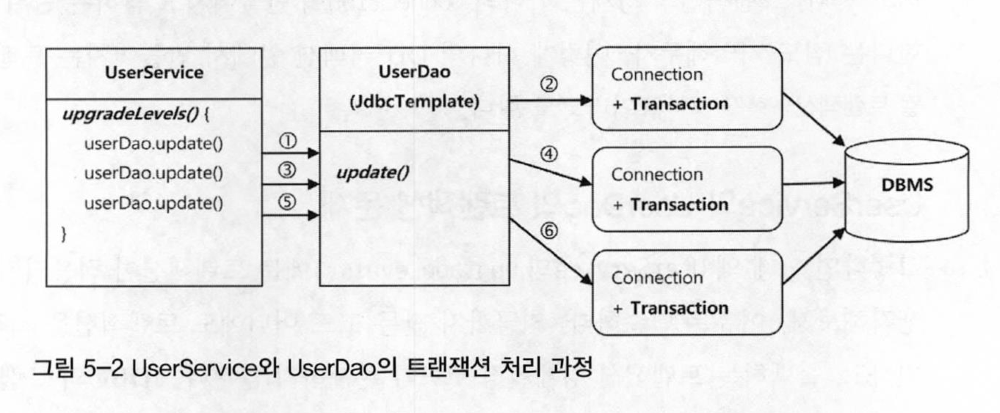
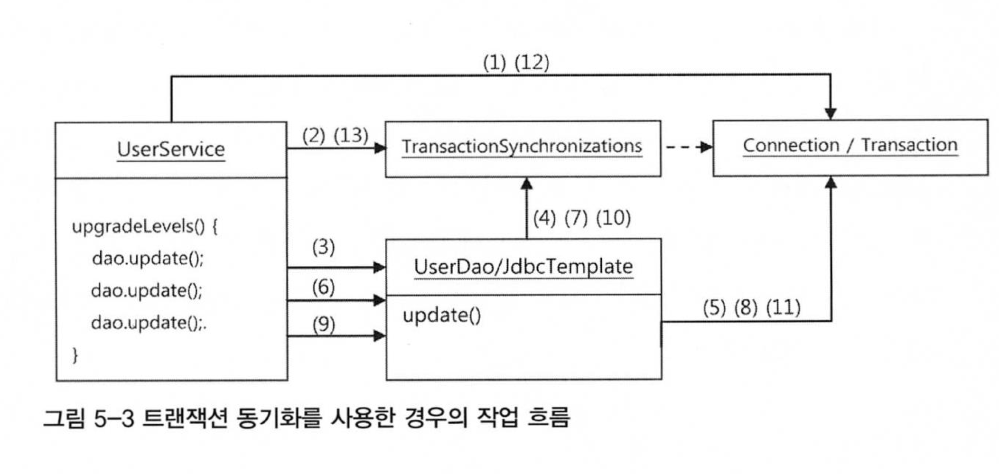
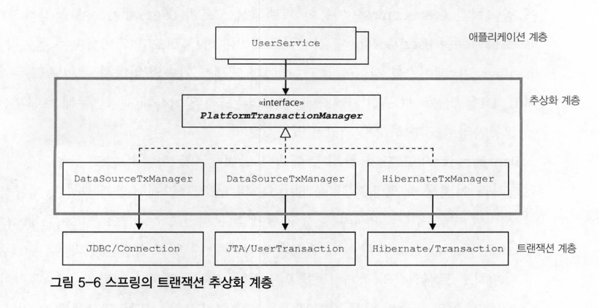

# 범위
5장 서비스 추상화

5.1 사용자 레벨 관리 기능 추가  
5.2 트랜잭션 서비스 추상화  
5.3 서비스 추상화와 단일 책임 원칙
5.4 메일 서비스 추상화  

# WHY
환경과 상황에 따라서 기술이 바뀌고, 그에 따라 다른 API를 사용하고, 다른 스타일의 접근 방법을 따라야하는 건 피곤하다.

# WHAT
여러 종류의 기술을 추상화하고, 일관된 방법으로 사용할 수 있도록 지원해야 한다.

# HOW
## 예시 - 트랜잭션 처리
### 문제상황1
목표: 비즈니스 로직 내의 트랜잭션 경계 설정하기
- JDBC의 트랜잭션은 하나의 Connection을 가져와서 사용하다가 닫는 사이에 발생  
  == jdbcTemplate 메소드 호출 한번에 한 개의 DB커넥션이 만들어지고 닫히는 사이에 발생  
  == jdbcTemplate 메소드를 사용하면, 매 호출마다 독립적인 커넥션을 맺어서, 독립적인 트랜잭션만 설정가능한 상황
  
#### sol
트랜잭션 적용을 위해, UserService 클래스로 트랜잭션 경계설정 코드 추가
```java
public void upgradeLevels() throws Exception {
    // (1) DB Connection 생성
    // (2) 트랜잭션 시작
    try (
        // (3) DAO 메소드 호출
        // (4) 트랜잭션 커밋
    catch(Exception e) {
        // (5) 트랜잭션 롤백
        throw e;
    finally {
        // (6) DB Connection 종료
    }
}
```

#### 파생되는 문제점
1. DB커넥션, 리소스의 깔끔한 처리를 담당하던 `JdbcTemplate`을 활용할 수 없음
    - JDBC API를 직접 사용하는 초기 방식으로 돌아가야 함.
2. DAO의 메소드와 비즈니스 로직을 담고있는 `UserService`의 메소드에 `Connection` 파라미터가 추가되어야 함
3. `Connection` 파라미터가 UserDao 인터페티스 메소드에 추가되면, UserDao는 더이상 데이터 액세스 기술에 독립적일 수 없음
    - JPA나 하이버네이트로 구현방식을 변경하려면, 인터페이스가 바뀌게 됨.
4. DAO 메소드에 Connection 파라미터를 받게 하면, 테스트 코드 로직도 수정되어야 함. 

### 문제상황2
목표: 연결되는 메소드에 파라미터로 추가된 `Connection` 제거하기
#### sol
트랜잭션 동기화 방식 이용(스프링 지원)
- UserService에서 트랜잭션을 시작하기 위해 만든 `Connection`을 <특별한 저장소>에 보관해두고,  
  이후에 호출되는 DAO의 메소드에서는 저장된 `Connection`을 가져다가 사용하게 하는 것  
  
- 트랜잭션 동기화 저장소는 작업쓰레드마다 독립적으로 Connection오브젝트를 저장,관리하기 떄문에, 다중 사용자를 처리하는 서버의 멀티쓰레드 환경에서도 충돌나지x

### 문제상황3
목표: 여러 개의 DB를 사용하는 상황에서 트랜잭션 처리하기
- 로컬 트랜잭션(JDBC의 Connection을 이용한 트랜잭션 방식)은 지원 불가능
- 글로벌 트랜잭션 방식(별도의 트랜잭션 관리자를 통해 트랜잭션 관리)이 필요함

#### sol
JTA(Java Transaction API)를 이용해서, 트랜잭션 매니저가 트랜잭션 처리하도록 설정
- 여러 개의 DB나 메시징 서버에 대한 작업을 하나의 트랜잭션으로 통합하는 `분산 트랜잭션` or `글로벌 트랜잭션` 이 가능해짐

#### 파생되는 문제점
비즈니스 로직은 변경되지 않았는데, 기술 환경(여러 개의 DB)에 따라서 코드가 바뀌는 상황이 발생

### 문제상황4
목표: 데이터 액세스 기술에 독립적이게 트랜잭션 처리하기
- 공통점을 찾아서 추상화 시키기
  - JDBC가 DB와 관계없이 공통된 기술을 사용할 수 있도록 추상화가 가능했던 이유: 모두 SQL을 이용한다는 공통점이 있음

#### sol
추상화 포인트: DB와 관계없이, `트랜잭션 경계설정 방법` 에서 공통점을 찾자!  

- 사용하는 DB에 맞게 트랜잭션 매니저를 설정할 수 있도록, DI 받아서 이용

# 기타
## 코드작성 시 체크 리스트
1. 코드에 중복된 부분은 없는가?
    - 한 가지 변경 이유가 발생했을 때, 여러 군데를 고치게 만든다면 중복임
2. 코드가 무엇을 하는 것인지 이해하기 불편하지 않은가?
3. 코드가 자신이 있어야 할 자리에 있는가?
4. 앞으로 변경이 일어난다면, 어떤 것이 있을 수 있고, 그 변화에 쉽게 대응할 수 있게 작성되어 있는가? 

## 용어정리
- test double: 테스트 환경을 만들어주기 위해, 테스트 대상이 되는 오브젝트의 기능에만 충실하게 수행하면서 빠르게 ,자주 테스트를 실행할 수 있도록 사용하는 오브젝트를 총칭하는 단어
- test stub: 테스트 대상 오브젝트의 의존객체로서 존재. 테스트 동안에 코드가 정상적으로 수행할 수 있도록 도움
- mock 오브젝트: 테스트 대상과 의존 오브젝트 사이에 주고받는 정보를 보존해주는 기능을 가진 테스트용 의존 오브젝트