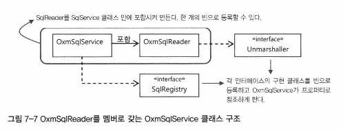
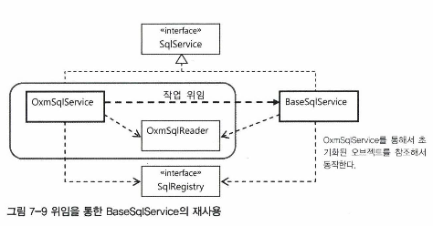

# 범위
7장 스프링 핵심 기술의 응용

## 학습목표
IoC/DI, 서비스 추상화, AOP를 애플리케이션 개발에 활용해서 새로운 기능 만들어보기  
이를 통해, 스프링의 개발철학과 추구하는 가치, 스프링 사용자에게 요구되는 게 무엇인지 알아보기

## 다루는 범위
7.3 서비스 추상화 적용  

학습 목표: `JaxbXmlSqlReader` 를 아래 2가지 요구사항이 충족되도록 개선하기
- JAXB 이외의 `XML <-> 자바 오브젝트` 매핑 기술이 있는데, 필요에 따라 다른 기술로 교체가 쉽도록!
- 현재 xml파일은 `UserDao` 클래스와 같은 클래스패스 안에서만 가능한데, 아무데서나 가져올 수 있도록!

<details>
<summary>현재 JaxbXmlSqlReader 로직 보기</summary>

```java
public class JaxbXmlSqlReader implements SqlReader {
	
	private static final String DEFAULT_SQL_MAP_FILE = "sqlmap.xml";

	private String sqlmapFile = DEFAULT_SQL_MAP_FILE;

	public void setSqlmapFile(String sqlmapFile) {
		this.sqlmapFile = sqlmapFile;
	}

	@Override
	public void read(SqlRegistry sqlRegistry) {
		String contextPath = Sqlmap.class.getPackage().getName();

		try {
			JAXBContext context = JAXBContext.newInstance(contextPath);
			Unmarshaller unmarshaller = context.createUnmarshaller();
			InputStream is = UserDao.class.getResourceAsStream(this.sqlmapFile);
			Sqlmap sqlmap = (Sqlmap) unmarshaller.unmarshal(is);

			for (SqlType sql : sqlmap.getSql()) {
				sqlRegistry.registerSql(sql.getKey(), sql.getValue());
			}
		} catch (JAXBException e) {
			throw new RuntimeException(e);
		}
	}
}
```

</details>

## OXM(Object-XML Mapping) 서비스 추상화
### why
xml <-> 자바 오브젝트 간의 매핑기술은 여러 가지가 있다. ex. Castor XML, JiBX, XmlBeans, Xstream 등  
어떤 기술을 선택하더라도, 적용이 쉬워야 한다.

### what
서비스 추상화가 필요하다.
- 로우레벨의 구체적인 기술과 API에 종속되지 않아야 한다.
- 추상화된 레이어와 API를 제공해서, 구현기술에 독립적인 코드를 작성할 수 있어야 한다.

### how
스프링은 OXM 추상화 인터페이스를 제공한다.

```java
public interface Marshaller {
    boolean supports(Class<?> clazz);
    /**
    * Marshals the object graph with the given root into the provided Result.
    */
    void marshal(Object graph, Result result) throws XmlMappingException, IOException;
}

public interface Unmarshaller {

    boolean supports(Class<?> clazz);
    /**
     * Unmarshal the given provided Source into an object graph.
     */
    Object unmarshal(Source source) throws XmlMappingException, IOException;
}
```
어떤 기술을 사용할지, config 설정만 해두면 구현기술과 독립적으로 코드 작성이 가능하다.
<details>
<summary>구현 예시</summary>

```java
@RunWith(SpringJUnit4ClassRunner.class)
@ContextConfiguration(locations = "/oxmtest-applicationContext.xml")
public class OxmTest {

    @Autowired
    Unmarshaller unmarshaller;

    @Test
    public void unmarshallSqlMap() throws XmlMappingException, IOException {
        Source xmlSource = new StreamSource(
                getClass().getResourceAsStream("sqlmap.xml")
        );

        Sqlmap sqlmap = (Sqlmap) this.unmarshaller.unmarshal(xmlSource);

        List<SqlType> sqlList = sqlmap.getSql();
        Assertions.assertThat(sqlList).hasSize(6);
        Assertions.assertThat(sqlList.get(0).getKey()).isEqualTo("userAdd");
        Assertions.assertThat(sqlList.get(1).getKey()).isEqualTo("userGet");

    }
}
```

케이스1 - JAXB 기술 이용
```xml
<?xml version="1.0" encoding="UTF-8"?>
<beans xmlns="http://www.springframework.org/schema/beans"
       xmlns:xsi="http://www.w3.org/2001/XMLSchema-instance"
       xsi:schemaLocation="http://www.springframework.org/schema/beans http://www.springframework.org/schema/beans/spring-beans.xsd">
    <bean id="unmarshaller" class="org.springframework.oxm.jaxb.Jaxb2Marshaller">
        <property name="contextPath" value="dao.service.jaxb" />
    </bean>
</beans>
```

케이스2 -Castor XML 기술 이용
```xml
<?xml version="1.0" encoding="UTF-8"?>
<beans xmlns="http://www.springframework.org/schema/beans"
       xmlns:xsi="http://www.w3.org/2001/XMLSchema-instance"
       xsi:schemaLocation="http://www.springframework.org/schema/beans http://www.springframework.org/schema/beans/spring-beans.xsd">
    <bean id="unmarshaller" class="org.springframework.oxm.jaxb.CastorMarshaller">
        <property name="contextPath" value="dao.service.jaxb" />
    </bean>
</beans>
```
</details>

## OXM 서비스 추상화 적용 - 버전 0
### 목적
스프링의 OXM 추상화 기능을 이용하는 `SqlService` 만들기
- `SqlRegistry`를 DI받을 수 있어야 함
- `SqlReader`는 스프링의 OXM 언마샬러를 이용해야함

### 의도


SqlReader 구현 오브젝트에 대한 의존관계를 `OxmSqlService` 에 고정시키기  
-> SQL 을 읽는 방법을 OXM으로 제한해서 사용성 극대화  
-> 두 개의 클래스를 강하게 결합시키는 것이므로, 더 이상 확장이나 변경에 제한을 두는 것이기도 함

### (그럼에도 불구하고) 장점
- 하나의 클래스로 만들어두기 때문에, 빈의 등록과 설정이 단순해지고, 쉽게 사용할 수 있음

만약, 이렇게 결합시키지 않고, SqlService에서 언마샬러를 관리하면, 매번 빈으로 등록해줘야 함.
- 많은 빈을 등록하는건 부담스러움

### 코드
```java
public class OxmSqlService implements SqlService {
    private final OxmSqlReader sqlReader = new OxmSqlReader();
    // 생략
    
    @PostConstruct
    public void loadSql() {
        this.sqlReader.read(this.sqlRegistry);
    }
    
    @Override
    public String getSql(String key) throws SqlRetrievalFailureException {
        try {
            return this.sqlRegistry.findSql(key);
        } catch (SqlNotFoundException e) {
            throw new SqlRetrievalFailureException(e.getMessage());
        }
    }

    private static class OxmSqlReader implements SqlReader {
        @Override
        public void read(SqlRegistry sqlRegistry) {
            // TODO : implementation
        }
    }
}
```

## OXM 서비스 추상화 적용 - 버전 1
### 목적
코드의 중복 제거
- OxmSqlService 와 BaseSqlService 는 SqlService의 핵심 메서드(`loadSql`, `getSql`) 구현이 중복된다
  
### 의도


OxmSqlService는 일종의 설정과 기본 구성을 변경해주기 위한 어댑터와 같은 개념이므로, SqlService의 핵심 메서드는 `BaseSqlService` 로 위임하기

### 코드
```java
public class OxmSqlService implements SqlService{
    private final BaseSqlService baseSqlService = new BaseSqlService();
    // 생략
    
    @PostConstruct
    public void loadSql(){
        this.baseSqlService.setSqlReader(this.oxmSqlReader);
        this.baseSqlService.seqSqlRegistry(this.sqlRegistry);
        this.baseSqlService.loadSql();
    }
    
    public String getSql(String key) throws SqlRetrievalFailureException{
        return this.baseSqlService.getSql(key);
    }
}
```

## 리소스 추상화
### why
XML 포맷의 문서이기만 하면, 파일(리소스)이 어디있든 불러올 수 있어야 한다.
- 자바는 `java.net.URL` 클래스를 통해 http/ftp/file 접두어를 이용해서 다양한 원격 리소스에 접근 가능
- 하지만, 리소스 파일의 존재 여부를 미리 확인할 수 없고, 접근할 수 있는 리소스 범위에 한계가 있음. 

### what
리소스 위치에 상관없이, 리소스에 접근할 수 있는 통일된 방법이 필요하다. 

### how
스프링은 자바에서 제공하는 일관성 없는 리소스 접근 API를 추상화해서 `Resource` 라는 추상화된 인터페이스를 제공한다.
- 스프링은 외부 리소스가 필요한 대부분의 경우, Resource 추상화를 이용한다.
  - 리소스가 아니라, 리소스에 접근할 수 잇는 추상화된 핸들러임!
- Resource는 스프링에서 빈이 아니라 값으로 취급되므로, 매번 빈으로 등록할 필요가 없다.

빈으로 등록하지 않기 때문에, 외부에서 값을 지정하려면 config에서 프로퍼티의 value 애트리뷰트에 넣는 방법 밖에 없다.
```xml
<property name="myFile" value="file:/data/myfile.txt" />
```
따라서, 단순 문자열만 입력되므로, 스프링에서는 `ResourceLoader` 라는 인터페이스를 활용해서, Resource 형태로 읽어온다.

<details>
<summary>Resource, ResourceLoader 인터페이스</summary>

```java
public interface Resource extends InputStreamSource {
	boolean exists();
    
	default boolean isReadable() {
		return exists();
	}

	default boolean isOpen() {
		return false;
	}
    
	default boolean isFile() {
		return false;
	}
    
    // JDK의 URL, URI, File 형태로 전환 가능한 리소스에 사용
	URL getURL() throws IOException;
	URI getURI() throws IOException;
	File getFile() throws IOException;

	default ReadableByteChannel readableChannel() throws IOException {
		return Channels.newChannel(getInputStream());
	}

	long contentLength() throws IOException;

	long lastModified() throws IOException;

	Resource createRelative(String relativePath) throws IOException;

	@Nullable
	String getFilename();
    
	String getDescription();
```

```java
public interface ResourceLoader {

	String CLASSPATH_URL_PREFIX = ResourceUtils.CLASSPATH_URL_PREFIX;
    
	Resource getResource(String location);
    
	@Nullable
	ClassLoader getClassLoader();
}
```
</details>

## OXM 서비스 추상화 적용 - 버전 2
### 목적
sqlmap 을 리소스 타입으로 다뤄서, 저장되어있는 위치와 독립적으로 파일을 이용하자!

### 코드
``` java
    private class OxmSqlReader implements SqlReader {

        private Unmarshaller unmarshaller;
        private Resource sqlmap = new ClassPathResource("sqlmap.xml", UserDao.class); // 디폴트로 sqlmap.xml 설정해둠

        @Override
        public void read(SqlRegistry registry) {
            try {
                Source source = new StreamSource(sqlmap.getInputStream());
                Sqlmap sqlmap = (Sqlmap) unmarshaller.unmarshal(source);
                for (SqlType sql : sqlmap.getSql()) {
                    registry.registerSql(sql.getKey(), sql.getValue());
                }
            } catch (IOException e) {
                throw new IllegalArgumentException(sqlmap.getFilename() + " 을 가져올 수 없습니다.", e);
            }
        }

        public void setUnmarshaller(Unmarshaller unmarshaller) {
            this.unmarshaller = unmarshaller;
        }

        public void setSqlmap(Resource sqlmap) {
            this.sqlmap = sqlmap;
        }
    }
```

```xml
<bean id="sqlService" class="sqlservice.OxmSqlService">
    <property name="unmarshaller" ref="unmarshaller" />
    <property name="sqlmap" value="file:/opt/resources/sqlmap.xml"/>
</bean>
```