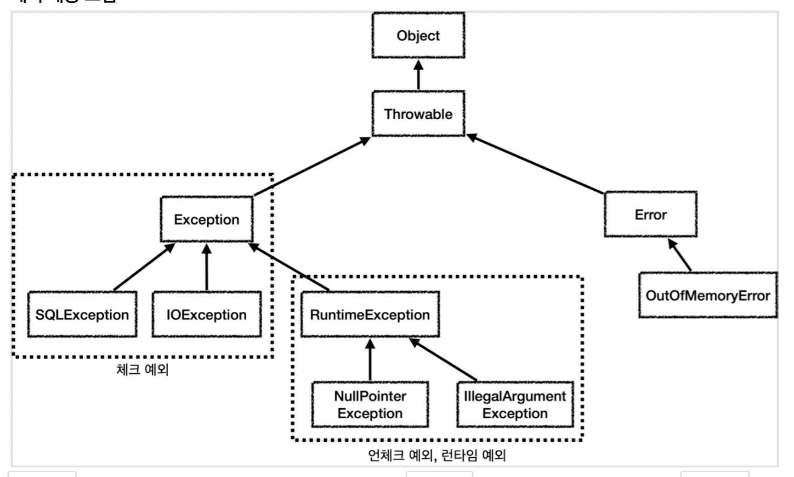
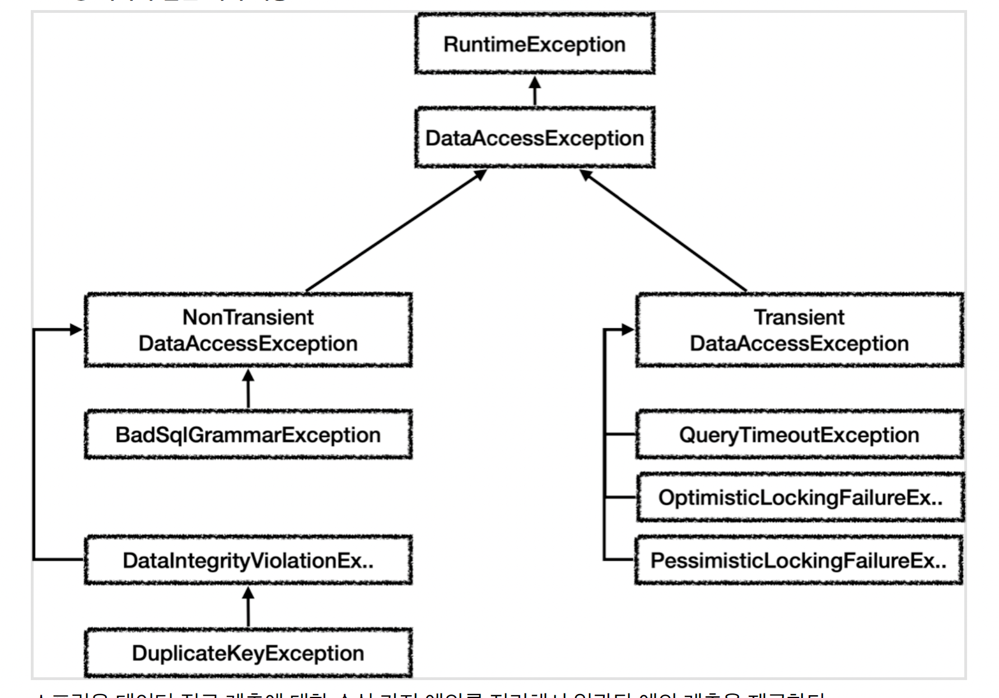

g# 범위
4장 예외  

4.1 사라진 SQLException  
4.2 예외 전환

# 배경지식
<details>
<summary>자세히 보기</summary>

## 예외의 종류와 특징
### Error
- `java.lang.Error` 의 서브클래스들
- 시스템에 뭔가 비정상적인 상황이 발생했을 경우 사용 ex. `OutOfMemoryError`, `ThreadDeath`
- 어플리케이션 레벨에서는 이런 에러는 처리하지 않아도됨.
  - 이유: catch로 잡아봤자, 아무런 대응 방법 없음 
### Exception

(출처: 김영한님 db강의)

- `java.lang.Exception` 클래스와 서브클래스들
- `RuntimeException을 상속했는가?` 를 기준으로 분류
  - O: 언체크예외
    - 프로그램의 오류가 있을 때, 발생하도록 의도된 것
    - `Error`와 동일하게, catch문으로 잡거나 throws로 선언하지 않아도 됨. (명시적으로 해도 됨)
  - X: 체크 예외
    - 항상 예외처리가 필요함. 
      - 단점:무책임한 throws를 남발하게 되는 상황이 만들어짐. 

## 예외를 처리하는 방법
1. 예외상황을 파악하고, 문제를 해결해서 정상 상태로 돌려놓는 것
2. 예외 회피: 예외처리를 자신이 담당하지 않고, 자신을 호출한 쪽으로 `그대로` 던져버리는 것
3. 예외 전환: 발생한 예외를 그대로 던지지 않고, 적절한 예외로 `전환`해서 던져버리는 것

### 예외 전환
#### 목적
1. 내부에서 발생한 예외를 그대로 던지는 것이, 그 예외상황에 대해 적절한 의미를 부여하지 못하기 때문에, 이런 케이스 보완
2. 예외를 처리하기 쉽고, 단순하게 만들기 위해 포장하기 위해서 ex. 체크 예외 -> 언체크 예외
3. 비즈니스적인 의미가 있는 예외이고, 적절한 대응이나 복구 작업이 필요할 때(근데 최초 예외가 언체크 예외라면?) ex. 언체크 예외 -> 체크 예외

#### 예시
**1번 목적 케이스**  
(JDBC API 예시)  
같은 pk로 insert요청이 2회 들어올 경우, `SQLException` 이 발생하는데,   
서비스 계층에서는 `SQLException` 보다 `DuplicateKeyException` 으로 넘겨받는게 더 처리하기 용이함. (의미가 분명하니까)

**2번 목적 케이스**  
어차피 복구 가능한 예외가 아니라면, 언체크예외로 포장해서 throw 하기

#### 개발스킬
중첩예외를 이용해 구현한다.
```java
public class BalanceInsufficientException extends Exception {
   public BalanceInsufficientException(RuntimeException e) { 
       //생략 
   }
   
   public BalanceInsufficientException(String message) { 
       super(message); 
   }
}
```

## 업계 동향
```
예전에는 복구할 가능성이 조금이라도 있다면 -> 체크예외 였는데, 
지금은 항상 복구할 수 있는 예외가 아니라면 -> 일단 언체크 예외로 만든다.
```
</details>

# WHY
스프링 프레임워크 개발 시 `DB접근 기술과 DB`에 독립적인 예외처리가 필요하다.  
ex. DB접근 기술: orm 기술, sql mapper 기술  
ex. DB: mysql, oracle, ...

# WHAT
각 기술마다 다른, 예외를 추상화시켜야 한다.
- 동일한 상황에 발생시키는 예외가 다르다.
  - 중복 키 에러가 발생했을 경우
    - JDBC: SQLException
    - JPA: PersistenceException
    - 하이버네이트: HibernateException //JPA의 구현체
- errorCode 정의가 다르다. (물론 표준이 있긴 하다..)

# HOW
스프링은 `예외 전환` 스킬을 통해 `DataAccessException`으로 DB관련 예외를 추상화시키고 있다.  

- 역할: 의미가 같은 예외라면, `DB접근 기술과 DB` 와 상관없이 일관된 예외를 발생시킨다.
- 장점: 특정 기술과 DB에 종속적인 코드를 작성하지 않아도 되어, 코드 확장과 변경에 용이한 상태가 된다. 
- 동작방식
  -  `SQLExceptionTranslator` 같은 변환기 클래스가 `SQLException`을 `DataAccessException`로 변환해준다. 