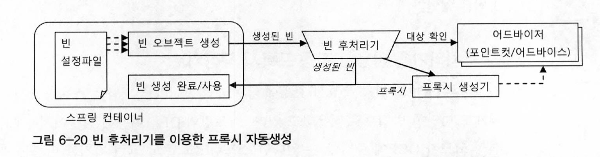

# 범위
6장 AOP

6.5 스프링 AOP

# WHY
부가 기능의 적용이 필요한 타깃 오브젝트마다 `거의 비슷한 내용의 ProxyFactoryBean` 빈 설정 정보를 추가하는 중복을 줄일 수 없을까? 
- 단순 복붙이지만, 그만큼 실수하기 쉬운 포인트

# WHAT
`설정자동등록 기법`으로 해결할 순 없을가?
- 유사 사례: 반복적인 프록시의 메소드 구현을 코드 자동생성 기법을 이용해 해결

# HOW
스프링은 `DefaultAdvisorAutoProxyCreator` 라는 빈 후처리기를 제공한다

## DefaultAdvisorAutoProxyCreator 란? 
어드바이저를 이용한 자동 프록시 생성기
스프링에 적용 방법: 이 빈 후처리기 자체를 빈으로 등록하면 됨
``` xml
<bean class = "org.springframework.aop.framework.autoproxy.DefaultAdvisorAutoProxyCreator" />
```

### 동작방식
빈 오브젝트가 생성될 때 마다, 빈 후처리기에 보내서 후처리 작업을 요청
ex. 빈 오브젝트의 프로퍼티를 강제 수정, 별도의 초기화 작업 수행, 만들어진 빈오브젝트 자체를 바꿔치기

#### flow


1. 빈으로 등록된 모든 어드바이저(`Advisor`인터페이스의 구현체) 내의 포인트 컷을 이용해 전달받은 빈이 프록시 적용 대상인지 확인한다.
2. 프록시 적용 대상이면, 내장된 프록시 생성기에게 현재 빈에 대한 프록시를 만들게 하고 -> 만들어진 프록시에 어드바이저를 연결해준다 
3. 빈 후처리기는 프록시가 생성되면 원래 컨테이너가 전달해준 빈 오브젝트 대신 프록시 오브젝트를 컨테이너에게 돌려준다.
4. 컨테이너는 최종적으로 빈 후처리기가 돌려준 오브젝틀르 빈으로 등록하고 사용한다. 

### 테스트 방법
자동생성 프록시가 정상동작함을 어떻게 보장할 수 있을까?  

<예시> 
트랜잭션 어드바이스
1. 트랜잭션이 필요한 빈에 트랜잭션 부가기능이 적용됐는가?
2. 아무 빈에나 트랜잭션이 부가기능이 적용된 것은 아닌지?

## 포인트컷
### 역할
``` java
public interface Pointcut {
    ClassFilter getClasFilter(); // 프록시를 적용할 클래스 인지 확인
    MethodMatcher getMethodMatcher(); // 어드바이스를 적용할 메소드인지 확인
}
```
### 표현식
(방법1)  
execution([접근제한자 패턴] 리턴값의 타입패턴 [패키지와 클래스 이름에 대한 패턴.] 메소드 이름 패턴 (파라미터 타입 패턴 | "..". ...) [throws 예외 패턴])  
-> 이 부분에 대해 알고싶으면 검색해서 더 자세히 찾아보기..

예시
```java
execution(* * (..)) // 리턴 타입, 파라미터, 메소드 이름에 상관없이 모든 메소드 조건을 허용
```
(방법2)  
특정 애노테이션 타입이 적용된 것만 선정할 수도 있음

# AOP란 무엇인가?
`Aspect Oriented Programming`. 
OOP를 돕는 보조적인 기술일 뿐, 완전히 대체하느 새로운 개념은 아니다. 
* Aspect: 그 자체로 애플리케이션의 핵심기능을 담고 있지는 않지만, 애플리케이션을 구성하는 중요한 한 가지 요소이고, 핵심기능에 부가되어 의미를 갖는 특별한 모듈

## 목적
aspect를 분리함으로써, 핵심기능을 설계하고 구현할 때 객체지향적인 가치를 지킬 수 있도록 도와주기

## 구현방식
### 프록시를 이용한 AOP
스프링 AOP가 이 방식이다
### 바이트코드 생성과 조작을 통한 AOP
AspectJ 라는 프레임워크가 이 방식이다.
프록시처럼 간접적인 방식이 아니라,  
타깃 오브젝트를 뜯어 고쳐서 직접 부가기능을 넣어주는 방식이다. 