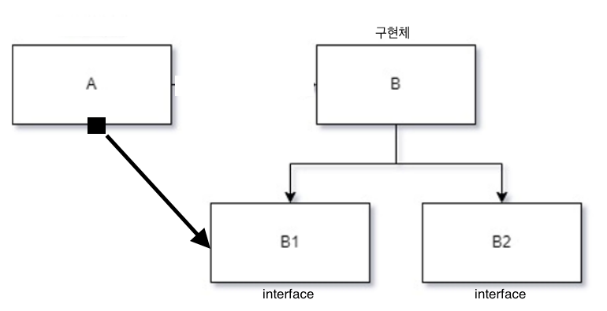

# 범위
7장 스프링 핵심 기술의 응용

## 학습목표
IoC/DI, 서비스 추상화, AOP를 애플리케이션 개발에 활용해서 새로운 기능 만들어보기  
이를 통해, 스프링의 개발철학과 추구하는 가치, 스프링 사용자에게 요구되는 게 무엇인지 알아보기

## 다루는 범위
7.4 인터페이스 상속을 통한 안전한 기능 확장  

학습 목표: 어플리케이션을 새로 시작하지 않고, 특정 SQL의 내용만 변경하기(==기능의 변경 or 추가)
- 부가 목표: 기존에 설계/ 개발했던 기능이 발전돼야 할 경우에 스프링답게 접근하는 방법이 무엇일지 살펴보기

## 7.4.1 DI와 기능의 확장
### DI를 의식하는 설계
DI를 적용하려면, 커다란 오브젝트 하나만 존재해서는 안된다.
- 최소한 두개 이상의 의존 관계를 가지고, 서로 협력해서 일하는 오브젝트가 필요하다.
- 적절한 책임에 따라 오브젝트를 분리해줘야 한다.

DI는 런타임 시에 의존 오브젝트를 다이나믹하게 연결해줘서, 유연한 확장을 꾀해야 한다.

```
DI는 확장을 위해 필요한 것이므로, 항상 미래에 일어날 변화를 예상하고 고민해야 적합한 설계가 가능해진다.
DI는 결국 미래를 프로그래밍 하는 것이다.


`SqlService`도 내부 기능을 적절한 책임과 역할에 따라 분리하고,  
인터페이스를 정의해 느슨하게 연결해주고, // SqlRegistry, SqlReader  
DI를 통해 유연하게 의존관계를 지정하도록 설계해두었기 떄문에  
=> 기능의 변경이나 추가가 쉬워졌다. 
```


### DI와 인터페이스 프로그래밍
DI를 적용할 때는 가능한 한 인터페이스를 사용하게 해야 한다.
인터페이스를 사용하는 이유는 여러가지가 있다.

**다형성을 얻는다.**  
하나의 인터페이스를 통해, 여러 개의 구현체를 바꿔가면서 사용할 수 있게 된다. 

**인터페이스 분리 원칙을 통해, 클라이언트와 의존 오브젝트 사이의 관계를 명확하게 해줄 수 있다.**  

<details>
<summary>그림 설명</summary>

B1 인터페이스를 B가 구현하고 있고, A는 B1 인터페이스를 통해서만 B를 사용한다면,   
그래서 DI 받을 때도 B1 인터페이스를 통해 받는다면 A에게 B는 B1이라는 관심사를 구현한 임의의 오브젝트에 불과하다.   
그래서 같은 B1 이라는 인터페이스를 구현했다면 B가 아니라 C, D 클래스로 만들어진 오브젝트이더라도 A에게 DI가 가능해진다.  

그런데 B 오브젝트는 B1이 아니라 B2라는 다른 인터페이스를 구현하고 있을 수도 있다.  
B2라는 인터페이스가 그려주는 창으로 B를 바라보는 다른 종류의 클라이언트가 존재하기 때문이다.

즉 인터페이스는 하나의 오브젝트가 여러 개를 구현할 수 있으므로, 하나의 오브젝트를 바라보는 창이 여러 가지일 수 있다는 뜻이다.

그러면 굳이 B2라는 인터페이스에 정의된 내용에는 아무런 관심 없는 A 오브젝트가 B2 인터페이스의 메서드까지 모두 노출되어 있는 B라는 클래스에 직접 의존할 이유가 없다.   
게다가 B2에 변화가 발생하면 A에도 영향을 줄 수도 있다.   
그래서 인터페이스를 클라이언트의 종류에 따라 적절하게 분리해서 오브젝트가 구현하게 하면 매우 유용하다.  

오브젝트가 그 자체로 응집도가 높은 작은 단위로 설계됐더라도, 목적과 관심이 각기 다른 클라이언트가 있다면 인터페이스를 통해 이를 적절하게 분리해줄 필요가 있고, 이를 객체지향 설계 원칙에서는 인터페이스 분리 원칙이라고 부른다.
</details>

## 7.4.2 인터페이스 상속
### 목적
기존 클라이언트에 영향을 주지 않고, 기능 확장하기
- 기능: 어플리케이션을 새로 시작하지 않고, 특정 SQL의 내용만 변경하기

### 의도


SQL 변경을 하는 `UpdatableSqlRegistry` 인터페이스를 추가하기  
-> 기존 SqlRegistry 인터페이스에 정의된 메서드도 사용할 필요가 있으니, 이 인터페이스를 상속받은 형태  
-> 인터페이스 상속을 통해, 기존 클라이언트(`BaseSqlService`) 에 아무런 영향을 주지 않을 수 있다!

예시) SQL을 관리하는 역할의 SqlAdminService도 있다고 가정  
BaseSqlService와 SqlAdminService 오브젝트는 동일한 MyUpdatableSqlRegistry 오브젝트를 DI 받아서 사용한다.

### 코드
```java
public interface UpdatableSqlRegistry extends SqlRegistry {
    public void updateSql(String key, String sql) throws SqlUpdateFailureException;

    public void updateSql(Map<String, String> sqlmap) throws SqlUpdateFailureException;

    public class SqlUpdateFailureException extends RuntimeException {
        public SqlUpdateFailureException(String message) {
            super(message);
        }

        public SqlUpdateFailureException(String message, Throwable cause) {
            super(message, cause);
        }
    }
}
```