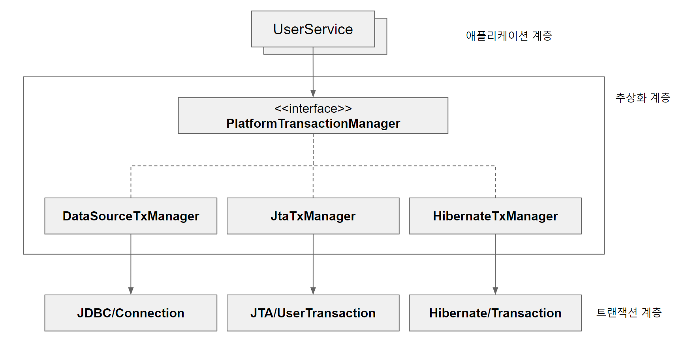

# 범위
2.6 트랜잭션  
2.6.1 트랜잭션 추상화와 동기화  
2.6.2 트랜잭션 경계설정 전략  
2.6.3 트랜잭션 속성  
2.6.4 데이터 액세스 기술 트랜잭션의 통합  
2.6.5 JTA를 이용한 글로벌/분산 트랜잭션

# 2.6 트랜잭션
스프링이 제공하는 트랜잭션 서비스는?
2가지 측면이 있다.
1. 트랜잭션 추상화
2. 트랜잭션 동기화

[이 velog](https://velog.io/@jakeseo_me/%ED%86%A0%EB%B9%84%EC%9D%98-%EC%8A%A4%ED%94%84%EB%A7%81-%EC%A0%95%EB%A6%AC-%ED%94%84%EB%A1%9C%EC%A0%9D%ED%8A%B8-5.2-%ED%8A%B8%EB%9E%9C%EC%9E%AD%EC%85%98-%EC%84%9C%EB%B9%84%EC%8A%A4-%EC%B6%94%EC%83%81%ED%99%94) 에서 잘 설명중이니 참고할 것..

# 2.6.1 트랜잭션 추상화와 동기화
## 트랜잭션 동기화
트랜잭션을 시작하기 위해 생성한 Connection 객체를 별도의 특별한 공간에 보관하고, 이 커넥션이 필요할 때 (ex. DAO) 꺼내쓰는 방식이다.

``` java
    public void upgradeLevels() throws SQLException{
        // 트랜잭션 동기화 관리자를 이용해 동기화 작업을 초기화
        TransactionSynchronizationManager.initSynchronization();
        // DB 커넥션을 생성하고 트랜잭션을 시작한다.
        // 이후의 DAO 작업은 모두 여기서 시작한 트랜잭션 안에서 진행된다.
        // 아래 두 줄이 DB 커넥션 생성과 동기화를 함께 해준다.
        Connection c = DataSourceUtils.getConnection(dataSource);
        c.setAutoCommit(false);

        try {
            List<User> users = userDao.getAll();
            for (User user : users) {
                if (canUpgradeLevel(user)) {
                    upgradeLevel(user);
                }
            }

            c.commit();
        }catch(Exception e) {
            c.rollback();
            throw e;
        } finally {
            // 스프링 DataSourceUtils 유틸리티 메소드를 통해 커넥션을 안전하게 닫는다.
            DataSourceUtils.releaseConnection(c, dataSource);
            // 동기화 작업 종료 및 정리
            TransactionSynchronizationManager.unbindResource(this.dataSource);
            TransactionSynchronizationManager.clearSynchronization();
        }
    }
```

## 트랜잭션 추상화

`PlatformTransactionManager` 인터페이스를 통해, JDBC / JTA / Hibernate 같은 기술에 종속되지 않은채로 트랜잭션 경계설정을 가능하게 한다.

```java
    public void upgradeLevels() {
        // 트랜잭션 시작
        TransactionStatus status =
                transactionManager.getTransaction(new DefaultTransactionDefinition());

        //setAutoCommit(false) 같은거 할 필요 없음
        try {
            List<User> users = userDao.getAll();
            for (User user : users) {
                if (canUpgradeLevel(user)) {
                    upgradeLevel(user);
                }
            }

            transactionManager.commit(status);
        }catch(Exception e) {
            transactionManager.rollback(status);
            throw e;
        }
    }
```

# 2.6.2 트랜잭션 경계 설정 전략
## 코드에 의한 트랜잭션 경계설정
거의 안쓰이는 방법이라 예제 코드만 첨부합니다.. 
```java
public class EmbeddedDbSqlRegistry implements UpdatableSqlRegistry {
    SimpleJdbcTemplate jdbc;
    TransactionTemplate transactionTemplate;

    public void setDataSource(DataSource dataSource) {
        jdbc = new SimpleJdbcTemplate(dataSource);

        //DataSource로 TranscationManager를 만들고 이를 이용해 TranscationTemplate을 생성한다.
        transactionTemplate = new TranscationTemplate(
                new DataSourceTranscationManager(dataSource));
    }

    @Override
    public void updateSql(final Map<String, String> sqlmap) throws SqlUpdateFailureException {
        transactionTemplate.execute(new TransactionCallbackWithoutResult() {
            // 트랜잭션 템플릿이 만드는 트랜잭션 경계 안에서 동작할 코드를 콜백 형태로 만들고 
            // execute() 메소드에 전달한다.
            @Override
            protected void doInTransactionWithoutResult(TransactionStatus status) {
                for (Map.Entry<String, String> entry : sqlmap.entrySet()) {
                    updateSql(entry.getKey(), entry.getValue());
                }
            }
        });
    }
}
```

## 선언적 트랜잭션 경계설정
선언적 트랜잭션을 이용하면 코드에는 전혀 영향을 주지 않으면서,
- 특정 메소드 실행 전 후에 트랜잭션이 시작되고 종료되거나 
- 기존 트랜잭션에 참여하도록 만들 수 있다.

어떻게 코드에 전혀 영향을 주지 않을 수 있을까?  
✨AOP의 형태로 동작하기 때문이다.✨

AOP로 동작하려면 `포인트컷(적용대상) + 어드바이스(부가기능)` 이 필요하다.

구현 방식에는 2가지가 있다. 

### tx 네임스페이스
`txAdvice`를 통해 스프링의 트랜잭션 관리 기능을 제공한다. 
```xml
<tx:advice id="transactionAdvice" transaction-manager="transactionManager">
  <tx:attributes>
    <tx:method name="save*" propagation="REQUIRED" rollback-for="Exception" />
    <tx:method name="get*" read-only="true" />
  </tx:attributes>
</tx:advice>

<!-- AOP 설정 -->
<aop:config>
<aop:advisor advice-ref="transactionAdvice" pointcut-ref="myPointcut" />
</aop:config>
```

### @Transactional
위 방식처럼 설정파일에 명시적으로 포인트컷과 어드바이스를 정의하지 않는다.

간단하게 @Transactional을 사용한다는 설정만 추가하면 된다.
```java
@Configuration
@EnableTransactionManagement
public class AppConfig {
    // ...
}
```
이러게 config 파일에 추가하거나

```xml
<tx:annotation-driven />
```
설정파일에 이 한줄을 추가해준다.

이 어노테이션은 선언된 위치에 따라 우선순위가 결정된다.
```
(높) 클래스의 메소드 > 클래스 > 인터페이스의 메소드 > 인터페이스 (낮)
```
구체적일수록 우선순위가 높다고 생각하면 된다. 

### 프록시 모드: 인터페이스와 클래스
스프링의 프록시 팩토리는 상황에 맞게 동적 프록시 기술을 선택한다.
- 대상에 인터페이스가 있을 경우: `JDK 동적 프록시`(인터페이스 기반)
- 대상에 인터페이스가 없을 경우: `CGLIB`(구체 클래스 기반)

트랜잭션의 경우, 디폴트로 `JDK 동적 프록시` 로 동작한다.  
클래스만 있을 경우엔 어떻게 해야할까?

``` java
proxyTargetClass=true

또는

@Configuration
@EnableTransactionManagement(proxyTargetClass = true)
public class AppConfig {
    // ...
}
```
이 옵션을 추가해서 무조건 `CGLIB` 기반으로 동작하게 한다. 
(책에는 별말 없지만, 매번 인터페이스를 만들지 않으므로 거의 이 옵션을 주고 사용한다)

### 프록시 방식의 AOP 한계
프록시를 사용하면 메서드 내부 호출에는 프록시를 적용할 수 없다. 
내부 호출을 할 때는, 프록시 객체의 메서드가 아닌 실제 타겟 객체의 메서드가 호출되기 때문이다. 

# 2.6.3 트랜잭션 속성  
## propagation (전파 동작)
메소드가 이미 실행 중인 트랜잭션 내에서 실행될 때 어떻게 동작할지를 정의한다. 
- `REQUIRED`: 미리 시작된 트랜잭션이 있음 참여하고, 없으면 새로 시작
- `SUPPORTS`: 이미 시작한 트랜잭션이 있음 참여하고, 없으면 트랜잭션 없이 진행
- `MANDATORY`: 미리 시작된 트랜잭션이 있음 참여하고, 없으면 예외 발생
- `REQUIRES_NEW`: 항상 새로운 트랜잭션 시작한다. 이미 시작한 트랜잭션이 있다면 보류시킴
- `NOT_SUPPORTED`: 트랜잭션을 사용하지 않게 한다. 이미 시작한 트랜잭션이 있다면 보류시킴
- `NEVER`: 트랜잭션을 사용하지 않도록 강제함. 이미 시작한 트랜잭션이 있으면 예외 발생
- `NESTED`: 이미 진행중인 트랜잭션이 있으면 중첩 트랜잭션을 시작함. 부모 트랜잭션은 자식의 영향을 받지 않고, 자식 트랜잭션은 부모의 영향을 받음.


## isolation (격리 수준)
트랜잭션의 격리 수준을 지정한다.
ex. DEFAULT (데이터베이스 기본값), READ_UNCOMMITTED, READ_COMMITTED, REPEATABLE_READ, SERIALIZABLE

## timeout
트랜잭션의 최대 실행 시간을 초 단위로 지정한다. 초과할 경우 트랜잭션은 롤백된다.

## readOnly
트랜잭션에서 데이터베이스를 읽기 전용으로 처리할지 여부를 지정한다. 읽기 전용으로 설정할 경우 성능이 향상될 수 있다. 

## rollbackFor
명시적으로 롤백되어야 하는 예외의 타입을 지정한다. 지정한 예외 또는 해당 예외의 서브클래스가 발생할 경우 트랜잭션이 롤백된다.

참고) RuntimeException 은 디폴트로 롤백된다. Exception은 디폴트로 커밋된다. 

## noRollbackFor
롤백되지 않아야 하는 예외의 타입을 지정한다. 지정한 예외 또는 해당 예외의 서브클래스가 발생해도 트랜잭션이 롤백되지 않는다.

# 2.6.4 데이터 액세스 기술 트랜잭션의 통합  
스프링은 두 개 이상의 데이터 액세스 기술로 만든 DAO를 하나의 트랜잭션으로 묶어서 사용하는 방법을 제공한다.
- ORM과 비ORM 기술을 함께 사용할 땐 주의해야 한다. 
  - ORM은 트랜잭션이 커밋되기 전까지 실제 DB에 cud를 하지 않으므로... 적절히 flush 해야한다

# 2.6.5 JTA를 이용한 글로벌/분산 트랜잭션  
한 개 이상의 DB나 JMS의 작업을 하나의 트랜잭션 안에서 동작하게 하려면 서버가 제공히는 트랜잭션 매니저를 JTA를 통해 사용해야 한다.  
스프링에서는 서버에 설정해둔 XA DataSource와 트랜잭션 매니저 그리고 UserTransaction 등을 JNDI를 통해 가져와 모든 데이터 액세스 기술에서 사용할 수 있다.